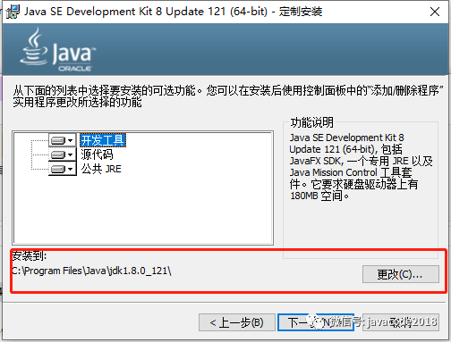
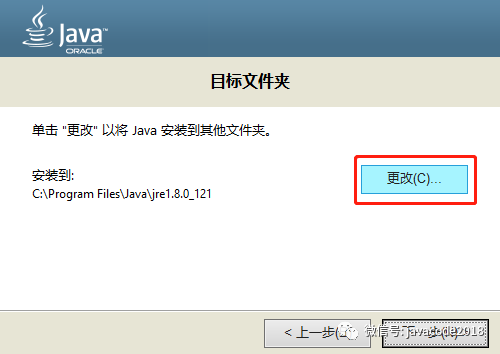
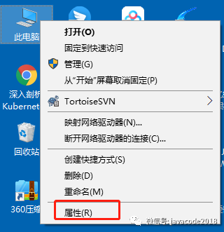
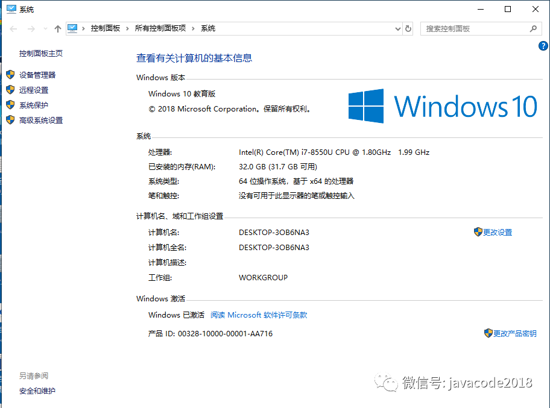
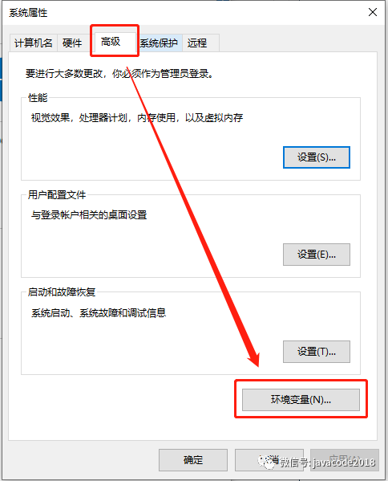
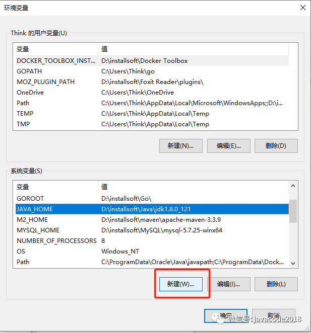
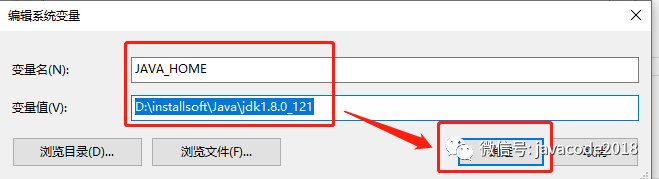
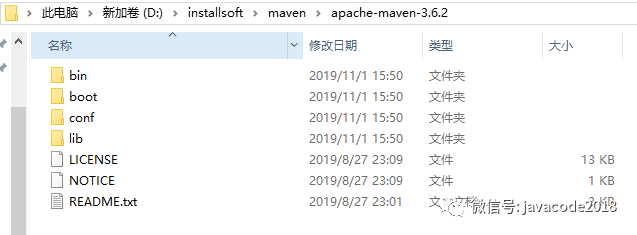

# Maven

## 1.为什么我们要学习maven?

学习某些技术，肯定是我们遇到了某些问题，而这些问题目前手头上没有很好的方案去解决，此时刚好有一种技术可以很好的解决这个问题，这样能够驱动我们愿意去学。所以我们学任何技术之前，需要先了解这种技术能够解决什么问题。带着问题去学习，大家才有兴趣，才能够更快的掌握。

我们遇到了什么问题呢？

maven还未出世的时候，我们有很多痛苦的经历。

### 1.1 不使用Maven带来的问题

#### 痛点1：jar包难以寻找

> 比如我们项目中需要用到fastjson，此时我们会去百度上检索fastjson相关jar包，然后下载下来，放到项目的lib下面，然后加到项目的classpath下面，用着用着发现这个jar的版本太老了，不是我们想要的，然后又重新去找，痛苦啊。

#### 痛点2：jar包依赖的问题

> jar包一般都不是独立存在的，一般一些jar也会用到其他的jar，比如spring-aop.jar会用到spring-core.jar，这种依赖可能比较简单，有些依赖可能有很多级，比如a.jar依赖于b.jar，而b.jar依赖c.jar，而c.jar又依赖于b.jar，当你用到a.jar的时候，你需要把其他3个也进入才可以，所以你用到一个jar的时候，你必须明确知道这些jar还会依赖于哪些jar，把他们都引入进来，否则项目是无法正常运行的，当项目用到很多jar的时候，我们是很难判断缺少哪些jar的，只有在项目运行过程报错了，才知道，这种也是相当痛苦的，浪费了大量时间。

#### 痛点3：jar包版本冲突问题

> 项目中用到了a.jar，a.jar依赖于c.jar的1.5版本，然后我们把这2个jar拷贝到项目中，后面又用到了b.jar，但是b.jar又依赖于c.jar的1.0版本，此时你把b.jar和c-1.0.jar引进来了，会发现c.jar有2个版本，发生冲突了，启动的时候会报错，这种情况你要着手去解决jar冲突的问题，也是非常痛苦的。
>
> 当我们从网上找到一个jar包来使用的时候，我们是很难判断这个jar依赖的其他jar的版本的，比如a.jar依赖于b.jar，你从网上把b.jar找到了，最后放入项目中，发现b.jar的版本太老了，又得去重新找。
>
> 记得之前在第三方支付工作的时候，我记忆犹新，当时用到的是lvy来引入jar的，这玩意解决jar包的冲突没有什么好办法，为了解决项目中jar包冲突的问题，花了整整一周时间。

#### 痛点4：jar不方便管理

> 当我们的项目比较大的时候，我们会将一个大的项目分成很多小的项目，每个小项目由几个开发负责，比如一个电商项目分为：账户相关的项目、订单相关的项目、商品相关的项目，这些项目的结构都是类似的，用到的技术都是一样的：ssm（spring、springmvc、mybatis），然后每个项目都需要把这些jar拷贝一份到自己的项目目录中，最后10个项目只是jar就复制了10份，后来，我们发现项目中有些jar需要升级版本，打算替换一下，此时我们需要依次去替换10个项目，也是相当痛苦。

#### 痛点5：项目结构五花八门

> 很久之前，我们使用eclipse搭建一个项目的时候，java源码的位置、资源文件的位置、测试文件的位置、静态资源位置、编译之后的class文件位置，都是可以随意放的，这些是由各自公司的架构师搭建项目时定好的，根据他们的经验来定义的，导致每个公司可能项目结构都不太一样，来新人之后，看到项目结构一脸闷逼，根本不知道哪是哪，需要人指导，无形的增加了成本，如果大家都按照某种规范采用同一种项目结构，这样岂不是很方便么，大家按照某种约定，项目使用同样的结构，比如：java文件、资源文件、测试用例、静态资源、编译之后的class、打包之后jar的位置等等各种文件的位置，这些东西，如果所有做java开发的公司都约定好的，这样拿到一个项目之后，就可以省去很多事情了。

#### 痛点6：项目的生命周期控制方式五花八门

> 一个项目对于开发来说，生命周期是这样的：搭建项目结构、编码、跑测试用例、编译、打包、发布到环境测试、发布到生产环境。其中除了编码之外，大多数时间都是在编译、打包、发布到测试环境，然后测试开始测试，测试提出bug，开发接着修改bug，之后又进行自测、编译、打包、发布到测试环境，多数时间都在重复着跑单元测试、编译、打包、发布的工作。在没有自动化编译的时候，每个过程都需要我们手动去操作，可能有些开发比较优秀，将这些操作写出自动化的脚本来进行了，但是每个人写的自动化的脚本可能都是不一样的，有些用java写，有些人用shell写等等。
>
> 后面有了Ant，ant可以将运行测试用例、编译、打包、发布搞成自动化的，ant自由度比较高，需要自己去写很多配置，比如编译：需要指定源码位于什么地方，编译之后的文件放在什么地方。ant的灵活度比极高，细节都交给了开发者自己去控制了，每个人写出来的ant脚本也是各种各样的，不利于大家统一维护和接受。
>
> 像上面这些过程，几乎是所有java项目都需要经历的，属于高频必备的操作，如果全世界所有开发java的能够约定好java项目的结构，测试用例存放的位置，编译之后的class存放的位置、打包之后文件存放的位置，自动化脚本都是用同一种规范来开发，那么大家最终写的自动化发布的脚本都是类似的，只是最后发布的地址不一样，其他都是一样的，这样的脚本会简化很多，新人来了上手也非常快。

### 1.2 maven是什么呢？

maven就是解决上面所有痛点的神器，算是所有开发者的福音。

使用maven搭建的项目架构，都需要遵循同样的结构，java源文件、资源文件、测试用例类文件、静态资源文件这些都是约定好的，大家都按照这个约定来，所以如果你们的项目是使用maven创建的，招新人来接手，如果他们懂maven，根本不需要培训，上来就可以看懂整个项目的结构。

maven给每个jar定义了唯一的标志，这个在maven中叫做项目的坐标，通过这个坐标可以找到你需要用到的任何版本的jar包。

maven会自动解决jar依赖的问题，比如你用到了a-1.0.jar，而a-1.0.jar依赖于b-1.1.jar和c-1.5.jar，当我们通过maven把a-1.0.jar引入之后，b-1.1.jar和c-1.5.jar会自动被引入进来。

maven可以很容易的解决不同版本之间的jar冲突的问题。

maven使开发者更加方便的控制整个项目的生命周期，比如：

```
mvn clear 可以清理上次已编译好的代码
mvn compile 可以自动编译项目
mvn test 可以自动运行所有测试用例
mvn package 可以完成打包需要的所有操作(自动包含了清理、编译、测试的过程)
```

还有更多更多好用的操作，由于maven使所有项目结构都是约定好的，所以这些操作都被简化为了非常简单的命令。

我们自己开发了一些工具包，需要给其他人使用时，只需要一个简单的`mvn install`命令就可以公布出去了，然后将这个jar的坐标告知使用者，使用者就可以找到了，根本不需要你将jar包传输给他。

由于maven项目结构都是约定好的，所以非常方便扩展，上面说的各种maven命令都是以插件的形式集成进来的，如果你愿意，你也可以自己开发一些maven插件给其他人使用，比如阿里内部自己开发的插件自动将项目发布到阿里云上面，非常方便开发发布项目。

再来看一下官方解释什么是maven：**maven是apache软件基金会组织维护的一款自动化构建工具，专注服务于java平台的项目构建和依赖管理**。

我们要写java代码，需要安装jdk，那我们要使用maven，也类似，需要在我们的机器中安装maven。

## 2.Maven的安装和环境配置

### 2.1 linux中安装maven

maven是使用java语言编写的，所以我们要运行maven，需要先安装jdk。

#### 安装jdk

##### 下载jdk

> 本次我们安装jdk1.8，可以到oracle官网上去下载jdk-8u181-linux-x64.tar.gz，将其放在/opt/jdk目录中，如下：

```
[root@ady01 jdk]# cd /opt/jdk/
[root@ady01 jdk]# ll
total 181300
-rw-r--r-- 1 root root 185646832 Nov  1 13:30 jdk-8u181-linux-x64.tar.gz
```

##### 解压jdk

```
[root@ady01 jdk]# tar -zvxf jdk-8u181-linux-x64.tar.gz
[root@ady01 jdk]# ll
total 181304
drwxr-xr-x 7   10  143      4096 Jul  7  2018 jdk1.8.0_181
-rw-r--r-- 1 root root 185646832 Nov  1 13:30 jdk-8u181-linux-x64.tar.gz
```

##### 配置环境变量

> 在/etc/profile文件末尾追加下面几行

```
export JAVA_HOME=/opt/jdk/jdk1.8.0_181
export PATH=$JAVA_HOME/bin:$PATH
export CLASSPATH=.:$JAVA_HOME/lib/dt.jar:$JAVA_HOME/lib/tools.jar
```

> 这个地方扩展个知识点：
>
> 有个知识点我们说一下，系统运行java或者其他外部命令的时候，系统是如何找到这些命令的？
>
> linux中会去PATH对应的所有目录中寻找这个命令，找到了就可以直接运行，如果没有设置PATH，我们需要知道命令的完整路径才可以运行，所以使用PATH更方便一些。
>
> window中，也有个系统变量PATH，这个PATH的值是由很多目录的地址组成的，当我们执行一个命令的之后，系统会去PATH对应的所有目录中寻找我们运行的命令，找到了就可以直接运行，比如你们想快速启动其他的一些软件，可以将这些软件的设置到PATH变量中，可以在cmd命令中快速启动了。

##### 运行下面命令使环境变量生效

```
[root@ady01 jdk1.8.0_181]# source /etc/profile
```

##### 验证jdk是否正常

> 查看jdk版本

```
[root@ady01 jdk]# java -version
java version "1.8.0_181"
Java(TM) SE Runtime Environment (build 1.8.0_181-b13)
Java HotSpot(TM) 64-Bit Server VM (build 25.181-b13, mixed mode)
```

新建/opt/jdk/HelloWorld.java，内容如下：

```
public class HelloWorld {
    public static void main(String[] args) {
        System.out.println("hello maven！");
    }
}
```

运行下面的命令：

```
[root@ady01 jdk]# cd /opt/jdk/
[root@ady01 jdk]# javac HelloWorld.java 
[root@ady01 jdk]# java HelloWorld
hello maven！
```

> 恭喜，输出`hello maven`表示正常，jdk安装成功！

#### 安装maven

##### 下载maven

咱们到maven官网中下载最新的maven，地址如下：

```
https://maven.apache.org/download.cgi
```

最新的版本是apache-maven-3.6.2，linux中我们需要下载`apache-maven-3.6.2-bin.tar.gz`这个。

```
[root@ady01 jdk]# mkdir /opt/maven
[root@ady01 jdk]# cd /opt/maven/
[root@ady01 maven]# wget http://mirrors.tuna.tsinghua.edu.cn/apache/maven/maven-3/3.6.2/binaries/apache-maven-3.6.2-bin.tar.gz
--2019-11-01 13:47:11--  http://mirrors.tuna.tsinghua.edu.cn/apache/maven/maven-3/3.6.2/binaries/apache-maven-3.6.2-bin.tar.gz
Resolving mirrors.tuna.tsinghua.edu.cn (mirrors.tuna.tsinghua.edu.cn)... 101.6.8.193, 2402:f000:1:408:8100::1
Connecting to mirrors.tuna.tsinghua.edu.cn (mirrors.tuna.tsinghua.edu.cn)|101.6.8.193|:80... connected.
HTTP request sent, awaiting response... 200 OK
Length: 9142315 (8.7M) [application/octet-stream]
Saving to: ‘apache-maven-3.6.2-bin.tar.gz’

100%[==================================================================================================================================>] 9,142,315   10.2MB/s   in 0.9s   

2019-11-01 13:47:13 (10.2 MB/s) - ‘apache-maven-3.6.2-bin.tar.gz’ saved [9142315/9142315]
[root@ady01 maven]# ls
apache-maven-3.6.2-bin.tar.gz
```

> 上面我们创建了/opt/maven目录用来存放maven相关软件，然后使用到wget命令，这个是linux中的一个命令，可以访问一个http地址，将其下载到当前目录。

##### 解压maven

```
[root@ady01 maven]# tar -zvxf apache-maven-3.6.2-bin.tar.gz
[root@ady01 maven]# ls
apache-maven-3.6.2  apache-maven-3.6.2-bin.tar.gz
```

##### maven目录结构

```
[root@ady01 maven]# ll /opt/maven/maven/
total 40
drwxr-xr-x 2 root  root   4096 Nov  1 13:49 bin
drwxr-xr-x 2 root  root   4096 Nov  1 13:49 boot
drwxrwxr-x 3 mysql mysql  4096 Aug 27 23:01 conf
drwxrwxr-x 4 mysql mysql  4096 Nov  1 13:49 lib
-rw-rw-r-- 1 mysql mysql 12846 Aug 27 23:09 LICENSE
-rw-rw-r-- 1 mysql mysql   182 Aug 27 23:09 NOTICE
-rw-rw-r-- 1 mysql mysql  2533 Aug 27 23:01 README.txt
```

> 1. bin：存放可以执行的文件
> 2. conf：存放maven的配置文件
> 3. lib：maven是java编写的，里面会用到很多第三方的jar包，这些jar包位于lib中

##### 创建一个软连接指向apache-maven-3.6.2目录

```
[root@ady01 maven]# ln -s apache-maven-3.6.2 maven
[root@ady01 maven]# ll
total 8936
drwxr-xr-x 6 root root    4096 Nov  1 13:49 apache-maven-3.6.2
-rw-r--r-- 1 root root 9142315 Sep  3 05:43 apache-maven-3.6.2-bin.tar.gz
lrwxrwxrwx 1 root root      18 Nov  1 13:56 maven -> apache-maven-3.6.2
```

> `ln –s 源文件 目标文件`是linux中的一个命令，windows中的快捷方式都知道吧，这个相当于给`源文件`创建了一个快捷方式，快捷方式的名称叫做`目标文件`。
>
> `ln -s apache-maven-3.6.2 maven`是指给`apache-maven-3.6.2`创建了一个快捷方式`maven`，访问`maven`就相当于访问`apache-maven-3.6.2`。
>
> 此处为什么需要用快捷方式？
>
> 以后升级maven更方便一些，以后如果我们需要将maven升级到最新的版本，比如3.7，那么只需下载3.7到当前目录，再运行一下`ln -s apache-maven-3.7 maven`命令修改一下快捷方式的指向就行了，很方便。

##### 配置maven环境变量

> 在/etc/profile文件末尾追加下面几行

```
export M2_HOME=/opt/maven/maven
export PATH=$M2_HOME/bin:$PATH
```

##### 运行下面的命令让环境变量生效

```
[root@ady01 maven]# source /etc/profile
```

##### 验证maven是否正常

```
[root@ady01 maven]# mvn -v
Apache Maven 3.6.2 (40f52333136460af0dc0d7232c0dc0bcf0d9e117; 2019-08-27T23:06:16+08:00)
Maven home: /opt/maven/maven
Java version: 1.8.0_181, vendor: Oracle Corporation, runtime: /opt/jdk/jdk1.8.0_181/jre
Default locale: en_US, platform encoding: UTF-8
OS name: "linux", version: "3.10.0-693.2.2.el7.x86_64", arch: "amd64", family: "unix"
```

> `mvn -v`输出maven的版本号信息，若输出和上面类似，那么恭喜你，maven安装成功!

### 2.3 window安装maven

#### 安装jdk

##### 下载jdk

我们以jdk1.8为例，到oracle官网下载jdk-8u121-windows-x64.exe

##### 安装jdk文件

双击`jdk-8u121-windows-x64.exe`运行。

更改安装地址，如下：



> 上图中的地址为默认地址，本次我们将其改为`D:\installsoft\Java\jdk1.8.0_121`，大家也可以根据自己的需求修改安装地址。

然后点击`下一步`



> 上图中是jre的默认地址，我们将其改为`D:\installsoft\Java\jre1.8.0_121`。

##### 配置环境变量

> 桌面上选中`此电脑`->鼠标右键点击`属性`->`高级系统设置`->`高级`->`环境变量`->`新建`，如下：










上图中新建环境变量`JAVA_HOME`,值为`D:\installsoft\Java\jdk1.8.0_121`，如下图：



新建环境变量`CLASSPATH`，值为`.;%JAVA_HOME%\lib;%JAVA_HOME%\lib\tools.jar`

修改环境变量PATH，在PATH的值中添加`%JAVA_HOME%\bin`

##### 验证jdk是否正常

> 查看jdk版本，cmd窗口中运行`java -version`，如下：

```
C:\Users\Think>java -version
java version "1.8.0_121"
Java(TM) SE Runtime Environment (build 1.8.0_121-b13)
Java HotSpot(TM) 64-Bit Server VM (build 25.121-b13, mixed mode)
```

新建D:/HelloWorld.java，文件编码格式为`utf-8`，内容如下：

```
public class HelloWorld {
    public static void main(String[] args) {
        System.out.println("hello maven！");
    }
}
```

运行下面的命令：

```
C:\Users\Think>D:
D:\>javac -encoding utf-8 HelloWorld.java
D:\>java HelloWorld
hello maven！
```

> 恭喜，输出`hello maven`表示正常，jdk安装成功！

#### 安装maven

##### 下载maven3.6.2

```
下载地址：http://mirrors.tuna.tsinghua.edu.cn/apache/maven/maven-3/3.6.2/binaries/apache-maven-3.6.2-bin.tar.gz
```

##### 解压

> 放在D:\installsoft\maven目录，如下图



##### 配置环境变量

> 这个地方参考上面jdk环境变量的配置。

新建环境变量`M2_HOME`，值为：

```
D:\installsoft\maven\apache-maven-3.6.2
```

修改环境变量PATH，在PATH的值中添加`%M2_HOME%\bin`

##### 验证maven是否正常

```
C:\Users\Think>mvn -v
Apache Maven 3.6.2 (40f52333136460af0dc0d7232c0dc0bcf0d9e117; 2019-08-27T23:06:16+08:00)
Maven home: D:\installsoft\maven\apache-maven-3.6.2\bin\..
Java version: 1.8.0_121, vendor: Oracle Corporation, runtime: D:\installsoft\Java\jdk1.8.0_121\jre
Default locale: zh_CN, platform encoding: GBK
OS name: "windows 10", version: "10.0", arch: "amd64", family: "windows"
```

> `mvn -v`输出maven的版本号信息，若输出和上面类似，那么恭喜你，maven安装成功!

### 3.Maven的运行原理详解

> 本文后面会用到`~`这个符号，先对这个符号做一下说明，这个符号表示当前用户的目录
>
> window中默认在`C:\Users\用户名`
>
> linux root用户默认在`/root`目录，其他用户的~对应`/home/用户名`
>
> 后面的文章中我们就用~表示用户目录，这个地方不再说明。

运行下面命令，看一下效果

```
C:\Users\Think>mvn help:system
[INFO] Scanning for projects...
Downloading from central: https://repo.maven.apache.org/maven2/org/apache/maven/plugins/maven-antrun-plugin/1.3/maven-antrun-plugin-1.3.pom
Downloaded from central: https://repo.maven.apache.org/maven2/org/apache/maven/plugins/maven-antrun-plugin/1.3/maven-antrun-plugin-1.3.pom (4.7 kB at 4.0 kB/s)
Downloading from central: https://repo.maven.apache.org/maven2/org/apache/maven/plugins/maven-plugins/12/maven-plugins-12.pom
Downloaded from central: https://repo.maven.apache.org/maven2/org/apache/maven/plugins/maven-plugins/12/maven-plugins-12.pom (12 kB at 21 kB/s)
Downloading from central: https://repo.maven.apache.org/maven2/org/apache/maven/maven-parent/9/maven-parent-9.pom
Downloaded from central: https://repo.maven.apache.org/maven2/org/apache/maven/maven-parent/9/maven-parent-9.pom (33 kB at 44 kB/s)
Downloading from central: https://repo.maven.apache.org/maven2/org/apache/maven/plugins/maven-antrun-plugin/1.3/maven-antrun-plugin-1.3.jar
Downloaded from central: https://repo.maven.apache.org/maven2/org/apache/maven/plugins/maven-antrun-plugin/1.3/maven-antrun-plugin-1.3.jar (24 kB at 12 kB/s)
Downloading from central: https://repo.maven.apache.org/maven2/org/apache/maven/plugins/maven-assembly-plugin/2.2-beta-5/maven-assembly-plugin-2.2-beta-5.pom
Downloaded from central: https://repo.maven.apache.org/maven2/org/apache/maven/plugins/maven-assembly-plugin/2.2-beta-5/maven-assembly-plugin-2.2-beta-5.pom (15 kB at 13 kB/s)
Downloading from central: https://repo.maven.apache.org/maven2/org/apache/maven/plugins/maven-plugins/16/maven-plugins-16.pom
Downloaded from central: https://repo.maven.apache.org/maven2/org/apache/maven/plugins/maven-plugins/16/maven-plugins-16.pom (13 kB at 33 kB/s)
Downloading from central: https://repo.maven.apache.org/maven2/org/apache/maven/plugins/maven-assembly-plugin/2.2-beta-5/maven-assembly-plugin-2.2-beta-5.jar
Downloaded from central: https://repo.maven.apache.org/maven2/org/apache/maven/plugins/maven-assembly-plugin/2.2-beta-5/maven-assembly-plugin-2.2-beta-5.jar (209 kB at 29 kB/s)
Downloading from central: https://repo.maven.apache.org/maven2/org/apache/maven/plugins/maven-dependency-plugin/2.8/maven-dependency-plugin-2.8.pom
Downloaded from central: https://repo.maven.apache.org/maven2/org/apache/maven/plugins/maven-dependency-plugin/2.8/maven-dependency-plugin-2.8.pom (11 kB at 14 kB/s)
Downloading from central: https://repo.maven.apache.org/maven2/org/apache/maven/plugins/maven-dependency-plugin/2.8/maven-dependency-plugin-2.8.jar
Progress (1): 153 kB
```

上面运行`mvn help:system`命令之后，好像从`https://repo.maven.apache.org`站点中在下载很多东西，最后又输出了系统所有环境变量的信息。

我们来详细看一下`mvn help:system`这个命令的运行过程：

> 1. 运行`mvn help:system`之后
> 2. 系统会去环境变量PATH对应的所有目录中寻找mvn命令，然后在`D:\installsoft\maven\apache-maven-3.6.2\bin`中找到了可执行的`mvn`文件
> 3. 运行mvn文件，也就是执行mvn命令
> 4. 通常一些软件启动的时候，会有一个启动配置文件，maven也有，mvn命令启动的时候会去`~/.m2`目录寻找配置文件`settings.xml`，这个文件是mvn命令启动配置文件，可以对maven进行一些启动设置（如本地插件缓存放在什么位置等等），若`~/.m2`目录中找不到`settings.xml`文件，那么会去`M2_HOME/conf`目录找这个配置文件，然后运行maven程序
> 5. mvn命令后面跟了一个参数：`help:sytem`，这个是什么意思呢？这个表示运行`help`插件，然后给help插件发送`system`命令
> 6. maven查看本地缓存目录（默认为`~/.m2`目录）寻找是否有help插件，如果本地没有继续下面的步骤
> 7. maven会去默认的一个站点（apache为maven提供的一个网站[repo.maven.apache.org]，这个叫中央仓库）下载help插件到`~/.m2`目录
> 8. 运行help插件，然后给help插件发送`system`指令，help插件收到`system`指令之后，输出了本地环境变量的信息，如果系统找不到指定的插件或者给插件发送无法识别的命令，都会报错

上面这个过程大家再感受一下，maven中所有的命令都是以插件的形式提供的，所以maven扩展也是相当容易的。

**mvn 插件名称:help**

> 上面这种会输出插件的帮助文档，来感受一个：

```
C:\Users\Think>mvn clean:help
[INFO] Scanning for projects...
[INFO]
[INFO] ------------------------------------------------------------------------
[INFO] Building Maven Stub Project (No POM) 1
[INFO] ------------------------------------------------------------------------
[INFO]
[INFO] --- maven-clean-plugin:2.5:help (default-cli) @ standalone-pom ---
[INFO] org.apache.maven.plugins:maven-clean-plugin:2.5

Maven Clean Plugin
  The Maven Clean Plugin is a plugin that removes files generated at build-time
  in a project's directory.

This plugin has 2 goals:

clean:clean
  Goal which cleans the build.
  This attempts to clean a project's working directory of the files that were
  generated at build-time. By default, it discovers and deletes the directories
  configured in project.build.directory, project.build.outputDirectory,
  project.build.testOutputDirectory, and project.reporting.outputDirectory.

  Files outside the default may also be included in the deletion by configuring
  the filesets tag.

clean:help
  Display help information on maven-clean-plugin.
  Call
    mvn clean:help -Ddetail=true -Dgoal=<goal-name>
  to display parameter details.


[INFO] ------------------------------------------------------------------------
[INFO] BUILD SUCCESS
[INFO] ------------------------------------------------------------------------
[INFO] Total time: 0.372 s
[INFO] Finished at: 2019-11-01T17:59:04+08:00
[INFO] Final Memory: 15M/487M
[INFO] ------------------------------------------------------------------------
```

这些后面还会详细介绍。

### 4.Maven的一些配置

#### 4.1启动文件设置

上面提到了`mvn`运行的时候，会加载启动的配置文件`settings.xml`，这个文件默认在`M2_HOME/conf`目录，一般我们会拷贝一个放在`~/.m2`目录中，前者是全局范围的配置文件，整个机器上所有用户都会受到该配置的影响，而后者是用户范围级别的，只有当前用户才会受到该配置的影响。推荐使用用户级别的，将其放在`~/.m2`目录，而不去使用全局的配置，以免影响到其他用户的使用。还有这样使用方便日后maven版本升级，一般情况下maven整个安装目录我们都不要去动，升级的时候只需要替换一下安装文件就可以了，很方便。

#### 4.2配置本地缓存目录

settings.xml中有个`localRepository`标签，可以设置本地缓存目录，maven从远程仓库下载下来的插件以及以后所有我们用到的jar包都会放在这个目录中，如下：

```
<localRepository>C:/Users/Think/.m1/repository</localRepository>
```