 # Dubbo

## 1.分布式系统的相关概念⭐

### 1.1 大型互联网项目架构目标

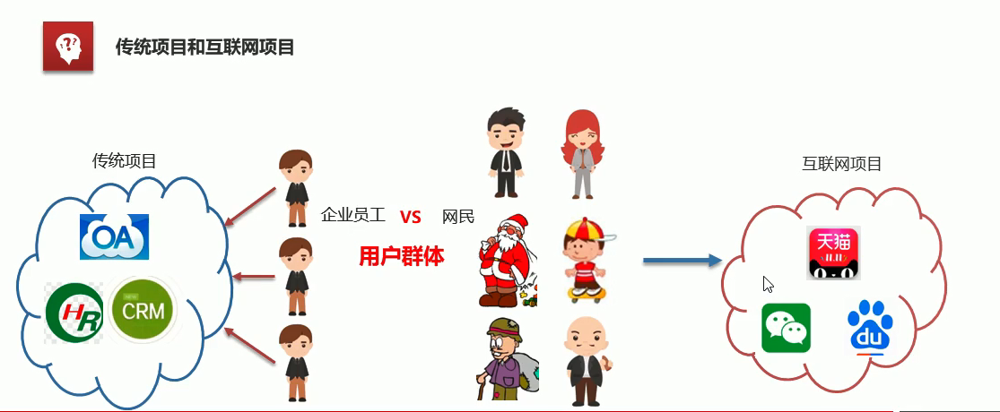

**1.用户群体**：

   传统项目：企业员工

   互联网项目：广大网民

**2.用户体验要求**：
	美观、功能、速度、稳定性

**衡量一个网站速度是否快:**
	打开一个新页面一瞬间完成;页面内跳转，-刹那间完成。
	根据佛经《僧衹律》记载:一 刹那者为-念,二十念为-瞬,二十瞬为-弹
	指，二十弹指为-罗预， 二十罗预为-须臾，一日一夜有三十须臾。

>经过周密的计算:一瞬间为0.36秒，一刹那为0.018秒

#### **1.1.1 互联网项目特点**：

- 用户多
- 流量大，并发高
- 海量数据
- 易受攻击
- 功能繁琐
- 变更快

#### **1.1.2 衡量网站的性能指标:**

- **响应时间:**指执行一个请求从开始到最后收到响应数据所花费的总体时间。
- **并发数:**指系统同时能处理的请求数量。

>​    **并发连接数:** 指的是客户端向服务器发起请求，并建立了TCP连接。每秒钟服务器连接的总TCP数量
>
>​    **请求数:**也称为QPS(Query Per Second)指每秒多少请求.请求数是大于等于并发连接数的。
>
>​    **并发用户数:**单位时间内有多少用户

- **吞吐量:**指单位时间内系统能处理的请求数量。

> ●QPS: Query Per Second每秒查询数。
> ●TPS: Transactions Per Second每秒事务数。
> ●一个事务是指一 个客户机向服务器发送请求然后服务器做出反应的过程。客户机在发送请求时开始计时，收到服务器响应后结束
> 计时，以此来计算使用的时间和完成的事务个数。
> ●一个页面的一次访问，只会形成一 个TPS; 但-次页面请求，可能产生多次对服务器的请求，就会有多个QPS
>   QPS>=并发连接数>= TPS

总结：大型互联网根据根据以上性能指标进行衡量，最终想实现的目标为：

- 高性能：提供快速的访问体验
- 高可用：网站服务可以一直正常访问
- 可伸缩：通过硬件增加/较少，提高/降低处理能力
- 高可拓展性：系统间耦合低，方便的通过新增/移除方式，增加/减少新的功能/模块
- 安全性：提供网站安全访问和数据加密，安全存储等策略
- 敏捷性：随需应变，快速响应

### 1.2  集群和分布式相关概念

集群和分布式，

- 集群:很多“人”一起，干一样的事。实际上就是一个业务模块，部署在多台服务器上。
- 分布式:很多"人”一起，干不样的事。这些不一样的事， 合起来是一件大事。一个大的业务系统，拆分为小的业务模块，分别部署在不同的机器上。

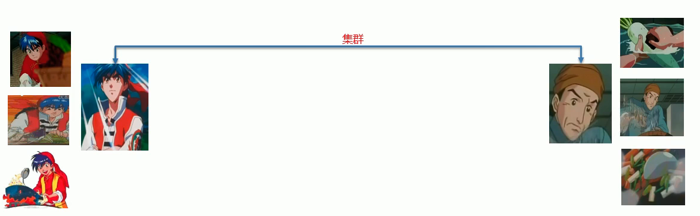

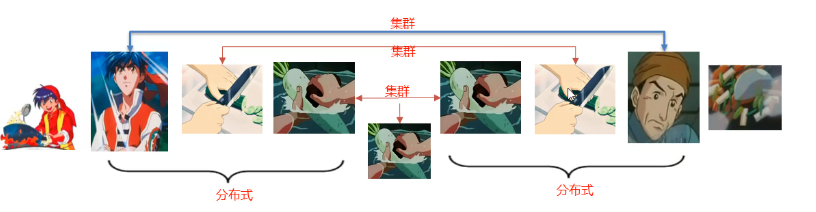

### 1.3 分布式系统架构演进

架构演变历史：

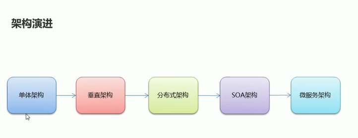

#### 1.3.1 单体架构

**优点:**
	简单:开发部署都很方便，小型项目首选
**缺点:**

- 项目启动慢
- 可靠性差
- 可伸缩性差
- 拓展性和可维护性差
- 性能差

#### 1.3.2 垂直架构

垂直架构是将单体架构中的多个模块拆分成为多个独立的架构，形成多个独立的单体架构。

**垂直架构存在的问题**：

- 重复功能太多啦

#### 1.3.3 分布式架构

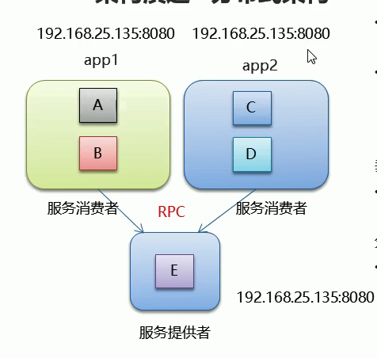

==分布式服务是指在垂直架构的基础上，将公共的业务模块抽取出来，作为独立的服务，供其他调用者消费，以实现服务的共享和重用。==底层通过RPC（远程过程调用实现）
**RPC:** Remote Procedure Call远程过程调用。有非常多的协议和技术来都实现了RPC的过程。比如: HTTP REST风格，Java RMI规范、WebService SOAP协议Hession等等。

**分布式架构存在的问题:**

- 服务提供方- -旦产生变更,所有消费方都需要变更。比如服务提供方的IP端口等变更，由于分布式系统架构是直接调用，此时需要在调用方进行变更。

#### 1.3.4 SOA架构

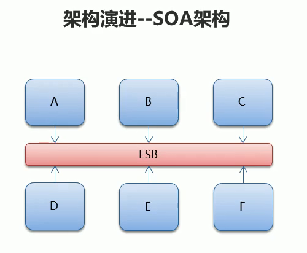

**SOA: (Service- Oriented Architecture,面向服务的架构)**：是一个组件模型,它将应用程序的不同功能单元(称为服务)进行拆分，并通过这些服务之间定义良好的接口和契约联系起来。也就是服务消费方不需要直接知道服务提供方的IP端口等信息，因为不再直接调用。只需要通过良好的接口和契约告知调用哪个服务即可。

**ESB: (Enterparise Servce Bus)**：企业服务总线,服务中介。主要是提供了一一个服务于服务之间的交互。ESB包含的功能如:负载均衡，流量控制，加密处理，服务的监控，异常处理，监控告急等等。

#### 1.3.5 微服务架构

微服务架构是在SOA上做的升华,微服务架构强调的一个重点是“业务需要彻底的组件化和服务化”，原有的单个业务系统会拆分为多个可以独立开发、设计、运行的小应用。这些小应用之间通过服务完成交互和集成。

**微服务架构= 80%的SOA服务架构思想+ 100%的组件化架构思想+ 80%的领域建模思想**

**特点:**

- 服务实现组件化:开发者可以自由选择开发技术。也不需要协调其他团队
- 服务之间交互一 般使用REST API
- 去中心化:每个微服务有自己私有的数据库持久化业务数据
- 自动化部署:把应用拆分成为一 个-个独立的单个服务,方便自动化部署、测试、运维

## 2.Dubbo概述⭐

>●Dubbo是阿里巴巴公司开源的一个高性能、轻量级的Java RPC框架。
>●致力于提供高性能和透明化的RPC远程服务调用方案,以及SOA服务治理方案。
>●官网: htp://ubbo.apache.orgo

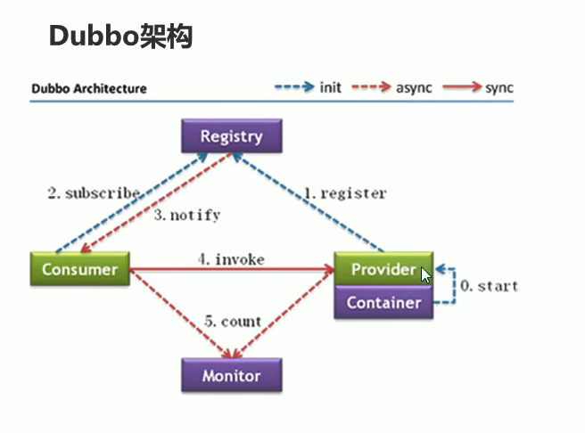

节点角色说明: .

| 节点      | 角色名称                                                     |
| --------- | ------------------------------------------------------------ |
| Provider  | 暴露服务的服务提供方，这个选哟运行在容器内部，通常是运行在Spring容器中 |
| Container | 服务运行容器，Spring容器启动服务                             |
| Consumer  | 调用远程服务的服务消费方,需要去subscribe订阅服务             |
| Registry  | 服务注册与发现的注册中心，服务提供者有变动，也会notify通知给服务提供者 |
| Monitor   | 统计服务的调用次数和调用时间的监控中心，监控中心不是必须的   |

虚线都是异步调用，实线是同步调用。

蓝色虚线：在启动时完成的功能

红色虚线（实线）：都是程序运行过程中执行的功能

**调用关系说明**：

0.服务容器负责启动，加载，运行服务提供者

1.服务提供者在启动时，向注册中心注册自己的服务

2.服务消费者在启动时，向注册中心订阅自己所需的服务

3.注册中心返回服务提供者地址列表给消费者，如果有变更，注册中心将基于长连接推送变更数据给消费者。

4.服务消费者，从服务提供者列表中，基于负载均衡算法，选一台提供者进行调用，如果调用失败，再选另一台调用。

## 3.Zookeeper注册中心⭐🐏

### 3.1 Zookeeper介绍

Zookeeper 是 Apache Hadoop 的子项目，是一个树型的目录服务，支持变更推送，适合作为 Dubbo 服务的注册中心，工业强度较高，可用于生产环境，并推荐使用 。

为了便于理解Zookeeper的树型目录服务，我们先来看一下我们电脑的文件系统(也是一个树型目录结构)：


我的电脑可以分为多个盘符（例如C、D、E等），每个盘符下可以创建多个目录，每个目录下面可以创建文件，也可以创建子目录，最终构成了一个树型结构。通过这种树型结构的目录，我们可以将文件分门别类的进行存放，方便我们后期查找。而且磁盘上的每个文件都有一个唯一的访问路径，例如：C:\Windows\itcast\hello.txt。

Zookeeper树型目录服务：


流程说明：

- 服务提供者(Provider)启动时: 向 `/dubbo/com.foo.BarService/providers` 目录下写入自己的 URL 地址
- 服务消费者(Consumer)启动时: 订阅 `/dubbo/com.foo.BarService/providers` 目录下的提供者 URL 地址。并向 `/dubbo/com.foo.BarService/consumers` 目录下写入自己的 URL 地址
- 监控中心(Monitor)启动时: 订阅 `/dubbo/com.foo.BarService` 目录下的所有提供者和消费者 URL 地址

### 3.2 Zookeeper安装

下载地址：http://archive.apache.org/dist/zookeeper/

本课程使用的Zookeeper版本为3.5.6，下载完成后可以获得名称为zookeeper-3.4.6.tar.gz的压缩文件。

安装步骤：

第一步：安装 jdk（略）
第二步：把 zookeeper 的压缩包（zookeeper-3.4.6.tar.gz）上传到 linux 系统

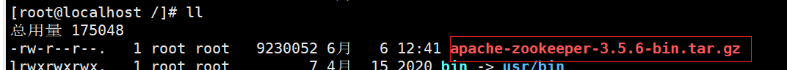

第三步：解压缩压缩包

~~~she
tar -zxvf apache-zookeeper-3.5.6-bin.tar.gz  -C /usr/local/
~~~

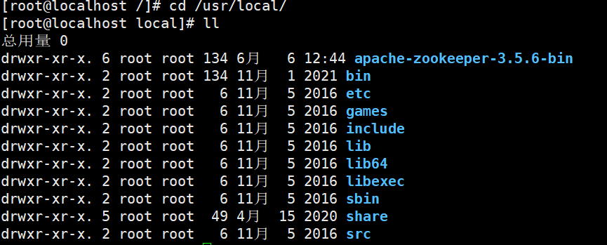

第四步：进入zookeeper-3.4.6目录，创建data目录

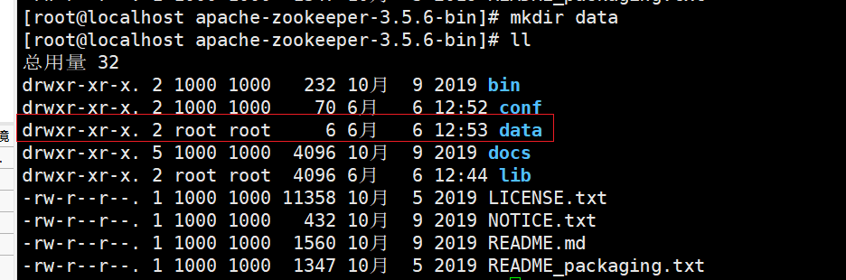

~~~shell
mkdir data
~~~

此时data目录为：/usr/local/apache-zookeeper-3.5.6-bin/data

第五步：进入conf目录 ，把zoo_sample.cfg 改名为zoo.cfg

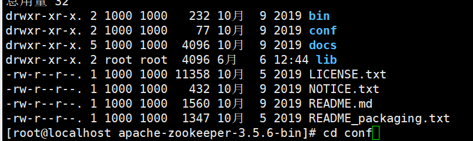

~~~shell
cd conf
mv zoo_sample.cfg zoo.cfg
~~~

第六步：打开zoo.cfg文件,  修改data属性：dataDir=/usr/local/apache-zookeeper-3.5.6-bin/data

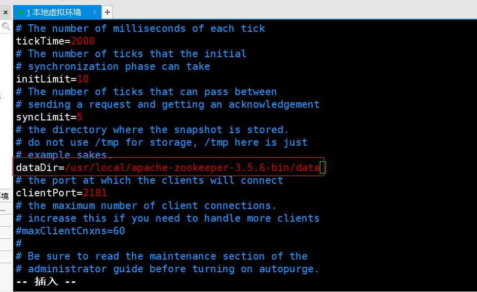

### 3.3 启动、停止Zookeeper

zookeeper的默认端口是2181.

进入Zookeeper的bin目录，启动服务命令
 ./zkServer.sh start

停止服务命令
./zkServer.sh stop

查看服务状态：
./zkServer.sh status

##  4.Dubbo案例⭐🐂

### 4.1 基础案例搭建

我们先创建两个工程：dubbo-service和dubbo-web.其中dubbo-service是一个jar工程，被web工程dubbo-web所依赖。

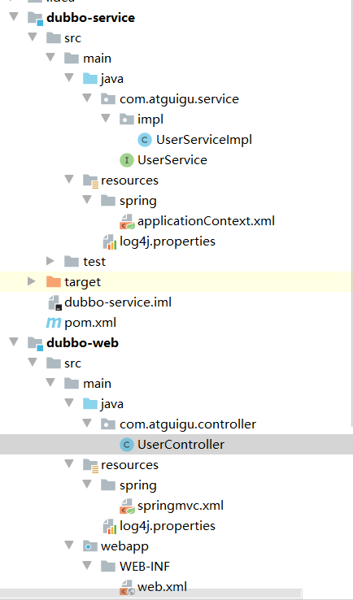

dubbo-service：

**pom.xml**

~~~xml
<?xml version="1.0" encoding="UTF-8"?>
<project xmlns="http://maven.apache.org/POM/4.0.0"
         xmlns:xsi="http://www.w3.org/2001/XMLSchema-instance"
         xsi:schemaLocation="http://maven.apache.org/POM/4.0.0 http://maven.apache.org/xsd/maven-4.0.0.xsd">
    <parent>
        <artifactId>IdeaProject1</artifactId>
        <groupId>org.example</groupId>
        <version>1.0-SNAPSHOT</version>
    </parent>
    <modelVersion>4.0.0</modelVersion>

    <artifactId>dubbo-service</artifactId>

    <properties>
        <spring.version>5.1.9.RELEASE</spring.version>
        <dubbo.version>2.7.4.1</dubbo.version>
        <zookeeper.version>4.0.0</zookeeper.version>

    </properties>

    <dependencies>
        <!-- servlet3.0规范的坐标 -->
        <dependency>
            <groupId>javax.servlet</groupId>
            <artifactId>javax.servlet-api</artifactId>
            <version>3.1.0</version>
            <scope>provided</scope>
        </dependency>
        <!--spring的坐标-->
        <dependency>
            <groupId>org.springframework</groupId>
            <artifactId>spring-context</artifactId>
            <version>${spring.version}</version>
        </dependency>
        <!--springmvc的坐标-->
        <dependency>
            <groupId>org.springframework</groupId>
            <artifactId>spring-webmvc</artifactId>
            <version>${spring.version}</version>
        </dependency>

        <!--日志-->
        <dependency>
            <groupId>org.slf4j</groupId>
            <artifactId>slf4j-api</artifactId>
            <version>1.7.21</version>
        </dependency>
        <dependency>
            <groupId>org.slf4j</groupId>
            <artifactId>slf4j-log4j12</artifactId>
            <version>1.7.21</version>
        </dependency>


        <!--Dubbo的起步依赖，版本2.7之后统一为rg.apache.dubb -->
        <dependency>
            <groupId>org.apache.dubbo</groupId>
            <artifactId>dubbo</artifactId>
            <version>${dubbo.version}</version>
        </dependency>
        <!--ZooKeeper客户端实现 -->
        <dependency>
            <groupId>org.apache.curator</groupId>
            <artifactId>curator-framework</artifactId>
            <version>${zookeeper.version}</version>
        </dependency>
        <!--ZooKeeper客户端实现 -->
        <dependency>
            <groupId>org.apache.curator</groupId>
            <artifactId>curator-recipes</artifactId>
            <version>${zookeeper.version}</version>
        </dependency>

    </dependencies>
</project>
~~~

**配置文件**

~~~xml
<?xml version="1.0" encoding="UTF-8"?>
<beans xmlns="http://www.springframework.org/schema/beans"
	   xmlns:xsi="http://www.w3.org/2001/XMLSchema-instance"
	   xmlns:dubbo="http://dubbo.apache.org/schema/dubbo" xmlns:context="http://www.springframework.org/schema/context"
	   xsi:schemaLocation="http://www.springframework.org/schema/beans http://www.springframework.org/schema/beans/spring-beans.xsd
        http://dubbo.apache.org/schema/dubbo http://dubbo.apache.org/schema/dubbo/dubbo.xsd http://www.springframework.org/schema/context https://www.springframework.org/schema/context/spring-context.xsd">
	<context:component-scan base-package="com.atguigu.service"></context:component-scan>


</beans>
~~~

~~~properties
# DEBUG < INFO < WARN < ERROR < FATAL
# Global logging configuration
log4j.rootLogger=info, stdout,file
# My logging configuration...
#log4j.logger.com.tocersoft.school=DEBUG
#log4j.logger.net.sf.hibernate.cache=debug
## Console output...
log4j.appender.stdout=org.apache.log4j.ConsoleAppender
log4j.appender.stdout.layout=org.apache.log4j.PatternLayout
log4j.appender.stdout.layout.ConversionPattern=%5p %d %C: %m%n

log4j.appender.file=org.apache.log4j.FileAppender
log4j.appender.file.File=../logs/iask.log
log4j.appender.file.layout=org.apache.log4j.PatternLayout
log4j.appender.file.layout.ConversionPattern=%d{yyyy-MM-dd HH:mm:ss}  %l  %m%n
~~~

**接口**

~~~java
package com.atguigu.service;

public interface UserService {
    public String sayHello();
}
~~~

**实现类**

~~~java
package com.atguigu.service.impl;

import com.atguigu.service.UserService;
import org.springframework.stereotype.Service;

@Service
public class UserServiceImpl implements UserService {
    @Override
    public String sayHello() {
        return "hello dubbo";
    }
}
~~~

***

dubbo-web

**pom.xml**

~~~xml
<?xml version="1.0" encoding="UTF-8"?>
<project xmlns="http://maven.apache.org/POM/4.0.0"
         xmlns:xsi="http://www.w3.org/2001/XMLSchema-instance"
         xsi:schemaLocation="http://maven.apache.org/POM/4.0.0 http://maven.apache.org/xsd/maven-4.0.0.xsd">
    <parent>
        <artifactId>IdeaProject1</artifactId>
        <groupId>org.example</groupId>
        <version>1.0-SNAPSHOT</version>
    </parent>
    <modelVersion>4.0.0</modelVersion>

    <artifactId>dubbo-web</artifactId>

    <!-- 这个项目需要打成war包-->
    <packaging>war</packaging>

    <properties>
        <spring.version>5.1.9.RELEASE</spring.version>
        <dubbo.version>2.7.4.1</dubbo.version>
        <zookeeper.version>4.0.0</zookeeper.version>
    </properties>

    <dependencies>
        <!-- servlet3.0规范的坐标 -->
        <dependency>
            <groupId>javax.servlet</groupId>
            <artifactId>javax.servlet-api</artifactId>
            <version>3.1.0</version>
            <scope>provided</scope>
        </dependency>
        <!--spring的坐标-->
        <dependency>
            <groupId>org.springframework</groupId>
            <artifactId>spring-context</artifactId>
            <version>${spring.version}</version>
        </dependency>
        <!--springmvc的坐标-->
        <dependency>
            <groupId>org.springframework</groupId>
            <artifactId>spring-webmvc</artifactId>
            <version>${spring.version}</version>
        </dependency>

        <!--日志-->
        <dependency>
            <groupId>org.slf4j</groupId>
            <artifactId>slf4j-api</artifactId>
            <version>1.7.21</version>
        </dependency>
        <dependency>
            <groupId>org.slf4j</groupId>
            <artifactId>slf4j-log4j12</artifactId>
            <version>1.7.21</version>
        </dependency>


        <!--Dubbo的起步依赖，版本2.7之后统一为rg.apache.dubb -->
        <dependency>
            <groupId>org.apache.dubbo</groupId>
            <artifactId>dubbo</artifactId>
            <version>${dubbo.version}</version>
        </dependency>
        <!--ZooKeeper客户端实现 -->
        <dependency>
            <groupId>org.apache.curator</groupId>
            <artifactId>curator-framework</artifactId>
            <version>${zookeeper.version}</version>
        </dependency>
        <!--ZooKeeper客户端实现 -->
        <dependency>
            <groupId>org.apache.curator</groupId>
            <artifactId>curator-recipes</artifactId>
            <version>${zookeeper.version}</version>
        </dependency>

        <dependency>
            <groupId>org.example</groupId>
            <artifactId>dubbo-service</artifactId>
            <version>1.0-SNAPSHOT</version>
        </dependency>
    </dependencies>


    <build>
        <plugins>
            <!--tomcat插件-->
            <plugin>
                <groupId>org.apache.tomcat.maven</groupId>
                <artifactId>tomcat7-maven-plugin</artifactId>
                <version>2.1</version>
                <configuration>
                    <port>8000</port>
                    <path>/</path>
                </configuration>
            </plugin>
        </plugins>
    </build>

</project>
~~~

**配置文件**

~~~xml
<?xml version="1.0" encoding="UTF-8"?>
<web-app xmlns:xsi="http://www.w3.org/2001/XMLSchema-instance"
         xmlns="http://java.sun.com/xml/ns/javaee"
         xsi:schemaLocation="http://java.sun.com/xml/ns/javaee http://java.sun.com/xml/ns/javaee/web-app_2_5.xsd"
         version="2.5">

		 
	<!-- spring -->
    <context-param>
        <param-name>contextConfigLocation</param-name>
        <param-value>classpath*:spring/applicationContext*.xml</param-value>
    </context-param>
    <listener>
        <listener-class>org.springframework.web.context.ContextLoaderListener</listener-class>
    </listener>
		 
	<!-- Springmvc -->	 
    <servlet>
        <servlet-name>springmvc</servlet-name>
        <servlet-class>org.springframework.web.servlet.DispatcherServlet</servlet-class>
        <!-- 指定加载的配置文件 ，通过参数contextConfigLocation加载-->
        <init-param>
            <param-name>contextConfigLocation</param-name>
            <param-value>classpath:spring/springmvc.xml</param-value>
        </init-param>
    </servlet>

    <servlet-mapping>
        <servlet-name>springmvc</servlet-name>
        <!--
        如果在 web.xml 中配置的 *.do，则会拦截所有的 .do 请求去匹配
        但是在 Controller 中的 RequestMapping 的 Value 如果是字符串没有不是 .do 结尾，那么 Spring MVC 会默认的加上 .do，
        web.xml 中配置了url-pattern后，会起到两个作用：
        （1）是限制 url 的后缀名，只能为”.do”。
        （2）就是在没有填写后缀时，默认在你配置的 Controller 的 RequestMapping 中添加”.do”的后缀。
        -->
        <url-pattern>*.do</url-pattern>
    </servlet-mapping>


</web-app>
~~~

~~~properties
# DEBUG < INFO < WARN < ERROR < FATAL
# Global logging configuration
log4j.rootLogger=info, stdout,file
# My logging configuration...
#log4j.logger.com.tocersoft.school=DEBUG
#log4j.logger.net.sf.hibernate.cache=debug
## Console output...
log4j.appender.stdout=org.apache.log4j.ConsoleAppender
log4j.appender.stdout.layout=org.apache.log4j.PatternLayout
log4j.appender.stdout.layout.ConversionPattern=%5p %d %C: %m%n

log4j.appender.file=org.apache.log4j.FileAppender
log4j.appender.file.File=../logs/iask.log
log4j.appender.file.layout=org.apache.log4j.PatternLayout
log4j.appender.file.layout.ConversionPattern=%d{yyyy-MM-dd HH:mm:ss}  %l  %m%n
~~~

~~~**xml
<?xml version="1.0" encoding="UTF-8"?>
<beans xmlns="http://www.springframework.org/schema/beans"
       xmlns:xsi="http://www.w3.org/2001/XMLSchema-instance"
       xmlns:dubbo="http://dubbo.apache.org/schema/dubbo"
       xmlns:mvc="http://www.springframework.org/schema/mvc"
       xmlns:context="http://www.springframework.org/schema/context"
       xsi:schemaLocation="http://www.springframework.org/schema/beans http://www.springframework.org/schema/beans/spring-beans.xsd
        http://www.springframework.org/schema/mvc http://www.springframework.org/schema/mvc/spring-mvc.xsd
         http://dubbo.apache.org/schema/dubbo http://dubbo.apache.org/schema/dubbo/dubbo.xsd http://www.springframework.org/schema/context https://www.springframework.org/schema/context/spring-context.xsd">
<mvc:annotation-driven></mvc:annotation-driven>
    <context:component-scan base-package="com.atguigu.controller"></context:component-scan>

</beans>
~~~

**代码**

~~~java
package com.atguigu.controller;


import com.atguigu.service.UserService;
import org.springframework.beans.factory.annotation.Autowired;
import org.springframework.web.bind.annotation.RequestMapping;
import org.springframework.web.bind.annotation.RestController;

@RestController
@RequestMapping("/user")
public class UserController {
    @Autowired
    private UserService userService;

    @RequestMapping("/sayHello")
    public String sayHello(){
        return userService.sayHello();
    }

}

~~~

此时我们访问：http://localhost:8000/user/sayHello.do，可以看到字符串顺利被打印出来。

此时的Dubbo-service还不是一个独立的web服务，只是被依赖进来啦，上述工程还不算是一个分布式工程。为此我们需要对上述项目进行改造。

### 4.2 服务提供者和@servcie

对service的pom.xml进行改造

- 1.引入依赖：由于此时的服务提供方也是web工程，所以我们也添加tomcat插件

~~~xml
<?xml version="1.0" encoding="UTF-8"?>
<project xmlns="http://maven.apache.org/POM/4.0.0"
         xmlns:xsi="http://www.w3.org/2001/XMLSchema-instance"
         xsi:schemaLocation="http://maven.apache.org/POM/4.0.0 http://maven.apache.org/xsd/maven-4.0.0.xsd">
    <parent>
        <artifactId>IdeaProject1</artifactId>
        <groupId>org.example</groupId>
        <version>1.0-SNAPSHOT</version>
    </parent>
    <modelVersion>4.0.0</modelVersion>

    <artifactId>dubbo-service</artifactId>
    <packaging>war</packaging>
    <properties>
        <spring.version>5.1.9.RELEASE</spring.version>
        <dubbo.version>2.7.4.1</dubbo.version>
        <zookeeper.version>4.0.0</zookeeper.version>

    </properties>

    <dependencies>
        <!-- servlet3.0规范的坐标 -->
        <dependency>
            <groupId>javax.servlet</groupId>
            <artifactId>javax.servlet-api</artifactId>
            <version>3.1.0</version>
            <scope>provided</scope>
        </dependency>
        <!--spring的坐标-->
        <dependency>
            <groupId>org.springframework</groupId>
            <artifactId>spring-context</artifactId>
            <version>${spring.version}</version>
        </dependency>
        <!--springmvc的坐标-->
        <dependency>
            <groupId>org.springframework</groupId>
            <artifactId>spring-webmvc</artifactId>
            <version>${spring.version}</version>
        </dependency>

        <!--日志-->
        <dependency>
            <groupId>org.slf4j</groupId>
            <artifactId>slf4j-api</artifactId>
            <version>1.7.21</version>
        </dependency>
        <dependency>
            <groupId>org.slf4j</groupId>
            <artifactId>slf4j-log4j12</artifactId>
            <version>1.7.21</version>
        </dependency>


        <!--Dubbo的起步依赖，版本2.7之后统一为rg.apache.dubb -->
        <dependency>
            <groupId>org.apache.dubbo</groupId>
            <artifactId>dubbo</artifactId>
            <version>${dubbo.version}</version>
        </dependency>
        <!--ZooKeeper客户端实现 -->
        <dependency>
            <groupId>org.apache.curator</groupId>
            <artifactId>curator-framework</artifactId>
            <version>${zookeeper.version}</version>
        </dependency>
        <!--ZooKeeper客户端实现 -->
        <dependency>
            <groupId>org.apache.curator</groupId>
            <artifactId>curator-recipes</artifactId>
            <version>${zookeeper.version}</version>
        </dependency>

    </dependencies>

    <build>
        <plugins>
            <!--tomcat插件-->
            <plugin>
                <groupId>org.apache.tomcat.maven</groupId>
                <artifactId>tomcat7-maven-plugin</artifactId>
                <version>2.1</version>
                <configuration>
                    <port>9999</port>
                    <path>/</path>
                </configuration>
            </plugin>
        </plugins>
    </build>
</project>
~~~

- 2.编写web.xml

~~~xml
<?xml version="1.0" encoding="UTF-8"?>
<web-app xmlns:xsi="http://www.w3.org/2001/XMLSchema-instance"
         xmlns="http://java.sun.com/xml/ns/javaee"
         xsi:schemaLocation="http://java.sun.com/xml/ns/javaee http://java.sun.com/xml/ns/javaee/web-app_2_5.xsd"
         version="2.5">
	<!-- spring -->
    <context-param>
        <param-name>contextConfigLocation</param-name>
        <param-value>classpath*:spring/applicationContext*.xml</param-value>
    </context-param>
    <listener>
        <listener-class>org.springframework.web.context.ContextLoaderListener</listener-class>
    </listener>

</web-app>
~~~

- 3.编写Spring配置文件需要加入注册中心相关信息

~~~xml
<?xml version="1.0" encoding="UTF-8"?>
<beans xmlns="http://www.springframework.org/schema/beans"
	   xmlns:xsi="http://www.w3.org/2001/XMLSchema-instance"
	   xmlns:dubbo="http://dubbo.apache.org/schema/dubbo" xmlns:context="http://www.springframework.org/schema/context"
	   xsi:schemaLocation="http://www.springframework.org/schema/beans http://www.springframework.org/schema/beans/spring-beans.xsd
        http://dubbo.apache.org/schema/dubbo http://dubbo.apache.org/schema/dubbo/dubbo.xsd http://www.springframework.org/schema/context https://www.springframework.org/schema/context/spring-context.xsd">
<!--	<context:component-scan base-package="com.atguigu.service"></context:component-scan>-->

    <!--dubbo的配置 -->
	<!--1.配置项目的名称，项目的名称需要唯一 -->
   <dubbo:application name="dubbo-service"></dubbo:application>
	<!--2.配置注册中心的地址 -->
	<dubbo:registry address="zookeeper://192.168.248.132:2181"></dubbo:registry>
    <!--3.配置Dubbo的包扫描。扫描Service接口所在包 -->
    <!-- 扫描指定包，加入@Service注解的类会被发布为服务  -->
	<dubbo:annotation package="com.atguigu.service"></dubbo:annotation>

</beans>
~~~

- 4.service接口

~~~java
package com.atguigu.service;

public interface UserService {
    public String sayHello();
}
~~~

- 5.Service实现类，**注意：服务实现类上使用的Service注解是Dubbo提供的，用于对外发布服务**

~~~java
package com.atguigu.service.impl;

import com.atguigu.service.UserService;
import org.apache.dubbo.config.annotation.Service;

@Service  // 这个是Dubbo提供的Service注解，将这个类提供的方法（服务）对外发布，将访问的地址，ip，端口，路径注册到注册中心中
public class UserServiceImpl implements UserService {
    @Override
    public String sayHello() {
        return "hello dubbo";
    }
}
~~~

### 4.3 服务消费者和@Reference

- 1.pom.xml文件

~~~xml
<?xml version="1.0" encoding="UTF-8"?>
<project xmlns="http://maven.apache.org/POM/4.0.0"
         xmlns:xsi="http://www.w3.org/2001/XMLSchema-instance"
         xsi:schemaLocation="http://maven.apache.org/POM/4.0.0 http://maven.apache.org/xsd/maven-4.0.0.xsd">
    <parent>
        <artifactId>IdeaProject1</artifactId>
        <groupId>org.example</groupId>
        <version>1.0-SNAPSHOT</version>
    </parent>
    <modelVersion>4.0.0</modelVersion>

    <artifactId>dubbo-web</artifactId>

    <!-- 这个项目需要打成war包-->
    <packaging>war</packaging>

    <properties>
        <spring.version>5.1.9.RELEASE</spring.version>
        <dubbo.version>2.7.4.1</dubbo.version>
        <zookeeper.version>4.0.0</zookeeper.version>
    </properties>

    <dependencies>
        <!-- servlet3.0规范的坐标 -->
        <dependency>
            <groupId>javax.servlet</groupId>
            <artifactId>javax.servlet-api</artifactId>
            <version>3.1.0</version>
            <scope>provided</scope>
        </dependency>
        <!--spring的坐标-->
        <dependency>
            <groupId>org.springframework</groupId>
            <artifactId>spring-context</artifactId>
            <version>${spring.version}</version>
        </dependency>
        <!--springmvc的坐标-->
        <dependency>
            <groupId>org.springframework</groupId>
            <artifactId>spring-webmvc</artifactId>
            <version>${spring.version}</version>
        </dependency>

        <!--日志-->
        <dependency>
            <groupId>org.slf4j</groupId>
            <artifactId>slf4j-api</artifactId>
            <version>1.7.21</version>
        </dependency>
        <dependency>
            <groupId>org.slf4j</groupId>
            <artifactId>slf4j-log4j12</artifactId>
            <version>1.7.21</version>
        </dependency>


        <!--Dubbo的起步依赖，版本2.7之后统一为rg.apache.dubb -->
        <dependency>
            <groupId>org.apache.dubbo</groupId>
            <artifactId>dubbo</artifactId>
            <version>${dubbo.version}</version>
        </dependency>
        <!--ZooKeeper客户端实现 -->
        <dependency>
            <groupId>org.apache.curator</groupId>
            <artifactId>curator-framework</artifactId>
            <version>${zookeeper.version}</version>
        </dependency>
        <!--ZooKeeper客户端实现 -->
        <dependency>
            <groupId>org.apache.curator</groupId>
            <artifactId>curator-recipes</artifactId>
            <version>${zookeeper.version}</version>
        </dependency>

    </dependencies>


    <build>
        <plugins>
            <!--tomcat插件-->
            <plugin>
                <groupId>org.apache.tomcat.maven</groupId>
                <artifactId>tomcat7-maven-plugin</artifactId>
                <version>2.1</version>
                <configuration>
                    <port>8000</port>
                    <path>/</path>
                </configuration>
            </plugin>
        </plugins>
    </build>

</project>
~~~

- 2.web.xml

~~~xml
<?xml version="1.0" encoding="UTF-8"?>
<web-app xmlns:xsi="http://www.w3.org/2001/XMLSchema-instance"
         xmlns="http://java.sun.com/xml/ns/javaee"
         xsi:schemaLocation="http://java.sun.com/xml/ns/javaee http://java.sun.com/xml/ns/javaee/web-app_2_5.xsd"
         version="2.5">
		 
	<!-- Springmvc -->	 
    <servlet>
        <servlet-name>springmvc</servlet-name>
        <servlet-class>org.springframework.web.servlet.DispatcherServlet</servlet-class>
        <!-- 指定加载的配置文件 ，通过参数contextConfigLocation加载-->
        <init-param>
            <param-name>contextConfigLocation</param-name>
            <param-value>classpath:spring/springmvc.xml</param-value>
        </init-param>
    </servlet>

    <servlet-mapping>
        <servlet-name>springmvc</servlet-name>
        <!--
        如果在 web.xml 中配置的 *.do，则会拦截所有的 .do 请求去匹配
        但是在 Controller 中的 RequestMapping 的 Value 如果是字符串没有不是 .do 结尾，那么 Spring MVC 会默认的加上 .do，
        web.xml 中配置了url-pattern后，会起到两个作用：
        （1）是限制 url 的后缀名，只能为”.do”。
        （2）就是在没有填写后缀时，默认在你配置的 Controller 的 RequestMapping 中添加”.do”的后缀。
        -->
        <url-pattern>*.do</url-pattern>
    </servlet-mapping>


</web-app>
~~~

- 3.springmvc的配置文件，配置文件需要加入注册中心相关信息

~~~xml
<?xml version="1.0" encoding="UTF-8"?>
<beans xmlns="http://www.springframework.org/schema/beans"
       xmlns:xsi="http://www.w3.org/2001/XMLSchema-instance"
       xmlns:dubbo="http://dubbo.apache.org/schema/dubbo"
       xmlns:mvc="http://www.springframework.org/schema/mvc"
       xmlns:context="http://www.springframework.org/schema/context"
       xsi:schemaLocation="http://www.springframework.org/schema/beans http://www.springframework.org/schema/beans/spring-beans.xsd
        http://www.springframework.org/schema/mvc http://www.springframework.org/schema/mvc/spring-mvc.xsd
         http://dubbo.apache.org/schema/dubbo http://dubbo.apache.org/schema/dubbo/dubbo.xsd http://www.springframework.org/schema/context https://www.springframework.org/schema/context/spring-context.xsd">
<mvc:annotation-driven></mvc:annotation-driven>
    <context:component-scan base-package="com.atguigu.controller"></context:component-scan>
    <!--dubbo的配置 -->
    <!--1.配置项目的名称，项目的名称需要唯一 -->
    <dubbo:application name="dubbo-web"></dubbo:application>
    <!--2.配置注册中心的地址 -->
    <dubbo:registry address="zookeeper://192.168.248.132:2181"></dubbo:registry>
    <!--3.配置Dubbo的包扫描。-->
    <dubbo:annotation package="com.atguigu.controller"></dubbo:annotation>

</beans>
~~~

- 4.编写Service：由于此时的Dubbo-service和Dubbo-web是两个不同的模块，故此时依赖中是没有Dubbo-service的代码的，我们暂时是将service接口写在了dubbo-web工程，也就是：

~~~java
package com.atguigu.service;

public interface UserService {
    public String sayHello();
}
~~~

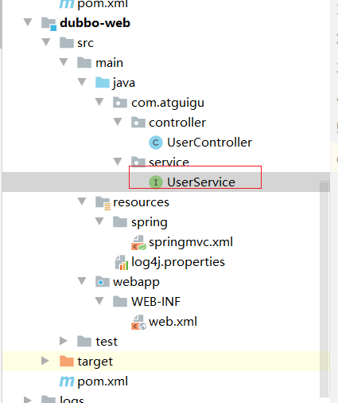

但是后面我们会解决这个问题。

- 5.编写controller

~~~java
package com.atguigu.controller;


import com.atguigu.service.UserService;
import org.apache.dubbo.config.annotation.Reference;
import org.springframework.beans.factory.annotation.Autowired;
import org.springframework.web.bind.annotation.RequestMapping;
import org.springframework.web.bind.annotation.RestController;

@RestController
@RequestMapping("/user")
public class UserController {
    //  @Autowired // 本地注入
    /**
     * 1.从zookeeper注册中心获取userService的访问
     * 2.进行远程调用RPC
     * 3.将结果封装为一个代理对象，给变量赋值
     */
    @Reference //远程注入
    private UserService userService;

    @RequestMapping("/sayHello")
    public String sayHello(){
        return userService.sayHello();
    }

}
~~~

#### 4.3.1 解决案例日志报错的问题

我们在改造上述案例进行访问的时候，发现虽然访问成功，但是日志报错：

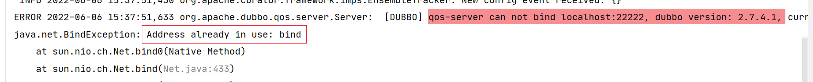

这是由于服务提供方和服务消费方都会使用22222作为qos-server的端口，我们让其中一个工程的qos-server的端口为其他值即可！

~~~xml
<?xml version="1.0" encoding="UTF-8"?>
<beans xmlns="http://www.springframework.org/schema/beans"
       xmlns:xsi="http://www.w3.org/2001/XMLSchema-instance"
       xmlns:dubbo="http://dubbo.apache.org/schema/dubbo"
       xmlns:mvc="http://www.springframework.org/schema/mvc"
       xmlns:context="http://www.springframework.org/schema/context"
       xsi:schemaLocation="http://www.springframework.org/schema/beans http://www.springframework.org/schema/beans/spring-beans.xsd
        http://www.springframework.org/schema/mvc http://www.springframework.org/schema/mvc/spring-mvc.xsd
         http://dubbo.apache.org/schema/dubbo http://dubbo.apache.org/schema/dubbo/dubbo.xsd http://www.springframework.org/schema/context https://www.springframework.org/schema/context/spring-context.xsd">
<mvc:annotation-driven></mvc:annotation-driven>
    <context:component-scan base-package="com.atguigu.controller"></context:component-scan>
    <!--dubbo的配置 -->
    <!--1.配置项目的名称，项目的名称需要唯一 -->
    <dubbo:application name="dubbo-web">
        <dubbo:parameter key="qos.port" value="44444"></dubbo:parameter>
    </dubbo:application>
    <!--2.配置注册中心的地址 -->
    <dubbo:registry address="zookeeper://192.168.248.132:2181"></dubbo:registry>
    <!--3.配置Dubbo的包扫描。-->
    <dubbo:annotation package="com.atguigu.controller"></dubbo:annotation>
</beans>
~~~

**思考一：**上面的Dubbo入门案例中我们是将Service接口从服务提供者工程(dubbo_service)复制到服务消费者工程(dubbo-web)中，这种做法是否合适？还有没有更好的方式？

**答：**这种做法显然是不好的，同一个接口被复制了两份，不利于后期维护。更好的方式是单独创建一个maven工程，将此接口创建在这个maven工程中。需要依赖此接口的工程只需要在自己工程的pom.xml文件中引入maven坐标即可。

**思考二：**在服务消费者工程(dubbo-web)中只是引用了HelloService接口，并没有提供实现类，Dubbo是如何做到远程调用的？

**答：**Dubbo底层是基于代理技术为Service接口创建代理对象，远程调用是通过此代理对象完成的。可以通过开发工具的debug功能查看此代理对象的内部结构。另外，Dubbo实现网络传输底层是基于Netty框架完成的。

**思考三：**上面的Dubbo入门案例中我们使用Zookeeper作为服务注册中心，服务提供者需要将自己的服务信息注册到Zookeeper，服务消费者需要从Zookeeper订阅自己所需要的服务，此时Zookeeper服务就变得非常重要了，那如何防止Zookeeper单点故障呢？

**答：**Zookeeper其实是支持集群模式的，可以配置Zookeeper集群来达到Zookeeper服务的高可用，防止出现单点故障。

### 4.4 Dubbo配置说明

##### 4.4.1 包扫描

```xml
<dubbo:annotation package="com.itheima.service" />
```

服务提供者和服务消费者都需要配置，表示包扫描，作用是扫描指定包(包括子包)下的类。

如果不使用包扫描，也可以通过如下配置的方式来发布服务：

```xml
<bean id="helloService" class="com.itheima.service.impl.HelloServiceImpl" />
<dubbo:service interface="com.itheima.api.HelloService" ref="helloService" />
```

作为服务消费者，可以通过如下配置来引用服务：

```xml
<!-- 生成远程服务代理，可以和本地bean一样使用helloService -->
<dubbo:reference id="helloService" interface="com.itheima.api.HelloService" />
```

上面这种方式发布和引用服务，一个配置项(<dubbo:service>、<dubbo:reference>)只能发布或者引用一个服务，如果有多个服务，这种方式就比较繁琐了。推荐使用包扫描方式。

##### 4.4.2 协议

```xml
<dubbo:protocol name="dubbo" port="20880"/>
```

一般在服务提供者一方配置，可以指定使用的协议名称和端口号。

其中Dubbo支持的协议有：dubbo、rmi、hessian、http、webservice、rest、redis等。

推荐使用的是dubbo协议。

dubbo 协议采用单一长连接和 NIO 异步通讯，适合于小数据量大并发的服务调用，以及服务消费者机器数远大于服务提供者机器数的情况。不适合传送大数据量的服务，比如传文件，传视频等，除非请求量很低。

也可以在同一个工程中配置多个协议，不同服务可以使用不同的协议，例如：

```xml
<!-- 多协议配置 -->
<dubbo:protocol name="dubbo" port="20880" />
<dubbo:protocol name="rmi" port="1099" />
<!-- 使用dubbo协议暴露服务 -->
<dubbo:service interface="com.itheima.api.HelloService" ref="helloService" protocol="dubbo" />
<!-- 使用rmi协议暴露服务 -->
<dubbo:service interface="com.itheima.api.DemoService" ref="demoService" protocol="rmi" /> 
```

## 5.Dubbo高级特性⭐🐂

### 5.1 管理控制台Dubbo-admin

dubbo- admin管理平台，是==**图形化的服务管理页面**==,提供了

- 从==注册中心==中获取到所有的提供者 /消费者进行配置管理，故dubbo- admin中需要配置注册中心地址；
- 路由规则、动态配置、服务降级、访问控制、权重调整、负载均衡等管理功能

实际上，dubbo- admin是一个前后端分离的项目。前端使用vue，后端使用springboot，我们安装dubbo-admin其实就是部署该项目。

**1、环境准备**

dubbo-admin 是一个前后端分离的项目。前端使用vue，后端使用springboot，安装 dubbo-admin 其实就是部署该项目。我们将dubbo-admin安装到开发环境上。要保证开发环境有jdk，maven，nodejs

安装node**(如果当前机器已经安装请忽略)**

因为前端工程是用vue开发的，所以需要安装node.js，node.js中自带了npm，后面我们会通过npm启动

下载地址

```
https://nodejs.org/en/
```

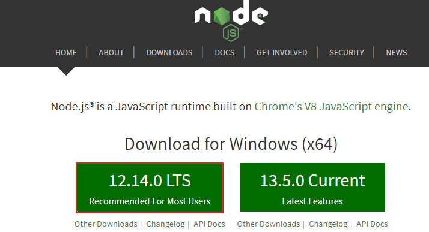


**2、下载 Dubbo-Admin**

进入github，搜索dubbo-admin

```
https://github.com/apache/dubbo-admin
```

下载：


**3、把下载的zip包解压到指定文件夹(解压到那个文件夹随意)**


**4、修改配置文件**

我们需要在配置文件中修改注册中心的配置等信息。

admin.registry.address注册中心
admin.config-center 配置中心
admin.metadata-report.address元数据中心

**5、打包项目**

在 dubbo-admin-develop 目录执行打包命令

```shell
mvn  clean package
```

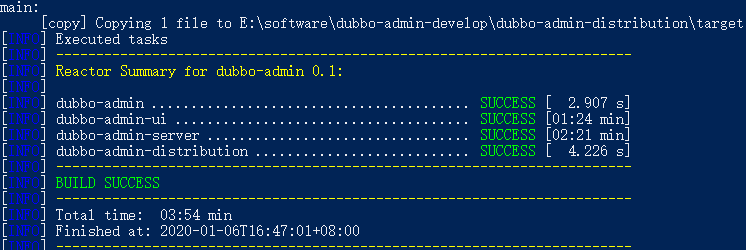

**6、启动后端**

切换到目录

```shell
dubbo-Admin-develop\dubbo-admin-distribution\target>
```

执行下面的命令启动 dubbo-admin，dubbo-admin后台由SpringBoot构建。

```shell
java -jar .\dubbo-admin-0.1.jar
```

**7、前台后端**

dubbo-admin-ui 目录下执行命令

```shell
npm run dev
```


**8、访问**

浏览器输入。用户名密码都是root

```
http://localhost:8081/
```


### 5.2 Dubbo自带的控制台

我们在开发时，需要知道Zookeeper注册中心都注册了哪些服务，有哪些消费者来消费这些服务。我们可以通过部署一个管理中心来实现。其实管理中心就是一个web应用，部署到tomcat即可。这个是Dubbo自带的，不如上面美观。

#### 5.2.1安装

安装步骤：

（1）将资料中的dubbo-admin-2.6.0.war文件复制到tomcat的webapps目录下

（2）启动tomcat，此war文件会自动解压

（3）修改WEB-INF下的dubbo.properties文件，注意dubbo.registry.address对应的值需要对应当前使用的Zookeeper的ip地址和端口号

​	dubbo.registry.address=zookeeper://192.168.253.124:2181
​	dubbo.admin.root.password=root
​	dubbo.admin.guest.password=guest

（4）重启tomcat

#### 5.2.2使用

操作步骤：

（1）访问http://localhost:8080/dubbo-admin-2.6.0/，输入用户名(root)和密码(root)


（2）启动服务提供者工程和服务消费者工程，可以在查看到对应的信息


### 5.3 序列化⭐🐂

我们在生产者和消费者之间如果需要传递java对象，此时就需要用到==java的序列化==。

1. dubbo 内部已经将序列化和反序列化的过程内部封装了
2. 我们只需要在定义pojo类时**实现serializable接口**即可
3. 一般会定义一 个公共的pojo模块,让生产者和消费者都依赖该模块。

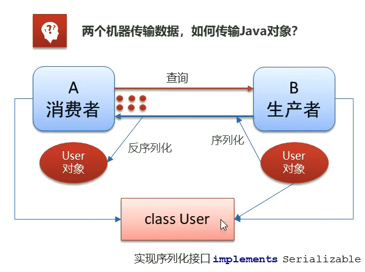

我们先创建一个实体类模块，让服务端和客户端都依赖这个实体类模块。实体类模块工程如下：dubbo-pojo

到时候服务消费端和服务提供端都引入这个模块依赖：

~~~xml
 <dependency>
            <groupId>org.example</groupId>
            <artifactId>dubbo-pojo</artifactId>
            <version>1.0-SNAPSHOT</version>
        </dependency>
~~~

~~~java
package com.atguigu.pojo;

import java.io.Serializable;

/**
 * 注意：将来所有的pojo类都需要实现Serializable接口！
 */
public class User implements Serializable {
    private String id;
    private String username;
    private String password;

    public User() {
    }

    public User(String id, String username, String password) {
        this.id = id;
        this.username = username;
        this.password = password;
    }

    public String getId() {
        return id;
    }

    public void setId(String id) {
        this.id = id;
    }

    public String getUsername() {
        return username;
    }

    public void setUsername(String username) {
        this.username = username;
    }

    public String getPassword() {
        return password;
    }

    public void setPassword(String password) {
        this.password = password;
    }
}
~~~

此时我们对Serivice工程做改造。

**接口**

~~~java
package com.atguigu.service;

import com.atguigu.pojo.User;

public interface UserService {
    public String sayHello();

    /**
     * 查询用户
     */
    public User findUserById(String id);
}
~~~

**实现类**

~~~java
package com.atguigu.service.impl;

import com.atguigu.pojo.User;
import com.atguigu.service.UserService;
import org.apache.dubbo.config.annotation.Service;

@Service  // 这个是Dubbo提供的Service注解，将这个类提供的方法（服务）对外发布，将访问的地址，ip，端口，路径注册到注册中心中
public class UserServiceImpl implements UserService {

    public String sayHello() {
        return "hello dubbo";
    }

    public User findUserById(String id) {
        // 查询user对象
        User user  = new User(id,"zhangsan","12");
        System.out.println(user.hashCode());
        return user;
    }
}


~~~

我们再对消费端接口做改造：

**控制器方法**

~~~java
package com.atguigu.controller;


import com.atguigu.pojo.User;
import com.atguigu.service.UserService;
import org.apache.dubbo.config.annotation.Reference;
import org.springframework.web.bind.annotation.RequestMapping;
import org.springframework.web.bind.annotation.RestController;

@RestController
@RequestMapping("/user")
public class UserController {
    //  @Autowired // 本地注入
    /**
     * 1.从zookeeper注册中心获取userService的访问
     * 2.进行远程调用RPC
     * 3.将结果封装为一个代理对象，给变量赋值
     */
    @Reference //远程注入
    private UserService userService;

    @RequestMapping("/sayHello")
    public String sayHello(){
        return userService.sayHello();
    }


    @RequestMapping("/find")
    public User find(){
        User user = userService.findUserById("2");
        System.out.println(user.hashCode());
        return user;
    }

}
~~~

**注意：**实体类一定要实现Serializable接口，否则会出现异常

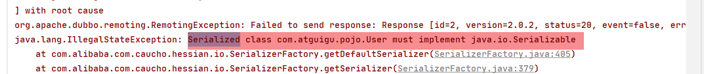

###  5.4 地址缓存⭐🐂

**注册中心挂了，服务是否可以正常访问？**

>1.  可以，因为dubbo服务消费者在第一-次调用时，会将服务提供方地址缓存到本地，以后在调用则不会访问注册中心。
>2.  当服务提供者地址发生变化时，注册中心会通知服务消费者。

### 5.5 超时⭐🐂

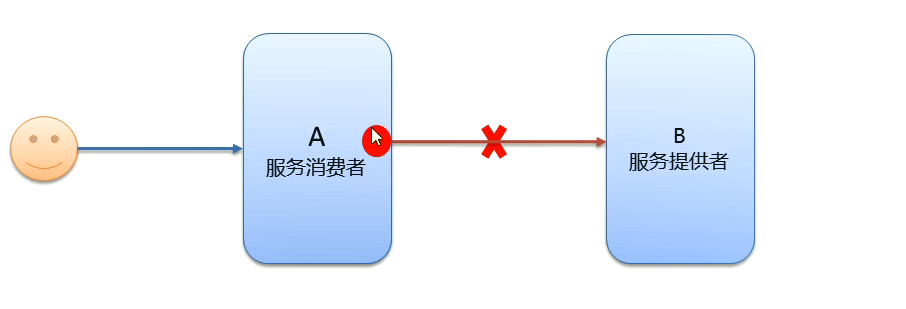

>- 服务消费者在调用服务提供者的时候发生了阻塞、等待的情形,这个时候,服务消费者会直等待下去。
>- 在某个峰值时刻，大量的请求都在同时请求服务消费者,会造成线程的大量堆积，势必会造成雪崩。

为了解决上述可能出现的问题，dubbo采用了如下方案：

==dubbo利用超时机制来解决这个问题，设置一个超时时间, 在这个时间段内，无法完成服务访问,则自动断开连接。==我们还可以设置超时时间：我们可以在@Service注解或者@Reference注解上配置，这个超时时间默认是1000毫秒。**建议配置在服务提供方：谁定义服务，谁才知道服务大概耗时**。

~~~java
//timeout 超时时间 单位毫秒  retries 重试次数
@Service(timeout = 3000,retries=0)
~~~

### 5.6 重试⭐🐏

超时机制的规则是如果在一定的时间内，provider没有返回，则认为本次调用失败，

重试机制在出现调用失败时，会再次调用。如果在配置的调用次数内都失败，则认为此次请求异常，抛出异常。

>1. 设置了超时时间，在这个时间段内，无法完成服务访问,则自动断开连接。
>2. 如果出现网络抖动,则这一-次请求就会失败。
>3. Dubbo提供重试机制来避免类似问题的发生。
>4. 通过retries属性来设置重试次数。默认为2次
>5. 如果消费者配置了重试次数，提供者也配置了重试次数，则以消费者为准；

~~~java
//timeout 超时时间 单位毫秒  retries 重试次数
@Service(timeout = 3000,retries=0)
~~~

### 5.7 多版本⭐

**灰度发布:**当出现新功能时,会让一部分用户先使用新功能，用户反馈没问题时，再将所有用户迁移到新功能。

==dubbo中使用version属性来设置和调用同一个接口的不同版本==

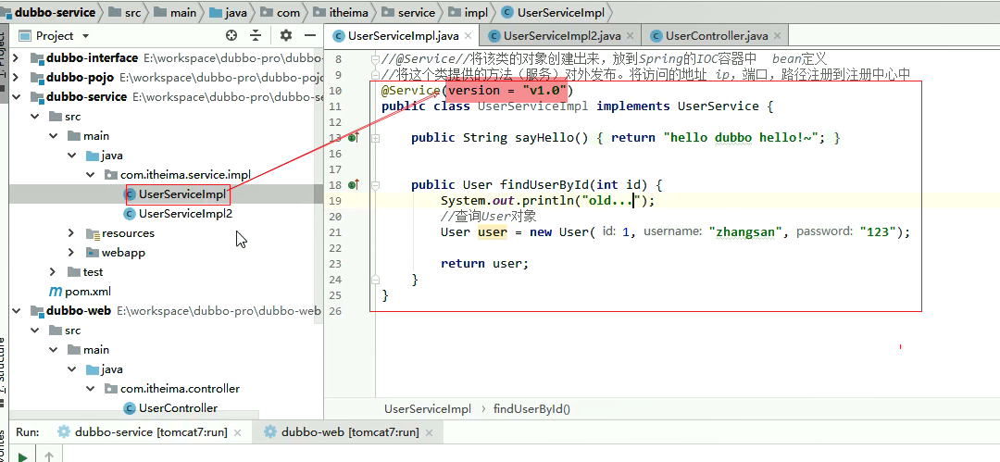

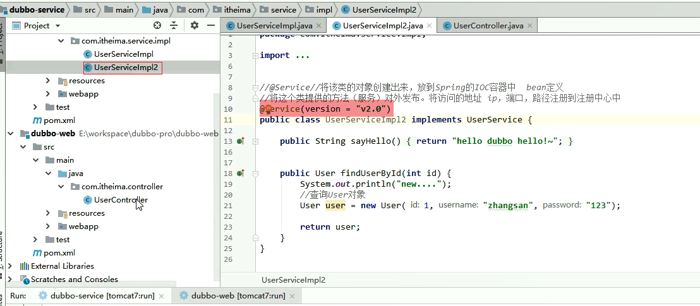

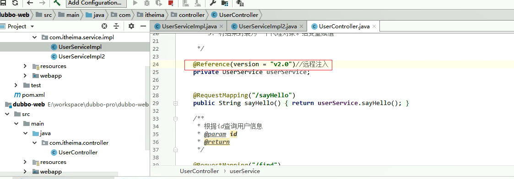

### 5.8 负载均衡⭐🐏

配置在消费端。

为了演示负载均衡的效果，我们可以让服务提供者启动三次，每次注意修改和端口有关的配置，这样就相当于搭建了一个伪集群。

修改1：pom.xml的tomcat插件的端口

~~~xml
 <build>
        <plugins>
            <!--tomcat插件-->
            <plugin>
                <groupId>org.apache.tomcat.maven</groupId>
                <artifactId>tomcat7-maven-plugin</artifactId>
                <version>2.1</version>
                <configuration>
                    <port>8000</port>
                    <path>/</path>
                </configuration>
            </plugin>
        </plugins>
    </build>
~~~

修改2：修改protocol和qos.port的端口。

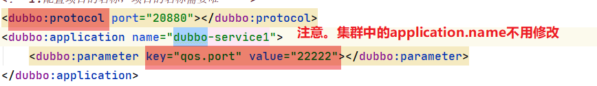

**负载均衡策略(4种) :** 

>**Random:**按权重随机，默认值。按权重设置随机概率。
>
>**RoundRobin:** 按权重轮询。
>
>**LeastActive:** 最少活跃调用数,相同活跃数的随机。谁最快调用谁
>
>**ConsistentHash:**一 致性Hash,相同参数的请求总是发到同一提供者。

负载均衡的配置如下：

~~~java
//@Reference(loadbalance = "roundrobin")
//@Reference(loadbalance = "leastactive")
//@Reference(loadbalance = "consistenthash")
@Reference(loadbalance = "random")//默认 按权重随机
private UserService userService;
~~~

### 5.9 集群容错⭐🐏

容错策略配置在消费端。


策略如下：

>**Failover Cluster:**失败重试。默认值。当出现失败，重试其它服务器，默认重试2次，使用retries配置。一般用于读操作
>**Failfast Cluster :**快速失败,发起-次调用，失败立即报错。通常用于写操作。也就是不重试，直接报错。
>**Failsafe Cluster:**失败安全，出现异常时，直接忽略。返回一个空结果。
>**Failback Cluster:**失败自动恢复,后台记录失败请求,定时重发。也就是一定要成功，不成功一定会继续发送，直到成功
>**Forking Cluster :**并行调用多个服务器，只要一个成功即返回。广撒网！
>**Broadcast Cluster:** 广播调用所有提供者,逐个调用，任意一台报错则报错。同时成功才算成功！

其策略的代码配置如下：

~~~java
@Reference(cluster = "failover")//远程注入
private UserService userService;
~~~

### 5.10 服务降级

假如说一个机器中提供有多个服务，如下所示：

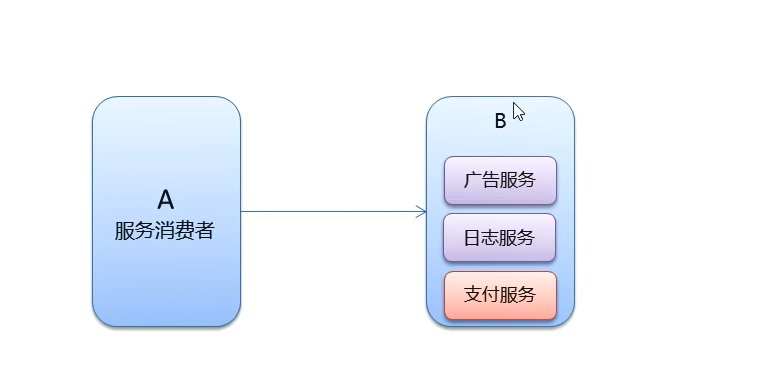

此时为了性能考虑，可能会关闭不太重要的非核心服务。

**服务降级**：当服务器压力剧增的情况下，根据实际业务情况及流量，对一些服务和页面有策略的不处理或换种简单的方式处理，从而释放服务器资源以保证**核心交易**正常运作或高效运作

**服务降级方式:**

>**mock= force:return null**：表示消费方对该服务的方法调用都直接返回null值,不发起远程调用。用来屏蔽不重要服务不可用时对调用方的影响。
>
>**mock=fail:return null**：表示消费方对该服务的方法调用在失败后，再返回null值,不抛异常。用来容忍不重要服务不稳定时对调用方的影响

服务降级在2.2.0版本后才有这个功能。

其代码的配置如下：

~~~java
//远程注入
@Reference(mock =“force:return null")//不再调用userService的服务
private UserService userService;
~~~

## 6.Dubbo早期版本的问题

Dubbo无法发布被事务代理的Service问题:

前面我们已经完成了Dubbo的入门案例，通过入门案例我们可以看到通过Dubbo提供的标签配置就可以进行包扫描，扫描到@Service注解的类就可以被发布为服务。

但是我们如果在服务提供者类上加入@Transactional事务控制注解后，服务就发布不成功了。原因是事务控制的底层原理是为服务提供者类创建代理对象，而默认情况下Spring是基于JDK动态代理方式创建代理对象，而此代理对象的完整类名为com.sun.proxy.$Proxy42（最后两位数字不是固定的），导致Dubbo在发布服务前进行包匹配时无法完成匹配，进而没有进行服务的发布。

### 6.1 问题展示

在入门案例的服务提供者dubbodemo_provider工程基础上进行展示

操作步骤：

（1）在pom.xml文件中增加maven坐标

~~~xml
<dependency>
  <groupId>mysql</groupId>
  <artifactId>mysql-connector-java</artifactId>
  <version>5.1.47</version>
</dependency>
<dependency>
  <groupId>com.alibaba</groupId>
  <artifactId>druid</artifactId>
  <version>1.1.6</version>
</dependency>
<dependency>
  <groupId>org.mybatis</groupId>
  <artifactId>mybatis-spring</artifactId>
  <version>1.3.2</version>
</dependency>
~~~

（2）在applicationContext-service.xml配置文件中加入数据源、事务管理器、开启事务注解的相关配置

~~~xml
<!--数据源-->
<bean id="dataSource" class="com.alibaba.druid.pool.DruidDataSource" destroy-method="close">
  <property name="username" value="root" />
  <property name="password" value="root" />
  <property name="driverClassName" value="com.mysql.jdbc.Driver" />
  <property name="url" value="jdbc:mysql://localhost:3306/test" />
</bean>
<!-- 事务管理器  -->
<bean id="transactionManager" 
      class="org.springframework.jdbc.datasource.DataSourceTransactionManager">
  <property name="dataSource" ref="dataSource"/>
</bean>
<!--开启事务控制的注解支持-->
<tx:annotation-driven transaction-manager="transactionManager"/>
~~~

上面连接的数据库可以自行创建

（3）在HelloServiceImpl类上加入@Transactional注解

（4）启动服务提供者和服务消费者，并访问


上面的错误为没有可用的服务提供者

查看dubbo管理控制台发现服务并没有发布，如下：


可以通过断点调试的方式查看Dubbo执行过程，Dubbo通过AnnotationBean的postProcessAfterInitialization方法进行处理

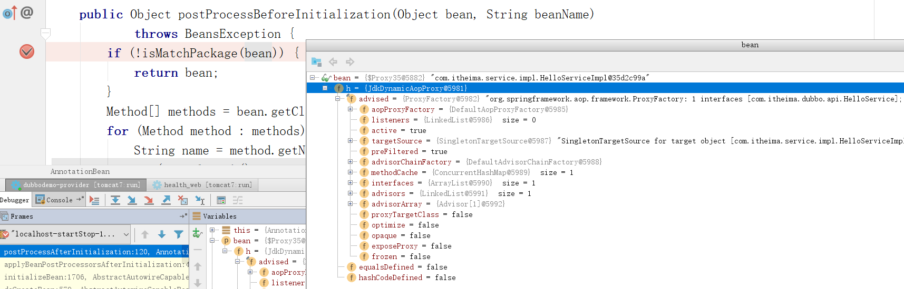


### 6.2 解决方案

通过上面的断点调试可以看到，在HelloServiceImpl类上加入事务注解后，Spring会为此类基于JDK动态代理技术创建代理对象，创建的代理对象完整类名为com.sun.proxy.$Proxy35，导致Dubbo在进行包匹配时没有成功（因为我们在发布服务时扫描的包为com.itheima.service），所以后面真正发布服务的代码没有执行。

**解决方式操作步骤**：

（1）修改applicationContext-service.xml配置文件，==**开启事务控制注解支持时指定proxy-target-class属性，值为true。其作用是使用cglib代理方式为Service类创建代理对象**==

~~~xml
<!--开启事务控制的注解支持，强制使用cglib创建代理对象-->
<tx:annotation-driven transaction-manager="transactionManager" proxy-target-class="true"/>
~~~

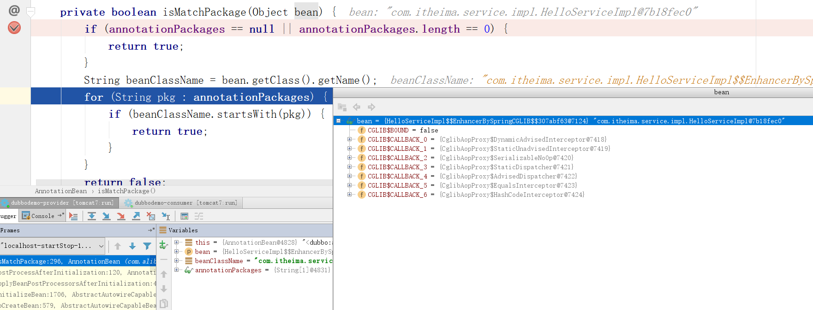

（2）==**修改服务提供类，在Service注解中加入interfaceClass属性，值为接口类.class，作用是指定服务的接口类型**==

~~~java
@Service(interfaceClass = HelloService.class)
@Transactional
public class HelloServiceImpl implements HelloService {
    public String sayHello(String name) {
        return "hello " + name;
    }
}
~~~

此处也是必须要修改的，否则会导致发布的服务接口为SpringProxy，而不是HelloService接口，这是由于创建的代理对象也是要实现其他接口的，故需要我们具体指定注册的接口为哪一个，如下：

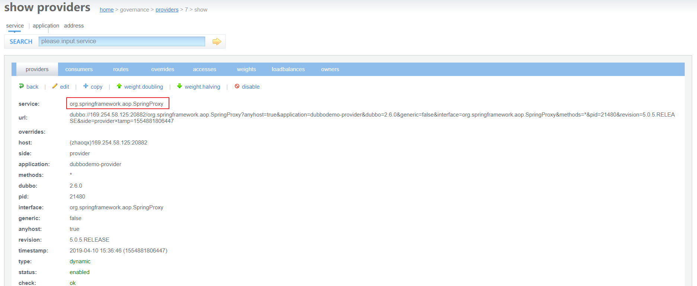