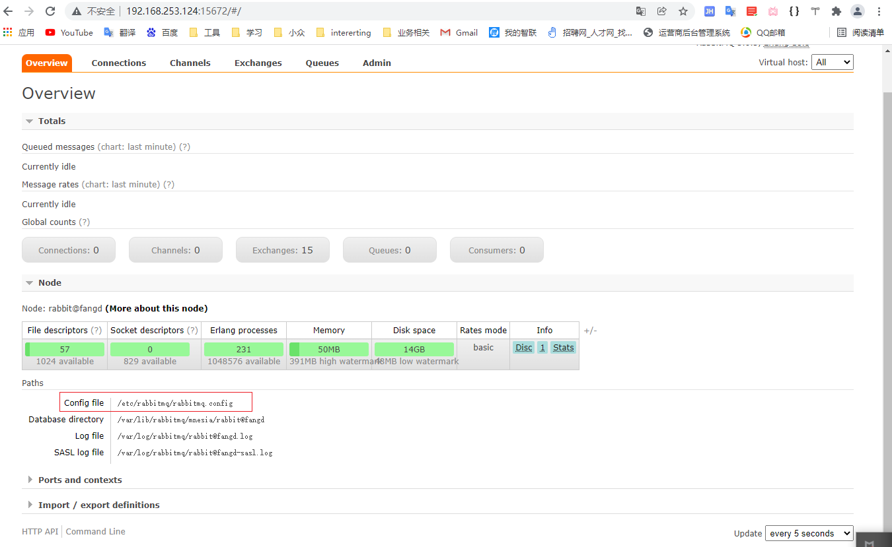
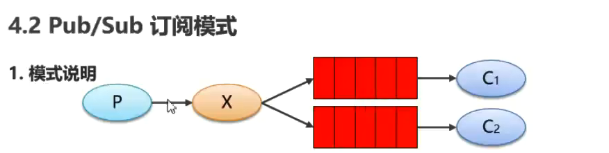
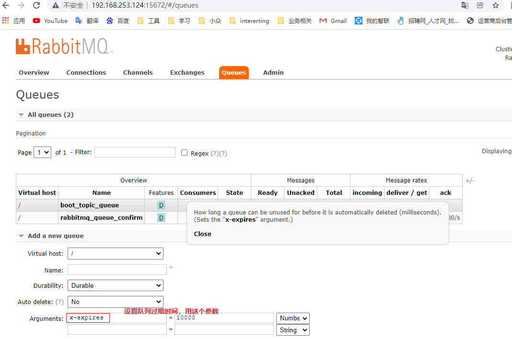
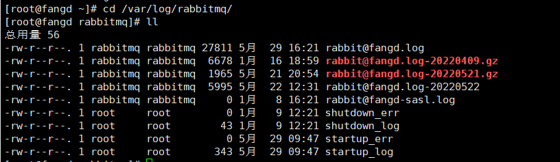
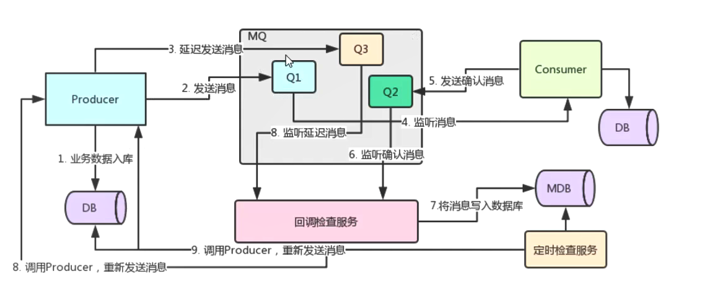
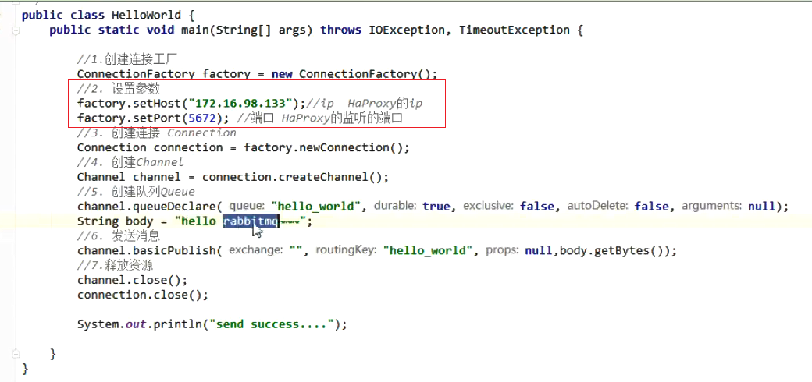

 # RabbitMQ

## 1.MQ的概念

MQ全称为==Message Queue==，消息队列是应用程序和应用程序之间的通信方法。

 为什么使用MQ

在项目中，可将一些无需即时返回且耗时的操作提取出来，进行**异步处理**，而这种异步处理的方式大大的节省了服务器的请求响应时间，从而**提高**了**系统**的**吞吐量**。

## 2.MQ的优势与劣势⭐

### 2.1 优势

- ==应用解耦==

**系统的耦合性越高，容错性就越低，可维护性就越低！**

MQ相当于一个中介，生产方通过MQ与消费方交互，它将应用程序进行解耦合。==**提升了容错性和系统的可维护性！**==


- ==异步提速==

将不需要同步处理的并且耗时长的操作由消息队列通知消息接收方进行异步处理。提高了应用程序的响应时间,==**提升用户体验和系统的吞吐量大大提高**==。


- ==削峰填谷==

  如订单系统，在下单的时候就会往数据库写数据。但是数据库只能支撑每秒1000左右的并发写入，并发量再高就容易宕机。低峰期的时候并发也就100多个，但是在高峰期时候，并发量会突然激增到5000以上，这个时候数据库肯定卡死了。

  

  消息被MQ保存起来了，然后系统就可以按照自己的消费能力来消费，比如每秒1000个数据，这样慢慢写入数据库，这样就不会卡死数据库了。

  

  但是使用了MQ之后，限制消费消息的速度为1000，但是这样一来，高峰期产生的数据势必会被积压在MQ中，高峰就被“削”掉了。但是因为消息积压，在高峰期过后的一段时间内，消费消息的速度还是会维持在1000QPS，直到消费完积压的消息,这就叫做“填谷”

  

  

### 2.2 劣势

- 系统可用性降低

还需要保证MQ没有问题，相当于多维护一个组件，增加了系统引入的外部依赖，这样就降低了系统的可用性

- 系统的复杂度提高

如何保证消息没有被重复消费，如何处理消息丢失情况，如何保证消息传递的顺序性！

- 一致性问题


**总结：**

~~~markdown
使用MQ满足的条件：
### 1.生产者不需要从消费者处获得反馈。引入消息队列之前的直接调用，其接口的返回值应该为空，这才让明明下层的动作还没做，上层却当成动作做完了继续往后走，即所谓异步成为了可能。
### 2.容许短暂的不一致性。
### 3.确实是用了有效果。即解耦、提速、削峰这些方面的收益，超过加入MQ，管理MQ这些成本。
~~~

## 3.常见的MQ产品

目前业界有很多的 MQ 产品，例如 RabbitMQ、RocketMQ、ActiveMQ、Kafka、ZeroMQ、MetaMq等，也有直接使用 Redis 充当消息队列的案例，而这些消息队列产品，各有侧重，在实际选型时，需要结合自身需求及 MQ 产品特征，综合考虑。


## 4.RabbitMQ的介绍

### 4.1 AMQP协议

**AMQP，即 Advanced Message Queuing Protocol（高级消息队列协议）**，是一个网络协议，是应用层协议的一个开放标准，为面向消息的中间件设计。基于此协议的客户端与消息中间件可传递消息，并不受客户端/中间件不同产品，不同的开发语言等条件的限制。2006年，AMQP 规范发布。类比HTTP。


### 4.2 RabbitMQ⭐🌙

#### 4.2.1 基本概念与架构 ⭐🌙

2007年，Rabbit 技术公司基于 AMQP 标准开发的 RabbitMQ 1.0 发布。RabbitMQ 采用 Erlang 语言开发。Erlang 语言由 Ericson 设计，专门为开发高并发和分布式系统的一种语言，在电信领域使用广泛。

RabbitMQ 中的相关概念：

**Broker**：接收和分发消息的应用，==RabbitMQ Server就是 Message Broker==

**Virtual host**：出于多租户和安全因素设计的，把 AMQP 的基本组件划分到一个虚拟的分组中，类似于网络中的 namespace 概念。==当多个不同的用户使用同一个 RabbitMQ server 提供的服务时，可以划分出多个vhost，每个用户在自己的 vhost 创建 exchange／queue 等，完成逻辑分区==

**Connection**：publisher／consumer 和 broker 之间的 TCP ==连接==

**Channel**：管道。如果每一次访问 RabbitMQ 都建立一个 Connection，在消息量大的时候建立 TCP Connection的开销将是巨大的，效率也较低。Channel 是在 connection 内部建立的逻辑连接，如果应用程序支持多线程，通常每个thread创建单独的 channel 进行通讯，AMQP method 包含了channel id 帮助客户端和message broker 识别 channel，所以 channel 之间是完全隔离的。Channel 作为轻量级的 Connection 极大==减少了操作系统建立 TCP connection 的开销==

**Exchange**：交换机。message 到达 broker 的第一站，根据分发规则，匹配查询表中的 routing key，分发消息到queue 中去。常用的类型有：==direct (point-to-point), topic (publish-subscribe) and fanout (multicast)==，**交换机可以绑定在不同的消息队列上，至于绑定在哪个消息队列，取决于Binding**

**Queue**：消息最终被送到这里等待 consumer 取走

**Binding**：exchange 和 queue 之间的虚拟连接，binding 中可以包含==routing key==。Binding 信息被保存到 exchange 中的查询表中，用于 message 的分发依据

其中：

- Producer和Consumer都是客户端,通过连接和服务端进行通信
- **Broker**:RabbitMQ的server(服务端)


#### 4.2.2 RabbitMQ的工作模式⭐🌙

RabbitMQ 提供了 6 种工作模式：==**简单模式、work queues、Publish/Subscribe 发布与订阅模式、Routing 路由模式、Topics 主题模式**==、RPC 远程调用模式（远程调用，不太算 MQ；暂不作介绍）。

官网对应模式介绍：https://www.rabbitmq.com/getstarted.html


#### 4.2.3 JMS⭐

JMS 即 Java 消息服务（JavaMessage Service）应用程序接口，是一个 Java 平台中关于面向消息中间件的API，用于在两个应用程序之间，或分布式系统中发送消息，进行异步通信。==JMS 是 JavaEE 规范中的一种，类比JDBC==，很多消息中间件都实现了JMS规范，例如：ActiveMQ。**RabbitMQ 官方没有提供 JMS 的实现包，但是开源社区有**

**AMQP 与 JMS 区别**：

- JMS是定义了统一的接口，来对消息操作进行统一；AMQP是通过规定协议来统一数据交互的格式
- JMS限定了必须使用Java语言；AMQP只是协议，不规定实现方式，因此是跨语言的。
- JMS规定了两种消息模式；而AMQP的消息模式更加丰富

**总结：**

1.RabbitMQ 是基于 AMQP 协议使用 Erlang 语言开发的一款消息队列产品。

2.RabbitMQ提供了6种==**工作模式**==，我们学习5种。这是今天的重点。

3.==AMQP 是协议==，类比HTTP。

4.==JMS 是 API 规范接口==，类比 JDBC。

### 4.3 RabbitMQ的安装和配置⭐

RabbitMQ官方地址：http://www.rabbitmq.com/

这里我们采用rpm安装方式

我们将三个RPM安装文件上传到linux系统

#### 4.3.1 安装依赖环境

~~~shell
yum install build-essential openssl openssl-devel unixODBC unixODBC-devel make gcc gcc-c++ kernel-devel m4 ncurses-devel tk tc xz
~~~

#### 4.3.2 安装Erlang

上传

erlang-18.3-1.el7.centos.x86_64.rpm
socat-1.7.3.2-5.el7.lux.x86_64.rpm
rabbitmq-server-3.6.5-1.noarch.rpm

~~~shell
# 安装
rpm -ivh erlang-18.3-1.el7.centos.x86_64.rpm
~~~


如果出现如下错误


说明gblic 版本太低。我们可以查看当前机器的gblic 版本

```shell
strings /lib64/libc.so.6 | grep GLIBC
```


当前最高版本2.12，需要2.15.所以需要升级glibc

- 使用yum更新安装依赖

  ```shell
  sudo yum install zlib-devel bzip2-devel openssl-devel ncurses-devel sqlite-devel readline-devel tk-devel gcc make -y
  ```

- 下载rpm包

  ```shell
  wget http://copr-be.cloud.fedoraproject.org/results/mosquito/myrepo-el6/epel-6-x86_64/glibc-2.17-55.fc20/glibc-utils-2.17-55.el6.x86_64.rpm &
  wget http://copr-be.cloud.fedoraproject.org/results/mosquito/myrepo-el6/epel-6-x86_64/glibc-2.17-55.fc20/glibc-static-2.17-55.el6.x86_64.rpm &
  wget http://copr-be.cloud.fedoraproject.org/results/mosquito/myrepo-el6/epel-6-x86_64/glibc-2.17-55.fc20/glibc-2.17-55.el6.x86_64.rpm &
  wget http://copr-be.cloud.fedoraproject.org/results/mosquito/myrepo-el6/epel-6-x86_64/glibc-2.17-55.fc20/glibc-common-2.17-55.el6.x86_64.rpm &
  wget http://copr-be.cloud.fedoraproject.org/results/mosquito/myrepo-el6/epel-6-x86_64/glibc-2.17-55.fc20/glibc-devel-2.17-55.el6.x86_64.rpm &
  wget http://copr-be.cloud.fedoraproject.org/results/mosquito/myrepo-el6/epel-6-x86_64/glibc-2.17-55.fc20/glibc-headers-2.17-55.el6.x86_64.rpm &
  wget http://copr-be.cloud.fedoraproject.org/results/mosquito/myrepo-el6/epel-6-x86_64/glibc-2.17-55.fc20/nscd-2.17-55.el6.x86_64.rpm &
  ```

- 安装rpm包

  ```shell
  sudo rpm -Uvh *-2.17-55.el6.x86_64.rpm --force --nodeps
  ```

- 安装完毕后再查看glibc版本,发现glibc版本已经到2.17了

  ```shell
  strings /lib64/libc.so.6 | grep GLIBC
  ```


#### 4.3.3 安装rabbitMQ

~~~shell
# 安装
rpm -ivh socat-1.7.3.2-5.el7.lux.x86_64.rpm

# 安装
rpm -ivh rabbitmq-server-3.6.5-1.noarch.rpm
~~~

安装完成以后就可以通过命令操作RabbitMQ，相关命令如下：

~~~shell
service rabbitmq-server start # 启动服务
service rabbitmq-server stop # 停止服务
service rabbitmq-server restart # 重启服务
~~~

~~~shell
[root@fangd rabbitMQ]# service rabbitmq-server start 
Starting rabbitmq-server (via systemctl):                  [  确定  ]
~~~

#### 4.3.4 设置可以使用RabbitMQ控制台

- 1，安装插件（自带）

~~~shell
# 开启管理界面
rabbitmq-plugins enable rabbitmq_management
~~~

~~~shell
[root@fangd rabbitMQ]# rabbitmq-plugins enable rabbitmq_management
The following plugins have been enabled:
  mochiweb
  webmachine
  rabbitmq_web_dispatch
  amqp_client
  rabbitmq_management_agent
  rabbitmq_management

Applying plugin configuration to rabbit@fangd... started 6 plugins.
~~~

- 2.修改配置文件

~~~shell
# 修改默认配置信息
vim /usr/lib/rabbitmq/lib/rabbitmq_server-3.6.5/ebin/rabbit.app 
# 比如修改密码、配置等等，例如：loopback_users 中的 <<"guest">>,只保留guest
~~~

可以看到，RabbitMQ的端口默认是5672


我们修改配置文件


改为

~~~shell
        {loopback_users, [guest]},
~~~

3.为了可以在浏览器访问控制台，我们需要**关闭防火墙**

~~~shell
systemctl stop firewalld
~~~

需要注意的：**RabbitMQ的服务器端口是5672（通信端口），但是我们访问它的图形化界面，输入的端口是15672，这两个是不一样的。**

RabbitMQ在安装好后，可以访问`http://ip地址:15672` ；其自带了guest/guest的用户名和密码

此时我们需要访问http://192.168.253.124:15672/这个地址，输入默认的用户名guest，密码guest就可以访问到控制台啦


#### 4.3.5 创建新用户，并且授权虚拟机⭐

**创建新用户**

**创**

**角色说明**：

1、 超级管理员(administrator)

可登陆管理控制台，可查看所有的信息，并且可以对用户，策略(policy)进行操作。

2、 监控者(monitoring)

可登陆管理控制台，同时可以查看rabbitmq节点的相关信息(进程数，内存使用情况，磁盘使用情况等)

3、 策略制定者(policymaker)

可登陆管理控制台, 同时可以对policy进行管理。但无法查看节点的相关信息(上图红框标识的部分)。

4、 普通管理者(management)

仅可登陆管理控制台，无法看到节点信息，也无法对策略进行管理。

5、 其他

无法登陆管理控制台，通常就是普通的生产者和消费者。

**建新虚拟机**

创建Virtual Hosts

Virtual Hosts配置

像mysql拥有数据库的概念并且可以指定用户对库和表等操作的权限。RabbitMQ也有类似的权限管理；在RabbitMQ中可以虚拟消息服务器Virtual Host，每个Virtual Hosts相当于一个相对独立的RabbitMQ服务器，每个VirtualHost之间是相互隔离的。exchange、queue、message不能互通。 相当于mysql的db。Virtual Name一般以/开头。


**设置Virtual Hosts权限**


#### 4.3.6 配置文件修改

我们可以看到，控制台说配置文件没有找到


我们去到RabbitMQ安装目录下

~~~shell
[root@fangd ~]# cd /usr/share/doc/rabbitmq-server-3.6.5/
~~~

执行命令

~~~shell
[root@fangd ~]# cd /usr/share/doc/rabbitmq-server-3.6.5/
[root@fangd rabbitmq-server-3.6.5]# ll
总用量 200
-rw-r--r--. 1 root root 28945 8月   5 2016 LICENSE
-rw-r--r--. 1 root root 11358 8月   5 2016 LICENSE-APACHE2-ExplorerCanvas
-rw-r--r--. 1 root root 10175 8月   5 2016 LICENSE-APL2-Rebar
-rw-r--r--. 1 root root 10851 8月   5 2016 LICENSE-APL2-Stomp-Websocket
-rw-r--r--. 1 root root  1206 8月   5 2016 LICENSE-BSD-base64js
-rw-r--r--. 1 root root  1304 8月   5 2016 LICENSE-BSD-glMatrix
-rw-r--r--. 1 root root 14041 8月   5 2016 LICENSE-EPL-OTP
-rw-r--r--. 1 root root  1087 8月   5 2016 LICENSE-MIT-EJS10
-rw-r--r--. 1 root root  1069 8月   5 2016 LICENSE-MIT-Flot
-rw-r--r--. 1 root root  1075 8月   5 2016 LICENSE-MIT-jQuery164
-rw-r--r--. 1 root root  1087 3月  31 2016 LICENSE-MIT-Mochi
-rw-r--r--. 1 root root  1087 8月   5 2016 LICENSE-MIT-Mochiweb
-rw-r--r--. 1 root root  1076 8月   5 2016 LICENSE-MIT-Sammy060
-rw-r--r--. 1 root root  1056 8月   5 2016 LICENSE-MIT-SockJS
-rw-r--r--. 1 root root 16726 8月   5 2016 LICENSE-MPL2
-rw-r--r--. 1 root root 24897 8月   5 2016 LICENSE-MPL-RabbitMQ
-rw-r--r--. 1 root root 21023 4月  11 2016 rabbitmq.config.example
-rw-r--r--. 1 root root   943 3月  31 2016 README
-rw-r--r--. 1 root root   277 3月  31 2016 set_rabbitmq_policy.sh.example
[root@fangd rabbitmq-server-3.6.5]# cp ./rabbitmq.config.example /etc/rabbitmq/rabbitmq.config
~~~

~~~shell
[root@fangd rabbitmq-server-3.6.5]# cp ./rabbitmq.config.example /etc/rabbitmq/rabbitmq.config
~~~

此时重启发现生效



#### 4.3.7 rabbitmq连接超时问题⭐🐏

在启动链接MQ的时候，发现rabbitMQ启动很慢，并且客户端服务器端连接超时，发现是自己==修改了主机名导致的！==

解决方法：

- 1.查看linux主机名

~~~shell
hostname
~~~

~~~shell
[root@fangd ~]# hostname
fangd
~~~

- 2.将主机名加入配置文件sysconfig

~~~shell
vim /etc/sysconfig/network
~~~

~~~shell
NETWORKING=yes
HOSTNAME=fangd
# Created by anaconda
~~~

- 3.在host文件中绑定主机名与IP

~~~shell
vim /etc/hosts
~~~

~~~shell
127.0.0.1   localhost localhost.localdomain localhost4 localhost4.localdomain4
::1         localhost localhost.localdomain localhost6 localhost6.localdomain6
192.168.253.124 fangd
~~~

重启rabbitMQ,此时发现问题得到解决！！！

## 5.RabbitMQ简单入门⭐🐂

实际上以下都是基于简单工作模式来处理的！！！！

### 5.1 创建工程

- 1.创建rabbitmq-producer,rabbitmq-consumer两个java工程


- 导入依赖

~~~xml
<?xml version="1.0" encoding="UTF-8"?>
<project xmlns="http://maven.apache.org/POM/4.0.0"
         xmlns:xsi="http://www.w3.org/2001/XMLSchema-instance"
         xsi:schemaLocation="http://maven.apache.org/POM/4.0.0 http://maven.apache.org/xsd/maven-4.0.0.xsd">
    <modelVersion>4.0.0</modelVersion>

    <groupId>org.atguigu</groupId>
    <artifactId>rabbitmq-producer</artifactId>
    <version>1.0-SNAPSHOT</version>

    <dependencies>
        <!--rabbitMQ java 客户端 -->
        <dependency>
            <groupId>com.rabbitmq</groupId>
            <artifactId>amqp-client</artifactId>
            <version>5.6.0</version>
        </dependency>
    </dependencies>
    <build>
        <plugins>
            <plugin>
                <groupId>org.apache.maven.plugins</groupId>
                <artifactId>maven-compiler-plugin</artifactId>
                <version>3.8.0</version>
                <configuration>
                    <source>1.8</source>
                    <target>1.8</target>
                </configuration>
            </plugin>
        </plugins>
    </build>
</project>
~~~

~~~xml
<?xml version="1.0" encoding="UTF-8"?>
<project xmlns="http://maven.apache.org/POM/4.0.0"
         xmlns:xsi="http://www.w3.org/2001/XMLSchema-instance"
         xsi:schemaLocation="http://maven.apache.org/POM/4.0.0 http://maven.apache.org/xsd/maven-4.0.0.xsd">
    <modelVersion>4.0.0</modelVersion>

    <groupId>com.atguigu</groupId>
    <artifactId>rabbitmq-consumer</artifactId>
    <version>1.0-SNAPSHOT</version>

    <dependencies>
        <!--rabbitMQ java 客户端 -->
        <dependency>
            <groupId>com.rabbitmq</groupId>
            <artifactId>amqp-client</artifactId>
            <version>5.6.0</version>
        </dependency>
    </dependencies>
    <build>
        <plugins>
            <plugin>
                <groupId>org.apache.maven.plugins</groupId>
                <artifactId>maven-compiler-plugin</artifactId>
                <version>3.8.0</version>
                <configuration>
                    <source>1.8</source>
                    <target>1.8</target>
                </configuration>
            </plugin>
        </plugins>
    </build>

</project>
~~~

### 5.2 生产者代码⭐🌙

~~~java
package com.atguigu.demo;

import com.rabbitmq.client.Channel;
import com.rabbitmq.client.Connection;
import com.rabbitmq.client.ConnectionFactory;


public class Produce {

    public static void main(String[] args) throws Exception {
        // 1.创建连接工厂
        ConnectionFactory factory = new ConnectionFactory();
        // 2.设置参数
        // 主机地址
        factory.setHost("192.168.253.124");
        // 连接端口：默认值5672
        factory.setPort(5672);
        // 设置要操作的虚拟机 默认是/，这个相当于是一个数据库，需要注意的是，这个虚拟机需要预先被授权，也就是预先要下面的用户可以访问，授权通过rabbitMQ控制台去完成
        factory.setVirtualHost("/itcast1");
        // 连接用户名 默认guest
        factory.setUsername("heima");
        // 连接密码  默认guest
        factory.setPassword("heima");
        // 3.创建连接 connection
        Connection connection = factory.newConnection();
        // 4.创建channel
        Channel channel = connection.createChannel();
        // 5.创建队列
        /**
         * queueDeclare(String queue, boolean durable, boolean exclusive, boolean autoDelete, Map<String, Object> arguments)
         参数：
             1.queue：队列名称
             2.durable：是否定义持久化队列 当为true时，表示当MQ重启之后，消息还在
             3.exclusive：一般给fasle，是否独占本次连接：独占则只能有一个消费者来监听队列
             4.autoDelete:是否在不使用的时候自动删除队列，即当没有consumer时，自动删除掉
             5.arguments：队列的其他参数
         */
        // 监听队列：如果没有一个名字叫hello_world的队列，则创建该队列，如果有则不会创建
        channel.queueDeclare("hello_world",true,false,false,null);
        // 6.发送消息
        /**
         *  basicPublish(String exchange, String routingKey, BasicProperties props, byte[] body)
         *  参数：
         *      1.exchange：交换机名称，简单模式下交换机会使用默认的 “ ”
         *      2.routingKey：路由名称,简单模式下使用默认的交换机，此时routingKey要和队列名称保持一致！！！！
         *      3.props：配置信息
         *      4.body：发送的消息数据
         */
        // 要发送的消息
        String body = "hello rabbitmq";
        channel.basicPublish("","hello_world",null,body.getBytes());
        // 7.释放资源
        channel.close();
        connection.close();
    }
}
~~~


### 5.3 消费者代码⭐🌙

~~~java
package com.atguigu.demo;

import com.rabbitmq.client.*;

import java.io.IOException;
import java.util.concurrent.TimeoutException;

public class Consumer {
    public static void main(String[] args) throws IOException, TimeoutException {
        // 1.创建连接工厂
        ConnectionFactory factory = new ConnectionFactory();
        // 2.设置参数
        factory.setHost("192.168.253.124");// ip 默认值为127.0.0.1
        factory.setPort(5672);// 默认值5672
        factory.setVirtualHost("/itcast1");// 设置虚拟机 默认是/
        factory.setUsername("heima");// 用户名 默认guest
        factory.setPassword("heima");// 密码  默认guest
        // 3.创建连接 connection
        Connection connection = factory.newConnection();
        // 4.创建频道：channel
        Channel channel = connection.createChannel();
        // 5.创建队列
        /**
         * queueDeclare(String queue, boolean durable, boolean exclusive, boolean autoDelete, Map<String, Object> arguments)
         参数：
         1.queue：队列名称
         2.durable：是否持久化 当MQ重启之后，还在
         3.exclusive：一般给fasle
         *：是否独占：独占则只能有一个消费者来监听队列
         *：当Connection关闭时，是否删除队列
         4.autoDelete:是否自动删除
         当没有consumer时，自动删除掉
         5.arguments：参数
         */
        // 监听队列：如果没有一个名字叫hello_world的队列，则创建该队列，如果有则不会创建
        channel.queueDeclare("hello_world",true,false,false,null);// 在消费者端这行代码也可以不要
        /**
         * Consumer:消费对象
         *    这是一个接口，我们用他的实现类DefaultConsumer，
         *    这个实现类是一个空实现，我们用这个实现类的匿名内部类
         */
        com.rabbitmq.client.Consumer consumer = new DefaultConsumer(channel){
            /*
               回调方法：当收到消息后，会自动执行该方法
                   1.consumerTag：消息的唯一标识
                   2.envelope： 消息包的内容，可以用来获取一些信息，如交换机，路由key...
                   3.BasicProperties:配置信息，消息的一些属性
                   4.body：消费的数据
             */
            @Override
            public void handleDelivery(String consumerTag, Envelope envelope, AMQP.BasicProperties properties, byte[] body) throws IOException {
                System.out.println("consumerTag:"+consumerTag);
                // 消息ID
                System.out.println("消息id为："+envelope.getDeliveryTag());
                // 交换机
                System.out.println("exchange:"+envelope.getExchange());
                // 路由key
                System.out.println("routingKey:"+envelope.getRoutingKey());
                System.out.println("properties:"+properties);
                // 收到的消息
                System.out.println("body:"+new String(body));
            }
        };
        // 6.消费资源，监听消息
        /**
         * basicConsume(String queue, boolean autoAck, Consumer callback)
         * 参数：
         *     1.queue：队列名称
         *     2.autoAck：是否自动确认，也就是消息回执，消费方收到消息后是否自动告诉MQ，mq接收到恢复后会删除消息
         *     3.callback：回调对象，可以监听一些自动执行的方法，传递我们创建的Consumer
         */
        channel.basicConsume("hello_world",true,consumer);
    }
}
~~~

**输出结果为：**

~~~shell
consumerTag:amq.ctag-J-j9mX30NfeAMk6VyM0iMA
exchange:
routingKey:hello_world
properties:#contentHeader<basic>(content-type=null, content-encoding=null, headers=null, delivery-mode=null, priority=null, correlation-id=null, reply-to=null, expiration=null, message-id=null, timestamp=null, type=null, user-id=null, app-id=null, cluster-id=null)
body:hello rabbitmq
~~~

注意：

==**消费者不需要关闭资源，因为需要一直监听消息**==。

### 5.4   消息确认机制ACK

通过刚才的案例可以看出，消息一旦被消费，消息就会立刻从队列中移除，那RabbitMQ如何得知消息被消费者接收？

~~~markdown
如果消费者接收消息后，还没执行操作就抛异常宕机导致消费失败，但是RabbitMQ无从得知，这样消息就丢失了，因此，RabbitMQ有一个ACK机制，当消费者获取消息后，会向RabbitMQ发送回执ACK，告知消息已经被接收。
**ACK**：(Acknowledge character）即是确认字符，在数据通信中，接收站发给发送站的一种传输类控制字符。表示发来的数据已确认接收无误我们在使用http请求时，http的状态码200就是告诉我们服务器执行成功整个过程就想快递员将包裹送到你手里，并且需要你的签字，并拍照回执。
~~~

不过这种回执ACK分为两种情况：

- 自动ACK：消息接收后，消费者立刻自动发送ACK（快递放在快递柜）
- 手动ACK：消息接收后，不会发送ACK，需要手动调用（快递必须本人签收）

两种情况如何选择，需要看消息的重要性：

~~~markdown
# 1.如果消息不太重要，丢失也没有影响，自动ACK会比较方便
# 2.如果消息非常重要，最好消费完成手动ACK，如果自动ACK消费后，RabbitMQ就会把消息从队列中删除，如果此时消费者抛异常宕机，那么消息就永久丢失了
~~~

修改手动消息确认：

~~~java
// false：手动消息确认
channel.basicConsume("queue1", false, consumer);
~~~

## 6.RabbitMQ的工作模式⭐🌙

我们在第五小节使用的就是简单模式。只有一个生产者，一个消费者。==交换机使用默认空，也就是不需要我们自己交换机，路由和队列名称保持一致。一条消息只能被一个消费者消费掉==

我们在第五章节已经讲了简单模式下的环境搭建和代码编写，这里我们再介绍以下其他几种工作模式！学习这几种工作模式需要注意<font color="red">**交换机和路由的编写**</font>.

### 6.1 Work queues工作队列模式⭐🌙

==交换机使用默认空，也就是不需要我们自己定义交换机 ，轮询去消费消息的。==

这也是消息路由的分发的一种方式！==代码和简单模式基本一致，只是多了几个消费者代码，消费者代码不止1份！！！！一条消息也只能被一个消费者消费掉==


`Work Queues`与入门程序的`简单模式`相比，多了一个或一些消费端，多个消费端共同消费同一个队列中的消息。==**一条消息只能被一个消费者消费掉，多个消费者监听同一个队列。**==

**应用场景**：对于 任务过重或任务较多情况使用工作队列可以提高任务处理的速度。

**消息提供者**

~~~java
package com.atguigu.producer;

import com.rabbitmq.client.Channel;
import com.rabbitmq.client.Connection;
import com.rabbitmq.client.ConnectionFactory;

import java.io.IOException;
import java.util.concurrent.TimeoutException;

/**
 * 发送消息
 */
public class Producer {
    public static void main(String[] args) throws IOException, TimeoutException {
        // 1.创建连接工厂
        ConnectionFactory factory = new ConnectionFactory();
        // 2.设置参数
        factory.setHost("192.168.253.124");// ip 默认值为127.0.0.1
        factory.setPort(5672);// 默认值5672
        factory.setVirtualHost("/itcast");// 设置虚拟机 默认是/
        factory.setUsername("heima");// 用户名 默认guest
        factory.setPassword("heima");// 密码  默认guest
        // 3.创建连接 connection
        Connection connection = factory.newConnection();
        // 4.创建channel
        Channel channel = connection.createChannel();
        // 5.创建队列
        /**
         * queueDeclare(String queue, boolean durable, boolean exclusive, boolean autoDelete, Map<String, Object> arguments)
           参数：
               1.queue：队列名称
               2.durable：是否持久化 当MQ重启之后，还在
               3.exclusive：一般给fasle
                     *：是否独占：独占则只能有一个消费者来监听队列
                     *：当Connection关闭时，是否删除队列
               4.autoDelete:是否自动删除
                     当没有consumer时，自动删除掉
               5.arguments：参数
         */
        // 监听队列：如果没有一个名字叫work_quenes的队列，则创建该队列，如果有则不会创建，
        channel.queueDeclare("work_quenes",true,false,false,null);
        // 6.发送消息
        /**work_quene
         *  basicPublish(String exchange, String routingKey, BasicProperties props, byte[] body)
         *  参数：
         *      1.exchange：交换机名称，工作队列模式下交换机会使用默认的 “ ”
         *      2.routingKey：路由名称,工作队列模式下使用默认的交换机，此时routingKey要和队列名称保持一致！！！！
         *      3.props：配置信息
         *      4.body：发送的消息数据
         */
        for (int i = 1; i <=10; i++) {
            String body = i+"hello rabbitmq";
            // 发送消息
            channel.basicPublish("","work_quene",null,body.getBytes());

        }
        // 7.释放资源
        channel.close();
        connection.close();
    }
}
~~~

**消费者1**

~~~java
package com.atguigu.consumer;

import com.rabbitmq.client.*;

import java.io.IOException;
import java.util.concurrent.TimeoutException;

public class WorkQuenes1 {
    public static void main(String[] args) throws IOException, TimeoutException {
        // 1.创建连接工厂
        ConnectionFactory factory = new ConnectionFactory();
        // 2.设置参数
        factory.setHost("192.168.253.124");// ip 默认值为127.0.0.1
        factory.setPort(5672);// 默认值5672
        factory.setVirtualHost("/itcast");// 设置虚拟机 默认是/
        factory.setUsername("heima");// 用户名 默认guest
        factory.setPassword("heima");// 密码  默认guest
        // 3.创建连接 connection
        Connection connection = factory.newConnection();
        // 4.创建channel
        Channel channel = connection.createChannel();
        // 5.创建队列
        /**
         * queueDeclare(String queue, boolean durable, boolean exclusive, boolean autoDelete, Map<String, Object> arguments)
         参数：
         1.queue：队列名称
         2.durable：是否持久化 当MQ重启之后，还在
         3.exclusive：一般给fasle
         *：是否独占：独占则只能有一个消费者来监听队列
         *：当Connection关闭时，是否删除队列
         4.autoDelete:是否自动删除
         当没有consumer时，自动删除掉
         5.arguments：参数
         */
        // 如果没有一个名字叫hello_world的队列，则创建该队列，如果有则不会创建
        channel.queueDeclare("work_quene",true,false,false,null);// 在消费者端这行代码也可以不要
        /**
         * basicConsume(String queue, boolean autoAck, Consumer callback)
         * 参数：
         *     1.queue：队列名称
         *     2.autoAck：是否自动确认，也就是消息回执，消费方收到消息后是否自动告诉MQ
         *     3.callback：回调对象，可以监听一些自动执行的方法
         */
        /**
         * Consumer:消费对象
         *    这是一个接口，我们用他的实现类DefaultConsumer，
         *    这个实现类是一个空实现，我们用这个实现类的匿名内部类
         */
        Consumer consumer = new DefaultConsumer(channel){
            /*
               回调方法：当收到消息后，会自动执行该方法
                   1.consumerTag：消息的唯一标识
                   2.envelope： 获取一些信息，如交换机，路由key...
                   3.BasicProperties:配置信息
                   4.body：消费的数据
             */
            @Override
            public void handleDelivery(String consumerTag, Envelope envelope, AMQP.BasicProperties properties, byte[] body) throws IOException {
                System.out.println("body:"+new String(body));
            }
        };
        // 6.消费资源
        channel.basicConsume("work_quene",true,consumer);
    }
}

~~~


**消费者2**

~~~java
package com.atguigu.consumer;

import com.rabbitmq.client.*;

import java.io.IOException;
import java.util.concurrent.TimeoutException;

public class WorkQuenes2 {
    public static void main(String[] args) throws IOException, TimeoutException {
        // 1.创建连接工厂
        ConnectionFactory factory = new ConnectionFactory();
        // 2.设置参数
        factory.setHost("192.168.253.124");// ip 默认值为127.0.0.1
        factory.setPort(5672);// 默认值5672
        factory.setVirtualHost("/itcast");// 设置虚拟机 默认是/
        factory.setUsername("heima");// 用户名 默认guest
        factory.setPassword("heima");// 密码  默认guest
        // 3.创建连接 connection
        Connection connection = factory.newConnection();
        // 4.创建channel
        Channel channel = connection.createChannel();
        // 5.创建队列
        /**
         * queueDeclare(String queue, boolean durable, boolean exclusive, boolean autoDelete, Map<String, Object> arguments)
         参数：
         1.queue：队列名称
         2.durable：是否持久化 当MQ重启之后，还在
         3.exclusive：一般给fasle
         *：是否独占：独占则只能有一个消费者来监听队列
         *：当Connection关闭时，是否删除队列
         4.autoDelete:是否自动删除
         当没有consumer时，自动删除掉
         5.arguments：参数
         */
        // 如果没有一个名字叫hello_world的队列，则创建该队列，如果有则不会创建
        channel.queueDeclare("work_quene",true,false,false,null);// 在消费者端这行代码也可以不要
        /**
         * basicConsume(String queue, boolean autoAck, Consumer callback)
         * 参数：
         *     1.queue：队列名称
         *     2.autoAck：是否自动确认，也就是消息回执，消费方收到消息后是否自动告诉MQ
         *     3.callback：回调对象，可以监听一些自动执行的方法
         */
        /**
         * Consumer:消费对象
         *    这是一个接口，我们用他的实现类DefaultConsumer，
         *    这个实现类是一个空实现，我们用这个实现类的匿名内部类
         */
        Consumer consumer = new DefaultConsumer(channel){
            /*
               回调方法：当收到消息后，会自动执行该方法
                   1.consumerTag：消息的唯一标识
                   2.envelope： 获取一些信息，如交换机，路由key...
                   3.BasicProperties:配置信息
                   4.body：消费的数据
             */
            @Override
            public void handleDelivery(String consumerTag, Envelope envelope, AMQP.BasicProperties properties, byte[] body) throws IOException {
                System.out.println("body:"+new String(body));
            }
        };
        // 6.消费资源
        channel.basicConsume("work_quene",true,consumer);
    }
}

~~~


在一个队列中如果有多个消费者，那么消费者之间对于同一个消息的关系是**竞争**的关系。

### 6.2 Publish/Subscribe发布与订阅模式⭐🌙

前两种工作模式，一条消息只能被一个消费者所消费，而从这个模式开始，一条消息可以被多个消费者所消费！！！！，可以不用指定Routing Key，Routing Key指定为空。

==需要交换机，类型为Fanout== 



在订阅模型中，多了一个 Exchange 角色，也就是**交换机**，==**一条消息只能被一个消费者消费掉**==，而且过程略有变化：

P：生产者，也就是要发送消息的程序，但是不再发送到队列中，而是发给X（交换机）

C：消费者，消息的接收者，会一直等待消息到来，**监听消息获取队列**。

Queue：消息队列，接收消息、缓存消息

Exchange：交换机（X），**将消息路由分发给不同的队列**。一方面，接收生产者发送的消息。另一方面，知道如何处理消息，例如递交给某个特别队列、递交给所有队列、或是将消息丢弃。到底如何操作，取决于Exchange的类型。Exchange有常见以下3种类型：

​      - Fanout：广播，将消息交给所有绑定到交换机的队列

​      - Direct：定向，把消息交给符合指定routing key 的队列

​      - Topic：通配符，把消息交给符合routing pattern（路由模式） 的队列

**Exchange**（交换机）只负责转发消息，不具备存储消息的能力，因此如果没有任何队列与 Exchange 绑定，或者没有符合路由规则的队列，那么消息会丢失！

**生产者代码**

~~~java
package com.atguigu.producer;

import com.rabbitmq.client.BuiltinExchangeType;
import com.rabbitmq.client.Channel;
import com.rabbitmq.client.Connection;
import com.rabbitmq.client.ConnectionFactory;

import java.io.IOException;
import java.util.concurrent.TimeoutException;

/**
 * 发送消息
 */
public class Producer {
    public static void main(String[] args) throws IOException, TimeoutException {
        // 1.创建连接工厂
        ConnectionFactory factory = new ConnectionFactory();
        // 2.设置参数
        factory.setHost("192.168.253.124");// ip 默认值为127.0.0.1
        factory.setPort(5672);// 默认值5672
        factory.setVirtualHost("/itcast");// 设置虚拟机 默认是/
        factory.setUsername("heima");// 用户名 默认guest
        factory.setPassword("heima");// 密码  默认guest
        // 3.创建连接 connection
        Connection connection = factory.newConnection();
        // 4.创建channel
        Channel channel = connection.createChannel();

        /**
         * exchangeDeclare(String exchange, BuiltinExchangeType type, boolean durable, boolean autoDelete, boolean internal, Map<String, Object> arguments)
           参数：
               1.exchange：交换机名称
               2.type交换机类型,类型确定，则分发的规则也就确定啦，所以交换机类型很重要！！！！
                     DIRECT("direct"):定向
                     FANOUT("fanout"):扇形（广播形式），发送消息到每一个”与之绑定“的队列
                     TOPIC("topic"):通配符的方式
                     HEADERS("headers"):参数匹配
               3.durable：是否持久化
               4.autoDelete：自动删除
               5.internal：内部使用，一般设置为false
               6.arguments：参数
         */
        String exchangeName  = "test_fanout";
        // 5.创建交换机
        channel.exchangeDeclare(exchangeName, BuiltinExchangeType.FANOUT,true,false,false,null);
        // 6.创建队列
        /**
         * queueDeclare(String queue, boolean durable, boolean exclusive, boolean autoDelete, Map<String, Object> arguments)
         参数：
         1.queue：队列名称
         2.durable：是否持久化 当MQ重启之后，还在
         3.exclusive：一般给fasle
             *：是否独占：独占则只能有一个消费者来监听队列
             *：当Connection关闭时，是否删除队列
         4.autoDelete:是否自动删除
             当没有consumer时，自动删除掉
         5.arguments：参数
         */
        String queneName1 = "test_fanout_quene1";
        String queneName2 = "test_fanout_quene2";
        channel.queueDeclare(queneName1,true,false,false,null);
        channel.queueDeclare(queneName2,true,false,false,null);
        // 7.绑定队列和交换机
        /*
              queueBind(String queue, String exchange, String routingKey)
              参数：
                 1.queue:队列名称
                 2.exchange:交换机名称
                 3.routingKey:路由键 绑定规则
                       如果交换机的类型为fanout，那么routingKey设置为""
         */
        channel.queueBind(queneName1,exchangeName,"");
        channel.queueBind(queneName2,exchangeName,"");
        // 8.发送消息
        /**work_quene
         *  basicPublish(String exchange, String routingKey, BasicProperties props, byte[] body)
         *  参数：
         *      1.exchange：交换机名称
         *      2.routingKey：路由名称,这种模式下路由key为“”
         *      3.props：配置信息
         *      4.body：发送的消息数据
         */
        String body ="日志信息：张三调用了findAll方法....日志级别:info";
        channel.basicPublish(exchangeName,"",null,body.getBytes());
        // 9.释放资源
        channel.close();
        connection.close();
    }
}
~~~

**注意：**

- ==这种模式需要创建交换机，且交换机类型为fanout;==
- ==这种模式下交换价会将消息发送给和他绑定的所有队列；==
- ==这种模式下的路由key为"";==

**消费者代码**

**消费者1**

~~~java
package com.atguigu.consumer;

import com.rabbitmq.client.*;

import java.io.IOException;
import java.util.concurrent.TimeoutException;

public class WorkQuenes1 {
    public static void main(String[] args) throws IOException, TimeoutException {
        // 1.创建连接工厂
        ConnectionFactory factory = new ConnectionFactory();
        // 2.设置参数
        factory.setHost("192.168.253.124");// ip 默认值为127.0.0.1
        factory.setPort(5672);// 默认值5672
        factory.setVirtualHost("/itcast");// 设置虚拟机 默认是/
        factory.setUsername("heima");// 用户名 默认guest
        factory.setPassword("heima");// 密码  默认guest
        // 3.创建连接 connection
        Connection connection = factory.newConnection();
        // 4.创建channel
        Channel channel = connection.createChannel();
       /**
         * basicConsume(String queue, boolean autoAck, Consumer callback)
         * 参数：
         *     1.queue：队列名称
         *     2.autoAck：是否自动确认，也就是消息回执，消费方收到消息后是否自动告诉MQ
         *     3.callback：回调对象，可以监听一些自动执行的方法
         */
        /**
         * Consumer:消费对象
         *    这是一个接口，我们用他的实现类DefaultConsumer，
         *    这个实现类是一个空实现，我们用这个实现类的匿名内部类
         */
        Consumer consumer = new DefaultConsumer(channel){
            /*
               回调方法：当收到消息后，会自动执行该方法
                   1.consumerTag：消息的唯一标识
                   2.envelope： 获取一些信息，如交换机，路由key...
                   3.BasicProperties:配置信息
                   4.body：消费的数据
             */
            @Override
            public void handleDelivery(String consumerTag, Envelope envelope, AMQP.BasicProperties properties, byte[] body) throws IOException {
                System.out.println("body:"+new String(body));
                System.out.println("消费者1将日志打印到控制台！！！");
            }
        };
        // 6.消费资源
        channel.basicConsume("test_fanout_quene1",true,consumer);
    }
}

~~~

**消费者2**

~~~java
package com.atguigu.consumer;

import com.rabbitmq.client.*;

import java.io.IOException;
import java.util.concurrent.TimeoutException;

public class WorkQuenes1 {
    public static void main(String[] args) throws IOException, TimeoutException {
        // 1.创建连接工厂
        ConnectionFactory factory = new ConnectionFactory();
        // 2.设置参数
        factory.setHost("192.168.253.124");// ip 默认值为127.0.0.1
        factory.setPort(5672);// 默认值5672
        factory.setVirtualHost("/itcast");// 设置虚拟机 默认是/
        factory.setUsername("heima");// 用户名 默认guest
        factory.setPassword("heima");// 密码  默认guest
        // 3.创建连接 connection
        Connection connection = factory.newConnection();
        // 4.创建channel
        Channel channel = connection.createChannel();
       /**
         * basicConsume(String queue, boolean autoAck, Consumer callback)
         * 参数：
         *     1.queue：队列名称
         *     2.autoAck：是否自动确认，也就是消息回执，消费方收到消息后是否自动告诉MQ
         *     3.callback：回调对象，可以监听一些自动执行的方法
         */
        /**
         * Consumer:消费对象
         *    这是一个接口，我们用他的实现类DefaultConsumer，
         *    这个实现类是一个空实现，我们用这个实现类的匿名内部类
         */
        Consumer consumer = new DefaultConsumer(channel){
            /*
               回调方法：当收到消息后，会自动执行该方法
                   1.consumerTag：消息的唯一标识
                   2.envelope： 获取一些信息，如交换机，路由key...
                   3.BasicProperties:配置信息
                   4.body：消费的数据
             */
            @Override
            public void handleDelivery(String consumerTag, Envelope envelope, AMQP.BasicProperties properties, byte[] body) throws IOException {
                System.out.println("body:"+new String(body));
                System.out.println("消费者1将日志打印到控制台！！！");
            }
        };
        // 6.消费资源
        channel.basicConsume("test_fanout_quene2",true,consumer);
    }
}
~~~

### 6.3 Routing 路由模式⭐🌙

==需要交换机，类型为Direct==

**Routing** 模式要求队列在绑定交换机时要指定 **routing key**，消息会转发到符合 routing key 的队列。

- 队列与交换机的绑定，不能是任意绑定了，而是要==指定一个 RoutingKey（路由key）==

- 消息的发送方在向 Exchange 发送消息时，也必须==指定消息的 RoutingKey==

- ===Exchange 不再把消息交给每一个绑定的队列，而是根据消息的 Routing Key 进行判断，只有队列的Routingkey 与消息的 Routing key 完全一致，才会接收到消息==


P：生产者，向 Exchange 发送消息，发送消息时，会指定一个routing key

X：Exchange（交换机），接收生产者的消息，然后把消息递交给与 routing key 完全匹配的队列

C1：消费者，其所在队列指定了需要 routing key 为 error 的消息

C2：消费者，其所在队列指定了需要 routing key 为 info、error、warning 的消息

**虽然绑定了多个队列，但是可以限制有哪些队列收到消息，那些队列收不到消息！！！！**

**生产者代码**

~~~java
package com.atguigu.producer;

import com.rabbitmq.client.BuiltinExchangeType;
import com.rabbitmq.client.Channel;
import com.rabbitmq.client.Connection;
import com.rabbitmq.client.ConnectionFactory;

import java.io.IOException;
import java.util.concurrent.TimeoutException;

public class Producer_Routing {
    public static void main(String[] args) throws IOException, TimeoutException {
        // 1.创建连接工厂
        ConnectionFactory factory = new ConnectionFactory();
        // 2.设置参数
        factory.setHost("192.168.253.124");// ip 默认值为127.0.0.1
        factory.setPort(5672);// 默认值5672
        factory.setVirtualHost("/itcast");// 设置虚拟机 默认是/
        factory.setUsername("heima");// 用户名 默认guest
        factory.setPassword("heima");// 密码  默认guest
        // 3.创建连接 connection
        Connection connection = factory.newConnection();
        // 4.创建channel
        Channel channel = connection.createChannel();

        /**
         * exchangeDeclare(String exchange, BuiltinExchangeType type, boolean durable, boolean autoDelete, boolean internal, Map<String, Object> arguments)
         参数：
           1.exchange：交换机名称
           2.type交换机类型
             DIRECT("direct"):定向 发送消息的RoutingKey和绑定消息的RoutingKey一致才可以！
             FANOUT("fanout"):扇形（广播形式），发送消息到每一个与之绑定的队列
             TOPIC("topic"):通配符的方式
             HEADERS("headers"):参数匹配
           3.durable：是否持久化
           4.autoDelete：自动删除
           5.internal：内部使用
           6.arguments：参数
         */
        String exchangeName  = "test_direct";
        // 5.创建交换机
        channel.exchangeDeclare(exchangeName, BuiltinExchangeType.DIRECT,true,false,false,null);
        // 6.创建队列
        /**
         * queueDeclare(String queue, boolean durable, boolean exclusive, boolean autoDelete, Map<String, Object> arguments)
         参数：
            1.queue：队列名称
            2.durable：是否持久化 当MQ重启之后，还在
            3.exclusive：一般给fasle
               *：是否独占：独占则只能有一个消费者来监听队列
               *：当Connection关闭时，是否删除队列
            4.autoDelete:是否自动删除
                当没有consumer时，自动删除掉
            5.arguments：参数
         */
        String queneName1 = "test_direct_quene1";
        String queneName2 = "test_direct_quene2";
        channel.queueDeclare(queneName1,true,false,false,null);
        channel.queueDeclare(queneName2,true,false,false,null);
        // 7.绑定队列和交换机
        /*
              queueBind(String queue, String exchange, String routingKey)
              参数：
                 1.queue:队列名称
                 2.exchange:交换机名称
                 3.routingKey:路由键 绑定规则
                       如果交换机的类型为fanout，那么routingKey设置为""
         */
        // 队列1绑定 info error warning
        channel.queueBind(queneName1,exchangeName,"info");
        channel.queueBind(queneName1,exchangeName,"error");
        channel.queueBind(queneName1,exchangeName,"warning");

        // 队列2绑定 error
        channel.queueBind(queneName2,exchangeName,"error");

        // 8.发送消息
        /**work_quene
         *  basicPublish(String exchange, String routingKey, BasicProperties props, byte[] body)
         *  参数：
         *      1.exchange：交换机名称，简单模式下交换机会使用默认的 “ ”
         *      2.routingKey：路由名称,简单模式下使用默认的交换机，此时routingKey要和队列名称保持一致！！！！
         *      3.props：配置信息
         *      4.body：发送的消息数据info
         */
        String body ="日志信息：张三调用了findAll方法....日志级别:info";
        channel.basicPublish(exchangeName,"info",null,body.getBytes());
        // 9.释放资源
        channel.close();
        connection.close();
    }

}
~~~

**消费者1代码**

~~~java
package com.atguigu.consumer;

import com.rabbitmq.client.*;

import java.io.IOException;
import java.util.concurrent.TimeoutException;

public class WorkQuenes1 {
    public static void main(String[] args) throws IOException, TimeoutException {
        // 1.创建连接工厂
        ConnectionFactory factory = new ConnectionFactory();
        // 2.设置参数
        factory.setHost("192.168.253.124");// ip 默认值为127.0.0.1
        factory.setPort(5672);// 默认值5672
        factory.setVirtualHost("/itcast");// 设置虚拟机 默认是/
        factory.setUsername("heima");// 用户名 默认guest
        factory.setPassword("heima");// 密码  默认guest
        // 3.创建连接 connection
        Connection connection = factory.newConnection();
        // 4.创建channel
        Channel channel = connection.createChannel();
       /**
         * basicConsume(String queue, boolean autoAck, Consumer callback)
         * 参数：
         *     1.queue：队列名称
         *     2.autoAck：是否自动确认，也就是消息回执，消费方收到消息后是否自动告诉MQ
         *     3.callback：回调对象，可以监听一些自动执行的方法
         */
        /**
         * Consumer:消费对象
         *    这是一个接口，我们用他的实现类DefaultConsumer，
         *    这个实现类是一个空实现，我们用这个实现类的匿名内部类
         */
        Consumer consumer = new DefaultConsumer(channel){
            /*
               回调方法：当收到消息后，会自动执行该方法
                   1.consumerTag：消息的唯一标识
                   2.envelope： 获取一些信息，如交换机，路由key...
                   3.BasicProperties:配置信息
                   4.body：消费的数据
             */
            @Override
            public void handleDelivery(String consumerTag, Envelope envelope, AMQP.BasicProperties properties, byte[] body) throws IOException {
                System.out.println("body:"+new String(body));
                System.out.println("消费者1将日志打印到控制台！！！");
            }
        };
        // 6.消费资源
        channel.basicConsume("test_direct_quene1",true,consumer);
    }
}
~~~

**消费者2代码**

~~~java
package com.atguigu.consumer;

import com.rabbitmq.client.*;

import java.io.IOException;
import java.util.concurrent.TimeoutException;

public class WorkQuenes2 {
    public static void main(String[] args) throws IOException, TimeoutException {
        // 1.创建连接工厂
        ConnectionFactory factory = new ConnectionFactory();
        // 2.设置参数
        factory.setHost("192.168.253.124");// ip 默认值为127.0.0.1
        factory.setPort(5672);// 默认值5672
        factory.setVirtualHost("/itcast");// 设置虚拟机 默认是/
        factory.setUsername("heima");// 用户名 默认guest
        factory.setPassword("heima");// 密码  默认guest
        // 3.创建连接 connection
        Connection connection = factory.newConnection();
        // 4.创建channel
        Channel channel = connection.createChannel();
        /**
         * basicConsume(String queue, boolean autoAck, Consumer callback)
         * 参数：
         *     1.queue：队列名称
         *     2.autoAck：是否自动确认，也就是消息回执，消费方收到消息后是否自动告诉MQ
         *     3.callback：回调对象，可以监听一些自动执行的方法
         */
        /**
         * Consumer:消费对象
         *    这是一个接口，我们用他的实现类DefaultConsumer，
         *    这个实现类是一个空实现，我们用这个实现类的匿名内部类
         */
        Consumer consumer = new DefaultConsumer(channel){
            /*
               回调方法：当收到消息后，会自动执行该方法
                   1.consumerTag：消息的唯一标识
                   2.envelope： 获取一些信息，如交换机，路由key...
                   3.BasicProperties:配置信息
                   4.body：消费的数据
             */
            @Override
            public void handleDelivery(String consumerTag, Envelope envelope, AMQP.BasicProperties properties, byte[] body) throws IOException {
                System.out.println("body:"+new String(body));
                System.out.println("保存到数据库！！！！！");
            }
        };
        // 6.消费资源
        channel.basicConsume("test_direct_quene2",true,consumer);
    }
}

~~~

### 6.4  Topics通配符模式⭐🌙

Topics通配符类型与Direct相比，都是可以根据RoutingKey把消息路由到不同的队列，但是Topic类型可以让队列在绑定Routing Key的时候使用**通配符**，这种模式也是功能最为强大的一种模式！实际上 和路由模式90%是一样的，
唯独的区别就是路由键支持模糊匹配  

==需要交换机，类型为Topic==,它的路由key是一种表达式的形式！！！！

这种模式下的Routing Key一般都有一个或者多个单词，多个单词之间用“,”分割，例如：item，insert

~~~
通配符规则：
# #：匹配一个或者多个词
# *：匹配不多不少恰好一个词
~~~


生产者代码**

~~~java
package com.atguigu.producer;

import com.rabbitmq.client.BuiltinExchangeType;
import com.rabbitmq.client.Channel;
import com.rabbitmq.client.Connection;
import com.rabbitmq.client.ConnectionFactory;

import java.io.IOException;
import java.util.concurrent.TimeoutException;

public class Producer_Routing {
    public static void main(String[] args) throws IOException, TimeoutException {
        // 1.创建连接工厂
        ConnectionFactory factory = new ConnectionFactory();
        // 2.设置参数
        factory.setHost("192.168.253.124");// ip 默认值为127.0.0.1
        factory.setPort(5672);// 默认值5672
        factory.setVirtualHost("/itcast");// 设置虚拟机 默认是/
        factory.setUsername("heima");// 用户名 默认guest
        factory.setPassword("heima");// 密码  默认guest
        // 3.创建连接 connection
        Connection connection = factory.newConnection();
        // 4.创建channel
        Channel channel = connection.createChannel();
        /**
         * exchangeDeclare(String exchange, BuiltinExchangeType type, boolean durable, boolean autoDelete, boolean internal, Map<String, Object> arguments)
         参数：
           1.exchange：交换机名称
           2.type交换机类型
               DIRECT("direct"):定向 发送消息的RoutingKey和绑定消息的RoutingKey一致才可以！
               FANOUT("fanout"):扇形（广播形式），发送消息到每一个与之绑定的队列
               TOPIC("topic"):通配符的方式
               HEADERS("headers"):参数匹配
           3.durable：是否持久化
           4.autoDelete：自动删除
           5.internal：内部使用
           6.arguments：参数
         */
        String exchangeName  = "test_topic";
        // 5.创建交换机
        channel.exchangeDeclare(exchangeName, BuiltinExchangeType.TOPIC,true,false,false,null);
        // 6.创建队列
        /**
         * queueDeclare(String queue, boolean durable, boolean exclusive, boolean autoDelete, Map<String, Object> arguments)
         参数：
            1.queue：队列名称
            2.durable：是否持久化 当MQ重启之后，还在
            3.exclusive：一般给fasle
               *：是否独占：独占则只能有一个消费者来监听队列
               *：当Connection关闭时，是否删除队列
            4.autoDelete:是否自动删除
                当没有consumer时，自动删除掉
            5.arguments：参数
         */
        String queneName1 = "test_topic_quene1";
        String queneName2 = "test_topic_quene2";
        channel.queueDeclare(queneName1,true,false,false,null);
        channel.queueDeclare(queneName2,true,false,false,null);
        // 7.绑定队列和交换机
        /*
              queueBind(String queue, String exchange, String routingKey)
              参数：
                 1.queue:队列名称
                 2.exchange:交换机名称
                 3.routingKey:路由键 绑定规则
                       如果交换机的类型为fanout，那么routingKey设置为""
         */
        // 队列1绑定
        channel.queueBind(queneName1,exchangeName,"#.error");
        channel.queueBind(queneName1,exchangeName,"order.*");

        // 队列2绑定 error
        channel.queueBind(queneName2,exchangeName,"*.*");

        // 8.发送消息
        /**work_quene
         *  basicPublish(String exchange, String routingKey, BasicProperties props, byte[] body)
         *  参数：
         *      1.exchange：交换机名称，简单模式下交换机会使用默认的 “ ”
         *      2.routingKey：路由名称,简单模式下使用默认的交换机，此时routingKey要和队列名称保持一致！！！！
         *      3.props：配置信息
         *      4.body：发送的消息数据info
         */
        String body ="日志信息：张三调用了findAll方法....日志级别:info";
        channel.basicPublish(exchangeName,"order.info",null,body.getBytes());
        // 9.释放资源
        channel.close();
        connection.close();
    }

}
~~~

**消费者1代码**

~~~java
package com.atguigu.consumer;

import com.rabbitmq.client.*;

import java.io.IOException;
import java.util.concurrent.TimeoutException;

public class WorkQuenes1 {
    public static void main(String[] args) throws IOException, TimeoutException {
        // 1.创建连接工厂
        ConnectionFactory factory = new ConnectionFactory();
        // 2.设置参数
        factory.setHost("192.168.253.124");// ip 默认值为127.0.0.1
        factory.setPort(5672);// 默认值5672
        factory.setVirtualHost("/itcast");// 设置虚拟机 默认是/
        factory.setUsername("heima");// 用户名 默认guest
        factory.setPassword("heima");// 密码  默认guest
        // 3.创建连接 connection
        Connection connection = factory.newConnection();
        // 4.创建channel
        Channel channel = connection.createChannel();
       /**
         * basicConsume(String queue, boolean autoAck, Consumer callback)
         * 参数：
         *     1.queue：队列名称
         *     2.autoAck：是否自动确认，也就是消息回执，消费方收到消息后是否自动告诉MQ
         *     3.callback：回调对象，可以监听一些自动执行的方法
         */
        /**
         * Consumer:消费对象
         *    这是一个接口，我们用他的实现类DefaultConsumer，
         *    这个实现类是一个空实现，我们用这个实现类的匿名内部类
         */
        Consumer consumer = new DefaultConsumer(channel){
            /*
               回调方法：当收到消息后，会自动执行该方法
                   1.consumerTag：消息的唯一标识
                   2.envelope： 获取一些信息，如交换机，路由key...
                   3.BasicProperties:配置信息
                   4.body：消费的数据
             */
            @Override
            public void handleDelivery(String consumerTag, Envelope envelope, AMQP.BasicProperties properties, byte[] body) throws IOException {
                System.out.println("body:"+new String(body));
                System.out.println("消费者1将日志打印到控制台！！！");
            }
        };
        // 6.消费资源
        channel.basicConsume("test_topic_quene1",true,consumer);
    }
}
~~~

**消费者2代码**

~~~java
package com.atguigu.consumer;

import com.rabbitmq.client.*;

import java.io.IOException;
import java.util.concurrent.TimeoutException;

public class WorkQuenes2 {
    public static void main(String[] args) throws IOException, TimeoutException {
        // 1.创建连接工厂
        ConnectionFactory factory = new ConnectionFactory();
        // 2.设置参数
        factory.setHost("192.168.253.124");// ip 默认值为127.0.0.1
        factory.setPort(5672);// 默认值5672
        factory.setVirtualHost("/itcast");// 设置虚拟机 默认是/
        factory.setUsername("heima");// 用户名 默认guest
        factory.setPassword("heima");// 密码  默认guest
        // 3.创建连接 connection
        Connection connection = factory.newConnection();
        // 4.创建channel
        Channel channel = connection.createChannel();
        /**
         * basicConsume(String queue, boolean autoAck, Consumer callback)
         * 参数：
         *     1.queue：队列名称
         *     2.autoAck：是否自动确认，也就是消息回执，消费方收到消息后是否自动告诉MQ
         *     3.callback：回调对象，可以监听一些自动执行的方法
         */
        /**
         * Consumer:消费对象
         *    这是一个接口，我们用他的实现类DefaultConsumer，
         *    这个实现类是一个空实现，我们用这个实现类的匿名内部类
         */
        Consumer consumer = new DefaultConsumer(channel){
            /*
               回调方法：当收到消息后，会自动执行该方法
                   1.consumerTag：消息的唯一标识
                   2.envelope： 获取一些信息，如交换机，路由key...
                   3.BasicProperties:配置信息
                   4.body：消费的数据
             */
            @Override
            public void handleDelivery(String consumerTag, Envelope envelope, AMQP.BasicProperties properties, byte[] body) throws IOException {
                System.out.println("body:"+new String(body));
                System.out.println("保存到数据库！！！！！");
            }
        };
        // 6.消费资源
        channel.basicConsume("test_topic_quene2",true,consumer);
    }
}

~~~

Topic 主题模式可以实现 Pub/Sub 发布与订阅模式和 Routing 路由模式的功能，只是 Topic 在配置routing key 的时候可以使用通配符，显得更加灵活。

### 6.5 总结

|                    |              简单工作模式               |                Work queues工作队列模式                 |                    Pub/Sub发布与订阅模式                     |                       Routing 路由模式                       |                       Topics通配符模式                       |
| :----------------: | :-------------------------------------: | :----------------------------------------------------: | :----------------------------------------------------------: | :----------------------------------------------------------: | :----------------------------------------------------------: |
|   消息的消费情况   |        一条消息，一个消费者消费         | 交换机绑定多个队列，一条消息，多个消费者去**竞争**消费 | 交换机绑定多个队列，一条消息，分发给多个队列，每个队列一定能收到消息，每个消费者消费自己的消息 | 交换机绑定多个队列，一条消息，有==前提的==分发给绑定的队列，满足条件的队列才可以收到消息。 | 交换机绑定多个队列，一条消息，有==前提的==分发给绑定的队列，满足条件的队列才可以收到消息。 |
| 是否需要定义交换机 | ==使用默认交换机,不需要自己定义交换机== |        ==使用默认交换机,不需要自己定义交换机==         |                    ==需要自己定义交换机==                    |                    ==需要自己定义交换机==                    |                    ==需要自己定义交换机==                    |
|    交换机的类型    |                   空                    |                           空                           | BuiltinExchangeType.FANOUT（广播，将消息交给所有绑定到交换机的队列） | BuiltinExchangeType.DIRECT（定向 发送消息的RoutingKey和绑定消息的RoutingKey一致才可以！） | BuiltinExchangeType.TOPIC（定向 发送消息的RoutingKey和绑定消息的RoutingKey一致才可以） |
|      路由定义      |       路由名称和队列名称保持一致        |               路由名称和队列名称保持一致               |       如果交换机的类型为fanout，那么routingKey设置为""       |              需要自己定义路由与特定的交换机绑定              |              需要自己定义路由与特定的交换机绑定              |

1.简单模式 HelloWorld

   一个生产者、一个消费者，不需要设置交换机（使用默认的交换机），routing key路由名称等于队列名称。

2.工作队列模式 Work Queue

   一个生产者、多个消费者（竞争关系），不需要设置交换机（使用默认的交换机），routing key路由名称等于队列名称。

3.发布订阅模式 Publish/subscribe

   需要设置类型为**fanout **的交换机，并且交换机和队列进行绑定，routing key路由名称等于空，当发送消息到交换机后，交换机会将消息发送到绑定的队列。

4.路由模式 Routing

   需要设置类型为 **direct** 的交换机，交换机和队列进行绑定，并且指定 routing key，当发送消息到交换机后，交换机会根据 routing key 将消息发送到对应的队列。

5.通配符模式 Topic

   需要设置类型为 topic 的交换机，交换机和队列进行绑定，并且指定通配符方式的 routing key，当发送消息到交换机后，交换机会根据 routing key 将消息发送到对应的队列。

交换机有类型，交换机通过路由绑定队列！！！！

注意：

- ==除了**简单模式**和**工作队列**模式，一条消息只能被一个消费者消费掉，其他模式下一条消息可以被多个消费者消费掉！==
- 简单工作模式，工作队列模式，还有发布订阅模式，不需要指定路由routing key，也就是RoutingKey为”“，其他模式需要指定RoutingKey

## 7.Spring整合RabbitMQ⭐🐂


### 7.1 Spring整合RabbitMQ生产者

**pom.xml**

~~~xml
<?xml version="1.0" encoding="UTF-8"?>
<project xmlns="http://maven.apache.org/POM/4.0.0"
         xmlns:xsi="http://www.w3.org/2001/XMLSchema-instance"
         xsi:schemaLocation="http://maven.apache.org/POM/4.0.0 http://maven.apache.org/xsd/maven-4.0.0.xsd">
    <modelVersion>4.0.0</modelVersion>

    <groupId>org.atguigu</groupId>
    <artifactId>spring-rabbitMQ-producer</artifactId>
    <version>1.0-SNAPSHOT</version>
    <dependencies>
        <dependency>
            <groupId>org.springframework</groupId>
            <artifactId>spring-context</artifactId>
            <version>5.1.7.RELEASE</version>
        </dependency>

        <dependency>
            <groupId>org.springframework.amqp</groupId>
            <artifactId>spring-rabbit</artifactId>
            <version>2.1.8.RELEASE</version>
        </dependency>

        <dependency>
            <groupId>junit</groupId>
            <artifactId>junit</artifactId>
            <version>4.12</version>
        </dependency>

        <dependency>
            <groupId>org.springframework</groupId>
            <artifactId>spring-test</artifactId>
            <version>5.1.7.RELEASE</version>
        </dependency>
    </dependencies>

    <build>
        <plugins>
            <plugin>
                <groupId>org.apache.maven.plugins</groupId>
                <artifactId>maven-compiler-plugin</artifactId>
                <version>3.8.0</version>
                <configuration>
                    <source>1.8</source>
                    <target>1.8</target>
                </configuration>
            </plugin>
        </plugins>
    </build>

</project>
~~~

**rabbitMQ配置文件：rabbitit.properties**

~~~properties
rabbitmq.host=192.168.253.124
rabbitmq.port=5672
rabbitmq.username=heima
rabbitmq.password=heima
rabbitmq.virtual-host=/itcast1
~~~

**Spring配置文件:spring-rabbitmq-producer.xml**

~~~xml
<?xml version="1.0" encoding="UTF-8"?>
<beans xmlns="http://www.springframework.org/schema/beans"
       xmlns:xsi="http://www.w3.org/2001/XMLSchema-instance"
       xmlns:context="http://www.springframework.org/schema/context"
       xmlns:rabbit="http://www.springframework.org/schema/rabbit"
       xsi:schemaLocation="http://www.springframework.org/schema/beans
       http://www.springframework.org/schema/beans/spring-beans.xsd
       http://www.springframework.org/schema/context
       https://www.springframework.org/schema/context/spring-context.xsd
       http://www.springframework.org/schema/rabbit
       http://www.springframework.org/schema/rabbit/spring-rabbit.xsd">
    <!--1.加载配置文件,配置文件rabbitmq.properties指定中间件的IP端口用户密码还有虚拟机的一些信息-->
    <context:property-placeholder location="classpath:rabbitmq.properties"/>

    <!-- 2.定义rabbitmq connectionFactory -->
    <rabbit:connection-factory id="connectionFactory" host="${rabbitmq.host}"
                               port="${rabbitmq.port}"
                               username="${rabbitmq.username}"
                               password="${rabbitmq.password}"
                               virtual-host="${rabbitmq.virtual-host}"/>
    <!--定义管理交换机、队列-->
    <rabbit:admin connection-factory="connectionFactory"/>

    <!--定义持久化队列，不存在则自动创建；不绑定到交换机则绑定到默认交换机
    默认交换机类型为direct，名字为：""，路由键为队列的名称
    -->
    <!--
     标签rabbit:queue：用来定义一个队列
     属性：
         id：bean的名称
         name：queue的名称
         auto-declare:自动创建
         auto-delete:自动删除。 最后一个消费者和该队列断开连接后，自动删除队列
         exclusive:是否独占
         durable：是否持久化
    -->
    <!-- 3.1 简单工作模式和工作队列模式 -->
    <rabbit:queue id="spring_queue" name="spring_queue"    auto-declare="true"/>

    <!-- 3.2 发布订阅模式 -->
    <!-- ~~~~~~~~~~~~~~~~~~~~~~~~~~~~广播；所有队列都能收到消息~~~~~~~~~~~~~~~~~~~~~~~~~~~~ -->
    <!--定义广播交换机中的持久化队列，不存在则自动创建-->
    <rabbit:queue id="spring_fanout_queue_1" name="spring_fanout_queue_1" auto-declare="true"/>
    <!--定义广播交换机中的持久化队列，不存在则自动创建-->
    <rabbit:queue id="spring_fanout_queue_2" name="spring_fanout_queue_2" auto-declare="true"/>

    <!--定义广播类型交换机；并绑定上述两个队列-->
    <rabbit:fanout-exchange id="spring_fanout_exchange" name="spring_fanout_exchange"  auto-declare="true">
        <rabbit:bindings>
            <rabbit:binding queue="spring_fanout_queue_1"  />
            <rabbit:binding queue="spring_fanout_queue_2"/>
        </rabbit:bindings>
    </rabbit:fanout-exchange>

    <!-- 3.3 Routing路由模式 -->
    <!--定义direct交换机中的持久化队列，不存在则自动创建-->
    <rabbit:queue id="spring_direct_queue_1" name="spring_direct_queue_1" auto-declare="true"/>
    <!--定义direct交换机中的持久化队列，不存在则自动创建-->
    <rabbit:queue id="spring_direct_queue_2" name="spring_direct_queue_2" auto-declare="true"/>
    <rabbit:direct-exchange id="spring_direct_exchange" name="spring_direct_exchange"  auto-declare="true" >
        <rabbit:bindings>
            <!--direct 类型的交换机绑定队列  key ：路由key  queue：队列名称-->
            <rabbit:binding queue="spring_direct_queue_1" key="debug"></rabbit:binding>
            <rabbit:binding queue="spring_direct_queue_1" key="info"></rabbit:binding>
            <rabbit:binding queue="spring_direct_queue_1" key="error"></rabbit:binding>
            <rabbit:binding queue="spring_direct_queue_2" key="error"></rabbit:binding>
        </rabbit:bindings>
    </rabbit:direct-exchange>

    <!-- 3.4 Topic通配符模式 -->
    <!-- ~~~~~~~~~~~~~~~~~~~~~~~~~~~~通配符；*匹配一个单词，#匹配多个单词 ~~~~~~~~~~~~~~~~~~~~~~~~~~~~ -->
    <!--定义TOPIC通配符类型交换机中的持久化队列，不存在则自动创建-->
    <rabbit:queue id="spring_topic_queue_star" name="spring_topic_queue_star"  auto-declare="true"/>
    <!--定义TOPIC通配符类型交换机中的持久化队列，不存在则自动创建-->
    <rabbit:queue id="spring_topic_queue_well" name="spring_topic_queue_well" auto-declare="true"/>
    <!--定义TOPIC通配符类型交换机中的持久化队列，不存在则自动创建-->
    <rabbit:queue id="spring_topic_queue_well2" name="spring_topic_queue_well2" auto-declare="true"/>

    <rabbit:topic-exchange id="spring_topic_exchange"  name="spring_topic_exchange" auto-declare="true">
        <rabbit:bindings>
            <rabbit:binding pattern="heima.*"  queue="spring_topic_queue_star"/>
            <rabbit:binding pattern="heima.#" queue="spring_topic_queue_well"/>
            <rabbit:binding pattern="itcast.#" queue="spring_topic_queue_well2"/>
        </rabbit:bindings>
    </rabbit:topic-exchange>

    <!--4.定义rabbitTemplate对象操作可以在代码中方便发送消息-->
    <rabbit:template id="rabbitTemplate" connection-factory="connectionFactory"/>
</beans>
~~~

**代码编写**

~~~java
import org.junit.Test;
import org.junit.runner.RunWith;
import org.springframework.amqp.rabbit.core.RabbitTemplate;
import org.springframework.beans.factory.annotation.Autowired;
import org.springframework.test.context.ContextConfiguration;
import org.springframework.test.context.junit4.SpringJUnit4ClassRunner;

@RunWith(SpringJUnit4ClassRunner.class)
@ContextConfiguration(locations = "classpath:spring-rabbitmq-producer.xml")
public class ProducerTest {
    // 注入RabbitTemplate
    @Autowired
    public RabbitTemplate  rabbitTemplate;

    /**
     * 简单工作模式和工作队列模式
     */
    @Test
    public void test1(){
        // 发送消息
        rabbitTemplate.convertAndSend("spring_queue","spring整合RabbitMQ测试简单工作模式！");
    }

    /**
     * 发布订阅模式：此时需要定义交换机，且Routing Key指定为“”即可！
     */
    @Test
    public void test2(){
        // 发送消息
        rabbitTemplate.convertAndSend("spring_fanout_exchange","","spring整合RabbitMQ测试发布订阅模式！");
    }

    /**
     * Routing路由模式：此时需要定义交换机，Routing key指定什么，就会跑到对应的队列中
     */
    @Test
    public void test3(){
        // 发送消息
        rabbitTemplate.convertAndSend("spring_direct_exchange","error","spring整合RabbitMQ测试发布Routing路由模式！");
    }

    /**
     * Topic模式：此时需要定义交换机，Routing key指定什么，就会跑到对应的队列中，且支持路由通配符
     */
    @Test
    public void test4(){
        // 发送消息
        rabbitTemplate.convertAndSend("spring_topic_exchange","heima.6","spring整合RabbitMQ测试topic通配符模式！");
    }
}
~~~

### 7.2 Spring整合RabbitMQ消费者

只需要编写对应的监听器即可！！！！用来监听消息，消息来到，调用回调方法即可！

**pom.xml**

~~~xml
<?xml version="1.0" encoding="UTF-8"?>
<project xmlns="http://maven.apache.org/POM/4.0.0"
         xmlns:xsi="http://www.w3.org/2001/XMLSchema-instance"
         xsi:schemaLocation="http://maven.apache.org/POM/4.0.0 http://maven.apache.org/xsd/maven-4.0.0.xsd">
    <modelVersion>4.0.0</modelVersion>

    <groupId>com.atguigu</groupId>
    <artifactId>spring-rabbitMQ-consumer</artifactId>
    <version>1.0-SNAPSHOT</version>
    <dependencies>
        <dependency>
            <groupId>org.springframework</groupId>
            <artifactId>spring-context</artifactId>
            <version>5.1.7.RELEASE</version>
        </dependency>

        <dependency>
            <groupId>org.springframework.amqp</groupId>
            <artifactId>spring-rabbit</artifactId>
            <version>2.1.8.RELEASE</version>
        </dependency>

        <dependency>
            <groupId>junit</groupId>
            <artifactId>junit</artifactId>
            <version>4.12</version>
        </dependency>

        <dependency>
            <groupId>org.springframework</groupId>
            <artifactId>spring-test</artifactId>
            <version>5.1.7.RELEASE</version>
        </dependency>
    </dependencies>

    <build>
        <plugins>
            <plugin>
                <groupId>org.apache.maven.plugins</groupId>
                <artifactId>maven-compiler-plugin</artifactId>
                <version>3.8.0</version>
                <configuration>
                    <source>1.8</source>
                    <target>1.8</target>
                </configuration>
            </plugin>
        </plugins>
    </build>

</project>
~~~

**rabbitMQ配置文件：rabbitit.properties**

~~~properties
rabbitmq.host=192.168.253.124
rabbitmq.port=5672
rabbitmq.username=heima
rabbitmq.password=heima
rabbitmq.virtual-host=/itcast
~~~

**Spring配置文件:spring-rabbitmq-consumer.xml**

~~~xml
<?xml version="1.0" encoding="UTF-8"?>
<beans xmlns="http://www.springframework.org/schema/beans"
       xmlns:xsi="http://www.w3.org/2001/XMLSchema-instance"
       xmlns:context="http://www.springframework.org/schema/context"
       xmlns:rabbit="http://www.springframework.org/schema/rabbit"
       xsi:schemaLocation="http://www.springframework.org/schema/beans
       http://www.springframework.org/schema/beans/spring-beans.xsd
       http://www.springframework.org/schema/context
       https://www.springframework.org/schema/context/spring-context.xsd
       http://www.springframework.org/schema/rabbit
       http://www.springframework.org/schema/rabbit/spring-rabbit.xsd">
    <!--加载配置文件-->
    <context:property-placeholder location="classpath:rabbitmq.properties"/>

    <!-- 定义rabbitmq connectionFactory -->
    <rabbit:connection-factory id="connectionFactory" host="${rabbitmq.host}"
                               port="${rabbitmq.port}"
                               username="${rabbitmq.username}"
                               password="${rabbitmq.password}"
                               virtual-host="${rabbitmq.virtual-host}"/>

    <!--监听器的bean -->
    <bean id="springQueueListener" class="com.itheima.rabbitmq.listener.SpringQueueListener"/>
    <!--监听器容器 -->
    <rabbit:listener-container connection-factory="connectionFactory" auto-declare="true">
        <!--监听器要监听那个队列，就在queue-names属性写对应的队列名称 -->
        <rabbit:listener ref="springQueueListener" queue-names="spring_direct_queue_1"/>
    </rabbit:listener-container>
</beans>
~~~

**监听器代码**

~~~java
package com.itheima.rabbitmq.listener;

import org.springframework.amqp.core.Message;
import org.springframework.amqp.core.MessageListener;

/*
*  1.监听器需要实现MessageListener接口， 并且复写方法onMessage，用来做回调方法
*  2.监听器主要用来监听队列，一个队列对应一个监听器！！！！
* */
public class SpringQueueListener implements MessageListener {
    @Override
    public void onMessage(Message message) {
         String msg =System.out.println(new String (message.getBody()));
         message.getMessageProperties().getReceivedExchange(),
         message.getMessageProperties().getReceivedRoutingKey(),
         message.getMessageProperties().getConsumerQueue(),
                    msg);
    }
}

~~~

**测试代码**

我们只要让test1方法不停，监听器就会持续开启，就可以监听到消息

~~~java
package com.itheima;

import org.junit.Test;
import org.junit.runner.RunWith;
import org.springframework.context.annotation.Configuration;
import org.springframework.test.context.ContextConfiguration;
import org.springframework.test.context.junit4.SpringJUnit4ClassRunner;

@RunWith(SpringJUnit4ClassRunner.class)
@ContextConfiguration(locations="classpath:spring-rabbitmq-consumer.xml")
public class ConsumerTest {

    @Test
    public void test1(){
        boolean flag = true;
        while(flag){

        }
    }
}
~~~

## 8.SpringBoot整合RabbitMQ⭐🐂

在Spring项目中，可以使用Spring-Rabbit去操作RabbitMQ：https://github.com/spring-projects/spring-amqp

尤其是在spring boot项目中只需要引入对应的amqp启动器依赖即可，方便的使用RabbitTemplate发送消息，使用注解接收消息。

*一般在开发过程中*：

**生产者工程：**

1. application.yml文件配置RabbitMQ相关信息；
2. 在生产者工程中编写配置类，用于创建交换机和队列，并进行绑定

3. 注入RabbitTemplate对象，通过RabbitTemplate对象发送消息到交换机

**消费者工程：**

1. application.yml文件配置RabbitMQ相关信息

2. 创建消息处理类，用于接收队列中的消息并进行处理

### 8.1 整合生产端编码

1. 创建生产者SpringBoot工程

2. 引入start，依赖坐标

~~~xml
<dependency>
      <groupId>org.springframework.boot</groupId>
       <artifactId>spring-boot-starter-amqp</artifactId>
</dependency>
~~~

3. 编写yml配置，基本信息配置

4. 定义交换机，队列以及绑定关系的==配置类(配置类的作用相当于把原来Spring整合RabbitMQ的主配置文件中的配置放到这个配置类来做)==

5. 注入RabbitTemplate，调用方法，完成消息发送

**1.pom.xml**

~~~xml
<?xml version="1.0" encoding="UTF-8"?>
<project xmlns="http://maven.apache.org/POM/4.0.0"
         xmlns:xsi="http://www.w3.org/2001/XMLSchema-instance"
         xsi:schemaLocation="http://maven.apache.org/POM/4.0.0 http://maven.apache.org/xsd/maven-4.0.0.xsd">
    <modelVersion>4.0.0</modelVersion>

    <groupId>com.atguigu</groupId>
    <artifactId>producer-springboot</artifactId>
    <version>1.0-SNAPSHOT</version>

    <!--父工程依赖 -->
    <parent>
        <groupId>org.springframework.boot</groupId>
        <artifactId>spring-boot-starter-parent</artifactId>
        <version>2.1.4.RELEASE</version>
    </parent>

    <dependencies>
        <dependency>
            <groupId>org.springframework.boot</groupId>
            <artifactId>spring-boot-starter-amqp</artifactId>
        </dependency>
        <dependency>
            <groupId>org.springframework.boot</groupId>
            <artifactId>spring-boot-starter-test</artifactId>
        </dependency>
    </dependencies>

</project>
~~~

**2.配置文件 application.yml**

~~~yaml
# 配置RabbitMQ的基本信息 IP 端口 usrename password
spring:
  rabbitmq:
    host: 192.168.253.124
    port: 5672
    username: guest
    password: guest
    virtual-host: /
~~~

**3.编写启动类**

~~~java
package com.atguigu;

import org.springframework.boot.SpringApplication;
import org.springframework.boot.autoconfigure.SpringBootApplication;

@SpringBootApplication
public class ProducerApplication {
    public static void main(String[] args) {
        SpringApplication.run(ProducerApplication.class,args);
    }
}

~~~

**4.编写配置类**

~~~java
package com.atguigu.rabbimq.config;


import org.springframework.amqp.core.*;
import org.springframework.beans.factory.annotation.Qualifier;
import org.springframework.context.annotation.Bean;
import org.springframework.context.annotation.Configuration;

@Configuration // 声明一个配置类
public class RabbitMQConfig {
    public static final String EXCHANGE_NAME="boot_topic_exchange";
    public static final String QUEUE_NAME="boot_topic_queue";
    // 1.交换机
    @Bean("bootExchange")
    public Exchange bootExchange(){
        return ExchangeBuilder.topicExchange(EXCHANGE_NAME)
                .durable(true).build();
    }

    // 2.队列的配置
    @Bean("bootQuene")
    public Queue bootQuene(){
        return QueueBuilder.durable(QUEUE_NAME).build();
    }
    // 3.队列和交换机的绑定关系
    /**
     * 1.知道哪个队列
     * 2.知道哪个交换机
     * 3.routing key
     */
    @Bean
    public Binding buildQueueExchange(@Qualifier("bootQuene") Queue queue ,@Qualifier("bootExchange") Exchange exchange){
        return BindingBuilder.bind(queue).to(exchange).with("boot.#").noargs();
    }
}
~~~

**5.测试代码**

需要注意的是：==**测试类与springboot主启动类的目录要一致**==

~~~java
package com.atguigu;

import org.junit.Test;
import org.junit.runner.RunWith;
import org.springframework.amqp.rabbit.core.RabbitTemplate;
import org.springframework.beans.factory.annotation.Autowired;
import org.springframework.boot.test.context.SpringBootTest;
import org.springframework.test.context.junit4.SpringRunner;

import static com.atguigu.rabbimq.config.RabbitMQConfig.EXCHANGE_NAME;

@SpringBootTest
@RunWith(SpringRunner.class)
public class ProducerTest {
    // 1.注入RabbitMQTemplate
    @Autowired
    private RabbitTemplate rabbitTemplate;

    @Test
    public  void  testSend(){
        // 发送消息
        rabbitTemplate.convertAndSend(EXCHANGE_NAME,"boot.haha","hello springboot");
    }
}
~~~

### 8.2 整合消费端代码

**消费端**

1. 创建消费者SpringBoot工程

2. 引入start，依赖坐标

~~~xml
<dependency>
    <groupId>org.springframework.boot</groupId>
    <artifactId>spring-boot-starter-amqp</artifactId>
</dependency>
~~~

3. 编写yml配置，基本信息配置

4. 定义监听类，使用@RabbitListener注解完成队列监听。

**1.pom.xml**

~~~xml
<?xml version="1.0" encoding="UTF-8"?>
<project xmlns="http://maven.apache.org/POM/4.0.0"
         xmlns:xsi="http://www.w3.org/2001/XMLSchema-instance"
         xsi:schemaLocation="http://maven.apache.org/POM/4.0.0 http://maven.apache.org/xsd/maven-4.0.0.xsd">
    <modelVersion>4.0.0</modelVersion>

    <groupId>com.atguigu</groupId>
    <artifactId>comsumer-springboot</artifactId>
    <version>1.0-SNAPSHOT</version>

    <!--父工程依赖 -->
    <parent>
        <groupId>org.springframework.boot</groupId>
        <artifactId>spring-boot-starter-parent</artifactId>
        <version>2.1.4.RELEASE</version>
    </parent>

    <dependencies>
        <!--rabbitMQ起步依赖 -->
        <dependency>
            <groupId>org.springframework.boot</groupId>
            <artifactId>spring-boot-starter-amqp</artifactId>
        </dependency>
        <dependency>
            <groupId>org.springframework.boot</groupId>
            <artifactId>spring-boot-starter-test</artifactId>
        </dependency>
    </dependencies>
</project>
~~~

**2.application.yml**

~~~yaml
# 配置RabbitMQ的基本信息 IP 端口 usrename password
spring:
  rabbitmq:
    host: 192.168.253.124
    port: 5672
    username: guest
    password: guest
    virtual-host: /
~~~

**3.启动类编写**

~~~java
package com.atgui;

import org.springframework.boot.SpringApplication;
import org.springframework.boot.autoconfigure.SpringBootApplication;

@SpringBootApplication
public class ConsumerApplication {
    public static void main(String[] args) {
        SpringApplication.run(ConsumerApplication.class,args);
    }
}
~~~

**4.监听器类编写**

~~~java
package com.atgui;

import org.springframework.amqp.core.Message;
import org.springframework.amqp.rabbit.annotation.RabbitListener;
import org.springframework.stereotype.Component;

/**
 * 1.监听器需要被Spring扫描作为Spring的一个组件来使用：@Component
 * 2.监听器内的方法需要加上 @RabbitListener注解，用来标记当前方法是个绑定队列的监听方法
 * 3.方法的参数为Message，会封装请求参数，也就是消息
 */
@Component
public class RabbitMQlistener {
    @RabbitListener(queues="boot_topic_queue")
     public void ListenerQuene(Message massage){
        System.out.println(massage);// (Body:'hello springboot' MessageProperties [headers={}, contentType=text/plain, contentEncoding=UTF-8, contentLength=0, receivedDeliveryMode=PERSISTENT, priority=0, redelivered=false, receivedExchange=boot_topic_exchange, receivedRoutingKey=boot.haha, deliveryTag=1, consumerTag=amq.ctag-TuQOTBz4c-jT7GRvtBsPOA, consumerQueue=boot_topic_queue])
    }
}
~~~

接下来我们继续学习RabbitMQ的高级特性相关的内容：


## 9.RabbitMQ的高级特性⭐🐏

这里讲的高级特性都是基于SPringle整合RabbitMQ的相关Api来说明的，实际上还有原生的API。

### 9.1 消息的可靠性投递⭐🐏

在使用 RabbitMQ 的时候，作为消息发送方希望杜绝任何消息丢失或者投递失败场景。RabbitMQ 为我们提供了**两种方式**用来控制消息的投递可靠性模式。

- ==**confirm 确认模式**==

- ==**return 退回模式**==

~~~markdown
# rabbitmq 整个消息投递的路径为：
producer--->rabbitmq broker--->exchange--->queue--->consumer
~~~

==**confirm 确认模式**==: 是指在消息发送端producer可以设置一个confirm的callback监听，消息从 producer 到 exchange 或者不达到exchange 都会会返回一个 ==confirmCallbac回调函数==，**消息到达或者不到达exchange，这个回调函数都会被执行，成功则返回true，失败则返回false**。

==**return 退回模式**==:消息从 exchange-->queue 投递==失败==则会返回一个**returnCallback**,只有失败才会执行。

我们将利用这两个 callback 控制消息的可靠性投递。

#### 9.1.1 confirm确认模式（针对服务提供方）⭐

**spring核心配置文件**

~~~xml
<?xml version="1.0" encoding="UTF-8"?>
<beans xmlns="http://www.springframework.org/schema/beans"
       xmlns:xsi="http://www.w3.org/2001/XMLSchema-instance"
       xmlns:context="http://www.springframework.org/schema/context"
       xmlns:rabbit="http://www.springframework.org/schema/rabbit"
       xsi:schemaLocation="http://www.springframework.org/schema/beans
       http://www.springframework.org/schema/beans/spring-beans.xsd
       http://www.springframework.org/schema/context
       https://www.springframework.org/schema/context/spring-context.xsd
       http://www.springframework.org/schema/rabbit
       http://www.springframework.org/schema/rabbit/spring-rabbit.xsd">
    <!--加载配置文件-->
    <context:property-placeholder location="classpath:rabbitmq.properties"/>
    <!-- 定义rabbitmq connectionFactory -->
    <rabbit:connection-factory id="connectionFactory" host="${rabbitmq.host}"
                               port="${rabbitmq.port}"
                               username="${rabbitmq.username}"
                               password="${rabbitmq.password}"
                               virtual-host="${rabbitmq.virtual-host}"
                               publisher-confirms="true"
    />
    <!--定义管理交换机、队列-->
    <rabbit:admin connection-factory="connectionFactory"/>

    <!--定义rabbitTemplate对象操作可以在代码中方便发送消息-->
    <rabbit:template id="rabbitTemplate" connection-factory="connectionFactory"/>

    <!--rabbitMQ的消息的可靠性投递（消费端） -->
    <rabbit:queue id="rabbitmq_queue_confirm" name="rabbitmq_queue_confirm"></rabbit:queue>
    <rabbit:direct-exchange name="test_exchange_confirm" >
        <rabbit:bindings>
            <rabbit:binding queue="rabbitmq_queue_confirm" key="confirm"></rabbit:binding>
        </rabbit:bindings>
    </rabbit:direct-exchange>


</beans>
~~~

**rabbitMQ.properties**

~~~properties
rabbitmq.host=192.168.253.124
rabbitmq.port=5672
rabbitmq.username=guest
rabbitmq.password=guest
rabbitmq.virtual-host=/
~~~

**代码测试类**

~~~java
import org.junit.Test;
import org.junit.runner.RunWith;
import org.springframework.amqp.rabbit.connection.CorrelationData;
import org.springframework.amqp.rabbit.core.RabbitTemplate;
import org.springframework.beans.factory.annotation.Autowired;
import org.springframework.test.context.ContextConfiguration;
import org.springframework.test.context.junit4.SpringJUnit4ClassRunner;

/**
 * 测试消息的可靠性投递
 *    1.confirm 确认模式
 *        confirm 确认模式: 消息从 producer 到 exchange 则会返回一个 confirmCallbac回调函数，
 *        消息到达或者不到达exchange，这个回调函数都会被执行，成功则返回true，失败则返回false。
 *    2.return 退回模式
 *        return 退回模式:消息从 exchange-->queue 投递失败则会返回一个returnCallback。
 *
 */
@RunWith(SpringJUnit4ClassRunner.class)
@ContextConfiguration(locations="classpath:spring-rabbitmq-producer.xml")
public class ProducerTest {

    // 1.注入RabbitTemplate
    @Autowired
    private RabbitTemplate rabbitTemplate;


    /**
     * 1.confirm 确认模式
     *     步骤：
     *        1.需要在配置文件中开启确认模式
     *             publisher-confirms="true"
     *        2.在rabbitTemplate定义ConfirmCallBack回调函数
     *
     *
     */
    @Test
    public void  testConfirm(){
        // 2.定义回调
        rabbitTemplate.setConfirmCallback(new RabbitTemplate.ConfirmCallback() {
            // 消息发送出去，这个方法就会被执行
            /**
             *
             * @param correlationData 相关配置信息
             * @param ack exchange交换机是否成功收到了消息，true代表成功，false代表失败
             * @param cause 失败的原因
             */
            @Override
            public void confirm(CorrelationData correlationData, boolean ack, String cause) {
                System.out.println("confirm方法被执行啦！");
                if(ack){
                    // 接收成功
                    System.out.println("接收成功"+cause);
                }else{
                    System.out.println("接收失败"+cause);
                }
            }
        });
       // 3.发送消息
        rabbitTemplate.convertAndSend("test_exchange_confirm","confirm","message confirm");
    }

}

~~~

总结：

- 设置ConnectionFactory的publisher-confirms="true" 开启 确认模式。


- 使用rabbitTemplate.setConfirmCallback设置回调函数。当消息发送到exchange后回调confirm方法。在方法中判断ack，如果为true，则发送成功，如果为false，则发送失败，需要处理。

####  9.1.2 return退回模式⭐

**spring核心配置文件**

~~~xml
<?xml version="1.0" encoding="UTF-8"?>
<beans xmlns="http://www.springframework.org/schema/beans"
       xmlns:xsi="http://www.w3.org/2001/XMLSchema-instance"
       xmlns:context="http://www.springframework.org/schema/context"
       xmlns:rabbit="http://www.springframework.org/schema/rabbit"
       xsi:schemaLocation="http://www.springframework.org/schema/beans
       http://www.springframework.org/schema/beans/spring-beans.xsd
       http://www.springframework.org/schema/context
       https://www.springframework.org/schema/context/spring-context.xsd
       http://www.springframework.org/schema/rabbit
       http://www.springframework.org/schema/rabbit/spring-rabbit.xsd">
    <!--加载配置文件-->
    <context:property-placeholder location="classpath:rabbitmq.properties"/>
    <!-- 定义rabbitmq connectionFactory -->
    <rabbit:connection-factory id="connectionFactory" host="${rabbitmq.host}"
                               port="${rabbitmq.port}"
                               username="${rabbitmq.username}"
                               password="${rabbitmq.password}"
                               virtual-host="${rabbitmq.virtual-host}"
                               publisher-confirms="true"
    />
    <!--定义管理交换机、队列-->
    <rabbit:admin connection-factory="connectionFactory"/>

    <!--定义rabbitTemplate对象操作可以在代码中方便发送消息-->
    <rabbit:template id="rabbitTemplate" connection-factory="connectionFactory"/>

    <!--rabbitMQ的消息的可靠性投递（消费端） -->
    <rabbit:queue id="rabbitmq_queue_confirm" name="rabbitmq_queue_confirm"></rabbit:queue>
    <rabbit:direct-exchange name="test_exchange_confirm" >
        <rabbit:bindings>
            <rabbit:binding queue="rabbitmq_queue_confirm" key="confirm"></rabbit:binding>
        </rabbit:bindings>
    </rabbit:direct-exchange>


</beans>
~~~

****

**rabbitMQ.properties**

~~~properties
rabbitmq.host=192.168.253.124
rabbitmq.port=5672
rabbitmq.username=guest
rabbitmq.password=guest
rabbitmq.virtual-host=/
~~~

**代码测试类**

~~~java
import org.junit.Test;
import org.junit.runner.RunWith;
import org.springframework.amqp.core.Message;
import org.springframework.amqp.rabbit.connection.CorrelationData;
import org.springframework.amqp.rabbit.core.RabbitTemplate;
import org.springframework.beans.factory.annotation.Autowired;
import org.springframework.test.context.ContextConfiguration;
import org.springframework.test.context.junit4.SpringJUnit4ClassRunner;

/**
 * 测试消息的可靠性投递
 *    1.confirm 确认模式
 *        confirm 确认模式: 消息从 producer 到 exchange 则会返回一个 confirmCallbac回调函数，
 *        消息到达或者不到达exchange，这个回调函数都会被执行，成功则返回true，失败则返回false。
 *    2.return 退回模式
 *        return 退回模式:消息从 exchange-->queue 投递失败则会返回一个returnCallback。
 *
 */
@RunWith(SpringJUnit4ClassRunner.class)
@ContextConfiguration(locations="classpath:spring-rabbitmq-producer.xml")
public class ProducerTest {

    // 1.注入RabbitTemplate
    @Autowired
    private RabbitTemplate rabbitTemplate;

    @Test
   /**
 * 消息可靠性投递之退回模式：这种模式下我们可以拿到一些被Exchange接收，但是没有被Queue处理的消息
 *     当消息发送给Exchange后，Exchange路由到Queue失败时才会执行ReturnCallBack
 *     步骤：
 *         1.开启回退模式：publisher-returns="true"
 *         2.设置ReturnCallBack
 *         3,设置Exchange处理消息的模式：有两种模式
 *              3.1 如果消息没有路由到Queue，则丢弃消息
 *              3.2 如果消息没有路由到Queue，返回给对应的消息发送方ReturnCallBack
 *
 */
    public void testReturn(){
        /**
         * 设置交换机处理失败消息的模式
         *     默认失败就丢弃啦，此时在消息发送失败不会调用setReturnCallback方法
         *     我们现在设置它处理失败则返回到消息发送方,只有这样设置，在消息接收失败才会调用setReturnCallback
         */
        rabbitTemplate.setMandatory(true);// 我们现在设置它处理失败则返回到消息发送方

         // 2.设置ReturnCallBack
        rabbitTemplate.setReturnCallback(new RabbitTemplate.ReturnCallback() {
            /**
             *
             * @param message 发送失败后返回的消息对象
             * @param replyCode 错误码
             * @param replyText 错误信息
             * @param exchange 交换机
             * @param routingKey 路由键
             */
            @Override
            public void returnedMessage(Message message, int replyCode, String replyText, String exchange, String routingKey) {
                System.out.println("return 执行啦！");
                System.out.println(message);// (Body:'message return' MessageProperties [headers={}, contentType=text/plain, contentEncoding=UTF-8, contentLength=0, receivedDeliveryMode=PERSISTENT, priority=0, deliveryTag=0])
                System.out.println(replyCode);// 312
                System.out.println(replyText);// NO_ROUTE
                System.out.println(exchange);// test_exchange_confirm
                System.out.println(routingKey);// confirm111
            }
        });
        // 3.发送消息  此时为了模拟场景，我们的routingkey写的是错误的，正常是confirm
        rabbitTemplate.convertAndSend("test_exchange_confirm","confirm111","message return");

    }

}
~~~

总结：

- 设置ConnectionFactory的publisher-returns="true" 开启 退回模式。


- 使用rabbitTemplate.setReturnCallback设置退回函数，当消息从exchange路由到queue失败后，如果设置了rabbitTemplate.setMandatory(true)参数，则才会会将消息退回给producer。并执行回调函数returnedMessage。

**总结：**

- Confirm确认模式

~~~markdown
# 1.设置ConnectionFactory的publisher-confirms="true" 开启 确认模式。
# 2.使用rabbitTemplate.setConfirmCallback设置回调函数。当消息发送到exchange后回调confirm方法。在方法中判断ack，如果为true，则发送成功，如果为false，则发送失败，需要处理。
~~~

- return退回模式

~~~markdown
# 1.设置ConnectionFactory的publisher-returns="true" 开启 退回模式。
# 2.使用rabbitTemplate.setReturnCallback设置退回函数，当消息从exchange路由到queue失败后，如果设置了rabbitTemplate.setMandatory(true)参数，则会将消息退回给producer。并执行回调函数returnedMessage。
~~~

~~~
在RabbitMQ中也提供了事务机制，但是性能较差，此处不做讲解。
使用channel下列方法，完成事务控制：
​        txSelect(), 用于将当前channel设置成transaction模式
​        txCommit()，用于提交事务
​        txRollback(),用于回滚事务
~~~

### 9.2 Consumer Ack(针对消费方)⭐🐏

ack指**Acknowledge**，确认。 表示**消费端收到消息后的确认方式**。

有三种确认方式：

- ==自动确认==：acknowledge="none"

- ==手动确认==：acknowledge="manual"

- ==根据异常情况确认==：acknowledge="auto"，（这种方式使用麻烦，不作讲解）

~~~markdown
# 1.其中自动确认是指，当消息一旦被Consumer接收到，则自动确认收到，并将相应 message 从 RabbitMQ 的消息缓存中移除。但是在实际业务处理中，很可能消息接收到，业务处理出现异常，那么该消息就会丢失。
# 2.如果设置了手动确认方式，则需要在业务处理成功后，调用channel.basicAck()，手动签收，如果出现异常，则调用channel.basicNack()方法，让其自动重新发送消息。
~~~

**Spring配置文件**

~~~xml
<?xml version="1.0" encoding="UTF-8"?>
<beans xmlns="http://www.springframework.org/schema/beans"
       xmlns:xsi="http://www.w3.org/2001/XMLSchema-instance"
       xmlns:context="http://www.springframework.org/schema/context"
       xmlns:rabbit="http://www.springframework.org/schema/rabbit"
       xsi:schemaLocation="http://www.springframework.org/schema/beans
       http://www.springframework.org/schema/beans/spring-beans.xsd
       http://www.springframework.org/schema/context
       https://www.springframework.org/schema/context/spring-context.xsd
       http://www.springframework.org/schema/rabbit
       http://www.springframework.org/schema/rabbit/spring-rabbit.xsd">
    <!--加载配置文件-->
    <context:property-placeholder location="classpath:rabbitmq.properties"/>

    <!-- 定义rabbitmq connectionFactory -->
    <rabbit:connection-factory id="connectionFactory" host="${rabbitmq.host}"
                               port="${rabbitmq.port}"
                               username="${rabbitmq.username}"
                               password="${rabbitmq.password}"
                               virtual-host="${rabbitmq.virtual-host}"/>

    <!-- 定义包扫描扫描进监听器所在的包 -->
    <context:component-scan base-package="com.atguigu.listener"></context:component-scan>
    <!-- 定义监听器容器 -->
    <rabbit:listener-container connection-factory="connectionFactory" acknowledge="manual">
        <rabbit:listener ref="ackListener" queue-names="rabbitmq_queue_confirm"></rabbit:listener>
    </rabbit:listener-container>
</beans>
~~~

**RabbitMQ配置文件**

~~~properties
rabbitmq.host=192.168.253.124
rabbitmq.port=5672
rabbitmq.username=guest
rabbitmq.password=guest
rabbitmq.virtual-host=/
~~~

**java代码**

~~~java
package com.atguigu.listener;

import com.rabbitmq.client.Channel;
import org.springframework.amqp.core.Message;
import org.springframework.amqp.core.MessageListener;
import org.springframework.amqp.rabbit.listener.api.ChannelAwareMessageListener;
import org.springframework.stereotype.Component;

/**
 * Consumer的ACK机制
 *    1.默认就是自动签收机制，
 *    2.设置手动签收机制：
 *         2.1 配置文件的监听器容器<rabbit:listener-container>标签设置属性：acknowledge="manual"
 *         2.2 让监听器类实现MessageListener接口的子接口ChannelAwareMessageListener，而不是当前接口MessageListener,这是由于子接口的onMessage方法里面有参数Channel，这个参数我们需要！
 *         2.3 如果消息成功处理，则调用channel的basicAck()签收；如果消息处理失败，则调用channel的basicNack()拒绝签收，broker可以重新发送给consumer
 */
@Component
public class AckListener  implements ChannelAwareMessageListener {

    @Override
    public void onMessage(Message message, Channel channel) throws Exception {
        long deliveryTag = message.getMessageProperties().getDeliveryTag();
        try {
            // 1.接受转换消息
            System.out.println(new String(message.getBody()));
            // 2.处理业务逻辑
            System.out.println("处理业务逻辑...");
            // 3。手动签收
            channel.basicAck(deliveryTag,true);
        }catch (Exception e){
            // 4 拒绝签收
            /**
             * 第三个参数：Requeue:重回队列 如果设置为true,则消息重新回到queue，broker会重新发送消息给消费端
             */
            channel.basicNack(deliveryTag,true,true);
        }
    }
}

~~~

**测试代码**

~~~java
package com.itheima;

import org.junit.Test;
import org.junit.runner.RunWith;
import org.springframework.context.annotation.Configuration;
import org.springframework.test.context.ContextConfiguration;
import org.springframework.test.context.junit4.SpringJUnit4ClassRunner;

@RunWith(SpringJUnit4ClassRunner.class)
@ContextConfiguration(locations="classpath:spring-rabbitmq-consumer.xml")
public class ConsumerTest {

    @Test
    public void test1(){
        boolean flag = true;
        while(flag){

        }
    }
}
~~~

**总结**

~~~markdown
# 1.在rabbit:listener-container标签中设置acknowledge属性，设置ack方式 none：自动确认，# # 2.如果在消费端没有出现异常，则调用channel.basicAck(deliveryTag,false);方法确认签收消息
# 3.如果出现异常，则在catch中调用 basicNack或 basicReject，拒绝消息，让MQ重新发送消息。
~~~

### 9.3 消费端限流


==限流代码是消费端代码==,我们这里也只写消费端代码。

**Spring配置文件**

~~~xml
<?xml version="1.0" encoding="UTF-8"?>
<beans xmlns="http://www.springframework.org/schema/beans"
       xmlns:xsi="http://www.w3.org/2001/XMLSchema-instance"
       xmlns:context="http://www.springframework.org/schema/context"
       xmlns:rabbit="http://www.springframework.org/schema/rabbit"
       xsi:schemaLocation="http://www.springframework.org/schema/beans
       http://www.springframework.org/schema/beans/spring-beans.xsd
       http://www.springframework.org/schema/context
       https://www.springframework.org/schema/context/spring-context.xsd
       http://www.springframework.org/schema/rabbit
       http://www.springframework.org/schema/rabbit/spring-rabbit.xsd">
    <!--加载配置文件-->
    <context:property-placeholder location="classpath:rabbitmq.properties"/>

    <!-- 定义rabbitmq connectionFactory -->
    <rabbit:connection-factory id="connectionFactory" host="${rabbitmq.host}"
                               port="${rabbitmq.port}"
                               username="${rabbitmq.username}"
                               password="${rabbitmq.password}"
                               virtual-host="${rabbitmq.virtual-host}"/>

    <!-- 定义包扫描扫描进监听器所在的包 -->
    <context:component-scan base-package="com.atguigu.listener"></context:component-scan>
    <!-- 定义监听器容器 -->
    <rabbit:listener-container connection-factory="connectionFactory" acknowledge="manual" prefetch="1">
        <rabbit:listener ref="ackListener" queue-names="rabbitmq_queue_confirm"></rabbit:listener>
    </rabbit:listener-container>
</beans>
~~~

**RabbitMQ配置文件**

~~~properties
rabbitmq.host=192.168.253.124
rabbitmq.port=5672
rabbitmq.username=guest
rabbitmq.password=guest
rabbitmq.virtual-host=/
~~~

**java代码**


~~~java
package com.atguigu.listener;

import com.rabbitmq.client.Channel;
import org.springframework.amqp.core.Message;
import org.springframework.amqp.core.MessageListener;
import org.springframework.amqp.rabbit.listener.api.ChannelAwareMessageListener;
import org.springframework.stereotype.Component;

/**
 * Consumer 限流机制
 * 步骤
 *     1：确保ack机制为手动确认，设置手动签收 配置文件中 acknowledge="manual"
 *     2.listener-container配置属性：
 *        prefetch = 1 ,表示消费端每次从mq拉取一条消息来消费，直到手动确认消费完毕才会继续拉取下一条消息。
 *        如果没有这个属性，队列中有多少条消息就会拉取多少条消息，只有设置了这个属性，才会一次拉取设置条数的消息！！！！这个很重要
 *
 */
@Component
public class AckListener  implements ChannelAwareMessageListener {

    @Override
    public void onMessage(Message message, Channel channel) throws Exception {
        // 获取消息
        System.out.println(new String(message.getBody()));
        // 处理业务逻辑
        // 3.签收
        channel.basicAck(message.getMessageProperties().getDeliveryTag(),true);
    }
}

~~~

**测试代码**

~~~java
package com.itheima;

import org.junit.Test;
import org.junit.runner.RunWith;
import org.springframework.context.annotation.Configuration;
import org.springframework.test.context.ContextConfiguration;
import org.springframework.test.context.junit4.SpringJUnit4ClassRunner;

@RunWith(SpringJUnit4ClassRunner.class)
@ContextConfiguration(locations="classpath:spring-rabbitmq-consumer.xml")
public class ConsumerTest {

    @Test
    public void test1(){
        boolean flag = true;
        while(flag){

        }
    }
}
~~~

在<rabbit:listener-container> 中配置 prefetch属性设置消费端一次拉取多少消息；

消费端的确认模式一定为**手动确认**。acknowledge="manual"。

### 9.4 TTL⭐🐏

TTL全称Time To Live (存活时间/过期时间)

当消息达到存活时间后，还没有被消费，会被自动清除。

RabbitMQ可以对消息和队列设置TTL

~~~markdown
# 1.通过队列设置，队列中所有消息都有相同的过期时间
# 2.对消息单独设置，每条消息的TTL可以不同（更颗粒化）  
~~~


#### 9.4.1 控制台设置消息过期时间

这个指的是队列中所有消息的统一的过期时间！也即是队列中假如有10条消息，则10条消息的过期时间都为设置的时间。


**队列属性x-message-ttl设置，投递到该队列中的所有消息都有相同的过期时间**




**队列有效期：x-expires参数是可以控制队列在指定时间未被使用过后删除 **

**总结**

~~~markdown
两种设置有效期的删除策略是不同的：
# 1.通过队列设置的，一旦消息过期，就会从队列中抹去，因为过期的消息肯定在队列头部，RabbitMQ只需要定期处理头部过期消息即可。
# 2.而单独设置队列有效期的，如果要删除则需要遍历整个队列，所以采取消费时判定是否过期处理删除
~~~

#### 9.4.2 代码设置过期时间⭐🐂

我们刚才通过控制台设置了队列内所有消息和队列本身的过期时间。接下来我们通过代码去设置队列和队列1消息的过期时间。

==**这个代码需要写在生产端。**==

##### 9.4.2.1 设置队列中消息的统一过期时间

通过这个x-message-ttl设置即可。

**Spring核心配置文件**

~~~xml
<?xml version="1.0" encoding="UTF-8"?>
<beans xmlns="http://www.springframework.org/schema/beans"
       xmlns:xsi="http://www.w3.org/2001/XMLSchema-instance"
       xmlns:context="http://www.springframework.org/schema/context"
       xmlns:rabbit="http://www.springframework.org/schema/rabbit"
       xsi:schemaLocation="http://www.springframework.org/schema/beans
       http://www.springframework.org/schema/beans/spring-beans.xsd
       http://www.springframework.org/schema/context
       https://www.springframework.org/schema/context/spring-context.xsd
       http://www.springframework.org/schema/rabbit
       http://www.springframework.org/schema/rabbit/spring-rabbit.xsd">
    <!--加载配置文件-->
    <context:property-placeholder location="classpath:rabbitmq.properties"/>
    <!-- 定义rabbitmq connectionFactory -->
    <rabbit:connection-factory id="connectionFactory" host="${rabbitmq.host}"
                               port="${rabbitmq.port}"
                               username="${rabbitmq.username}"
                               password="${rabbitmq.password}"
                               virtual-host="${rabbitmq.virtual-host}"
                               publisher-confirms="true"
    />
    <!--定义管理交换机、队列-->
    <rabbit:admin connection-factory="connectionFactory"/>

    <!--定义rabbitTemplate对象操作可以在代码中方便发送消息-->
    <rabbit:template id="rabbitTemplate" connection-factory="connectionFactory"/>


    <!--TTL -->
    <!--
        在rabbit:queue标签有属性rabbit:queue-arguments可以用来设置队列和队列消息的过期时间
        里面一个entry标签包裹一个属性
            key：属性名
            value：属性值

        x-message-ttl：设置当前队列中所有消息的过期时间
    -->
    <rabbit:queue name="test_queue_ttl" id="test_queue_ttl">
        <!--设置queue的参数 -->
        <rabbit:queue-arguments>
            <!--x-message-ttl:指的是队列中消息的过期时间 这个设置的是队列中所有消息的统一相同过期时间，我们需要给value通过value-type属性指定类型为Integer-->
            <entry key="x-message-ttl" value="10000" value-type="java.lang.Integer"></entry>
        </rabbit:queue-arguments>
    </rabbit:queue>
    
    <rabbit:topic-exchange name="test_exchange_ttl">
        <!-- 绑定交换机和队列-->
        <rabbit:bindings>
            <rabbit:binding pattern="ttl.#" queue="test_queue_ttl"></rabbit:binding>
        </rabbit:bindings>
    </rabbit:topic-exchange>


</beans>
~~~

**rabbitMQ.properties**

~~~properties
rabbitmq.host=192.168.253.124
rabbitmq.port=5672
rabbitmq.username=guest
rabbitmq.password=guest
rabbitmq.virtual-host=/
~~~

**代码编写**

~~~java
import org.junit.Test;
import org.junit.runner.RunWith;
import org.springframework.amqp.core.Message;
import org.springframework.amqp.rabbit.connection.CorrelationData;
import org.springframework.amqp.rabbit.core.RabbitTemplate;
import org.springframework.beans.factory.annotation.Autowired;
import org.springframework.test.context.ContextConfiguration;
import org.springframework.test.context.junit4.SpringJUnit4ClassRunner;

@RunWith(SpringJUnit4ClassRunner.class)
@ContextConfiguration(locations="classpath:spring-rabbitmq-producer.xml")
public class ProducerTest {

    // 1.注入RabbitTemplate
    @Autowired
    private RabbitTemplate rabbitTemplate;

    @Test
    public void testReturn(){
        for (int i = 0; i <10 ; i++) {
            // 发送消息
            rabbitTemplate.convertAndSend("test_exchange_ttl","ttl.message","ttl.message");
        }
 }

}
~~~

##### 9.4.2.2 设置消息的单独过期时间

**Spring核心配置文件**

~~~xml
<?xml version="1.0" encoding="UTF-8"?>
<beans xmlns="http://www.springframework.org/schema/beans"
       xmlns:xsi="http://www.w3.org/2001/XMLSchema-instance"
       xmlns:context="http://www.springframework.org/schema/context"
       xmlns:rabbit="http://www.springframework.org/schema/rabbit"
       xsi:schemaLocation="http://www.springframework.org/schema/beans
       http://www.springframework.org/schema/beans/spring-beans.xsd
       http://www.springframework.org/schema/context
       https://www.springframework.org/schema/context/spring-context.xsd
       http://www.springframework.org/schema/rabbit
       http://www.springframework.org/schema/rabbit/spring-rabbit.xsd">
    <!--加载配置文件-->
    <context:property-placeholder location="classpath:rabbitmq.properties"/>
    <!-- 定义rabbitmq connectionFactory -->
    <rabbit:connection-factory id="connectionFactory" host="${rabbitmq.host}"
                               port="${rabbitmq.port}"
                               username="${rabbitmq.username}"
                               password="${rabbitmq.password}"
                               virtual-host="${rabbitmq.virtual-host}"
                               publisher-confirms="true"
    />
    <!--定义管理交换机、队列-->
    <rabbit:admin connection-factory="connectionFactory"/>

    <!--定义rabbitTemplate对象操作可以在代码中方便发送消息-->
    <rabbit:template id="rabbitTemplate" connection-factory="connectionFactory"/>

    <rabbit:queue name="test_queue_ttl" id="test_queue_ttl">
    </rabbit:queue>
    
    <rabbit:topic-exchange name="test_exchange_ttl">
        <!-- 绑定交换机和队列-->
        <rabbit:bindings>
            <rabbit:binding pattern="ttl.#" queue="test_queue_ttl"></rabbit:binding>
        </rabbit:bindings>
    </rabbit:topic-exchange>


</beans>
~~~

**rabbitMQ.properties**

~~~properties
rabbitmq.host=192.168.253.124
rabbitmq.port=5672
rabbitmq.username=guest
rabbitmq.password=guest
rabbitmq.virtual-host=/
~~~

**代码编写**

~~~java
import org.junit.Test;
import org.junit.runner.RunWith;
import org.springframework.amqp.AmqpException;
import org.springframework.amqp.core.Message;
import org.springframework.amqp.core.MessagePostProcessor;
import org.springframework.amqp.rabbit.connection.CorrelationData;
import org.springframework.amqp.rabbit.core.RabbitTemplate;
import org.springframework.beans.factory.annotation.Autowired;
import org.springframework.test.context.ContextConfiguration;
import org.springframework.test.context.junit4.SpringJUnit4ClassRunner;

@RunWith(SpringJUnit4ClassRunner.class)
@ContextConfiguration(locations="classpath:spring-rabbitmq-producer.xml")
public class ProducerTest {

    // 1.注入RabbitTemplate
    @Autowired
    private RabbitTemplate rabbitTemplate;

    @Test
    public void testReturn(){
            // 消息后处理对象，可以设置消息的一些参数信息
            MessagePostProcessor messagePostProcessor = new MessagePostProcessor() {
                @Override
                public Message postProcessMessage(Message message) throws AmqpException {
                    /**
                     * 这个方法里面我们需要做的就是两件事
                     * 1.设置message的信息
                     * 2.返回该消息
                     */
                    message.getMessageProperties().setExpiration("5000");// 设置消息的过期时间
                    return message;
                }
            };
        
            // 发送消息
  rabbitTemplate.convertAndSend("test_exchange_ttl","ttl.message","ttl.message",messagePostProcessor);
        }

}
~~~

**注意：**

- 如果单独设置了消息的过期时间，也设置了队列的统一过期时间，则会以时间短的为准。
- 设置统一消息时间，则会在到期后将队列所有消息全部移除。
- 消息过期后，只有消息在队列顶端（此时意味着消息马上要被消费），才会判断其是否过期（如果过期，则移除掉），如果这个消息设置了过期时间，但不是立即被消费的消息，此时哪怕它过期啦，也不会被立即移除。

~~~markdown
# 1.设置队列过期时间使用参数：x-message-ttl，单位：ms(毫秒)，会对整个队列消息统一过期。
# 2.设置消息过期时间使用参数：expiration。单位：ms(毫秒)，当该消息在队列头部时（消费时），会单独判断这一消息是否过期。
# 3.如果两者都进行了设置，以时间短的为准。
~~~

###  9.5 死信队列⭐🐂

死信队列，英文缩写：DLX 。Dead Letter Exchange（死信交换机），当消息成为Dead message后，可以被重新发送到另一个交换机，这个交换机就是DLX。


这里引出两个问题：

- 队列入和绑定死信交换机？
- 消息如何成为死信？

**消息成为死信的三种情况：**

>1. 队列消息长度到达限制；
>2. 消费者拒接消费消息，basicNack/basicReject,并且不把消息重新放入原目标队列,requeue=false；
>3. 原队列存在消息过期设置，消息到达超时时间未被消费；

**队列绑定死信交换机：**

>给队列设置参数： x-dead-letter-exchange （死信交换机名称）和 x-dead-letter-routing-key（当前对列给死信交换机发送消息要绑定的routingKey）


**核心Spring配置文件**

~~~xml
<?xml version="1.0" encoding="UTF-8"?>
<beans xmlns="http://www.springframework.org/schema/beans"
       xmlns:xsi="http://www.w3.org/2001/XMLSchema-instance"
       xmlns:context="http://www.springframework.org/schema/context"
       xmlns:rabbit="http://www.springframework.org/schema/rabbit"
       xsi:schemaLocation="http://www.springframework.org/schema/beans
       http://www.springframework.org/schema/beans/spring-beans.xsd
       http://www.springframework.org/schema/context
       https://www.springframework.org/schema/context/spring-context.xsd
       http://www.springframework.org/schema/rabbit
       http://www.springframework.org/schema/rabbit/spring-rabbit.xsd">
    <!--1.加载配置文件,配置文件rabbitmq.properties指定中间件的IP端口用户密码还有虚拟机的一些信息-->
    <context:property-placeholder location="classpath:rabbitmq.properties"/>

    <!-- 2.定义rabbitmq connectionFactory -->
    <!--
     在rabbit:connection-factory标签中开启回退模式
     只需要将属性publisher-returns设置为true即可！


     -->
    <rabbit:connection-factory id="connectionFactory" host="${rabbitmq.host}"
                               port="${rabbitmq.port}"
                               username="${rabbitmq.username}"
                               password="${rabbitmq.password}"
                               virtual-host="${rabbitmq.virtual-host}"
                               publisher-returns="true"
    />
    <!--定义管理交换机、队列-->
    <rabbit:admin connection-factory="connectionFactory"/>

    <!--定义持久化队列，不存在则自动创建；不绑定到交换机则绑定到默认交换机
    默认交换机类型为direct，名字为：""，路由键为队列的名称
    -->
    <!--
     标签rabbit:queue：用来定义一个队列
     属性：
         id：bean的名称
         name：queue的名称
         auto-declare:自动创建
         auto-delete:自动删除。 最后一个消费者和该队列断开连接后，自动删除队列
         exclusive:是否独占
         durable：是否持久化
    -->


   <!--
      死信队列：
         1.声明正常的队列（test_queue_dlx）和交换机（test_exchange_ttl）
         2.声明死信队列（queue_dlx）和死信交换机（exchange_ttl）
         3.正常队列需要绑定死信交换机
              设置两个参数：
                  * x-dead-letter-exchange:死信交换机名称
                  * x-dead-letter-routing-key:发送给死信交换机的routingKey
    -->
    <!--
        1.声明正常的队列（test_queue_dlx）和交换机（test_exchange_ttl）,并且正常的队列和正常的交换机绑定
    -->
    <rabbit:queue name="test_queue_dlx" id="test_queue_dlx">
        <!--3.正常队列绑定死信交换机 -->
        <rabbit:queue-arguments>
            <!-- 3.1  x-dead-letter-exchange:死信交换机名称-->
            <entry key ="x-dead-letter-exchange" value="exchange_ttl"></entry>
            <!-- 3.2
               x-dead-letter-routing-key:发送给死信交换机的routingKey
               注意：
                 此时相当于给死信交换机发送消息，死信交换机与死信队列绑定的routingkey是dlx.#
                 故按照给消息队列发送消息的具体规则，我们需要给value设置具体的值
            -->
            <entry key ="x-dead-letter-routing-key" value="dlx.hehe"></entry>

            <!--为了让当前队列中的消息成为死信，需要做如下设置 -->
            <!--设置消息的过期时间让当前队列的消息成为死信  ttl-->
            <entry  key="x-message-ttl" value="10000" value-type="java.lang.Integer"></entry>
            <!--设置队列的长度限制让当前队列的消息成为死信 max-length-->
            <entry  key="x-max-length" value="10000" value-type="java.lang.Integer"></entry>
        </rabbit:queue-arguments>
    </rabbit:queue>
    <rabbit:topic-exchange name="test_exchange_ttl">
        <rabbit:bindings>
            <rabbit:binding pattern="test.dlx.#" queue="test_queue_dlx"></rabbit:binding>
        </rabbit:bindings>
    </rabbit:topic-exchange>

    <!--
       2.声明死信队列（queue_dlx）和死信交换机（exchange_ttl）,并且死信队列和死信交换机绑定
   -->
    <rabbit:queue name="queue_dlx" id="queue_dlx"></rabbit:queue>
    <rabbit:topic-exchange name="exchange_ttl">
        <rabbit:bindings>
            <rabbit:binding pattern="dlx.#" queue="queue_dlx"></rabbit:binding>
        </rabbit:bindings>
    </rabbit:topic-exchange>

    <!--4.定义rabbitTemplate对象操作可以在代码中方便发送消息-->
    <rabbit:template id="rabbitTemplate" connection-factory="connectionFactory"/>
</beans>
~~~

**rabbitMQ.properties**

~~~properties
rabbitmq.host=192.168.253.124
rabbitmq.port=5672
rabbitmq.username=heima
rabbitmq.password=heima
rabbitmq.virtual-host=/itcast1
~~~

**情形1：过期成为死信**

~~~java
import org.junit.Test;
import org.junit.runner.RunWith;
import org.springframework.amqp.AmqpException;
import org.springframework.amqp.core.Message;
import org.springframework.amqp.core.MessagePostProcessor;
import org.springframework.amqp.rabbit.connection.CorrelationData;
import org.springframework.amqp.rabbit.core.RabbitTemplate;
import org.springframework.beans.factory.annotation.Autowired;
import org.springframework.test.context.ContextConfiguration;
import org.springframework.test.context.junit4.SpringJUnit4ClassRunner;

@RunWith(SpringJUnit4ClassRunner.class)
@ContextConfiguration(locations="classpath:spring-rabbitmq-producer.xml")
public class ProducerTest {

    // 1.注入RabbitTemplate
    @Autowired
    private RabbitTemplate rabbitTemplate;

    /**
     * 发送测试死信队列：
     *    1.过期时间
     */
    @Test
    public void testDlx(){
        rabbitTemplate.convertAndSend("test_exchange_dlx","test.dlx.haha","我是一条消息");
    }

}

~~~

**情形2：长度限制成为死信**

~~~java
import org.junit.Test;
import org.junit.runner.RunWith;
import org.springframework.amqp.AmqpException;
import org.springframework.amqp.core.Message;
import org.springframework.amqp.core.MessagePostProcessor;
import org.springframework.amqp.rabbit.connection.CorrelationData;
import org.springframework.amqp.rabbit.core.RabbitTemplate;
import org.springframework.beans.factory.annotation.Autowired;
import org.springframework.test.context.ContextConfiguration;
import org.springframework.test.context.junit4.SpringJUnit4ClassRunner;

@RunWith(SpringJUnit4ClassRunner.class)
@ContextConfiguration(locations="classpath:spring-rabbitmq-producer.xml")
public class ProducerTest {

    // 1.注入RabbitTemplate
    @Autowired
    private RabbitTemplate rabbitTemplate;

    /**
     * 发送测试死信队列：
     *    1.过期时间
     *    2.长度限制
     *    3.消息拒收
     */
    @Test
    public void testDlx(){
        for (int i = 0; i < 20; i++) {
            rabbitTemplate.convertAndSend("test_exchange_dlx","test.dlx.haha","我是一条消息");
        }
       }
}

~~~

**情形3：消息拒收成为死信**

此时需要写消费端代码：

**Spring核心配置文件**

~~~xml
<?xml version="1.0" encoding="UTF-8"?>
<beans xmlns="http://www.springframework.org/schema/beans"
       xmlns:xsi="http://www.w3.org/2001/XMLSchema-instance"
       xmlns:context="http://www.springframework.org/schema/context"
       xmlns:rabbit="http://www.springframework.org/schema/rabbit"
       xsi:schemaLocation="http://www.springframework.org/schema/beans
       http://www.springframework.org/schema/beans/spring-beans.xsd
       http://www.springframework.org/schema/context
       https://www.springframework.org/schema/context/spring-context.xsd
       http://www.springframework.org/schema/rabbit
       http://www.springframework.org/schema/rabbit/spring-rabbit.xsd">
    <!--加载配置文件-->
    <context:property-placeholder location="classpath:rabbitmq.properties"/>

    <!-- 定义rabbitmq connectionFactory -->
    <rabbit:connection-factory id="connectionFactory" host="${rabbitmq.host}"
                               port="${rabbitmq.port}"
                               username="${rabbitmq.username}"
                               password="${rabbitmq.password}"
                               virtual-host="${rabbitmq.virtual-host}"/>
    <!--定义监听器：可以使用包扫描来扫描监听器所在的包，这样可以不用一个个配置监听器的bean,可以方便的完成bean的注册 -->
    <context:component-scan base-package="com.atguigu.rabbitmq.listener"/>

    <!--定义监听器容器来加载监听类 -->
    <rabbit:listener-container connection-factory="connectionFactory" acknowledge="manual" prefetch="1">
        <!--我们需要监听正常的队列，这样拒收以后消息就会成死信 -->
        <rabbit:listener ref="dlxListener" queue-names="test_queue_dlx"></rabbit:listener>
    </rabbit:listener-container>
</beans>
~~~

**rabbitMQ.prpperties**

~~~properties
rabbitmq.host=192.168.253.124
rabbitmq.port=5672
rabbitmq.username=heima
rabbitmq.password=heima
rabbitmq.virtual-host=/itcast1
~~~

**监听器**

~~~java
package com.atguigu.rabbitmq.listener;

import com.rabbitmq.client.Channel;
import org.springframework.amqp.core.Message;
import org.springframework.amqp.rabbit.listener.api.ChannelAwareMessageListener;
import org.springframework.stereotype.Component;

import java.io.IOException;

/**
 * Consumer的ACK机制
 *    1.默认就是自动签收机制，
 *    2.设置手动签收机制：
 *         2.1 配置文件的监听器容器<rabbit:listener-container>标签设置属性：acknowledge="manual"
 *         2.2 让监听器类实现MessageListener接口的子接口ChannelAwareMessageListener，而不是当前接口MessageListener,这是由于子接口的onMessage方法里面有参数Channel，这个参数我们需要！
 *         2.3 如果消息成功处理，则调用channel的basicAck()签收；如果消息处理失败，则调用channel的basicNack()拒绝签收，broker可以重新发送给consumer
 */
@Component
public class DlxListener  implements ChannelAwareMessageListener{
    @Override
    public void onMessage(Message message, Channel channel) throws Exception {
        long deliveryTag = message.getMessageProperties().getDeliveryTag();
        try {
            // 1.接收转换消息
            System.out.println(new String(message.getBody()));
            // 2.处理业务逻辑
            System.out.println("处理业务逻辑");
            int i =  1/0;
            // 3.手动签收
            channel.basicAck(deliveryTag,true);
        } catch (IOException e) {
            System.out.println("出现异常拒绝签收");
            // 4.拒绝签收
            /**
             * 这个方法的第三个参数requeue：重回队列，如果设置为true，则消息重新回到queue中，broker会重新发送消息给消费端
             * 此时我们为了演示死信队列的效果，我们设置第三个参数requeue为fasle
             */

            channel.basicNack(deliveryTag,true,false);
        }
    }
}
~~~

**测试代码**

~~~java
package com.itheima;

import org.junit.Test;
import org.junit.runner.RunWith;
import org.springframework.context.annotation.Configuration;
import org.springframework.test.context.ContextConfiguration;
import org.springframework.test.context.junit4.SpringJUnit4ClassRunner;

@RunWith(SpringJUnit4ClassRunner.class)
@ContextConfiguration(locations="classpath:spring-rabbitmq-consumer.xml")
public class ConsumerTest {

    @Test
    public void test1(){
        boolean flag = true;
        while(flag){

        }
    }
}

~~~

>死信交换机和死信队列和普通的没有区别:
>
>当消息成为死信后，如果该队列绑定了死信交换机，则消息会被死信交换机重新路由到死信队列
>
>消息成为死信的三种情况：
>
>- 队列消息长度到达限制；
>
>- 消费者拒接消费消息，并且不重回队列；
>
>- 原队列存在消息过期设置，消息到达超时时间未被消费；

### 9.6 延迟队列

**延迟队列**：即消息进入队列以后不会立即被消费，只有到达指定时间后，才会被消费。

>很可惜，在RabbitMQ中并未提供延迟队列功能。
>
>但是可以使用：==**TTL+死信队列**== 组合实现延迟队列的效果。


延迟队列的代码实现：

**生产者代码实现：**

~~~xml
<?xml version="1.0" encoding="UTF-8"?>
<beans xmlns="http://www.springframework.org/schema/beans"
       xmlns:xsi="http://www.w3.org/2001/XMLSchema-instance"
       xmlns:context="http://www.springframework.org/schema/context"
       xmlns:rabbit="http://www.springframework.org/schema/rabbit"
       xsi:schemaLocation="http://www.springframework.org/schema/beans
       http://www.springframework.org/schema/beans/spring-beans.xsd
       http://www.springframework.org/schema/context
       https://www.springframework.org/schema/context/spring-context.xsd
       http://www.springframework.org/schema/rabbit
       http://www.springframework.org/schema/rabbit/spring-rabbit.xsd">
    <!--1.加载配置文件,配置文件rabbitmq.properties指定中间件的IP端口用户密码还有虚拟机的一些信息-->
    <context:property-placeholder location="classpath:rabbitmq.properties"/>

    <!-- 2.定义rabbitmq connectionFactory -->
    <!--
     在rabbit:connection-factory标签中开启回退模式
     只需要将属性publisher-returns设置为true即可！


     -->
    <rabbit:connection-factory id="connectionFactory" host="${rabbitmq.host}"
                               port="${rabbitmq.port}"
                               username="${rabbitmq.username}"
                               password="${rabbitmq.password}"
                               virtual-host="${rabbitmq.virtual-host}"
                               publisher-returns="true"
    />
    <!--定义管理交换机、队列-->
    <rabbit:admin connection-factory="connectionFactory"/>

    <!--定义持久化队列，不存在则自动创建；不绑定到交换机则绑定到默认交换机
    默认交换机类型为direct，名字为：""，路由键为队列的名称
    -->
    <!--
     标签rabbit:queue：用来定义一个队列
     属性：
         id：bean的名称
         name：queue的名称
         auto-declare:自动创建
         auto-delete:自动删除。 最后一个消费者和该队列断开连接后，自动删除队列
         exclusive:是否独占
         durable：是否持久化
    -->
   <!--
      死信队列：
         1.声明正常的队列（test_queue_dlx）和交换机（test_exchange_ttl）
         2.声明死信队列（queue_dlx）和死信交换机（exchange_ttl）
         3.正常队列需要绑定死信交换机
              设置两个参数：
                  * x-dead-letter-exchange:死信交换机名称
                  * x-dead-letter-routing-key:发送给死信交换机的routingKey
    -->
    <!--
        延迟队列：
            1.定义正常的交换机（order_exchange）和队列(order_queue)
            2.定义死信交换机（order_exchange_dlx）和队列（order_queue_dlx）
            3.绑定，设置正常队列的过期时间为30分钟
    -->
    <!--1. 定义正常的交换机（order_exchange）和队列(order_queue)-->
    <rabbit:queue id="order_queue" name="order_queue">
        <!--3.绑定，设置正常队列的过期时间为30分钟-->
        <rabbit:queue-arguments>
            <entry key="x-dead-letter-exchange" value="order_exchange_dlx" ></entry>
            <entry key="x-dead-letter-routing-key" value="dlx.order.cancel" ></entry>
            <entry key="x-message-ttl" value="10000" value-type="java.lang.Integer"></entry>
        </rabbit:queue-arguments>
    </rabbit:queue>
    <rabbit:topic-exchange name="order_exchange">
        <rabbit:bindings>
            <rabbit:binding pattern="order.#" queue="order_queue"></rabbit:binding>
        </rabbit:bindings>
    </rabbit:topic-exchange>

    <!--2.定义死信交换机（order_exchange_dlx）和队列（order_queue_dlx） -->
    <rabbit:queue id="order_queue_dlx" name="order_queue_dlx"></rabbit:queue>
    <rabbit:topic-exchange name="order_exchange_dlx">
        <rabbit:bindings>
            <rabbit:binding pattern="dlx.order.#" queue="order_queue_dlx"></rabbit:binding>
        </rabbit:bindings>
    </rabbit:topic-exchange>


    <!--4.定义rabbitTemplate对象操作可以在代码中方便发送消息-->
    <rabbit:template id="rabbitTemplate" connection-factory="connectionFactory"/>
</beans>
~~~

~~~properties
rabbitmq.host=192.168.253.124
rabbitmq.port=5672
rabbitmq.username=heima
rabbitmq.password=heima
rabbitmq.virtual-host=/itcast1
~~~

~~~java
import org.junit.Test;
import org.junit.runner.RunWith;
import org.springframework.amqp.core.Message;
import org.springframework.amqp.rabbit.core.RabbitTemplate;
import org.springframework.beans.factory.annotation.Autowired;
import org.springframework.test.context.ContextConfiguration;
import org.springframework.test.context.junit4.SpringJUnit4ClassRunner;

@RunWith(SpringJUnit4ClassRunner.class)
@ContextConfiguration(locations = "classpath:spring-rabbitmq-return.xml")
public class ProducerTest1 {
    @Autowired
    private RabbitTemplate rabbitTemplate;

    @Test
    public void testDelay() throws InterruptedException {
        // 1.发送订单消息，将来是在订单系统中，下单成功后，发送消息
        rabbitTemplate.convertAndSend("order_exchange","order.msg","订单消息：id=1,时间为:2022/05/29");
        // 2.打印倒计时10秒
        for (int i = 10; i > 0 ; i--) {
            System.out.println(i+"...");
            Thread.sleep(1000);
        }
    }

}
~~~

**消费者代码编写**

~~~java
package com.atguigu.rabbitmq.listener;

import com.rabbitmq.client.Channel;
import org.springframework.amqp.core.Message;
import org.springframework.amqp.rabbit.listener.api.ChannelAwareMessageListener;
import org.springframework.stereotype.Component;

import java.io.IOException;
@Component
public class OrderListener implements ChannelAwareMessageListener {
    @Override
    public void onMessage(Message message, Channel channel) throws Exception {
        long deliveryTag = message.getMessageProperties().getDeliveryTag();
        try {
            // 1.接收转换消息
            System.out.println(new String(message.getBody()));
            // 2.处理业务逻辑
            System.out.println("处理业务逻辑");
            System.out.println("根据订单id查询其状态");
            System.out.println("判断状态是否为支付成功");
            System.out.println("取消订单，回回滚库存");
            // 3.手动签收
            channel.basicAck(deliveryTag,true);
        } catch (IOException e) {
            System.out.println("出现异常拒绝签收");
            // 4.拒绝签收
            channel.basicNack(deliveryTag,true,false);
        }
    }
}
~~~

~~~java
import org.junit.Test;
import org.junit.runner.RunWith;
import org.springframework.test.context.ContextConfiguration;
import org.springframework.test.context.junit4.SpringJUnit4ClassRunner;

@RunWith(SpringJUnit4ClassRunner.class)
@ContextConfiguration(locations = "classpath:spring-rabbitmq-consumer.xml")
public class ConsumerTest {
    @Test
    public void test(){
        boolean flag = true;
        while(flag){

        }
    }

}
~~~

**配置文件**

~~~xml
<?xml version="1.0" encoding="UTF-8"?>
<beans xmlns="http://www.springframework.org/schema/beans"
       xmlns:xsi="http://www.w3.org/2001/XMLSchema-instance"
       xmlns:context="http://www.springframework.org/schema/context"
       xmlns:rabbit="http://www.springframework.org/schema/rabbit"
       xsi:schemaLocation="http://www.springframework.org/schema/beans
       http://www.springframework.org/schema/beans/spring-beans.xsd
       http://www.springframework.org/schema/context
       https://www.springframework.org/schema/context/spring-context.xsd
       http://www.springframework.org/schema/rabbit
       http://www.springframework.org/schema/rabbit/spring-rabbit.xsd">
    <!--加载配置文件-->
    <context:property-placeholder location="classpath:rabbitmq.properties"/>

    <!-- 定义rabbitmq connectionFactory -->
    <rabbit:connection-factory id="connectionFactory" host="${rabbitmq.host}"
                               port="${rabbitmq.port}"
                               username="${rabbitmq.username}"
                               password="${rabbitmq.password}"
                               virtual-host="${rabbitmq.virtual-host}"/>
    <!--定义监听器：可以使用包扫描来扫描监听器所在的包，这样可以不用一个个配置监听器的bean,可以方便的完成bean的注册 -->
    <context:component-scan base-package="com.atguigu.rabbitmq.listener"/>

    <!--定义监听器容器来加载监听类 -->
    <rabbit:listener-container connection-factory="connectionFactory" acknowledge="manual" prefetch="1">
        <!--延迟队列效果实现：一定要监听的是死信队列-->
        <rabbit:listener ref="orderListener" queue-names="order_queue_dlx"></rabbit:listener>
    </rabbit:listener-container>
</beans>
~~~

~~~properties
rabbitmq.host=192.168.253.124
rabbitmq.port=5672
rabbitmq.username=heima
rabbitmq.password=heima
rabbitmq.virtual-host=/itcast1
~~~

此时我们通过提供方给MQ发送消息，可以看到，等待10秒钟后，消费端代码执行！

### 9.7 日志与监控

linux服务上的，RabbitMQ默认日志存放路径： /var/log/rabbitmq/rabbit@xxx.log

日志包含了RabbitMQ的版本号、Erlang的版本号、RabbitMQ服务节点名称、cookie的hash值、RabbitMQ配置文件地址、内存限制、磁盘限制、默认账户guest的创建以及权限配置等等。



>rabbitmqctl命令提供者了管理和监控的功能，常用命令如下：
>
>查看队列
>
>\# rabbitmqctl list_queues
>
>查看exchanges
>
>\# rabbitmqctl list_exchanges
>
>查看用户
>
>\# rabbitmqctl list_users
>
>查看连接
>
>\# rabbitmqctl list_connections
>
>查看消费者信息
>
>\# rabbitmqctl list_consumers
>
>查看环境变量
>
>\# rabbitmqctl environment
>
>查看未被确认的队列
>
>\# rabbitmqctl list_queues name messages_unacknowledged
>
>查看单个队列的内存使用
>
>\# rabbitmqctl list_queues name memory
>
>查看准备就绪的队列
>
>\# rabbitmqctl list_queues name messages_ready

### 9.8 消息追踪

#### 9.8.1 firehose的机制

firehose的机制是将生产者投递给rabbitmq的消息，rabbitmq投递给消费者的消息按照指定的格式发送到默认的exchange上。这个默认的exchange的名称为amq.rabbitmq.trace，它是一个topic类型的exchange。发送到这个exchange上的消息的routing key为 publish.exchangename 和 deliver.queuename。其中exchangename和queuename为实际exchange和queue的名称，分别对应生产者投递到exchange的消息，和消费者从queue上获取的消息。

注意：打开 trace 会影响消息写入功能，适当打开后请关闭。

==rabbitmqctl trace_on：开启Firehose命令==

==rabbitmqctl trace_off：关闭Firehose命令==

#### 9.8.2 rabbitmq_tracing机制

rabbitmq_tracing和Firehose在实现上如出一辙，只不过rabbitmq_tracing的方式比Firehose多了一层GUI的包装，更容易使用和管理。

启用插件：==rabbitmq-plugins enable rabbitmq_tracing==


## 10.RabbitMQ应用问题

### 10.1 消息的可靠性保障：消息的补偿机制



### 10.2 消息的幂等性保障：乐观锁解决方案

>幂等性指一次和多次请求某一个资源，对于资源本身应该具有同样的结果。也就是说，其任意多次执行对资源本身所产生的影响均与一次执行的影响相同。
>
>在MQ中指，消费多条相同的消息，得到与消费该消息一次相同的结果。


## 11.RabbitMQ的集群

摘要：实际生产应用中都会采用消息队列的集群方案，如果选择RabbitMQ那么有必要了解下它的集群方案原理

一般来说，如果只是为了学习RabbitMQ或者验证业务工程的正确性那么在本地环境或者测试环境上使用其单实例部署就可以了，但是出于MQ中间件本身的可靠性、并发性、吞吐量和消息堆积能力等问题的考虑，在生产环境上一般都会考虑使用RabbitMQ的集群方案。

RabbitMQ这款消息队列中间件产品本身是基于Erlang编写，Erlang语言天生具备分布式特性（通过同步Erlang集群各节点的magic cookie来实现）。因此，RabbitMQ天然支持Clustering。这使得RabbitMQ本身不需要像ActiveMQ、Kafka那样通过ZooKeeper分别来实现HA方案和保存集群的元数据。集群是保证可靠性的一种方式，同时可以通过水平扩展以达到增加消息吞吐量能力的目的。


### 11.1 单机多实例部署

由于某些因素的限制，有时候你不得不在一台机器上去搭建一个rabbitmq集群，这个有点类似zookeeper的单机版。真实生成环境还是要配成多机集群的。有关怎么配置多机集群的可以参考其他的资料，这里主要论述如何在单机中配置多个rabbitmq实例。

主要参考官方文档：https://www.rabbitmq.com/clustering.html

首先确保RabbitMQ运行没有问题

~~~shell
[root@fangd rabbitmq]# rabbitmqctl status
Status of node rabbit@fangd ...
[{pid,2018},
 {running_applications,
     [{rabbitmq_tracing,"RabbitMQ message logging / tracing","3.6.5"},
      {rabbitmq_management,"RabbitMQ Management Console","3.6.5"},
      {rabbitmq_web_dispatch,"RabbitMQ Web Dispatcher","3.6.5"},
      {webmachine,"webmachine","1.10.3"},
      {mochiweb,"MochiMedia Web Server","2.13.1"},
      {rabbitmq_management_agent,"RabbitMQ Management Agent","3.6.5"},
      {compiler,"ERTS  CXC 138 10","6.0.3"},
      {rabbit,"RabbitMQ","3.6.5"},
      {os_mon,"CPO  CXC 138 46","2.4"},
      {syntax_tools,"Syntax tools","1.7"},
      {amqp_client,"RabbitMQ AMQP Client","3.6.5"},
      {rabbit_common,[],"3.6.5"},
      {xmerl,"XML parser","1.3.10"},
      {ssl,"Erlang/OTP SSL application","7.3"},
      {public_key,"Public key infrastructure","1.1.1"},
      {crypto,"CRYPTO","3.6.3"},
      {asn1,"The Erlang ASN1 compiler version 4.0.2","4.0.2"},
      {ranch,"Socket acceptor pool for TCP protocols.","1.2.1"},
      {inets,"INETS  CXC 138 49","6.2"},
      {mnesia,"MNESIA  CXC 138 12","4.13.3"},
      {sasl,"SASL  CXC 138 11","2.7"},
      {stdlib,"ERTS  CXC 138 10","2.8"},
      {kernel,"ERTS  CXC 138 10","4.2"}]},
 {os,{unix,linux}},
 {erlang_version,
     "Erlang/OTP 18 [erts-7.3] [source] [64-bit] [async-threads:64] [hipe] [kernel-poll:true]\n"},
 {memory,
     [{total,56354512},
      {connection_readers,0},
      {connection_writers,0},
      {connection_channels,0},
      {connection_other,2680},
      {queue_procs,425960},
      {queue_slave_procs,0},
      {plugins,1106016},
      {other_proc,18069208},
      {mnesia,128112},
      {mgmt_db,1008320},
      {msg_index,61104},
      {other_ets,1435192},
      {binary,808584},
      {code,27897179},
      {atom,1000601},
      {other_system,4411556}]},
 {alarms,[]},
 {listeners,[{clustering,25672,"::"},{amqp,5672,"::"}]},
 {vm_memory_high_watermark,0.4},
 {vm_memory_limit,409475481},
 {disk_free_limit,50000000},
 {disk_free,14546669568},
 {file_descriptors,
     [{total_limit,924},{total_used,13},{sockets_limit,829},{sockets_used,0}]},
 {processes,[{limit,1048576},{used,254}]},
 {run_queue,0},
 {uptime,31262},
 {kernel,{net_ticktime,60}}]
~~~

**搭建步骤**：

- 1.停止rabbitmq服务

~~~shell
[root@fangd rabbitmq]# service rabbitmq-server stop
Stopping rabbitmq-server (via systemctl):                  [  确定  ]
~~~

- 2.启动第一个节点

>设置第一个节点端口为5673.第一个节点名为rabbit1

~~~shell
[root@fangd rabbitmq]# RABBITMQ_NODE_PORT=5673 RABBITMQ_NODENAME=rabbit1 rabbitmq-server start

              RabbitMQ 3.6.5. Copyright (C) 2007-2016 Pivotal Software, Inc.
  ##  ##      Licensed under the MPL.  See http://www.rabbitmq.com/
  ##  ##
  ##########  Logs: /var/log/rabbitmq/rabbit1.log
  ######  ##        /var/log/rabbitmq/rabbit1-sasl.log
  ##########
              Starting broker...
 completed with 7 plugins.
~~~

上述这个命令是前台启动的方式。我们另起一个shell，开启第二个rabbitMQ节点

- 3.启动第二个节点

>设置第一个节点端口为5674.第一个节点名为rabbit2.由于第一个节点的控制台端口为15672，此时我们可以设置第二个节点的控制台端口为15674

~~~shell
[root@fangd rabbitmq]# RABBITMQ_NODE_PORT=5674 RABBITMQ_SERVER_START_ARGS="-rabbitmq_management listener [{port,15674}]" RABBITMQ_NODENAME=rabbit2 rabbitmq-server start

              RabbitMQ 3.6.5. Copyright (C) 2007-2016 Pivotal Software, Inc.
  ##  ##      Licensed under the MPL.  See http://www.rabbitmq.com/
  ##  ##
  ##########  Logs: /var/log/rabbitmq/rabbit2.log
  ######  ##        /var/log/rabbitmq/rabbit2-sasl.log
  ##########
              Starting broker...
 completed with 7 plugins.
~~~


- 4.Rabbit1设置为主节点：执行下面三个命令

~~~shell
[root@fangd rabbitmq]# rabbitmqctl -n rabbit1 stop_app
Stopping node rabbit1@fangd ...
[root@fangd rabbitmq]# rabbitmqctl -n rabbit1 reset
Resetting node rabbit1@fangd ...
[root@fangd rabbitmq]# rabbitmqctl -n rabbit1 start_app
Starting node rabbit1@fangd ..
~~~

- 5.Rabbit1设置为从节点：执行下面三个命令

~~~shell
[root@fangd rabbitmq]# rabbitmqctl -n rabbit2 stop_app
Stopping node rabbit2@fangd ...
[root@fangd rabbitmq]# rabbitmqctl -n rabbit2 reset
Resetting node rabbit2@fangd ...
[root@fangd rabbitmq]# rabbitmqctl -n rabbit2 join_cluster rabbit1@'fangd'
Clustering node rabbit2@fangd with rabbit1@fangd ...
[root@fangd rabbitmq]# rabbitmqctl -n rabbit2 start_app
Starting node rabbit2@fangd ...
~~~

>注意：rabbitmqctl -n rabbit2 join_cluster rabbit1@'fangd'，''内是主机名，要换成自己的

此时这两个节点已经构成了集群，但是还是有一点问题:


### 11.2 镜像集群配置

>上面已经完成RabbitMQ默认集群模式，但并不保证队列的高可用性，尽管交换机、绑定这些可以复制到集群里的任何一个节点，但是队列内容不会复制。虽然该模式解决一项目组节点压力，但队列节点宕机直接导致该队列无法应用，只能等待重启，所以要想在队列节点宕机或故障也能正常应用，就要复制队列内容到集群里的每个节点，必须要创建镜像队列。
>
>镜像队列是基于普通的集群模式的，然后再添加一些策略，所以你还是得先配置普通集群，然后才能设置镜像队列，我们就以上面的集群接着做。

也就是11.1虽然已经实现集群啦，但是还是无法实现集群内队列的复制互通。

**设置的镜像队列可以通过开启的网页的管理端Admin->Policies**


> - Name:策略名称,
> - Pattern：匹配的规则，如果是匹配所有的队列，是^.
> - 如果要匹配所有以a开头的队列，可以使用a^.
> - Definition:使用ha-mode模式中的all，也就是同步所有匹配的队列。问号链接帮助文档。

**设置的镜像队列可以通过开启的网页的管理端Admin->Policies，也可以通过命令。**

>rabbitmqctl set_policy my_ha "^" '{"ha-mode":"all"}'

### 11.3  负载均衡-HAProxy

HAProxy提供高可用性、负载均衡以及基于TCP和HTTP应用的代理，支持虚拟主机，它是免费、快速并且可靠的一种解决方案,包括Twitter，Reddit，StackOverflow，GitHub在内的多家知名互联网公司在使用。HAProxy实现了一种事件驱动、单一进程模型，此模型支持非常大的并发连接数。

#### 11.3.1 安装HAProxy

- 1.下载依赖包

~~~shell
yum install gcc vim wget
-----------------------------------------------------
[root@fangd rabbitmq]# yum install gcc vim wget
已加载插件：fastestmirror, langpacks
base                                                                                 | 3.6 kB  00:00:00     
extras                                                                               | 2.9 kB  00:00:00     
mysql-connectors-community                                                           | 2.6 kB  00:00:00     
mysql-tools-community                                                                | 2.6 kB  00:00:00     
mysql56-community                                                                    | 2.6 kB  00:00:00     
updates                                                                              | 2.9 kB  00:00:00     
(1/4): extras/7/x86_64/primary_db                                                    | 247 kB  00:00:00     
(2/4): mysql-connectors-community/x86_64/primary_db                                  |  87 kB  00:00:01     
(3/4): mysql-tools-community/x86_64/primary_db                                       |  86 kB  00:00:01     
(4/4): updates/7/x86_64/primary_db                                                   |  16 MB  00:00:13     
Determining fastest mirrors
 * base: mirrors.aliyun.com
 * extras: mirrors.aliyun.com
 * updates: mirrors.aliyun.com
软件包 gcc-4.8.5-44.el7.x86_64 已安装并且是最新版本
正在解决依赖关系
--> 正在检查事务
---> 软件包 vim-enhanced.x86_64.2.7.4.160-2.el7 将被 升级
---> 软件包 vim-enhanced.x86_64.2.7.4.629-8.el7_9 将被 更新
--> 正在处理依赖关系 vim-common = 2:7.4.629-8.el7_9，它被软件包 2:vim-enhanced-7.4.629-8.el7_9.x86_64 需要
---> 软件包 wget.x86_64.0.1.14-15.el7 将被 升级
---> 软件包 wget.x86_64.0.1.14-18.el7_6.1 将被 更新
--> 正在检查事务
---> 软件包 vim-common.x86_64.2.7.4.160-2.el7 将被 升级
---> 软件包 vim-common.x86_64.2.7.4.629-8.el7_9 将被 更新
--> 解决依赖关系完成

依赖关系解决

============================================================================================================
 Package                   架构                版本                              源                    大小
============================================================================================================
正在更新:
 vim-enhanced              x86_64              2:7.4.629-8.el7_9                 updates              1.1 M
 wget                      x86_64              1.14-18.el7_6.1                   base                 547 k
为依赖而更新:
 vim-common                x86_64              2:7.4.629-8.el7_9                 updates              5.9 M

事务概要
============================================================================================================
升级  2 软件包 (+1 依赖软件包)

总下载量：7.5 M
Is this ok [y/d/N]: y
Downloading packages:
Delta RPMs disabled because /usr/bin/applydeltarpm not installed.
(1/3): wget-1.14-18.el7_6.1.x86_64.rpm                                               | 547 kB  00:00:01     
(2/3): vim-enhanced-7.4.629-8.el7_9.x86_64.rpm                                       | 1.1 MB  00:00:01     
(3/3): vim-common-7.4.629-8.el7_9.x86_64.rpm                                         | 5.9 MB  00:00:05     
------------------------------------------------------------------------------------------------------------
总计                                                                        1.4 MB/s | 7.5 MB  00:00:05     
Running transaction check
Running transaction test
Transaction test succeeded
Running transaction
警告：RPM 数据库已被非 yum 程序修改。
  正在更新    : 2:vim-common-7.4.629-8.el7_9.x86_64                                                     1/6 
  正在更新    : 2:vim-enhanced-7.4.629-8.el7_9.x86_64                                                   2/6 
  正在更新    : wget-1.14-18.el7_6.1.x86_64                                                             3/6 
  清理        : 2:vim-enhanced-7.4.160-2.el7.x86_64                                                     4/6 
  清理        : 2:vim-common-7.4.160-2.el7.x86_64                                                       5/6 
  清理        : wget-1.14-15.el7.x86_64                                                                 6/6 
  验证中      : 2:vim-common-7.4.629-8.el7_9.x86_64                                                     1/6 
  验证中      : 2:vim-enhanced-7.4.629-8.el7_9.x86_64                                                   2/6 
  验证中      : wget-1.14-18.el7_6.1.x86_64                                                             3/6 
  验证中      : wget-1.14-15.el7.x86_64                                                                 4/6 
  验证中      : 2:vim-enhanced-7.4.160-2.el7.x86_64                                                     5/6 
  验证中      : 2:vim-common-7.4.160-2.el7.x86_64                                                       6/6 

更新完毕:
  vim-enhanced.x86_64 2:7.4.629-8.el7_9                    wget.x86_64 0:1.14-18.el7_6.1                   

作为依赖被升级:
  vim-common.x86_64 2:7.4.629-8.el7_9                                                                       

完毕！
~~~

- 2.上传haproxy源码包


- 3.解压

~~~shell
tar -zxvf haproxy-1.6.5.tar.gz -C /usr/local
~~~

- 4.进入目录、进行编译、安装

~~~shell
cd /usr/local/haproxy-1.6.5
make TARGET=linux31 PREFIX=/usr/local/haproxy  编译
make install PREFIX=/usr/local/haproxy 安装
~~~

~~~shell
[root@fangd soft]# cd /usr/local/
[root@fangd local]# ll
总用量 4
drwxr-xr-x.  9 root root  160 10月 14 2019 apache-tomcat-8.5.27
drwxr-xr-x.  2 root root  134 6月  19 2021 bin
drwxr-xr-x.  2 root root    6 11月  5 2016 etc
drwxr-xr-x.  2 root root    6 11月  5 2016 games
drwxrwxr-x.  9 root root  280 5月  10 2016 haproxy-1.6.5
drwxr-xr-x.  2 root root    6 11月  5 2016 include
drwxr-xr-x.  8 root root  115 10月 14 2019 jdk-9.0.4
drwxr-xr-x.  2 root root    6 11月  5 2016 lib
drwxr-xr-x.  2 root root    6 11月  5 2016 lib64
drwxr-xr-x.  2 root root    6 11月  5 2016 libexec
drwxr-xr-x.  2 root root    6 11月  5 2016 sbin
drwxr-xr-x.  5 root root   49 10月 12 2019 share
drwxr-xr-x.  2 root root    6 11月  5 2016 src
drwxr-xr-x. 11 1000 1000 4096 11月 20 2019 zookeeper
~~~

~~~shell
[root@fangd haproxy-1.6.5]# make install PREFIX=/usr/local/haproxy
install -d "/usr/local/haproxy/sbin"
install haproxy  "/usr/local/haproxy/sbin"
install -d "/usr/local/haproxy/share/man"/man1
install -m 644 doc/haproxy.1 "/usr/local/haproxy/share/man"/man1
install -d "/usr/local/haproxy/doc/haproxy"
for x in configuration management architecture cookie-options lua proxy-protocol linux-syn-cookies network-namespaces close-options intro; do \
	install -m 644 doc/$x.txt "/usr/local/haproxy/doc/haproxy" ; \
done

~~~

- 5.赋权

~~~shell
groupadd -r -g 149 haproxy
useradd -g haproxy -r -s /sbin/nologin -u 149 haproxy
~~~

- 6.创建haproxy配置文件

~~~shell
vim /etc/haproxy/haproxy.cfg
~~~

我们接下来需要对haproxy配置文件进行编写，需要注意的是，里面主要是配置了HAProxy软件的IP端口和其绑定的多个节点的IP端口。

#### 11.3.2 配置HAproxy

配置文件如下：

~~~shell
#logging options
global
	log 127.0.0.1 local0 info
	maxconn 5120
	chroot /usr/local/haproxy
	uid 99
	gid 99
	daemon
	quiet
	nbproc 20
	pidfile /var/run/haproxy.pid

defaults
	log global
	
	mode tcp

	option tcplog
	option dontlognull
	retries 3
	option redispatch
	maxconn 2000
	contimeout 5s
   
     clitimeout 60s

     srvtimeout 15s	
#front-end IP for consumers and producters

listen rabbitmq_cluster
    #haproxy的端口
	bind 0.0.0.0:5672
	
	mode tcp
	#balance url_param userid
	#balance url_param session_id check_post 64
	#balance hdr(User-Agent)
	#balance hdr(host)
	#balance hdr(Host) use_domain_only
	#balance rdp-cookie
	#balance leastconn
	#balance source //ip
	
	balance roundrobin
	    # 要绑定的rabbitmq节点的IP端口
        server node1 127.0.0.1:5673 check inter 5000 rise 2 fall 2
        server node2 127.0.0.1:5674 check inter 5000 rise 2 fall 2

listen stats
    # 这个地址写成自己linux的ip
	bind 192.168.253.124:8100    
	mode http
	option httplog
	stats enable
	stats uri /rabbitmq-stats
	stats refresh 5s
~~~

**启动HAproxy负载：**

~~~shell
/usr/local/haproxy/sbin/haproxy -f /etc/haproxy/haproxy.cfg
//查看haproxy进程状态
ps -ef | grep haproxy

访问如下地址对mq节点进行监控
http://192.168.253.124:8100/rabbitmq-stats
~~~


此时代码中访问mq集群地址，则变为访问haproxy地址:5672。



