尚硅谷SpringCloud

微服务相关我们需要学习如下知识：

- ==注册中心：Eureka==**管理微服务**
- ==负载均衡：Ribbon==
- ==声明式调用远程方法：OpenFeign==
- ==熔断、降级，监控：Hystrix==**熔断：直接不调用其他服务，降级：在调用失败，返回错误的结果**
- ==网关：Gateway==,**拦截请求，做功能拓展，底层实际上原理就是过滤器**
- ==链路追踪：Sleuth==**整个服务链路调用过程，谁调用谁，开始时间，结束时间等会通过这个记录起来**
- ==注册中心和配置中心：SpringCloudAlibaba **Nacos**==
- ==熔断、降级、限流：SpringCloudAlibaba Sentinel==，**比Hystrix更好用**

SpringCloud微服务是==一整套组件的合集==，这些组件都是配合使用的，我们要好好掌握。每个微服务组件都是基于**SpringBoot**来开发的。

## 1.微服务理论

### 1.1 微服务理论概述⭐

**微服务：microservcies**。将一个单体的应用程序拆分成多个微服务应用。

每一个微服务都运行在自己的服务器上，他们之间的通信可以采用==轻量级的基于Http的restful风格进行调用==。每一个微服务应该具备一定的业务的能力，可以进行自动化的部署运行。这些微服务应该被一个独立的管理中心所管理。每一个微服务可以采用不同的技术语言和不同的数据存储技术。

中文微服务地址：http://blog.cuicc.com/blog/2015/07/22/microservices/

~~~
简单来说，微服务架构风格[1]是一种将一个单一应用程序开发为一组小型服务的方法，每个服务运行在自己的进程中，服务间通信采用轻量级通信机制(通常用HTTP资源API)。这些服务围绕业务能力构建并且可通过全自动部署机制独立部署。这些服务共用一个最小型的集中式的管理，服务可用不同的语言开发，使用不同的数据存储技术
~~~

****

### 1.2 分布式概念

==**集群**==指的是将几台服务器集中在一起，实现**同一业务**。集群的系统不一定是分布式的。

分布式的每一个节点都可以集群，但是集群并不一定就是分布式的。分布式的系统一定涉及到系统间的调用。

****

### 1.3 软件系统架构

- ==单一应用架构==：ALL IN ONE

网站流量很小的时候，只需要一个应用，将所有功能部署在一起，以减少部署节点和成本，这个时候，用于简化增删改查的数据访问框架ORM是关键。

- ==垂直应用架构==：按照某种方式拆分，独立运行

当访问量逐渐增大，单一应用架构不能满足需求，将应用拆分成互不相关的几个应用，以提升效率。此时，用于加速前端页面开发的Web框架(MVC异步开发)是关键。

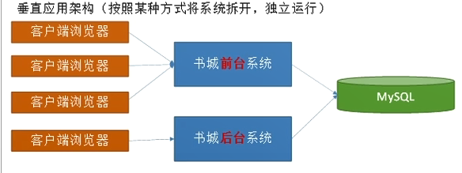

- ==分布式SOA架构==：Distributed Service

当垂直应用越来越多，应用之间的交互不可避免，将核心业务抽取出来，作为独立的服务，形成稳定的服务中心，此时，用于提高业务服用和整合的分布式服务框架RPC是关键。

RPC：**Romote Procedure Call**,是指远程过程调用，是一种进程间的通信方式，它是一种技术思想，而不是规范。它允许程序调用另一个地址空间的过程或函数。

>RPC:底层是通过Netty（Socket） +自定义序列化
>
>RestApi：Http+JSON(SpringCLoud就是使用Rest方式进行服务之间的交互的，不属于RPC)
>
>~~~markdown
>本质区别
>     http是协议，rpc是方法，rpc的实现可能也会用到http
>     http在应用层，rpc在传输层（长连接，少了三次握手，不过http2.0也可以链接复用了）
>     http中所使用的报文中有效字节数仅仅占约 30%，也就是70%的时间用于传输元数据废编码。当然实际情况下报文内容可能会比这个长，但是报头所占的比例也是非常可观的。而rpc仅通过序列化发送有效数据，省去了很多无效的数据，提高传输效率。
>    http需要可读性强，包括输入、输出，解析等。rpc就像调用方法一样调用，很简单。
>~~~

- ==微服务架构==：

### 1.4 分布式微服务思想与基本概念⭐

#### 1.4.1 高并发

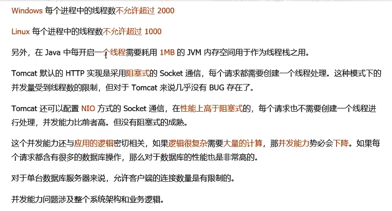

这里面有几个指标需要关注：

==响应时间==：清求做出响应的时间

==吞吐量==：系统在单位时间内处理请求的数量

==并发用户数==：承载的正常使用系统功能的用户的数量

#### 1.4.2 高可用

服务**集群**部署，数据库**主从+双机热备**

- 主-备方案（Active-Standby方式）

主-备方案是指一台服务器处于某种业务的激活状态（即Active状态），另一台服务器属于该业务的备用状态（即Standby状态）

- 双主机方案（Active-Active方式）

双主机方案即指两种不同的业务分别在两台服务器上互为主备状态

#### 1.4.3 注册中心

==**保存某个服务所在地址等信息，方便调用者实时获取其他服务信息。**==

- ==服务注册：服务提供者==
- ==服务发现：服务消费者==

#### 1.4.4 负载均衡⭐

动态将清求分发给比较闲的服务器

负载均衡的**常用策略**：

轮询(Round Robin)、加权轮询(Weighted Round Robin)、随机(Random)、哈希(Hash）、最小连接数(LC)、最短响应时间(LRT)

#### 1.4.5 服务雪崩

服务之间复杂调用，一个服务不可用，导致整个系统受影响不可用。

#### 1.4.6 熔断⭐

某个服务频繁超时，直接将其短路快速返回mock（模拟/虚拟）值。

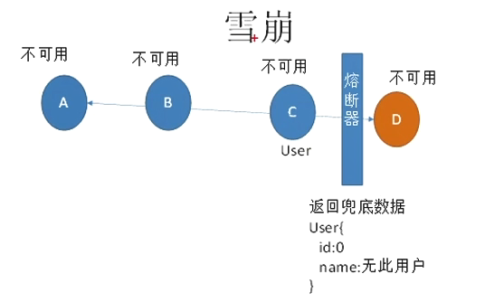

#### 1.4.7 限流⭐

限制某个服务每秒的调用本服务的频率。

#### 1.4.8 API网关⭐

网关的实现原理就是==过滤器==。

API网关需要做很多工作，他作为一个系统的后端总入口，承载着所有服务的组合路由转换等工作，除此之外，我们一般也会把安全，限流、缓存、日志、监控、重试、熔断等放到API网关来做。

#### 1.4.9 服务追踪⭐

追踪服务的调用链，记录整个系统的执行请求过程。如“请求响应时间，判断链路中的哪些服务属于慢服务（可能存在问题，需要改善）

#### 1.4.10 弹性云

ELastic Compute Servcie弹性计算服务

动态扩容，压榨服务器的闲时能力。

## 2.SpringCloud介绍

SpringCloud是Spring旗下的项目之一，

[官网地址：http://projects.spring.io/spring-cloud/](http://projects.spring.io/spring-cloud/)

学习地址：https://spring-cloud-alibaba-group.github.io/github-pages/hoxton/en-us/index.html

Spring最擅长的就是集成，把世界上最好的框架拿过来，集成到自己的项目中。

SpringCloud也是一样，它将现在非常流行的一些技术整合到一起，实现了诸如：配置管理，服务发现，智能路由，负载均衡，熔断器，控制总线，集群状态等等功能。其主要涉及的组件包括：

中文社区：https://www.bookstack.cn/read/spring-cloud-docs/docs-index.md

相关组件：

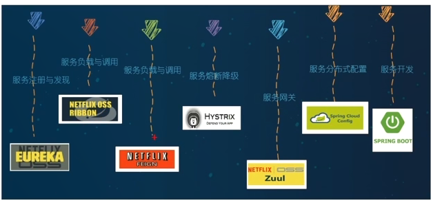

**SpringCloud的版本**

SpringCloud的版本命名比较特殊，因为它不是一个组件，而是许多组件的集合，它的命名是以A到Z的为首字母的一些单词（其实是伦敦地铁站的名字）组成,不过从2020开始，SpringCloud重新以年份开始定义版本名：

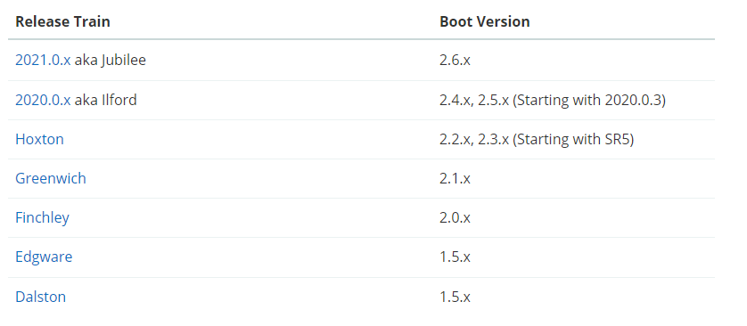

SpringCloud和SpringBoot之间存在版本对应关系，详细的对应关系可以i通过这个地址查看：https://start.spring.io/actuator/info

接下来，我们就一一学习SpringCloud中的重要组件。

在这之前，我们先介绍一下一个好用的插件：==**Lombok**==，人称**小辣椒**.

作用：简化javaBean的开发。

~~~java
/**
 * lombok:小辣椒
 * 简化javaBean的开发，使类的结构更加清晰
 */
@Data   // 加上这个注解就相当于写了getter/setter方法
@AllArgsConstructor  // 生成一个全参的构造器
@NoArgsConstructor   // 生成无参构造器
@ToString            // 生成toString方法
@EqualsAndHashCode   // 生成Equals和hashCode方法
@Slf4j               // 会内建一个log对象，可以直接调用日志方法输出日志
上述几个注解都是作用在JavaBean上的。
~~~

## 3 微服务环境搭建⭐🐂

### 3.1 创建project父工程🐏

**重要提醒**：我们在下载依赖的时候，需要将==远程仓库地址==改为如下的地址：

~~~xml
<mirror>
      <id>nexus-aliyun</id>
      <mirrorOf>central</mirrorOf> 
	  <name>Nexus aliyun</name>
      <url>http://maven.aliyun.com/nexus/content/groups/public/</url>
</mirror>
~~~

我们创建父工程，在父工程中锁定版本,管理依赖配置等。

~~~xml
<?xml version="1.0" encoding="UTF-8"?>
<project xmlns="http://maven.apache.org/POM/4.0.0"
         xmlns:xsi="http://www.w3.org/2001/XMLSchema-instance"
         xsi:schemaLocation="http://maven.apache.org/POM/4.0.0 http://maven.apache.org/xsd/maven-4.0.0.xsd">
    <modelVersion>4.0.0</modelVersion>

    <groupId>com.atguigu.springcloud</groupId>
    <artifactId>cloud2022</artifactId>
    <version>1.0-SNAPSHOT</version>

    <!--聚合子模块 -->
    <modules>
        <module>cloud-provider-payment8001</module>
        <module>cloud-consumer-order80</module>
        <module>cloud-api-commons</module>
    </modules>

    <!--父工程的packaging必须指定为pom-->
    <packaging>pom</packaging>

    <properties>
        <project.build.sourceEncoding>UTF-8</project.build.sourceEncoding>
        <maven.compiler.source>1.8</maven.compiler.source>
        <maven.compiler.target>1.8</maven.compiler.target>
        <junit.version>4.12</junit.version>
        <log4j.version>1.2.17</log4j.version>
        <!--简化javaBean开发的组件 -->
        <lombok.version>1.16.18</lombok.version>
        <mysql.version>5.1.47</mysql.version>
        <druid.version>1.1.16</druid.version>
        <nybatis.spring.boot.version>1.3.0</nybatis.spring.boot.version>
    </properties>

    <!--子模块继承之后，提供作用，锁定版本，并且子模块中不用写groupID和version-->
    <dependencyManagement>
        <dependencies>
            <!--spring boot 2.2.2 -->
            <dependency>
                <groupId>org.springframework.boot</groupId>
                <artifactId>spring-boot-dependencies</artifactId>
                <version>2.2.2.RELEASE</version>
                <type>pom</type>
                <scope>import</scope>
            </dependency>
            <!--spring-cloud Hoxton.SR1-->
            <dependency>
                <groupId>org.springframework.cloud</groupId>
                <artifactId>spring-cloud-dependencies</artifactId>
                <version>Hoxton.SR1</version>
                <type>pom</type>
                <scope>import</scope>
            </dependency>
            <!-- spring cloud alibaba 2.1.0.RELEASE-->
            <dependency>
                <groupId>com.alibaba.cloud</groupId>
                <artifactId>spring-cloud-alibaba-dependencies</artifactId>
                <version>2.1.0.RELEASE</version>
                <type>pom</type>
                <scope>import</scope>
            </dependency>
            <dependency>
                <groupId>mysql</groupId>
                <artifactId>mysql-connector-java</artifactId>
                <version>${mysql.version}</version>
            </dependency>
            <dependency>
                <groupId>com.alibaba</groupId>
                <artifactId>druid</artifactId>
                <version>${druid.version}</version>
            </dependency>
            <dependency>
                <groupId>org.mybatis.spring.boot</groupId>
                <artifactId>mybatis-spring-boot-starter</artifactId>
                <version>${nybatis.spring.boot.version}</version>
            </dependency>
            <dependency>
                <groupId>junit</groupId>
                <artifactId>junit</artifactId>
                <version>${junit.version}</version>
                <scope>test</scope>
            </dependency>
            <dependency>
                <groupId>log4j</groupId>
                <artifactId>log4j</artifactId>
                <version>${log4j.version}</version>
            </dependency>
            <dependency>
                <groupId>org.projectlombok</groupId>
                <artifactId>lombok</artifactId>
                <version>${lombok.version}</version>
                <optional>true</optional>
            </dependency>
        </dependencies>
    </dependencyManagement>

    <build>
        <plugins>
            <!--打包的插件 -->
            <plugin>
                <groupId>org.springframework.boot</groupId>
                <artifactId>spring-boot-maven-plugin</artifactId>
                <configuration>
                    <fork>true</fork>
                    <addResources>true</addResources>
                </configuration>
            </plugin>
        </plugins>
    </build>

</project>
~~~

==父工程创建完要执行mvn:install==

### 3.2 创建服务提供者子工程cloud-provider-payment8001🐏

子模块名称为：cloud-provider-payment8001

其最终结构如下：

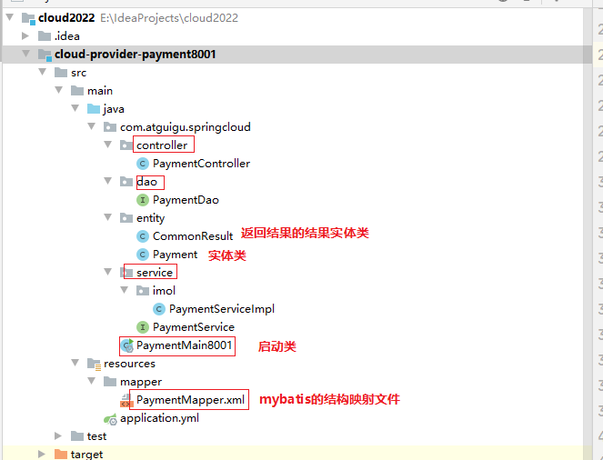

**pom,xml**

~~~xml
<?xml version="1.0" encoding="UTF-8"?>
<project xmlns="http://maven.apache.org/POM/4.0.0"
         xmlns:xsi="http://www.w3.org/2001/XMLSchema-instance"
         xsi:schemaLocation="http://maven.apache.org/POM/4.0.0 http://maven.apache.org/xsd/maven-4.0.0.xsd">
    <parent>
        <artifactId>cloud2022</artifactId>
        <groupId>com.atguigu.springcloud</groupId>
        <version>1.0-SNAPSHOT</version>
    </parent>
    <modelVersion>4.0.0</modelVersion>

    <artifactId>cloud-provider-payment8001</artifactId>
    <dependencies>
        <dependency>
            <groupId>org.springframework.boot</groupId>
            <artifactId>spring-boot-starter-web</artifactId>
        </dependency>
        <!--健康监控 -->
        <dependency>
            <groupId>org.springframework.boot</groupId>
            <artifactId>spring-boot-starter-actuator</artifactId>
        </dependency>
        <dependency>
            <groupId>org.mybatis.spring.boot</groupId>
            <artifactId>mybatis-spring-boot-starter</artifactId>
        </dependency>
        <dependency>
            <groupId>com.alibaba</groupId>
            <artifactId>druid-spring-boot-starter</artifactId>
            <version>1.1.10</version>
        </dependency>
        <dependency>
            <groupId>mysql</groupId>
            <artifactId>mysql-connector-java</artifactId>
        </dependency>
        <dependency>
            <groupId>org.springframework.boot</groupId>
            <artifactId>spring-boot-starter-jdbc</artifactId>
        </dependency>
        <!--热部署 -->
        <dependency>
            <groupId>org.springframework.boot</groupId>
            <artifactId>spring-boot-devtools</artifactId>
            <scope>runtime</scope>
            <optional>true</optional>
        </dependency>
        <dependency>
            <groupId>org.projectlombok</groupId>
            <artifactId>lombok</artifactId>
            <optional>true</optional>
        </dependency>
        <dependency>
            <groupId>org.springframework.boot</groupId>
            <artifactId>spring-boot-starter-test</artifactId>
            <scope>test</scope>
        </dependency>
    </dependencies>

</project>
~~~

**启动类**

~~~java
package com.atguigu.springcloud;

import org.springframework.boot.SpringApplication;
import org.springframework.boot.autoconfigure.SpringBootApplication;
import org.springframework.transaction.annotation.EnableTransactionManagement;

@EnableTransactionManagement // 开启声明式事务
@SpringBootApplication
public class PaymentMain8001 {
    public static void main(String[] args) {
        SpringApplication.run(PaymentMain8001.class,args);
    }
}
~~~

**全局配置文件application.yml**

~~~yaml
server:
  port: 8001

spring:
  application:
    name: cloud-payment-service
  datasource:
    type: com.alibaba.druid.pool.DruidDataSource
    driver-class-name: com.mysql.jdbc.Driver
    url: jdbc:mysql://localhost:3306/test?useUnicode=true&characterEncoding=utf-8&useSSL=false&serverTimezone=Asia/Shanghai
    username: root
    password: 123456

# mybatis相关整合配置
mybatis:
  mapper-locations: classpath:/mapper/*.xml   #接口映射文件路径
  type-aliases-package: com.atguigu.springcloud.entity  #设置别名包

# log
logging:
  level:
    com.atguigu.springcloud: debug
~~~

**实体类**

~~~java
package com.atguigu.springcloud.entity;


import lombok.*;
import lombok.extern.slf4j.Slf4j;

import java.io.Serializable;

/**
 * lombok:小辣椒
 * 简化javaBean的开发，使类的结构更加清晰
 */
@Data   // 加上这个注解就相当于写了getter/setter方法
@AllArgsConstructor  //生成一个含所有参数的构造器
@NoArgsConstructor   // 生成无参构造器
@ToString            // 生成toString方法
@EqualsAndHashCode   // 生成Equals和hashCode方法
@Slf4j               // 会内建一个log对象，可以直接调用他的日志输出的方法
// 这个实体类需要实现Serializable接口，这是由于我们的类需要转换成json格式在服务之间来回转换
public class Payment implements Serializable {
    private Integer id;
    private String serial;
}

~~~

**结果实体类**

~~~java
package com.atguigu.springcloud.entity;

import lombok.AllArgsConstructor;
import lombok.Data;
import lombok.NoArgsConstructor;

import java.io.Serializable;

@Data
@AllArgsConstructor
@NoArgsConstructor
public class CommonResult<T> implements Serializable {
    private Integer code;// 返回给调用者的状态码
    private String message;//返回给调用者的消息（无论成功或者失败）
    private T data;// 真正成功以后需要返回的数据

    public CommonResult(Integer code,String message){
        this(code,message,null);
    }
}
~~~

**建表语句**

~~~sql
SELECT * FROM  payment;
CREATE TABLE payment(
 id bigint(20) NOT NULL AUTO_INCREMENT comment 'ID',
 serial varchar(300) DEFAULT NULL,
 PRIMARY key(id)
)
INSERT INTO payment (id,serial) values(31,'尚硅谷001');
~~~

**Dao接口**

~~~java
package com.atguigu.springcloud.dao;

import com.atguigu.springcloud.entity.Payment;
import org.apache.ibatis.annotations.Mapper;
import org.apache.ibatis.annotations.Param;
import org.springframework.stereotype.Component;

// @Component // 代替@Repository 声明bean对象
@Mapper // mybatis提供的，等价于@MapperScan("com.atguigu.springcloud.dao")
// @Repository // Spring提供的，声明一个JavaBean对象
public interface PaymentDao {
    public int create(Payment payment);
    public Payment getPaymentById(@Param("id")Long id);
}

~~~

注意：==**@Mapper与@MapperScan注解的用法**==

~~~markdown
这两个注解都是自动为这个Dao接口生成一个实现类，让别的类进行引用
### 1.@Mapper
@Mapper是MyBatis提供的注解，作用也是声明一个Bean。但是只是用一个@Mapper的话在service层调用时会爆红，但是不影响使用
@Mapper注解不需要在SpringBoot启动类上配置扫描@MapperScan，也就是使用@Mapper，则不需要添加@MapperScan注解；通过xml里面的namespace里面的接口地址，生成bean对象后注入到Service里面，
### 2.@MapperScan
@Repository是spring提供的注释，能够将该类注册成Bean。被依赖注入。 使用该注解前，在启动类上要加@Mapperscan,来表明Mapper类的位置。
~~~

~~~java
如果有多个类的话，可以使用@MapperScan进行注解，一次性注解多个包
@SpringBootApplication  
@MapperScan({"com.kfit.demo","com.kfit.user"})  
public class App {  
    public static void main(String[] args) {  
       SpringApplication.run(App.class, args);  
    }  
} 
~~~

**接口映射文件**

~~~xml
<?xml version="1.0" encoding="UTF-8" ?>
<!DOCTYPE mapper
        PUBLIC "-//mybatis.org//DTD Mapper 3.0//EN"
        "http://mybatis.org/dtd/mybatis-3-mapper.dtd">
<!--
   说明：
      1.接口设置文件的根标签为mapper
      2.根标签mapper的namespace属性：这个属性的属性值用来绑定我们创建的接口，故值要设置为Mapper接口的全类名
-->
<mapper namespace="com.atguigu.springcloud.dao.PaymentDao">
    <!--
    说明：
       mapper根标签可以有子标签select,insert,update,delete
         id属性：设置为Mapper接口的方法名，也是sql语句的唯一标识
         resultType:设置方法的返回值的类型，即实体类的全限定名
    -->
    <!--
       useGeneratedKeys:使用mysql的自动增长策略  auto_increment
       主键回填到keyProperty指定的属性上
       insert 操作也会生成Result结果集，可以获取主键值
     -->
    <insert id="create"  useGeneratedKeys="true"  keyProperty="id">
        <!--
          当传输参数为javaBean时候:
          #{}与${}都可以通过属性名直接获取属性值，但是要注意${}的字符串要加单引号问题！
        -->
        insert into payment(serial) values (#{serial});
    </insert>

    <resultMap id="BaseResultMap" type="com.atguigu.springcloud.entity.Payment">
        <id column="id" property="id" jdbcType="BIGINT"></id>
        <result column="serial" property="serial" jdbcType="VARCHAR"></result>
    </resultMap>


    <select id="getPaymentById" parameterType="long" resultMap="BaseResultMap">
        select  * from  payment where  id = #{id}
    </select>
</mapper>
~~~

**service接口**

~~~java
package com.atguigu.springcloud.service;

import com.atguigu.springcloud.entity.Payment;

public interface PaymentService {
    public int create(Payment payment);
    public Payment getPaymentById(Long id);
}
~~~

**service接口实现类**

~~~java
package com.atguigu.springcloud.service.imol;

import com.atguigu.springcloud.dao.PaymentDao;
import com.atguigu.springcloud.entity.Payment;
import com.atguigu.springcloud.service.PaymentService;
import org.springframework.beans.factory.annotation.Autowired;
import org.springframework.stereotype.Service;
import org.springframework.transaction.annotation.Transactional;

@Service
public class PaymentServiceImpl implements PaymentService {
    @Autowired
    private PaymentDao paymentDao;
    @Override
    @Transactional(timeout = 5000,rollbackFor=Exception.class)
    public int create(Payment payment) {
        return paymentDao.create(payment);
    }

    @Override
    @Transactional(timeout = 5000,readOnly = true)
    public Payment getPaymentById(Long id) {
        return paymentDao.getPaymentById(id);
    }
}
~~~

**Controller**

~~~java
package com.atguigu.springcloud.controller;

import com.atguigu.springcloud.entity.CommonResult;
import com.atguigu.springcloud.entity.Payment;
import com.atguigu.springcloud.service.PaymentService;
import lombok.extern.slf4j.Slf4j;
import org.springframework.beans.factory.annotation.Autowired;
import org.springframework.web.bind.annotation.PathVariable;
import org.springframework.web.bind.annotation.RequestMapping;
import org.springframework.web.bind.annotation.RestController;

@RestController
@Slf4j
public class PaymentController {
    @Autowired
    private PaymentService paymentService;


    @RequestMapping("/payment/create")
    // 可以在控制器方法的形参位置设置一个实体类类型的形参，此时若浏览器传输的请求参数的参数名和实体类中的属性名一致，那么请求参数就会为此属性赋值
    public CommonResult<Payment> create(@RequestBody Payment payment){
        try {
            int i = paymentService.create(payment);
            if(i==1){
                log.debug("保存成功-payment="+payment);
                return  new CommonResult(200,"保存成功",payment);
            }else{
                log.debug("保存失败");
                return new CommonResult(444,"保存失败");
            }
        } catch (Exception e) {
            log.debug("系统异常"+e.getMessage());
            e.printStackTrace();
            return new CommonResult(999,"系统异常");
        }

    }


    @RequestMapping("/payment/getPaymentById/{id}")
    public CommonResult<Payment> getPaymentById(@PathVariable("id") Long id){
        Payment payment = paymentService.getPaymentById(id);
        if(payment==null){
            log.debug("查询数据失败-id"+id);
            System.out.println(666);
            return new CommonResult<Payment>(404,"查询失败",null);
         }else{
            log.debug("查询数据成功+paymen="+payment);
            return new CommonResult<Payment>(200,"查询成功",payment);
       }
    }
}
~~~

**测试**

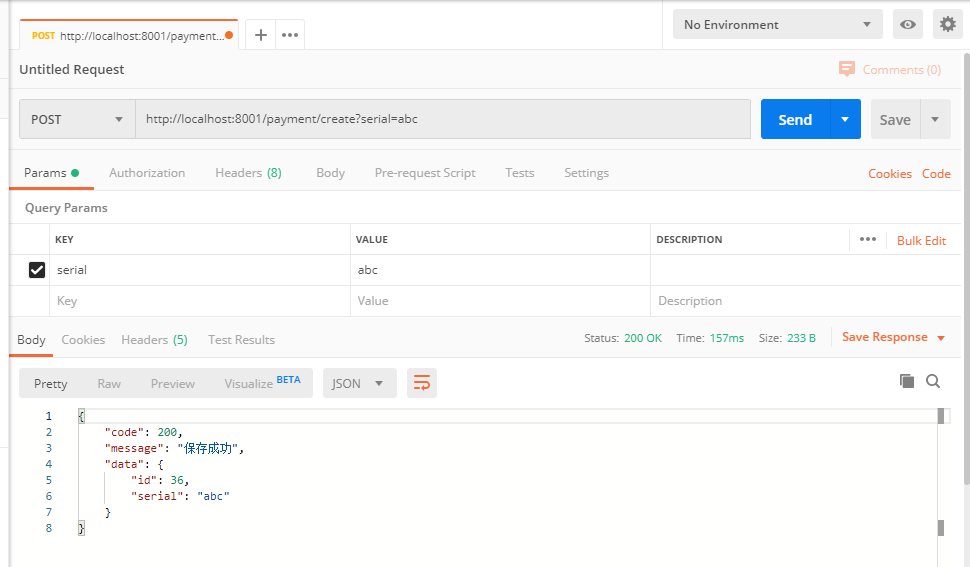

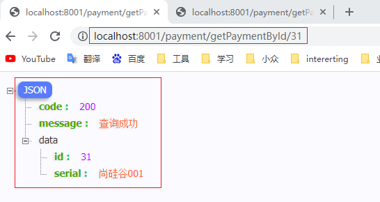

### 3.3 创建服务消费者子工程cloud-consumer-order80⭐🐏

子模块名称为：cloud-consumer-order80

我们在服务消费中子工程中想调用服务提供者子工程的服务，这时候我们通过http协议进行通信，我们采用**RestTemplate**来发送清求。

我们先对RestTemplate来进行简单介绍

#### 3.3.1 RestTemplate⭐

ResrTemplate提供了多种便捷访问远程Http服务的方法，是一种简单便捷的访问RestFul服务模板，是==Spring提供的用于访问Rest服务的客户端模板工具类==。

官网地址：https://docs.spring.io/spring-framework/docs/5.2.2.RELEASE/javadoc-api/org/springframework/web/client/RestTemplate.html

使用RestTemplate访问RestFul接口非常的简单无脑，其中，url、requestMap、ResponseBean、class这三个参数分别代表**Rest请求地址**，**请求参数**，**Http响应转换被转换成的对象类型**。

**pom.xml**

~~~xml
<?xml version="1.0" encoding="UTF-8"?>
<project xmlns="http://maven.apache.org/POM/4.0.0"
         xmlns:xsi="http://www.w3.org/2001/XMLSchema-instance"
         xsi:schemaLocation="http://maven.apache.org/POM/4.0.0 http://maven.apache.org/xsd/maven-4.0.0.xsd">
    <parent>
        <artifactId>cloud2022</artifactId>
        <groupId>com.atguigu.springcloud</groupId>
        <version>1.0-SNAPSHOT</version>
    </parent>
    <modelVersion>4.0.0</modelVersion>

    <artifactId>cloud-consumer-order80</artifactId>

    <dependencies>
        <dependency>
            <groupId>org.springframework.boot</groupId>
            <artifactId>spring-boot-starter-web</artifactId>
        </dependency>
        <!--健康监控 -->
        <dependency>
            <groupId>org.springframework.boot</groupId>
            <artifactId>spring-boot-starter-actuator</artifactId>
        </dependency>
        <!--热部署 -->
        <dependency>
            <groupId>org.springframework.boot</groupId>
            <artifactId>spring-boot-devtools</artifactId>
            <scope>runtime</scope>
            <optional>true</optional>
        </dependency>
        <dependency>
            <groupId>org.projectlombok</groupId>
            <artifactId>lombok</artifactId>
            <optional>true</optional>
        </dependency>
        <dependency>
            <groupId>org.springframework.boot</groupId>
            <artifactId>spring-boot-starter-test</artifactId>
            <scope>test</scope>
        </dependency>
    </dependencies>
</project>
~~~

**启动类**

~~~java
package com.atguigu.springcloud;


import org.springframework.boot.SpringApplication;
import org.springframework.boot.autoconfigure.SpringBootApplication;

@SpringBootApplication
public class OrderMain80 {
    public static void main(String[] args) {
        SpringApplication.run(OrderMain80.class,args);
    }
}
~~~

**全局配置文件**

~~~yaml
server:
  port: 80

spring:
  application:
    name: cloud-consumer-order
~~~

**实体类**

~~~java
package com.atguigu.springcloud.entity;


import lombok.*;
import lombok.extern.slf4j.Slf4j;

import java.io.Serializable;

/**
 * lombok:小辣椒
 * 简化javaBean的开发，使类的结构更加清晰
 */
@Data   // 加上这个注解就相当于写了getter/setter方法
@AllArgsConstructor  //生成一个含所有参数的构造器
@NoArgsConstructor   // 生成无参构造器
@ToString            // 生成toString方法
@EqualsAndHashCode   // 生成Equals和hashCode方法
@Slf4j               // 会内建一个log对象，可以直接调用他的日志输出的方法
// 这个实体类需要实现Serializable接口，这是由于我们的类需要转换成json格式在服务之间来回转换
public class Payment implements Serializable {
    private Integer id;
    private String serial;
}
~~~

**返回结果实体类**

~~~java
package com.atguigu.springcloud.entity;

import lombok.AllArgsConstructor;
import lombok.Data;
import lombok.NoArgsConstructor;

import java.io.Serializable;

@Data
@AllArgsConstructor
@NoArgsConstructor
public class CommonResult<T> implements Serializable {
    private Integer code;// 返回给调用者的状态码
    private String message;//返回给调用者的消息（无论成功或者失败）
    private T data;// 真正成功以后需要返回的数据

    public CommonResult(Integer code,String message){
        this(code,message,null);
    }

}
~~~

**controller**

~~~java
package com.atguigu.springcloud.controller;

import com.atguigu.springcloud.entity.CommonResult;
import com.atguigu.springcloud.entity.Payment;
import org.springframework.beans.factory.annotation.Autowired;
import org.springframework.web.bind.annotation.PathVariable;
import org.springframework.web.bind.annotation.PostMapping;
import org.springframework.web.bind.annotation.RequestMapping;
import org.springframework.web.bind.annotation.RestController;
import org.springframework.web.client.RestTemplate;

/**
 * 消费者：订单微服务
 * 1.我们是消费者，不与数据库打交道
 * 2.如果需要跳转页面，就使用@Controller注解，否则，全部请求采用异步，返回json
 */
@RestController
public class OrderController {
    String URL="http://localhost:8001";
    @Autowired
    private RestTemplate restTemplate;

    @RequestMapping("/customer/payment/getPaymentById/{id}")//被浏览器调用
    public CommonResult<Payment> getPaymentById(@PathVariable("id") Long id){
        CommonResult<Payment> object = restTemplate.getForObject(URL + "/payment/getPaymentById/" + id, CommonResult.class);
        return object;
    }

    @PostMapping("/customer/payment/create")
    public CommonResult<Payment> create(Payment payment){
       return  restTemplate.postForObject(URL + "/payment/create", payment, CommonResult.class);
    }
}
~~~

****

**配置类**

~~~java
package com.atguigu.springcloud.config;

import org.springframework.boot.SpringBootConfiguration;
import org.springframework.context.annotation.Bean;
import org.springframework.web.client.RestTemplate;

@SpringBootConfiguration  // SprigBoot提供的，作用等价于@Configuraton
public class ApplicationContextConfig {
    @Bean
    public RestTemplate restTemplate(){
        return new RestTemplate();
    }
}
~~~

**测试:**

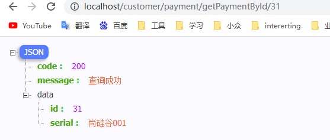

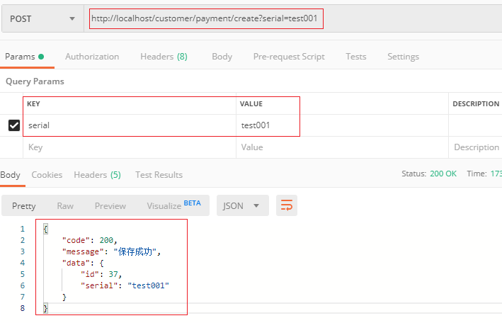

至此，我们可以通过服务消费者去调用服务提供者的服务啦。

### 3.4 创建公共commns子工程

我们通过观看消费者和服务提供者代码，可以看到：==存在重复代码==

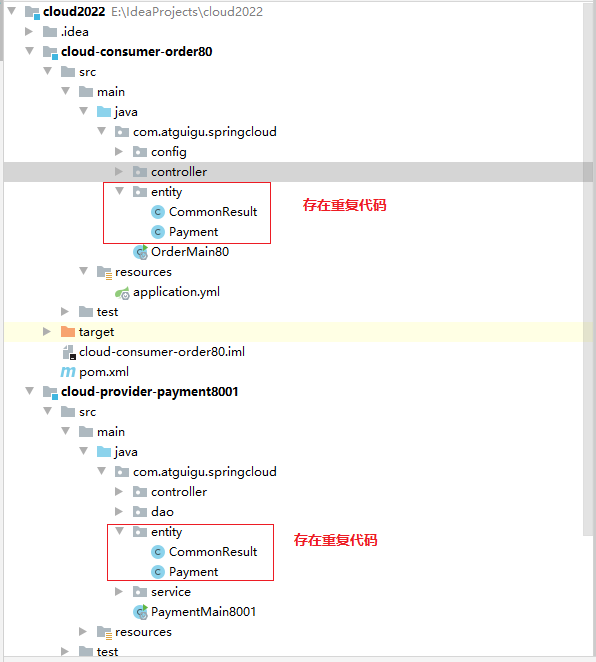

为此，我们单独来创建一个子工程cloud-api-commons去简化它。

- 1.创建子工程模块

**pom.xml**

~~~xml
<?xml version="1.0" encoding="UTF-8"?>
<project xmlns="http://maven.apache.org/POM/4.0.0"
         xmlns:xsi="http://www.w3.org/2001/XMLSchema-instance"
         xsi:schemaLocation="http://maven.apache.org/POM/4.0.0 http://maven.apache.org/xsd/maven-4.0.0.xsd">
    <parent>
        <artifactId>cloud2022</artifactId>
        <groupId>com.atguigu.springcloud</groupId>
        <version>1.0-SNAPSHOT</version>
    </parent>
    <modelVersion>4.0.0</modelVersion>

    <artifactId>cloud-api-commons</artifactId>
    <dependencies>
        <dependency>
            <groupId>org.springframework.boot</groupId>
            <artifactId>spring-boot-devtools</artifactId>
            <scope>runtime</scope>
            <optional>true</optional>
        </dependency>
        <dependency>
            <groupId>org.projectlombok</groupId>
            <artifactId>lombok</artifactId>
            <optional>true</optional>
        </dependency>
        <!--糊涂工具包-->
        <dependency>
            <groupId>cn.hutool</groupId>
            <artifactId>hutool-all</artifactId>
            <version>5.1.0</version>
        </dependency>
    </dependencies>

</project>
~~~

**实体类**

~~~java
package com.atguigu.springcloud.entity;

import lombok.AllArgsConstructor;
import lombok.Data;
import lombok.NoArgsConstructor;

import java.io.Serializable;

@Data
@AllArgsConstructor
@NoArgsConstructor
public class CommonResult<T> implements Serializable {
    private Integer code;// 返回给调用者的状态码
    private String message;//返回给调用者的消息（无论成功或者失败）
    private T data;// 真正成功以后需要返回的数据

    public CommonResult(Integer code,String message){
        this(code,message,null);
    }

}

~~~

~~~java
package com.atguigu.springcloud.entity;


import lombok.*;
import lombok.extern.slf4j.Slf4j;

import java.io.Serializable;

/**
 * lombok:小辣椒
 * 简化javaBean的开发，使类的结构更加清晰
 */
@Data   // 加上这个注解就相当于写了getter/setter方法
@AllArgsConstructor  //生成一个含所有参数的构造器
@NoArgsConstructor   // 生成无参构造器
@ToString            // 生成toString方法
@EqualsAndHashCode   // 生成Equals和hashCode方法
// 这个实体类需要实现Serializable接口，这是由于我们的类需要转换成json格式在服务之间来回转换
public class Payment implements Serializable {
    private Integer id;
    private String serial;
}

~~~

- 2.==删除提供者，消费者的实体类代码，并且在依赖中引入公共子工程的坐标==

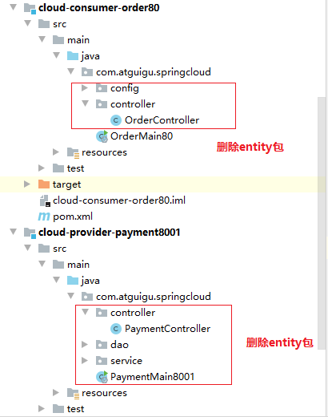

**公共子模块坐标**

~~~xml
<dependency>
            <artifactId>cloud-api-commons</artifactId>
            <groupId>com.atguigu.springcloud</groupId>
            <version>1.0-SNAPSHOT</version>
</dependency>
~~~

- 3.==将父工程先clean再install==

## 4.注册中心Eureka⭐🐏

关键是三个注解的使用：

>1.@EnableEurekaServer：声明当前的微服务是Eureka服务端
>
>2.@@EnableEurekaClient： 标记当前服务是一个Eureka客户端
>
>3.@LoadBalanced ：开启远程调用微服务的负载均衡，默认策略是轮询

我们在前面的案例中已经实现了服务之间的调用。但是，假如服务有集群，且服务出现下线，宕机等问题，在服务消费者那儿均是无法知道的，我们还将服务提供者IP地址直接写在了服务消费者的代码中，为了解决这一系列的问题，我们需要引入==注册中心==工具。

SpringCloud封装了**Netflix**公司开发的Eureka模块来实现服务治理。以实现==服务调用，负载均衡，容错等。实现服务注册和发现==。

### 4.1 服务注册

Eureka采用CS的设计架构，Eureka Server作为服务注册的服务器，它是**<font color="red">服务注册中心</font>**.

而系统中的其他微服务，使用**Eureka Client客户端**连接到Eureka Server并且维持**<font color="red">心跳</font>**连接（30秒一次通讯，当服务注册中心连续3个30秒均未收到消息），这样系统的维护人员可以通过Eureka Server来==监控==系统中的各个微服务是否正常运行。==所有的微服务都是**Eureka Client客户端**。==

- 在服务注册与发现中，有一个注册中心。

- 当服务器启动的时候，会把当前的自己服务器的信息，比如：服务通讯地址等信息以别名的方式注册到注册中心上。

- 另一方（消费者服务），以该别名的方式去注册中心获取到实际的服务通讯地址（==获取实际可调用的服务列表==），然后，在实现本地的RPC远程调用。

RPC远程调用框架的核心设计思想：在于注册中心滚，因为注册中心管理每一个服务与服务之间的一个依赖关系。

在任何一个RPC的远程框架中，都会有一个注册中心。（存放服务地址相关信息）

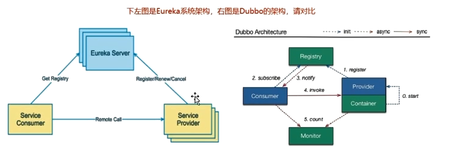

### 4.2 Eureka两组件⭐

- eureka Server提供服务注册服务

各个微服务节点通过配置以后，会在Eureka Server中国进行注册，这样Eureka Server中的服务注册表中将会存储所有可用的服务节点，服务节点的信息可以在界面中直观看到。

- Eureka Client通过注册中心进行访问

是一个java客户端，用于简化和Eureka Server的交互，客户端同时也具备一个内置的，使用轮询负载均衡算法的负载均衡器，在应用启动后，将会往Eureka Server发送心跳（默认周期30秒），如果Eureka Server在多个心跳周期内没有收到某个节点的心跳，Server会从服务注册表中将这个服务节点移除（默认90秒）

需要注意的是：

>服务注册上的服务列表会被注册中心客户端抓取到本地，作为缓存

### 4.3 创建Eureka Sever注册中心cloud-eureka-server-7001⭐

关键是在启动类加上注解：**<font color="red">@EnableEurekaServer  </font>**.

我们创建一个新的子工程，来当作Eureka Server工程

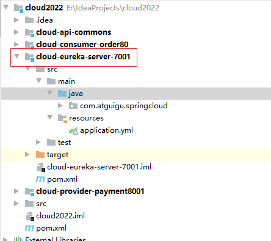

**pom.xml**

关键是加入如下依赖：

~~~xml
<dependency>
            <groupId>org.springframework.cloud</groupId>
            <artifactId>spring-cloud-starter-netflix-eureka-server</artifactId>
        </dependency>
~~~

~~~xml
<?xml version="1.0" encoding="UTF-8"?>
<project xmlns="http://maven.apache.org/POM/4.0.0"
         xmlns:xsi="http://www.w3.org/2001/XMLSchema-instance"
         xsi:schemaLocation="http://maven.apache.org/POM/4.0.0 http://maven.apache.org/xsd/maven-4.0.0.xsd">
    <parent>
        <artifactId>cloud2022</artifactId>
        <groupId>com.atguigu.springcloud</groupId>
        <version>1.0-SNAPSHOT</version>
    </parent>
    <modelVersion>4.0.0</modelVersion>

    <artifactId>cloud-eureka-server-7001</artifactId>

    <dependencies>
        <!--
        SpringCloud集成netflix公司的组件：eurekaServer（cs架构）
        eureka-server 服务端
        eureka-client 客户端
        -->
        <dependency>
            <groupId>org.springframework.cloud</groupId>
            <artifactId>spring-cloud-starter-netflix-eureka-server</artifactId>
        </dependency>

        <dependency>
            <groupId>com.atguigu.springcloud</groupId>
            <artifactId>cloud-api-commons</artifactId>
            <version>1.0-SNAPSHOT</version>
        </dependency>
        <dependency>
            <groupId>org.springframework.boot</groupId>
            <artifactId>spring-boot-starter-web</artifactId>
        </dependency>
        <dependency>
            <groupId>org.springframework.boot</groupId>
            <artifactId>spring-boot-starter-actuator</artifactId>
        </dependency>
        <dependency>
            <groupId>org.springframework.boot</groupId>
            <artifactId>spring-boot-devtools</artifactId>
            <scope>runtime</scope>
            <optional>true</optional>
        </dependency>
        <dependency>
            <groupId>org.projectlombok</groupId>
            <artifactId>lombok</artifactId>
        </dependency>
        <dependency>
            <groupId>org.springframework.boot</groupId>
            <artifactId>spring-boot-starter-test</artifactId>
            <scope>test</scope>
        </dependency>
        <dependency>
            <groupId>junit</groupId>
            <artifactId>junit</artifactId>
        </dependency>
    </dependencies>
</project>
~~~

**配置文件**

~~~yaml
# 注册中心服务端端口号
server:
  port: 7001

# 注册中心服务端IP地址
eureka:
  instance:
    hostname: localhost

#这里会出现client原因：这是由于服务端也需要在集群的时候将自己注册到其他注册中心上，故每个服务端自带一个客户端
  client:
    #注册中心本身不需要往自身上注册，只有集群的时候，需要将一个注册中心注册到另一个注册上
    register-with-eureka: false
    #注册中心本身不需要抓取注册信息，集群的时候需要
    fetch-registry: false
    service-url:
      # 这里代表要注册的注册中心的地址，多个地址之间用,隔开
      defaultZone: http://${eureka.instance.hostname}:${server.port}/eureka
~~~

**启动类**

>启动类必须加上@EnableEurekaServer注解，声明当前的微服务是Eureka服务端

~~~java
package com.atguigu.springcloud;

import org.springframework.boot.SpringApplication;
import org.springframework.boot.autoconfigure.SpringBootApplication;
import org.springframework.cloud.netflix.eureka.server.EnableEurekaServer;

@SpringBootApplication
@EnableEurekaServer   // 声明当前的微服务是Eureka服务端
public class EurekaMain7001 {
    public static void main(String[] args) {
        SpringApplication.run(EurekaMain7001.class,args);
    }
}
~~~

### 4.4 服务注册⭐🐏

#### 4.4.1 8001服务提供者注册到注册中心⭐

接下来我们需要将8001服务提供者注册到注册中心，为此，我们需要在8001工程内加入如下依赖：

- 1.添加依赖

~~~Xml
<!--依赖Eureka客户端，即当前的微服务对于Eureka Server来讲，我们是客户端 -->
        <dependency>
            <groupId>org.springframework.cloud</groupId>
            <artifactId>spring-cloud-starter-netflix-eureka-client</artifactId>
        </dependency>
~~~

同时，我们需要修改全局配置文件Application.yml,,在这个配置文件中加入Eureka的配置

- 2.修改配置文件

~~~yaml
server:
  port: 8001

spring:
  application:
    name: cloud-payment-service
  datasource:
    type: com.alibaba.druid.pool.DruidDataSource
    driver-class-name: com.mysql.jdbc.Driver
    url: jdbc:mysql://localhost:3306/test?useUnicode=true&characterEncoding=utf-8&useSSL=false&serverTimezone=Asia/Shanghai
    username: root
    password: 123456

# mybatis相关整合配置
mybatis:
  mapper-locations: classpath:/mapper/*.xml   #接口映射文件路径
  type-aliases-package: com.atguigu.springcloud.entity  #设置别名包

# log
logging:
  level:
    com.atguigu.springcloud: debug
eureka:
  client:
    # 当前8001就是客户端，需要将自己注册到7001注册中心上去
    register-with-eureka: true
    # 80从7001上获取服务列表（会缓存到本地），用来调用其他的微服务
    fetch-registry: true
    # 当前微服务作为Eureka客户端，要注册到Eureka Server端
    service-url:
      # 这里代表要注册到的注册中心的地址，多个地址之间用,隔开
      defaultZone: http://localhost:7001/eureka
~~~

我们还需要将当前微服务标记成一个Eureka Client客户端，为此，我们需要在主启动类上加上注解==@EnableEurekaClient==，

关键是在启动类加上注解：**<font color="red">@EnableEurekaClient</font>**.标记当前服务是一个Eureka客户端

- 3.将当前微服务标记成Eureka Client客户端

~~~java
package com.atguigu.springcloud;

import org.springframework.boot.SpringApplication;
import org.springframework.boot.autoconfigure.SpringBootApplication;
import org.springframework.cloud.netflix.eureka.EnableEurekaClient;
import org.springframework.transaction.annotation.EnableTransactionManagement;

@EnableTransactionManagement // 开启声明式事务
@SpringBootApplication
@EnableEurekaClient  // 标记当前微服务是一个eureka客户端
public class PaymentMain8001 {
    public static void main(String[] args) {
        SpringApplication.run(PaymentMain8001.class,args);
    }
}
~~~

可以看到，8001已注册到注册中心上去啦

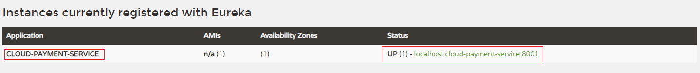

#### 4.4.2 80服务消费方注册到服务注册中心⭐

将80服务消费方注册到服务注册中心，

- 1.加入和8001工程一样的Eureka Client依赖

~~~xml
<!--依赖Eureka客户端，即当前的微服务对于Eureka Server来讲，我们是客户端 -->
        <dependency>
            <groupId>org.springframework.cloud</groupId>
            <artifactId>spring-cloud-starter-netflix-eureka-client</artifactId>
        </dependency>
~~~

- 2.修改配置文件

~~~yaml
server:
  port: 80

spring:
  application:
    name: cloud-consumer-order

eureka:
  client:
    # 当前8001就是客户端，需要将自己注册到7001注册中心上去
    register-with-eureka: true
    # 80从7001上获取服务列表（会缓存到本地），用来调用其他的微服务
    fetch-registry: true
    # 当前微服务作为Eureka客户端，要注册到Eureka Server端
    service-url:
      # 这里代表要注册到的注册中心的地址，多个地址之间用,隔开
      defaultZone: http://localhost:7001/eureka
~~~

我们还需要将当前微服务标记成一个Eureka Client客户端，为此，我们需要在主启动类上加上注解==@EnableEurekaClient==，

关键是在启动类加上注解：**<font color="red">@EnableEurekaClient</font>**.

- 3.将当前微服务标记成Eureka Client客户端

~~~java
package com.atguigu.springcloud;


import org.springframework.boot.SpringApplication;
import org.springframework.boot.autoconfigure.SpringBootApplication;
import org.springframework.cloud.netflix.eureka.EnableEurekaClient;

@SpringBootApplication
@EnableEurekaClient // 标记当前服务是一个Eureka客户端
public class OrderMain80 {
    public static void main(String[] args) {
        SpringApplication.run(OrderMain80.class,args);
    }
}
~~~

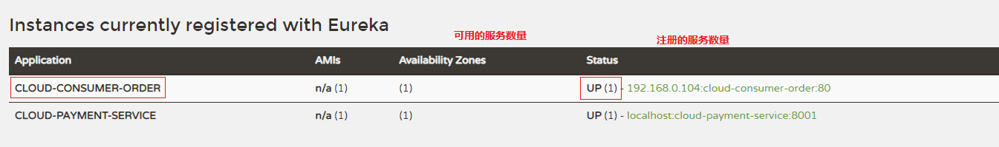

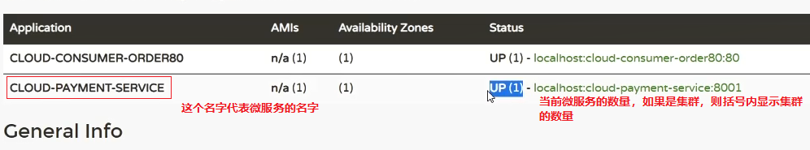

与8001注册到注册中心不同，我们现在是需要通过80调用8001的服务的，我们希望注册中心可以解决刚才我们提到的IP硬编码等的问题，为此，我们还需要修改服务消费方的controller代码。

- 4.修改controller代码,**<font color="red">ip需要修改为服务提供者的服务名</font>**.

>我们现在已经将IP改为Eureka上注册的服务的服务名application，一个服务名可能对应集群下多个服务IP，这个时候调用会负载均衡到该服务下的某个具体的服务。

~~~java
package com.atguigu.springcloud.controller;

import com.atguigu.springcloud.entity.CommonResult;
import com.atguigu.springcloud.entity.Payment;
import org.springframework.beans.factory.annotation.Autowired;
import org.springframework.web.bind.annotation.PathVariable;
import org.springframework.web.bind.annotation.PostMapping;
import org.springframework.web.bind.annotation.RequestMapping;
import org.springframework.web.bind.annotation.RestController;
import org.springframework.web.client.RestTemplate;

/**
 * 消费者：订单微服务
 * 1.我们是消费者，不与数据库打交道
 * 2.如果需要跳转页面，就使用@Controller注解，否则，全部请求采用异步，返回json
 */
@RestController
public class OrderController {
    // String URL="http://localhost:8001";
    // 由于现在是通过获取注册中心中的服务注册列表去调用列表中的服务，故不能用硬编码
    String URL = "http://CLOUD-PAYMENT-SERVICE";// 将IP地址改为提供服务的微服务的服务名

    @Autowired
    private RestTemplate restTemplate;

    @RequestMapping("/customer/payment/getPaymentById/{id}")//被浏览器调用
    public CommonResult<Payment> getPaymentById(@PathVariable("id") Long id){
        CommonResult<Payment> object = restTemplate.getForObject(URL + "/payment/getPaymentById/" + id, CommonResult.class);
        return object;
    }

    @PostMapping("/customer/payment/create")
    public CommonResult<Payment> create(Payment payment){
       return  restTemplate.postForObject(URL + "/payment/create", payment, CommonResult.class);
    }

}
~~~

但是这样调用还是会失败的，这是因为我们需要开启负载均衡，否则调用服务会失败。调用一个微服务，在默认情况下，也是需要开启负载均衡的，


- 5.开启RestTemplate调用服务的==负载均衡策略==，通过**<font color="red">@LoadBalanced注解</font>**.开启负载均衡

~~~java
package com.atguigu.springcloud.config;

import org.springframework.boot.SpringBootConfiguration;
import org.springframework.cloud.client.loadbalancer.LoadBalanced;
import org.springframework.context.annotation.Bean;
import org.springframework.web.client.RestTemplate;

@SpringBootConfiguration  // SprigBoot提供的，作用等价于@Configuraton
public class ApplicationContextConfig {

    @LoadBalanced // 开启RestTemplate远程调用微服务的负载均衡，默认策略是轮询
    @Bean
    public RestTemplate restTemplate(){
        return new RestTemplate();
    }
}
~~~

## 5.负载均衡Ribbon⭐🐏

>自定义负载均衡策略用到：@RibbonClient注解

### 5.1 介绍⭐

SpringCloud Ribbon是基于NetFilx Ribbon 实现的一套客户端负载均衡工具。

简单来说，Ribbon是Netflix公司发布的开源产品，主要功能是提供客户端的软件负载均衡算法和服务调用。

Ribbon客户端组件提供一系列完善的配置项，如：连接超时，重试等。

简单来说，就是在配置文件中列出Load Balancer后面所有的机器，Ribbon会自动帮你基于某种规则去连接这些机器。我们很容易==使用ribbon去实现自定义的负载均衡算法==。

Ribbon目前也进入了**维护模式**。未来的替换方案：==Spring Cloud LOadBalancer.==

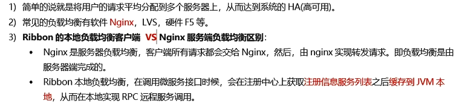

**集中式LB**：

即在服务的消费方和提供方之间使用独立的LB设备（可以是硬件，如F5，也可以是软件，如Nginx），由该设备负责把访问的清求通过某种策略转发至服务的提供方。

**进程内LB**：

将LB的逻辑集成到消费方，消费方从服务注册中心获取有哪些地址可用，然后自己再从这些地址中选择合适的服务器。

Ribbon就属于==进程内LB==，他只是一个类库，集成于消费方，消费方通过它来获取服务提供方的地址。

Ribbon：**<font color="red">负载均衡+RestTemplate调用</font>**，它自带一些常用的负载均衡策略。

架构图如下：

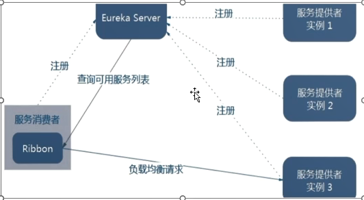

>ribbon工作时分为两步：
>
>1.先选择Eureka Server 它优先选择在同一区域内负载较少的Sever
>
>2.在根据用户指定的策略，再从Server获取到的服务注册列表中的选择一个地址，其中Ribbon提供了多种策略：轮询、随机和根据响应时间加权的等

需要注意的时，Ribbon已经集成在Eureka内的：

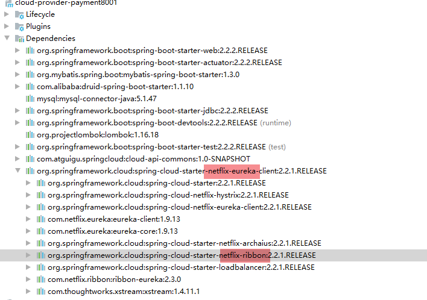

### 5.2 使用⭐🐏

我们考虑如何修改Ribbon的默认负载均衡策略：

Ribbon提供了一个核心的策略接口：==IRule==

~~~java
//
// Source code recreated from a .class file by IntelliJ IDEA
// (powered by Fernflower decompiler)
//

package com.netflix.loadbalancer;

public interface IRule {
    Server choose(Object var1);

    void setLoadBalancer(ILoadBalancer var1);

    ILoadBalancer getLoadBalancer();
}
~~~

其继承关系如下：

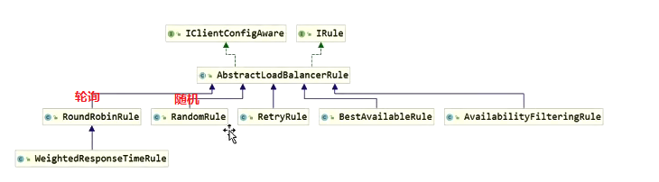

- 1.**RoundRobinRule:轮询**，这是默认策略
- 2.**RandomRule:随机**
- 3.**RetryRule**:先按照RoundRobinRule的策略获取服务，如果获取的服务失败，则再指定的时间内进行重试，获取可用的服务
- 4.**WeightedResponseTimeRule**:对RoundRobinRule的拓展，响应速度越快的实例选择权重越大，越容易被选中。
- 5.**BestAvailableRule**:会优先过滤掉由于多次访问故障而处于断路器跳闸状态的服务，然后选择一个并发量最小的服务。
- 6.**AvailabilityFilteringRule**:会先过滤掉故障实例，在选择并发量较小的实例
- 7.**ZoneAvoidanceRule**:默认规则，复合判断Server送在区域的性能和server的可用性选择服务器

替换策略步骤如下：

**1.新建一个包**

>这个自定义的配置类不能放在@ComponentScan所扫描的当前包和子包下，否则我们自定义的这个配置类机会被所有的Ribbon客户端所共享，达不到特殊定制化的目的。

包名：**com.atguigu.myrule**

**2,新建一个自定义的负载均衡策略类**

~~~java
package com.atguigu.myrule;

import com.netflix.loadbalancer.IRule;
import com.netflix.loadbalancer.RandomRule;
import org.springframework.context.annotation.Bean;
import org.springframework.context.annotation.Configuration;

@Configuration
public class MySelfRule {
    @Bean
    public IRule getRule(){
        return new RandomRule();// 定义为随机策略
    }

}
~~~

**3，在启动类上进行策略绑定，需要用@RibbonClient注解**

==**需要注意的是，@LoadBalanced ： 开启RestTemplate远程调用微服务的负载均衡，这个注解仍然需要使用，只是从默认策略化成我们转变的策略。**==

==@RibbonClient：只有在你需要改变默认策略的时候需要显示指定，其他情况下可以不写这个注解。==

~~~java
package com.atguigu.springcloud;


import com.atguigu.myrule.MySelfRule;
import org.springframework.boot.SpringApplication;
import org.springframework.boot.autoconfigure.SpringBootApplication;
import org.springframework.cloud.netflix.eureka.EnableEurekaClient;
import org.springframework.cloud.netflix.ribbon.RibbonClient;

@SpringBootApplication
// name属性执行要调用的服务名，configuration指定自定义负载均衡策略配置类的class，从而达到修改默认规则的目的
@RibbonClient(name ="CLOUD-PAYMENT-SERVICE",configuration = MySelfRule.class)
@EnableEurekaClient
public class OrderMain80 {
    public static void main(String[] args) {
        SpringApplication.run(OrderMain80.class,args);
    }
}
~~~

为了验证我们的策略成功，我们可以将8001工程复制，多修改几份。详细的复制操作，可以看

E:\编程\尚硅谷\2019\05框架高级\05SpringCloud\19_尚硅谷_SpringCloud_案例_Ribbon_高清 720P.mp4

最终项目结构为：

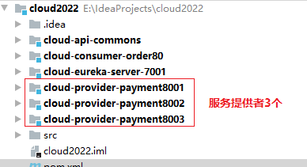

此时，我们启动项目，访问http://localhost:7001/，可以看到，服务提供者 **CLOUD-PAYMENT-SERVICE** 有三个：

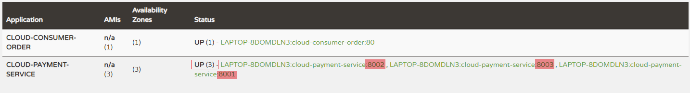

此时，通过80工程访问，就可以看到随机调用的实现啦。

### 5.3 Ribbon负载均衡算法

~~~java
List<ServiceInstance> instances = discoveryClient.getInstances("CLOUD-PAYMENT-SERVICE")
如：
    List[0] instances = 127.0.0.1:8001
    List[1] instances = 127.0.0.1:8002
~~~

此时，8001+8002组合为集群，他们共计为2台机器，集群总数为2，按照轮询算法原理为：

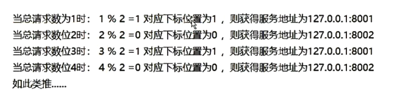

我们对Ribbon的负载均衡策略有了大概的了解以后，接下来我们考虑自己实现一个简单的负载均衡。

为此，我们需要对项目进行改造：

#### 5.3.1 修改原有3个服务提供者工程：

修改服务提供者8001、8002、8003工程的controller

增加一个方法：

~~~java
 @GetMapping("/payment/lb")
    public String getPaymentLB(){
        return port;
    }
~~~

~~~java
package com.atguigu.springcloud.controller;

import com.atguigu.springcloud.entity.CommonResult;
import com.atguigu.springcloud.entity.Payment;
import com.atguigu.springcloud.service.PaymentService;
import lombok.extern.slf4j.Slf4j;
import org.springframework.beans.factory.annotation.Autowired;
import org.springframework.beans.factory.annotation.Value;
import org.springframework.web.bind.annotation.*;

@RestController
@Slf4j
public class PaymentController {
    @Autowired
    private PaymentService paymentService;

    @Value("${server.port}")
    String port;// 本服务的端口

    @RequestMapping("/payment/create")
    // 可以在控制器方法的形参位置设置一个实体类类型的形参，此时若浏览器传输的请求参数的参数名和实体类中的属性名一致，那么请求参数就会为此属性赋值
    public CommonResult<Payment> create(@RequestBody Payment payment){
        try {
            int i = paymentService.create(payment);
            if(i==1){
                log.debug("保存成功-payment="+payment);
                return  new CommonResult(200,"保存成功",payment);
            }else{
                log.debug("保存失败");
                return new CommonResult(444,"保存失败");
            }
        } catch (Exception e) {
            log.debug("系统异常"+e.getMessage());
            e.printStackTrace();
            return new CommonResult(999,"系统异常");
        }

    }


    @RequestMapping("/payment/getPaymentById/{id}")
    public CommonResult<Payment> getPaymentById(@PathVariable("id") Long id){
        Payment payment = paymentService.getPaymentById(id);
        if(payment==null){
            log.debug("查询数据失败-id"+id);
            System.out.println(666);
            return new CommonResult<Payment>(404,"查询失败",null);
         }else{
            log.debug("查询数据成功+paymen="+payment);
            return new CommonResult<Payment>(200,"查询成功",payment);
       }
    }

    @GetMapping("/payment/lb")
    public String getPaymentLB(){
        return port;
    }
}

~~~

#### 5.3.2 去掉80消费者的@LoadBalanced注解

~~~java
package com.atguigu.springcloud.config;

import org.springframework.boot.SpringBootConfiguration;
import org.springframework.cloud.client.loadbalancer.LoadBalanced;
import org.springframework.context.annotation.Bean;
import org.springframework.web.client.RestTemplate;

@SpringBootConfiguration  // SprigBoot提供的，作用等价于@Configuraton
public class ApplicationContextConfig {

    // @LoadBalanced // 开启RestTemplate远程调用微服务的负载均衡，默认策略是轮询
    @Bean
    public RestTemplate restTemplate(){
        return new RestTemplate();
    }
}
~~~

#### 5.3.3 在消费端增加自定义策略处理类

~~~java
package com.atguigu.springcloud.lb;

import org.springframework.cloud.client.ServiceInstance;

import java.util.List;

// 自定义负载均衡策略：轮询
public interface LoadBalancer {
    // 收集服务器总共有多少台能供提t供服务的机器，并且放到List里面
    ServiceInstance instance(List<ServiceInstance> servoceInstances);
}

~~~

~~~java
package com.atguigu.springcloud.lb;

import org.springframework.cloud.client.ServiceInstance;
import org.springframework.stereotype.Component;

import java.util.List;
import java.util.concurrent.atomic.AtomicInteger;

@Component
public class MyLb  implements LoadBalancer{
    private AtomicInteger atomicInteger = new AtomicInteger(0);// 原子整形类，这个做加法是线程安全的！
    
    // 这个方法实现了负载均衡的算法，返回要调用的某个微服务实例
    @Override
    public ServiceInstance instance(List<ServiceInstance> servoceInstances) { // 得到机器的列表
        int  index= getAndIncrement()%servoceInstances.size();//得到服务器的下标位置
        return servoceInstances.get(index);
    }


    private final int getAndIncrement(){
        int current;
        int next;
        do{
            current  = this.atomicInteger.get();
            next = current>=2147483647?0:current+1;// Integer.MAX_VALUE
        }while(!this.atomicInteger.compareAndSet(current,next));// 第一个参数是期望值，第二个参数是修改值
        System.out.println("******第几次访问，次数next："+next);
        return next;
    }
}
~~~

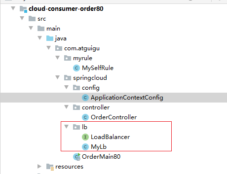

#### 5.3.4 对80消费端的controller进行改造

~~~java
package com.atguigu.springcloud.controller;

import com.atguigu.springcloud.entity.CommonResult;
import com.atguigu.springcloud.entity.Payment;
import com.atguigu.springcloud.lb.LoadBalancer;
import org.springframework.beans.factory.annotation.Autowired;
import org.springframework.cloud.client.ServiceInstance;
import org.springframework.cloud.client.discovery.DiscoveryClient;
import org.springframework.web.bind.annotation.*;
import org.springframework.web.client.RestTemplate;

import javax.annotation.Resource;
import java.net.URI;
import java.util.List;

/**
 * 消费者：订单微服务
 * 1.我们是消费者，不与数据库打交道
 * 2.如果需要跳转页面，就使用@Controller注解，否则，全部请求采用异步，返回json
 */
@RestController
public class OrderController {
    // String URL="http://localhost:8001";
    // 由于现在是通过获取注册中心中的服务注册列表去调用列表中的服务，故不能用硬编码
    String URL = "http://CLOUD-PAYMENT-SERVICE";// 将IP地址改为提供服务的微服务的服务名

    @Autowired
    private RestTemplate restTemplate;

    @RequestMapping("/customer/payment/getPaymentById/{id}")//被浏览器调用
    public CommonResult<Payment> getPaymentById(@PathVariable("id") Long id){
        CommonResult<Payment> object = restTemplate.getForObject(URL + "/payment/getPaymentById/" + id, CommonResult.class);
        return object;
    }

    @PostMapping("/customer/payment/create")
    public CommonResult<Payment> create(Payment payment){
       return  restTemplate.postForObject(URL + "/payment/create", payment, CommonResult.class);
    }
    
    
    
    
    
    

    @Autowired
    private LoadBalancer loadBalancer;

    @Resource
    private DiscoveryClient discoveryClient;

    // 返回端口号，用于测试
    @GetMapping(value="/consumer/payment/lb")
    public String getPayMentLB(){
        List<ServiceInstance> instances = discoveryClient.getInstances("CLOUD-PAYMENT-SERVICE");
        if(instances ==null||instances.size()<=0){
            return null;
        }
        // 这个方法实现了负载均衡的算法，返回要调用的某个微服务实例
        ServiceInstance serviceInstance = loadBalancer.instance(instances);
        URI uri = serviceInstance.getUri();
        return restTemplate.getForObject(uri+"/payment/lb",String.class);
    }
}
~~~

## 6.服务接口调用OpenFeign⭐🐏

Feign是一个声明式的web服务客户端。让编写web服务客户端变得非常容易，只需要创建一个接口并且在接口上添加注解即可。**<font color="red">OpenFeign:基于接口的编程方式，用于远程调用的</font>**

SpringCloud对Feigin进行了封装，使其支持了SpringMVC标准注解和HttpMessageConverts.Feign可以与Eureka和Ribbon组合使用以支持负载均衡。

说白了，原来我们是使用ribbon+restTemplate去调用服务。现在我们也可以换种方式，用Feign去调用服务，且Feign也支持Ribbon的负载均衡。==OpenFeign集成了Ribbon==。==**OpenFeign是一个远程调用的客户端组件。**==

### 6.1 Feign的入门使用⭐🐏

Feign的使用步骤：

>- 1.导入依赖
>- 2.在主启动类添加@EnableFeignClients   // 启用OpenFeign远程调用功能
>- 3.编写Service接口，接口添加注解：@FeignClient，里面写要调用的服务名。需要注意的是，service接口中的方法要与**远程Controller的方法声明保持一致，不能乱写！**
>- 4.在controller对Feign接口进行注入

我们创建一个新的子工程：**cloud-consumer-feign-order80**用于演示OpenFeign的用法

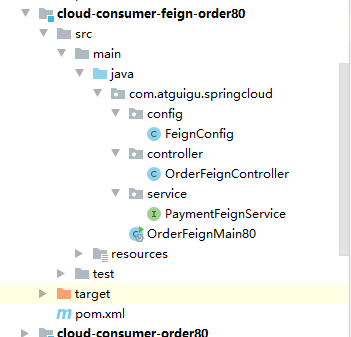

~~~xml
<?xml version="1.0" encoding="UTF-8"?>
<project xmlns="http://maven.apache.org/POM/4.0.0"
         xmlns:xsi="http://www.w3.org/2001/XMLSchema-instance"
         xsi:schemaLocation="http://maven.apache.org/POM/4.0.0 http://maven.apache.org/xsd/maven-4.0.0.xsd">
    <parent>
        <artifactId>cloud2022</artifactId>
        <groupId>com.atguigu.springcloud</groupId>
        <version>1.0-SNAPSHOT</version>
    </parent>
    <modelVersion>4.0.0</modelVersion>

    <artifactId>cloud-consumer-feign-order80</artifactId>

    <dependencies>
        
        <!--OpenFeign:基于接口的编程方式，用于远程调用的！ -->
        <dependency>
            <groupId>org.springframework.cloud</groupId>
            <artifactId>spring-cloud-starter-openfeign</artifactId>
        </dependency>
        <!--依赖Eureka客户端，即当前的微服务对于Eureka Server来讲，我们是客户端 -->
        <dependency>
            <groupId>org.springframework.cloud</groupId>
            <artifactId>spring-cloud-starter-netflix-eureka-client</artifactId>
        </dependency>
        
        
        <dependency>
            <groupId>org.springframework.boot</groupId>
            <artifactId>spring-boot-starter-web</artifactId>
        </dependency>
        <!--健康监控 -->
        <dependency>
            <groupId>org.springframework.boot</groupId>
            <artifactId>spring-boot-starter-actuator</artifactId>
        </dependency>
        <!--热部署 -->
        <dependency>
            <groupId>org.springframework.boot</groupId>
            <artifactId>spring-boot-devtools</artifactId>
            <scope>runtime</scope>
            <optional>true</optional>
        </dependency>
        <dependency>
            <groupId>org.projectlombok</groupId>
            <artifactId>lombok</artifactId>
            <optional>true</optional>
        </dependency>
        <dependency>
            <groupId>org.springframework.boot</groupId>
            <artifactId>spring-boot-starter-test</artifactId>
            <scope>test</scope>
        </dependency>
        <dependency>
            <artifactId>cloud-api-commons</artifactId>
            <groupId>com.atguigu.springcloud</groupId>
            <version>1.0-SNAPSHOT</version>
        </dependency>
    </dependencies>

</project>
~~~

**主配置文件application.yml**

~~~yaml
server:
  port: 80
spring:
  application:
    name: cloud-consuner-feign-order80
eureka:
  client:
    fetch-registry: true
    service-url:
     # 这里代表要注册到的注册中心的地址，多个地址之间用,隔开
      defaultZone: http://localhost:7001/eureka
    register-with-eureka: true
~~~

**主启动类**

>@EnableFeignClients   // 启用OpenFeign远程调用功能

~~~java
package com.atguigu.springcloud;

import org.springframework.boot.SpringApplication;
import org.springframework.boot.autoconfigure.SpringBootApplication;
import org.springframework.cloud.netflix.eureka.EnableEurekaClient;
import org.springframework.cloud.openfeign.EnableFeignClients;
import org.springframework.cloud.openfeign.FeignClient;

@SpringBootApplication
@EnableEurekaClient
@EnableFeignClients   // 启用OpenFeign远程调用功能
public class OrderFeignMain80 {
    public static void main(String[] args) {
        SpringApplication.run(OrderFeignMain80.class,args);
    }
}

~~~

**调用服务的业务类的编写**

**service层**

我们新建一个service包，在service包下新建一个**接口**PaymentFeignService，

注意：里面的方法不能随意申明。

~~~java
package com.atguigu.springcloud.service;

import com.atguigu.springcloud.entity.CommonResult;
import com.atguigu.springcloud.entity.Payment;
import org.springframework.cloud.openfeign.FeignClient;
import org.springframework.stereotype.Component;
import org.springframework.web.bind.annotation.PathVariable;
import org.springframework.web.bind.annotation.RequestBody;
import org.springframework.web.bind.annotation.RequestMapping;

/**
 * 此时客户端，也就是调用其他微服务的微服务的service层，定义注解，注解上加上注解：@FeignClient
 * 1.里面的value就是要调用的微服务在Eureka上显示的应用名
 * 2.这个接口的方法声明，需要与远程微服务controller方法的声明保持一致。
 * 3.这个service接口没有实现类，底层是通过代理实现接口的
 */
@Component
@FeignClient("CLOUD-PAYMENT-SERVICE")
public interface PaymentFeignService {
    @RequestMapping("/payment/getPaymentById/{id}")
    public CommonResult<Payment> getPaymentById(@PathVariable("id") Long id);


    @RequestMapping("/payment/create")
    // 可以在控制器方法的形参位置设置一个实体类类型的形参，此时若浏览器传输的请求参数的参数名和实体类中的属性名一致，那么请求参数就会为此属性赋值
    public CommonResult<Payment> create(@RequestBody Payment payment);
}

~~~

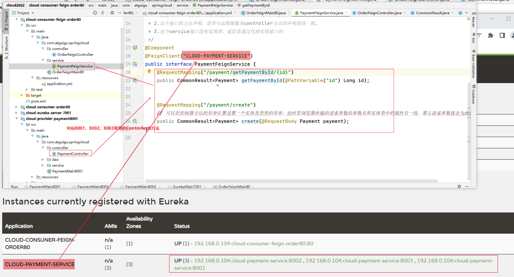

**controller层**

>负责注入service层的Feign接口，调用Service的方法

~~~java
package com.atguigu.springcloud.controller;

import com.atguigu.springcloud.entity.CommonResult;
import com.atguigu.springcloud.entity.Payment;
import com.atguigu.springcloud.service.PaymentFeignService;
import org.springframework.beans.factory.annotation.Autowired;
import org.springframework.web.bind.annotation.PathVariable;
import org.springframework.web.bind.annotation.RequestMapping;
import org.springframework.web.bind.annotation.RestController;

@RestController
public class OrderFeignController {

    @Autowired
    private PaymentFeignService paymentFeignService;// 原来是注入RestTemplate对象，现在是将Feign的接口Service注入进来，符合面向接口编程！

    @RequestMapping("/customer/payment/getPaymentById/{id}")
    public CommonResult<Payment> getPaymentById(@PathVariable("id") Long id){
       return paymentFeignService.getPaymentById(id);
    }
}

~~~

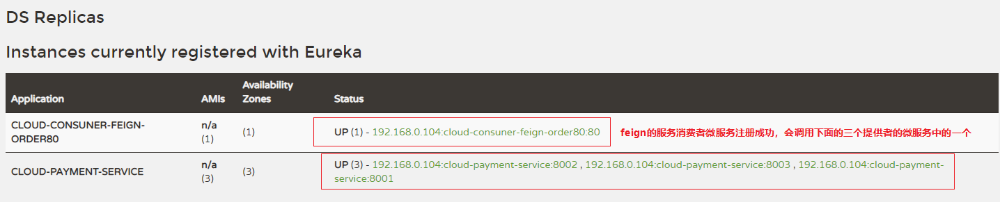

此时我们调用服务提供者，可以看到：

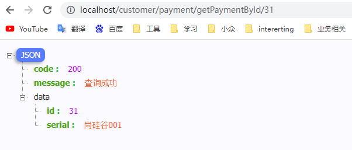

总结：**feign的用法**：

- service层定义成接口，加@FeignClient，内部接口的方法声明，需要与远程微服务controller方法的声明保持一致
- controller对service对象进行注入
- 主启动类上加上注解@EnableFeignClients   // 启用OpenFeign远程调用功能

### 6.2 OpenFeign_超时⭐

演示openFeign的超时作用，我们可以在8001、8002、8003服务提供者的controller上增加一个方法，让80消费者去调用这个方法

**服务提供者代码编写**

~~~java
  @GetMapping("/payment/feign/timeout")
    public String paymentFeignTimeout(){
        try{
            TimeUnit.SECONDS.sleep(3); //休眠3秒
        }catch (Exception e){
            e.printStackTrace();
        }
        return port;
    }
~~~

**服务消费方**

**service获取提供方的方法声明**

~~~java
package com.atguigu.springcloud.service;

import com.atguigu.springcloud.entity.CommonResult;
import com.atguigu.springcloud.entity.Payment;
import org.springframework.cloud.openfeign.FeignClient;
import org.springframework.stereotype.Component;
import org.springframework.web.bind.annotation.GetMapping;
import org.springframework.web.bind.annotation.PathVariable;
import org.springframework.web.bind.annotation.RequestBody;
import org.springframework.web.bind.annotation.RequestMapping;

/**
 * 此时客户端，也就是调用其他微服务的微服务的service层，定义注解，注解上加上注解：@FeignClient
 * 1.里面的value就是要调用的微服务在Eureka上显示的应用名
 * 2.这个接口的方法声明，需要与远程微服务controller方法的声明保持一致。
 * 3.这个service接口没有实现类，底层是通过代理实现接口的
 */
@Component
@FeignClient("CLOUD-PAYMENT-SERVICE")
public interface PaymentFeignService {
    @RequestMapping("/payment/getPaymentById/{id}")
    public CommonResult<Payment> getPaymentById(@PathVariable("id") Long id);


    @RequestMapping("/payment/create")
    // 可以在控制器方法的形参位置设置一个实体类类型的形参，此时若浏览器传输的请求参数的参数名和实体类中的属性名一致，那么请求参数就会为此属性赋值
    public CommonResult<Payment> create(@RequestBody Payment payment);

    @GetMapping("/payment/feign/timeout")
    public String paymentFeignTimeout();
}
~~~

**controller进行方法调用**

~~~java
package com.atguigu.springcloud.controller;

import com.atguigu.springcloud.entity.CommonResult;
import com.atguigu.springcloud.entity.Payment;
import com.atguigu.springcloud.service.PaymentFeignService;
import org.springframework.beans.factory.annotation.Autowired;
import org.springframework.web.bind.annotation.PathVariable;
import org.springframework.web.bind.annotation.RequestMapping;
import org.springframework.web.bind.annotation.RestController;

@RestController
public class OrderFeignController {

    @Autowired
    private PaymentFeignService paymentFeignService;// 原来是注入RestTemplate对象，现在是将Feign的接口Service注入进来，符合面向接口编程！

    @RequestMapping("/customer/payment/getPaymentById/{id}")
    public CommonResult<Payment> getPaymentById(@PathVariable("id") Long id){
       return paymentFeignService.getPaymentById(id);
    }

    @RequestMapping("/customer/payment/feign/timeout")
    public String paymentFeignTimeout(){
        return paymentFeignService.paymentFeignTimeout();
    }
}

~~~

执行以后我们发现服务器返回错误信息：

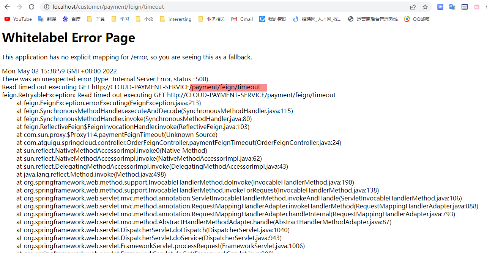

这时由于<font color="red">Feign</font>默认是1秒就返回信息，而我们休眠了3秒，故Feifn直接返回错误信息啦。

==我们可以修改Feign的超时时间控制，也就是Ribbon的超时时间控制，因为Feign集成了Ribbon进行负载均衡==

我们在yml配置文件中修改即可：

~~~yaml
server:
  port: 80
spring:
  application:
    name: cloud-consuner-feign-order80
eureka:
  client:
    fetch-registry: true
    service-url:
      defaultZone: http://localhost:7001/eureka
    register-with-eureka: true

#设置Feign客户端的超时时间（OpenFeign默认支持Ribbon）
ribbon:
  # 指的是建立连接所用的时间，适用于网络状况正常的i情况下，两端连接所用的时间
  ReadTimeout: 5000
  # 指的是建立连接以后从服务器读取到可用资源所用的时间
  ConnecTimeout: 5000
~~~

#### 6.2.1Feign的重试

Feign是存在==重试机制==的。也就是当前请求调用没有在规定的时间内返回结果。会再次调用一次。

如果80调用8001，且重试了8001仍然没有返回结果，此时80会继续调用8002，也就是继续重试集群的下一台服务器。如果调用8002仍然没有响应，此时会重试8002.。。。。

第一次请求和第二次请求的结果是一致的，此时是==幂等==的，这时**才允许重试**。

⼀、 Feign设置超时时间 
使⽤Feign调⽤接⼝分两层，ribbon的调⽤和hystrix的调⽤，所以ribbon的超时时间和Hystrix的超时时间的结合就是Feign的超时时间

~~~yaml
#hystrix的超时时间
hystrix:
    command:
        default:
            execution:
              timeout:
                enabled: true
              isolation:
                    thread:
                        timeoutInMilliseconds: 9000
#ribbon的超时时间
ribbon:
  ReadTimeout: 3000
  ConnectTimeout: 3000
~~~

⼀般情况下 都是 ribbon 的超时时间（<）hystrix的超时时间（因为涉及到ribbon的重试机制） 
因为ribbon的重试机制和Feign的重试机制有冲突，所以源码中默认关闭Feign的重试机制，源码如下 要开启Feign的重试机制如下：

~~~java
@Bean Retryer feignRetryer() {
        return  new Retryer.Default();
}
~~~

不过我们一般不开启Feign的重试机制。也就是一般设置为==**Retryer.NEVER_RETRY。**==

#### 6.2.2 Ribbon的重试

ribbon的重试机制实际上就是多个Feign对每台机的重试的和。
设置重试次数：bash

```yaml
ribbon:
  ReadTimeout: 3000
  ConnectTimeout: 3000
  MaxAutoRetries: 1 #同一台实例最大重试次数,不包括首次调用
  MaxAutoRetriesNextServer: 1 #重试负载均衡其余的实例最大重试次数,不包括首次调用
  OkToRetryOnAllOperations: true  #是否全部操做都重试 
```

根据上面的参数计算重试的次数：MaxAutoRetries+MaxAutoRetriesNextServer+(MaxAutoRetries *MaxAutoRetriesNextServer) 即重试3次 则一共产生4次调用
若是在重试期间，时间超过了hystrix的超时时间，便会当即执行熔断**fallback**。因此要根据上面配置的参数计算hystrix的超时时间，使得在重试期间不能达到hystrix的超时时间，否则重试机制就会没有意义
hystrix超时时间的计算： (1 + MaxAutoRetries + MaxAutoRetriesNextServer) * ReadTimeout 即按照以上的配置 hystrix的超时时间应该配置为 （1+1+1）*3=9秒服务器

- 当ribbon超时后且hystrix没有超时，便会采起重试机制。

- 当OkToRetryOnAllOperations设置为false时，只会对get请求进行重试。

- 若是设置为true，便会对全部的请求进行重试。

若是put或post等写操做，若是服务器接口没作幂等性，会产生很差的结果，因此OkToRetryOnAllOperations慎用。负载均衡，若是不配置ribbon的重试次数，默认会重试一次。
注意：
**默认状况下,GET方式请求不管是链接异常仍是读取异常,都会进行重试，非GET方式请求,只有链接异常时,才会进行重试**

### 6.3 OpenFeign_日志

Feign提供了日志打印功能，我们可以通过配置来调整日志级别，从而了解Feign对Http请求的细节。说白了就是对Feign接口的调用情况进行监控和输出。

- **日志级别**

NONE：默认的，不显示任何日志

BASIC：仅记录请求方法，RUL、响应状态码及执行时间

HEADERS：除了BASIC重定义的信息外，还有请求和响应的头信息

FULL：除了HEADERS中定义的信息外，还有请求和响应的正文还有元数据

- **日志配置**

我们需要先写一个日志配置类，返回日志级别，**注意需要将返回的bean交给Spring管理**

~~~java
package com.atguigu.springcloud.config;

import feign.Logger;
import org.springframework.boot.SpringBootConfiguration;
import org.springframework.context.annotation.Bean;

// 设置OpenFeign的远程调用的日志的打印级别
@SpringBootConfiguration
public class FeignConfig {
    @Bean
    public Logger.Level feignLoggerLevel(){
        return Logger.Level.FULL;
    }
}
~~~

然后修改全局主配置文件

~~~yaml
server:
  port: 80
spring:
  application:
    name: cloud-consuner-feign-order80
eureka:
  client:
    fetch-registry: true
    service-url:
      defaultZone: http://localhost:7001/eureka
    register-with-eureka: true

#设置Feign客户端的超时时间
ribbon:
  # 指的是建立连接所用的时间，适用于网络状况正常的i情况下，两端连接所用的时间
  ReadTimeout: 5000
  # 指的是建立连接以后从服务器读取到可用资源所用的时间
  ConnecTimeout: 5000

# 指定监控的接口，以及日志级别
logging:
  level:
    com.atguigu.springcloud.service.PaymentFeignService: debug
~~~

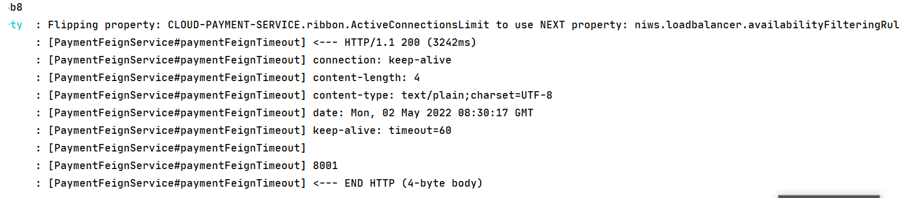

## 7.熔断器Hystrix⭐🐏

分布式系统面临的主要问题：

在复杂的分布式体系结构中的应用程序有数十个依赖关系，每一个依赖关系在某些时候将不可避免的失败。

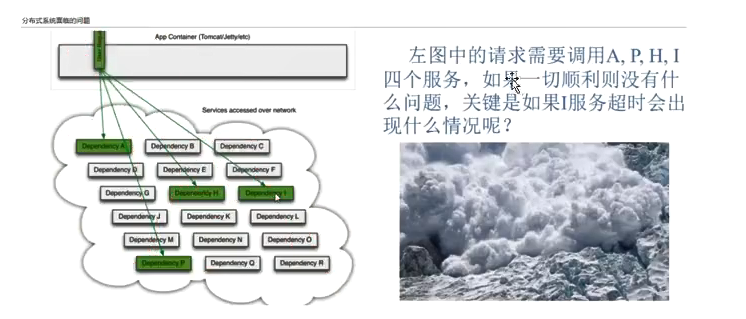

**服务雪崩**

多个微服务之间调用时，假如微服务A调用微服务B和微服务C，微服务B和微服务C又调用其他的微服务，这就是所谓的“**扇出**”。

如果扇出的链路上某个微服务的调用响应的时间过程或者不可用，对微服务A的调用就会占用越来越多的系统资源，进而引起系统的崩溃，所谓的“雪崩效应”。

对于高流量的应用来说，单一的后端依赖可能导致所有的服务器上的所有资源都在几秒钟内饱和。比失败更糟糕的是，这些应用程序还可能导致服务之间的延迟增加，备份队列，线程和其他资源紧张，导致整个系统发生更多的级联故障。这些都需要对故障和延迟进行隔离和管理，以便单一依赖关系的失败，不能取消整个应用程序或者系统。

**Hystrix**是一个用于处理分布式系统的**延迟**和**容错**的开源库，在分布式系统中，许多依赖不可避免的会调用失败，比如超时，异常等。

**Hystrix**能够保证在一个依赖出问题的情况下，不会导致整体服务失败，避免级联故障，以提高分布式系统的稳定性。

“断路器”本身是一种开关设置，当某个服务单元发生故障以后，通过断路器的故障监控（类似熔断保险丝），==向调用方返回一个符合预期的，可处理的备选响应（FallBack），而不是长时间的等待或者抛出调用方无法处理的异常==，这样就保证了服务调用方的线程不会长时间、不必要的占用，从而避免了故障在分布式系统中的蔓延，乃至雪崩。

Hystrix可以做服务降级，服务熔断，服务的实时监控等功能！！！！

### 7.1 Hystrix重要概念

#### 7.1.1 服务降级Fallback

服务器忙，请稍后再试，不让服务器等待并且立刻返回一个友好提示

==哪些情况下会触发降级==：

- **<font color="red">程序运行异常</font>**
- **<font color="red">超时自动降级</font>**
- 服务熔断触发服务降级
- 线程池、信号量打满也会导致服务降级
- 人工降级

#### 7.1.2 服务熔断 Breaker

类比保险丝达到最大服务访问以后，直接拒绝访问，拉闸限电，然后调用服务降级的方法并且返回友好提示

就是保险丝。一般来说，会有如下过程：服务的降级-》服务的熔断-》恢复调用链路。

#### 7.1.3 服务限流FlowLimit

秒杀高并发德国操作，严禁一窝蜂的过来拥挤，大家排队，一秒钟N个，有序进行。

### 7.2 Hystrix案例

#### 7.2.1 创建基础案例

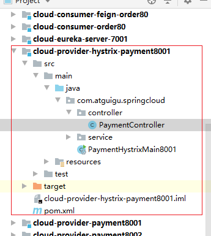

新建cloud-provider-hystrix-payment8001子工程，后续关于所有的Hystrix案例都基于此子工程。

**pom.xml**

~~~xml
<?xml version="1.0" encoding="UTF-8"?>
<project xmlns="http://maven.apache.org/POM/4.0.0"
         xmlns:xsi="http://www.w3.org/2001/XMLSchema-instance"
         xsi:schemaLocation="http://maven.apache.org/POM/4.0.0 http://maven.apache.org/xsd/maven-4.0.0.xsd">
    <parent>
        <artifactId>cloud2022</artifactId>
        <groupId>com.atguigu.springcloud</groupId>
        <version>1.0-SNAPSHOT</version>
    </parent>
    <modelVersion>4.0.0</modelVersion>

    <artifactId>cloud-provider-hystrix-payment8001</artifactId>

    <dependencies>
        <!--新增Hystrix熔断器 -->
        <dependency>
            <groupId>org.springframework.cloud</groupId>
            <artifactId>spring-cloud-starter-netflix-hystrix</artifactId>
        </dependency>
        <!--依赖Eureka客户端，即当前的微服务对于Eureka Server来讲，我们是客户端 -->
        <dependency>
            <groupId>org.springframework.cloud</groupId>
            <artifactId>spring-cloud-starter-netflix-eureka-client</artifactId>
        </dependency>
        <dependency>
            <groupId>org.springframework.boot</groupId>
            <artifactId>spring-boot-devtools</artifactId>
            <scope>runtime</scope>
            <optional>true</optional>
        </dependency>
        <dependency>
            <groupId>org.projectlombok</groupId>
            <artifactId>lombok</artifactId>
            <optional>true</optional>
        </dependency>
        <dependency>
            <groupId>org.springframework.boot</groupId>
            <artifactId>spring-boot-starter-test</artifactId>
            <scope>test</scope>
        </dependency>
        <dependency>
            <groupId>org.springframework.boot</groupId>
            <artifactId>spring-boot-starter-web</artifactId>
        </dependency>
        <dependency>
            <artifactId>cloud-api-commons</artifactId>
            <groupId>com.atguigu.springcloud</groupId>
            <version>1.0-SNAPSHOT</version>
        </dependency>
    </dependencies>

</project>
~~~

**全局配置文件**

~~~yaml
server:
  port: 8001

spring:
  application:
    name: cloud-hystrix-payment-service

eureka:
  client:
    register-with-eureka: true
    fetch-registry: true
    service-url:
      defaultZone: http://localhost:7001/eureka

~~~

**启动类**

~~~java
package com.atguigu.springcloud;


import org.springframework.boot.SpringApplication;
import org.springframework.boot.autoconfigure.SpringBootApplication;
import org.springframework.cloud.netflix.eureka.EnableEurekaClient;

@SpringBootApplication
@EnableEurekaClient
public class PaymentHystrixMain8001 {
    public static void main(String[] args) {
        SpringApplication.run(PaymentHystrixMain8001.class,args);
    }
}

~~~

**service**

~~~java
package com.atguigu.springcloud.service;

public interface PaymentService {
    public String paymentInfo_OK(Integer id);
    public String payment_Timeout(Integer id);
}
~~~

~~~java
package com.atguigu.springcloud.service;

import org.springframework.stereotype.Service;

import java.util.concurrent.TimeUnit;

@Service
public class PaymentServiceImpl  implements  PaymentService{
    @Override
    // 成功    这个方法模拟正常情况
    public String paymentInfo_OK(Integer id) {
        return "线程池"+Thread.currentThread().getName()+" paymentInfo_Ok,id: "+id+"\t"+"哈哈哈";
    }


    @Override
    // 失败   这个方法来模拟超时情况
    public String payment_Timeout(Integer id) {
        int  timeNumber = 3;
        try{
            TimeUnit.SECONDS.sleep(timeNumber);
        }catch(Exception e){
            e.printStackTrace();
        }
        return "线程池"+Thread.currentThread().getName()+" paymentInfo_TimeOut,id: "+id+"\t"+"呜呜呜";
    }
}
~~~

**controller**

~~~java
package com.atguigu.springcloud.controller;

import com.atguigu.springcloud.service.PaymentService;
import lombok.extern.slf4j.Slf4j;
import org.springframework.beans.factory.annotation.Autowired;
import org.springframework.beans.factory.annotation.Value;
import org.springframework.web.bind.annotation.GetMapping;
import org.springframework.web.bind.annotation.PathVariable;
import org.springframework.web.bind.annotation.RestController;


@RestController
@Slf4j
public class PaymentController {
    @Autowired
    private PaymentService paymentService;

    @Value("${server.port}")
    private String servicePort;


    @GetMapping("/payment/hystrix/ok/{id}")
    public String paymentInfo_OK(@PathVariable("id") Integer id){
        String result = paymentService.paymentInfo_OK(id);
        log.info("*******result:"+result);
        return result;
    }


    @GetMapping("/payment/hystrix/timeout/{id}")
    public String paymentInfo_Timeout(@PathVariable("id") Integer id){
        String result = paymentService.payment_Timeout(id);
        log.info("*******result:"+result);
        return result;
    }
}
~~~

直接访问路径：http://localhost:8001/payment/hystrix/timeout/8、http://localhost:8001/payment/hystrix/ok/10

可以看到正常调用，则环境搭建完毕

#### 7.2.2 使用Jmeter对Hystrix8001进行压力测试

我们在上述工程的controller中创建了两个请求方法，其中一个是休眠方法，当我们不停的访问这个休眠方法的时候，就会拖慢访问正常的OK的方法的响应速度。

我们采用jmeter工具来模拟压测。

jmeter官网：https://jmeter.apache.org/download_jmeter.cgi

我们开启Jmeter，来20000个并发，压测8001的payment_Timeout服务，我们看此时我们访问payment_Ok服务会不会变慢。

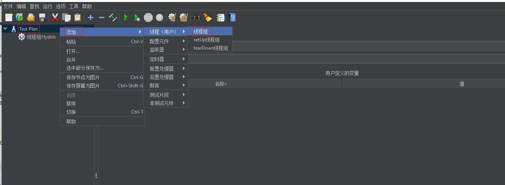

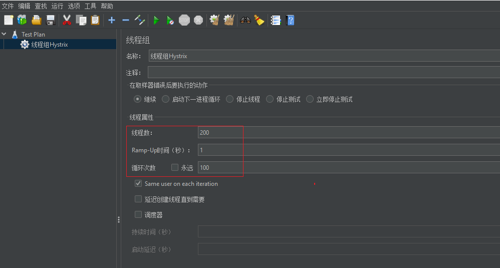

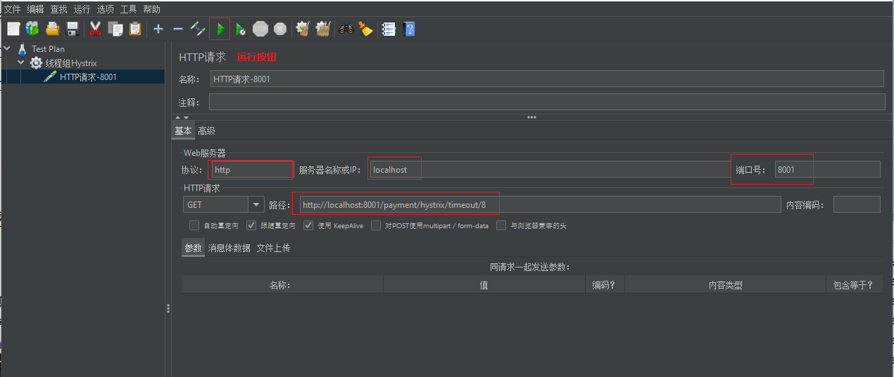

通过压力测试可以看到，此时访问OK也会转圈圈！这是由于大量的timeOut请求占据服务器的线程，使之得不到有效释放，导致原本快速响应的ok请求也受到影响。

#### 7.2.3 创建新的消费微服务80工程

我们刚才是直接对8001服务端进行了压测，现在我们创建cloud-consumer-feign-hystrix-order80子工程

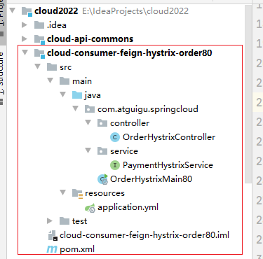


**pom.xml**

~~~xml
<?xml version="1.0" encoding="UTF-8"?>
<project xmlns="http://maven.apache.org/POM/4.0.0"
         xmlns:xsi="http://www.w3.org/2001/XMLSchema-instance"
         xsi:schemaLocation="http://maven.apache.org/POM/4.0.0 http://maven.apache.org/xsd/maven-4.0.0.xsd">
    <parent>
        <artifactId>cloud2022</artifactId>
        <groupId>com.atguigu.springcloud</groupId>
        <version>1.0-SNAPSHOT</version>
    </parent>
    <modelVersion>4.0.0</modelVersion>

    <artifactId>cloud-consumer-feign-hystrix-order80</artifactId>
    <dependencies>
        <!--新增Hystrix熔断器 -->
        <dependency>
            <groupId>org.springframework.cloud</groupId>
            <artifactId>spring-cloud-starter-netflix-hystrix</artifactId>
        </dependency>
        <!--OpenFeign:基于接口的编程方式，用于远程调用的！ -->
        <dependency>
            <groupId>org.springframework.cloud</groupId>
            <artifactId>spring-cloud-starter-openfeign</artifactId>
        </dependency>
        <!--依赖Eureka客户端，即当前的微服务对于Eureka Server来讲，我们是客户端 -->
        <dependency>
            <groupId>org.springframework.cloud</groupId>
            <artifactId>spring-cloud-starter-netflix-eureka-client</artifactId>
        </dependency>
        <dependency>
            <groupId>org.springframework.boot</groupId>
            <artifactId>spring-boot-starter-web</artifactId>
        </dependency>
        <!--健康监控 -->
        <dependency>
            <groupId>org.springframework.boot</groupId>
            <artifactId>spring-boot-starter-actuator</artifactId>
        </dependency>
        <!--热部署 -->
        <dependency>
            <groupId>org.springframework.boot</groupId>
            <artifactId>spring-boot-devtools</artifactId>
            <scope>runtime</scope>
            <optional>true</optional>
        </dependency>
        <dependency>
            <groupId>org.projectlombok</groupId>
            <artifactId>lombok</artifactId>
            <optional>true</optional>
        </dependency>
        <dependency>
            <groupId>org.springframework.boot</groupId>
            <artifactId>spring-boot-starter-test</artifactId>
            <scope>test</scope>
        </dependency>
        <dependency>
            <artifactId>cloud-api-commons</artifactId>
            <groupId>com.atguigu.springcloud</groupId>
            <version>1.0-SNAPSHOT</version>
        </dependency>
    </dependencies>

</project>
~~~

**application,yml**

~~~yaml
server:
  port: 80

spring:
  application:
    name: cloud-consumer-feign-hystrix-payment-service

eureka:
  client:
    register-with-eureka: true
    fetch-registry: true
    service-url:
      defaultZone: http://localhost:7001/eureka

~~~

**主启动类**

~~~java
package com.atguigu.springcloud;

import org.springframework.boot.SpringApplication;
import org.springframework.boot.autoconfigure.SpringBootApplication;
import org.springframework.cloud.netflix.eureka.EnableEurekaClient;
import org.springframework.cloud.openfeign.EnableFeignClients;

@SpringBootApplication
@EnableEurekaClient
@EnableFeignClients
public class OrderHystrixMain80 {
    public static void main(String[] args) {
        SpringApplication.run(OrderHystrixMain80.class,args);
    }
}
~~~

**service接口**

由于我们是使用feign远程调用的，故Service层写接口即可

~~~java
package com.atguigu.springcloud.service;

import org.springframework.cloud.openfeign.FeignClient;
import org.springframework.web.bind.annotation.GetMapping;
import org.springframework.web.bind.annotation.PathVariable;

@FeignClient("cloud-hystrix-payment-service")
public interface PaymentHystrixService {
    @GetMapping("/payment/hystrix/ok/{id}")
    public String paymentInfo_OK(@PathVariable("id") Integer id);


    @GetMapping("/payment/hystrix/timeout/{id}")
    public String paymentInfo_Timeout(@PathVariable("id") Integer id);
}

~~~

**controller**

~~~java
package com.atguigu.springcloud.controller;

import com.atguigu.springcloud.service.PaymentHystrixService;
import lombok.extern.slf4j.Slf4j;
import org.springframework.beans.factory.annotation.Autowired;
import org.springframework.web.bind.annotation.GetMapping;
import org.springframework.web.bind.annotation.PathVariable;
import org.springframework.web.bind.annotation.RestController;

@RestController
@Slf4j
public class OrderHystrixController {
    @Autowired
    private PaymentHystrixService paymentHystrixService;

    @GetMapping("/consumer/payment/hystrix/ok/{id}")
    public String paymentInfo_OK(@PathVariable("id") Integer id){
        String result = paymentHystrixService.paymentInfo_OK(id);
        log.info("*******result:"+result);
        return result;
    }


    @GetMapping("/consumer/payment/hystrix/timeout/{id}")
    public String paymentInfo_Timeout(@PathVariable("id") Integer id){
        String result = paymentHystrixService.paymentInfo_Timeout(id);
        log.info("*******result:"+result);
        return result;
    }

}

~~~

我们再压测8001服务端的同时，正常通过Hystrix80消费端去访问http://localhost/consumer/payment/hystrix/timeout/32.

发现此时80要么转圈圈，要么消费端报超时错误。

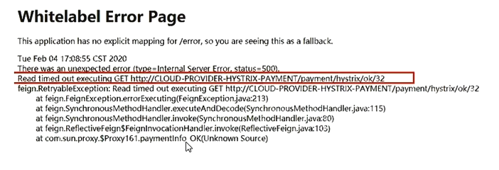

>原因：8001同一层次的其他接口服务被困死，因为tomcat线程里面的工作线程已经被挤占完毕。

### 7.3 Hystrix解决上述问题⭐🐏

超时导致服务器变慢-》超时不再等待

出错(当即或者程序运行出错)-》出错要有兜底

==**不管是消费者还是提供者都可以做Hystrix处理**==，<font color="red">超时或者出错有降级兜底结果</font>

****

#### 7.3.1服务降级⭐🐏

##### 7.3.1.1 cloud-provider-hystrix-payment8001服务提供方降级⭐🐏

我们在**8001服务提供方**这里这里要演示==@HystrixCommand==注解的作用。

思路：==设置自身调用超时时间的峰值，峰值内正常运行，超过了需要由兜底的方法处理，做服务降级。==

也就是假如设置超时时间峰值为5秒，休眠时间是3秒，此时是可以正常返回的；假如设置超时时间峰值为2秒，休眠时间是3秒，此时就需要返回兜底的结果。服务降级的配置如下：

>服务降级配置步骤：
>
>- 1.主启动类开启Hystrix配置：@EnableCircuitBreaker  // 主启动类激活Hystrix，启用我们的熔断器
>- 2.编写兜底方法
>- 3.兜底方法与真正可能出现问题的服务方法绑定 @HystrixCommand与 @HystrixProperty

注意，2、3 我们是写在Service层的.

****

~~~java
package com.atguigu.springcloud;


import org.springframework.boot.SpringApplication;
import org.springframework.boot.autoconfigure.SpringBootApplication;
import org.springframework.cloud.client.circuitbreaker.EnableCircuitBreaker;
import org.springframework.cloud.netflix.eureka.EnableEurekaClient;

@SpringBootApplication
@EnableEurekaClient
@EnableCircuitBreaker  // 主启动类激活Hystrix，启用我们的熔断器
public class PaymentHystrixMain8001 {
    public static void main(String[] args) {
        SpringApplication.run(PaymentHystrixMain8001.class,args);
    }
}

~~~

**service**

~~~java
package com.atguigu.springcloud.service;

import com.netflix.hystrix.contrib.javanica.annotation.HystrixCommand;
import com.netflix.hystrix.contrib.javanica.annotation.HystrixProperty;
import org.springframework.stereotype.Service;

import java.util.concurrent.TimeUnit;

@Service
public class PaymentServiceImpl  implements  PaymentService{
    @Override
    // 成功    这个方法模拟正常情况
    public String paymentInfo_OK(Integer id) {
        return "线程池"+Thread.currentThread().getName()+" paymentInfo_Ok,id: "+id+"\t"+"哈哈哈";
    }


    /**
     * fallbackMethod:指定降级方法名称，一旦调用服务方法失败，则自动调用@HystrixCommand标注好的fallbackMethod调用类中的指定的方法。
     * 通过指定熔断器属性，设置降级处理条件，方法执行不能超过规定时间，否则，就走降级方法啦。
     */
    @HystrixCommand(fallbackMethod ="payment_TimeoutHandle",
            commandProperties = {
                    @HystrixProperty(name="execution.isolation.thread.timeoutInMilliseconds",value="5000")
            }
    )
    @Override
    // 失败   这个方法来模拟超时情况
    public String payment_Timeout(Integer id) {
        int  timeNumber = 15;
        try{
            TimeUnit.SECONDS.sleep(timeNumber);
        }catch(Exception e){
            e.printStackTrace();
        }
        return "线程池"+Thread.currentThread().getName()+" paymentInfo_TimeOut,id: "+id+"\t"+"呜呜呜";
    }


    // 这是兜底的方法，也就是上面的paymentInfo_Timeout出问题，我来返回一个错误信息
    // 降级方法的声明要求：方法名称任意,但是返回的结果类型和参数必须与业务方法保持一致。
    public String payment_TimeoutHandle(Integer id){
        return "payment_TimeoutHandle,系统繁忙，请稍后再试";
    }
}
~~~

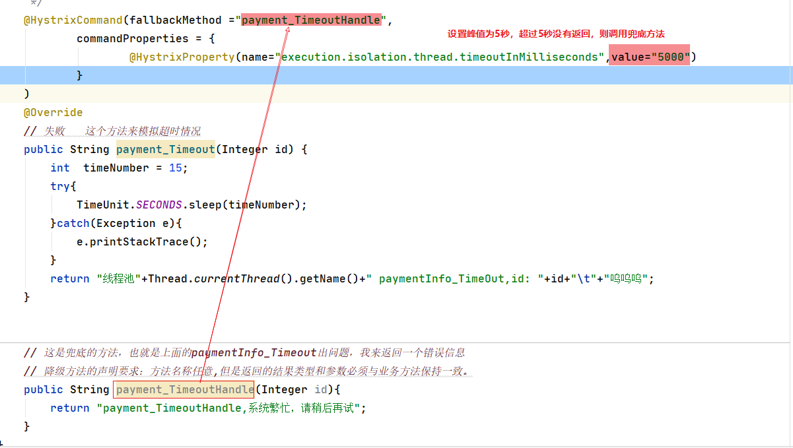

上述方法演示的时候，开启小于5秒的休眠，正常返回，开启大于5秒的休眠，调用了兜底方法

##### 7.3.1.2cloud-consumer-feign-hystrix-order80服务消费方服务降级⭐🐏

服务降级可以在服务提供方侧配置，也可以在服务消费方侧配置，更多的是在服务提供方侧配置。并且在服务消费方的开始方式和服务提供方不一样。

>服务消费方的降级配置步骤：
>
>- 1.在主启动类开启Hystrix配置@EnableHystrix  // 开启Hystrix的配置，这个注解和@EnableCircuitBreaker作用一样
>- 2.==修改yaml配置文件开启降级配置==
>- 3.编写降级方法
>- 4.将降级方法和业务方法绑定@HystrixCommand与 @HystrixProperty

**在主启动类开启Hystrix配置**

~~~java
package com.atguigu.springcloud;

import org.springframework.boot.SpringApplication;
import org.springframework.boot.autoconfigure.SpringBootApplication;
import org.springframework.cloud.netflix.eureka.EnableEurekaClient;
import org.springframework.cloud.netflix.hystrix.EnableHystrix;
import org.springframework.cloud.openfeign.EnableFeignClients;

@SpringBootApplication
@EnableEurekaClient
@EnableFeignClients
@EnableHystrix  // 开启Hystrix的配置，这个注解和@EnableCircuitBreaker作用一样
public class OrderHystrixMain80 {
    public static void main(String[] args) {
        SpringApplication.run(OrderHystrixMain80.class,args);
    }
}

~~~

**配置文件**

~~~yaml
server:
  port: 80

spring:
  application:
    name: cloud-consumer-feign-hystrix-payment-service

eureka:
  client:
    register-with-eureka: true
    fetch-registry: true
    service-url:
      defaultZone: http://localhost:7001/eureka

feign:
  hystrix:
    enabled: true   #如果处理自身的容错就开启，开启方式和生产端不一样。
~~~

**controller**

由于我们是通过feign的远程调用，我们在消费端，只需要在controler层编写降级方法并且绑定就行，和服务提供方写在Service层不一样

~~~java
package com.atguigu.springcloud.controller;

import com.atguigu.springcloud.service.PaymentHystrixService;
import com.netflix.hystrix.contrib.javanica.annotation.HystrixCommand;
import com.netflix.hystrix.contrib.javanica.annotation.HystrixProperty;
import lombok.extern.slf4j.Slf4j;
import org.springframework.beans.factory.annotation.Autowired;
import org.springframework.web.bind.annotation.GetMapping;
import org.springframework.web.bind.annotation.PathVariable;
import org.springframework.web.bind.annotation.RestController;

@RestController
@Slf4j
public class OrderHystrixController {
    @Autowired
    private PaymentHystrixService paymentHystrixService;

    @GetMapping("/consumer/payment/hystrix/ok/{id}")
    public String paymentInfo_OK(@PathVariable("id") Integer id){
        String result = paymentHystrixService.paymentInfo_OK(id);
        log.info("*******result:"+result);
        return result;
    }

    /**
     * fallbackMethod:指定降级方法名称，一旦调用服务方法失败，胡自动调用@HystrixCommand标注好的fallbackMethod调用类中的指定的方法。
     * 通过指定熔断器属性，设置降级处理条件，方法执行不能超过规定时间，否则，就走降级方法啦。
     */
    @HystrixCommand(fallbackMethod ="payment_TimeoutHandle",
            commandProperties = {
                    @HystrixProperty(name="execution.isolation.thread.timeoutInMilliseconds",value="1500")
            }
    )
    @GetMapping("/consumer/payment/hystrix/timeout/{id}")
    public String paymentInfo_Timeout(@PathVariable("id") Integer id){
        String result = paymentHystrixService.paymentInfo_Timeout(id);
        log.info("*******result:"+result);
        return result;
    }


    // 这是兜底的方法，也就是上面的paymentInfo_Timeout出问题，我来返回一个错误信息
    // 降级方法的声明要求：方法名称任意,但是返回的结果类型和参数必须与业务方法保持一致。
    public String payment_TimeoutHandle(@PathVariable("id")Integer id){
        return "payment_TimeoutHandle,系统繁忙，请稍后再试";
    }
}
~~~

**注意**：

==如果是服务提供方触发降级返回了降级方法，此时在消费方也会触发降级，并且执行消费方的降级方法==。

##### 7.3.1.3 全局降级和降级组件类⭐🐏

刚才我们在配置降级的时候，发现是在业务处理类里面每个业务方法都对应一个降级方法，这中做法会导致业务处理类里面代码臃肿，而且降级方法和业务方法也耦合在一个类中。==代码膨胀，代码耦合==

###### 7.3.1.3.1 解决代码冗余，我们通过统一降级方法来处理⭐🐏

我们就在8001服务提供方这里演示。

- 主启动类加上@EnableCircuitBreaker注解

- 定义全局统一的降级处理方法

- 在**业务处理类上加上@DefaultProperties，其 属性defaultFallback指定全局统一的降级处理方法**，==此时不需要在每个方法上配置一个降级方法，而是在类上定义一个全局降级方法。==
- 每个需要降级的业务方法==仍需要加上@HystrixCommand注解==，==不过不需要对这个注解再做额外的配置==

**启动类**

~~~java
package com.atguigu.springcloud;


import org.springframework.boot.SpringApplication;
import org.springframework.boot.autoconfigure.SpringBootApplication;
import org.springframework.cloud.client.circuitbreaker.EnableCircuitBreaker;
import org.springframework.cloud.netflix.eureka.EnableEurekaClient;

@SpringBootApplication
@EnableEurekaClient
@EnableCircuitBreaker  // 主启动类激活Hystrix，启用我们的熔断器
public class PaymentHystrixMain8001 {
    public static void main(String[] args) {
        SpringApplication.run(PaymentHystrixMain8001.class,args);
    }
}

~~~

**配置文件**

~~~yaml
server:
  port: 8001

spring:
  application:
    name: cloud-hystrix-payment-service

eureka:
  client:
    register-with-eureka: true
    fetch-registry: true
    service-url:
      defaultZone: http://localhost:7001/eureka

~~~

**service层**

~~~java
package com.atguigu.springcloud.service;

import com.netflix.hystrix.contrib.javanica.annotation.DefaultProperties;
import com.netflix.hystrix.contrib.javanica.annotation.HystrixCommand;
import com.netflix.hystrix.contrib.javanica.annotation.HystrixProperty;
import org.springframework.stereotype.Service;

import java.util.concurrent.TimeUnit;

@Service
@DefaultProperties(defaultFallback = "payment_global_fallbackMethod")
public class PaymentServiceImpl  implements  PaymentService{
    @Override
    // 成功    这个方法模拟正常情况
    public String paymentInfo_OK(Integer id) {
        return "线程池"+Thread.currentThread().getName()+" paymentInfo_Ok,id: "+id+"\t"+"哈哈哈";
    }


//    /**
//     * fallbackMethod:指定降级方法名称，一旦调用服务方法失败，胡自动调用@HystrixCommand标注好的fallbackMethod调用类中的指定的方法。
//     * 通过指定熔断器属性，设置降级处理条件，方法执行不能超过规定时间，否则，就走降级方法啦。
//     */
//    @HystrixCommand(fallbackMethod ="payment_TimeoutHandle",
//            commandProperties = {
//                    @HystrixProperty(name="execution.isolation.thread.timeoutInMilliseconds",value="5000")
//            }
//    )
    @HystrixCommand
    @Override
    // 失败   这个方法来模拟超时情况
    public String payment_Timeout(Integer id) {
        int i = 1/0;
        int  timeNumber = 3;
        try{
            TimeUnit.SECONDS.sleep(timeNumber);
        }catch(Exception e){
            e.printStackTrace();
        }
        return "线程池"+Thread.currentThread().getName()+" paymentInfo_TimeOut,id: "+id+"\t"+"呜呜呜";
    }


    // 这是兜底的方法，也就是上面的paymentInfo_Timeout出问题，我来返回一个错误信息
    // 降级方法的声明要求：方法名称任意,但是返回的结果类型和参数必须与业务方法保持一致。
//    public String payment_TimeoutHandle(Integer id){
//        return "payment_TimeoutHandle,系统繁忙，请稍后再试";
//    }


    /**
     * 我们将某一个业务处理类的降级方法注释掉，定义一个全局处理降级方法
     */

    public String payment_global_fallbackMethod(){
        return "Global异常处理信息，请稍后再试";
    }

}
~~~

我们再业务方法内定义了一个异常，我们访问：http://localhost:8001/payment/hystrix/timeout/19

可以看到，统一降级方法被调用：

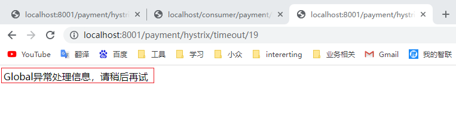

###### 7.3.1.3.2 解决代码耦合的问题：降级组件类⭐🐏

我们这时考虑的是==Feign的远程调用的情况==下，在消费端80怎么定义降级组件类

步骤：

>1.主启动类上加上@EnableHystrix  // 开启Hystrix的配置，这个注解和@EnableCircuitBreaker作用一样
>
>2.修改全局配置文件，这是使用降级组件类要开启的
>
>3.定义全局降级组件类
>
>4.修改service接口层，添加fallback属性，指定降级组件类。

**启动类**

~~~java
package com.atguigu.springcloud;

import org.springframework.boot.SpringApplication;
import org.springframework.boot.autoconfigure.SpringBootApplication;
import org.springframework.cloud.netflix.eureka.EnableEurekaClient;
import org.springframework.cloud.netflix.hystrix.EnableHystrix;
import org.springframework.cloud.openfeign.EnableFeignClients;

@SpringBootApplication
@EnableEurekaClient
@EnableFeignClients
@EnableHystrix  // 开启Hystrix的配置，这个注解和@EnableCircuitBreaker作用一样
public class OrderHystrixMain80 {
    public static void main(String[] args) {
        SpringApplication.run(OrderHystrixMain80.class,args);
    }
}

~~~

**配置文件**

~~~yaml
server:
  port: 80

spring:
  application:
    name: cloud-consumer-feign-hystrix-payment-service

eureka:
  client:
    register-with-eureka: true
    fetch-registry: true
    service-url:
      defaultZone: http://localhost:7001/eureka

feign:
  hystrix:
    enabled: true   #如果处理自身的容错就开启，开启方式和生产端不一样。
~~~

**降级组件类**

需要实现Feign的service接口，实现其中的方法

~~~java
package com.atguigu.springcloud.service;

import org.springframework.stereotype.Component;

/**
 * 降级组件类：
 * 1.这个类实现了Feign接口，它是一个降级组件类
 * 2.这个类中实现的方法就是要调用远程方法的降级方法
 * 3.通过这个组件类和组件类对应的方法，实现了业务方法和降级方法的耦合分离
 * 4.此时每个方法都一个降级方法，这种处理是为了解决代码耦合的问题，不是为了统一降级方法以减少代码
 *
 */
@Component
public class PaymentHystrixServiceHandler  implements PaymentHystrixService{
    // 降级方法
    @Override
    public String paymentInfo_OK(Integer id) {
        return "PaymentHystrixServiceHandler-paymentInfo_OK 降级处理";
    }

    // 降级方法
    @Override
    public String paymentInfo_Timeout(Integer id) {
        return "PaymentHystrixServiceHandler-paymentInfo_Timeout 降级处理";
    }
}

~~~

**service接口**

**fallback属性指定定义的降级组件类的class**

~~~java
package com.atguigu.springcloud.service;

import org.springframework.cloud.openfeign.FeignClient;
import org.springframework.web.bind.annotation.GetMapping;
import org.springframework.web.bind.annotation.PathVariable;

@FeignClient(name="cloud-hystrix-payment-service",fallback = PaymentHystrixServiceHandler.class)
public interface PaymentHystrixService {
    @GetMapping("/payment/hystrix/ok/{id}")
    public String paymentInfo_OK(@PathVariable("id") Integer id);


    @GetMapping("/payment/hystrix/timeout/{id}")
    public String paymentInfo_Timeout(@PathVariable("id") Integer id);
}

~~~

此时的Controller中是没有Hystrix相关的配置的

~~~java
package com.atguigu.springcloud.controller;

import com.atguigu.springcloud.service.PaymentHystrixService;
import com.netflix.hystrix.contrib.javanica.annotation.HystrixCommand;
import com.netflix.hystrix.contrib.javanica.annotation.HystrixProperty;
import lombok.extern.slf4j.Slf4j;
import org.springframework.beans.factory.annotation.Autowired;
import org.springframework.web.bind.annotation.GetMapping;
import org.springframework.web.bind.annotation.PathVariable;
import org.springframework.web.bind.annotation.RestController;

@RestController
@Slf4j
public class OrderHystrixController {
    @Autowired
    private PaymentHystrixService paymentHystrixService;

    @GetMapping("/consumer/payment/hystrix/ok/{id}")
    public String paymentInfo_OK(@PathVariable("id") Integer id){
        String result = paymentHystrixService.paymentInfo_OK(id);
        log.info("*******result:"+result);
        return result;
    }

//    /**
//     * fallbackMethod:指定降级方法名称，一旦调用服务方法失败，胡自动调用@HystrixCommand标注好的fallbackMethod调用类中的指定的方法。
//     * 通过指定熔断器属性，设置降级处理条件，方法执行不能超过规定时间，否则，就走降级方法啦。
//     */
//    @HystrixCommand(fallbackMethod ="payment_TimeoutHandle",
//            commandProperties = {
//                    @HystrixProperty(name="execution.isolation.thread.timeoutInMilliseconds",value="1500")
//            }
//    )
    @GetMapping("/consumer/payment/hystrix/timeout/{id}")
    public String paymentInfo_Timeout(@PathVariable("id") Integer id){
        String result = paymentHystrixService.paymentInfo_Timeout(id);
        log.info("*******result:"+result);
        return result;
    }


//    // 这是兜底的方法，也就是上面的paymentInfo_Timeout出问题，我来返回一个错误信息
//    // 降级方法的声明要求：方法名称任意,但是返回的结果类型和参数必须与业务方法保持一致。
//    public String payment_TimeoutHandle(@PathVariable("id")Integer id){
//        return "payment_TimeoutHandle,系统繁忙，请稍后再试";
//    }

}
~~~

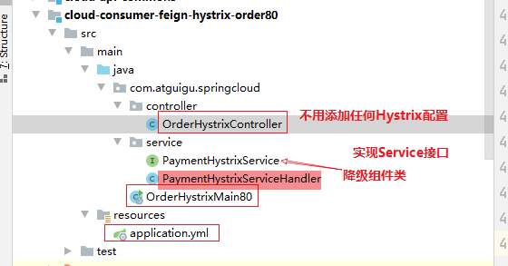

我们断掉8001的服务，直接通过80的服务去调用8001，看此时降级组件类是否生效。

可以看到，全局降级组件类生效

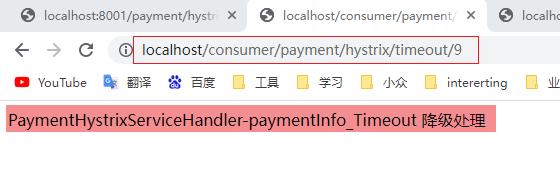

#### 7.3.2服务熔断⭐🐏

断路器：类似于==保险丝==

熔断机制：

熔断机制是应对雪崩效应的一种微服务的一种链路保护机制，当扇出链路的某个微服务出错不可用或者响应时间太长，会进行服务的降级，进而熔断该节点微服务的调用，快速返回响应的错误信息。

当检测到该节点的微服务调用响应正常后，恢复调用链路。

在SpringCLoud框架中，熔断机制通过Hystrix实现。Hystrix会监控微服务的调用状态，当失败的调用到一定的阈值，缺省是<font color="red">**5秒内20次调用失败**</font>，就会启动熔断机制，==**熔断机制的注解也是 @HystrixCommand**==

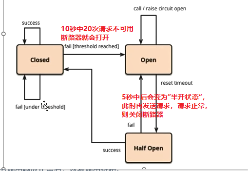

我们在cloud-provider-hystrix-payment8001演示熔断处理。

**启动类**

==@EnableCircuitBreaker  // 主启动类激活Hystrix，启用我们的熔断器==

~~~Java
package com.atguigu.springcloud;


import org.springframework.boot.SpringApplication;
import org.springframework.boot.autoconfigure.SpringBootApplication;
import org.springframework.cloud.client.circuitbreaker.EnableCircuitBreaker;
import org.springframework.cloud.netflix.eureka.EnableEurekaClient;

@SpringBootApplication
@EnableEurekaClient
@EnableCircuitBreaker  // 主启动类激活Hystrix，启用我们的熔断器
public class PaymentHystrixMain8001 {
    public static void main(String[] args) {
        SpringApplication.run(PaymentHystrixMain8001.class,args);
    }
}

~~~

**配置文件**

~~~yaml
server:
  port: 8001

spring:
  application:
    name: cloud-hystrix-payment-service

eureka:
  client:
    register-with-eureka: true
    fetch-registry: true
    service-url:
      defaultZone: http://localhost:7001/eureka

~~~

**service接口**

新增一个测试熔断的抽象方法

~~~java
package com.atguigu.springcloud.service;

public interface PaymentService {
    public String paymentInfo_OK(Integer id);
    public String payment_Timeout(Integer id);

    public String paymentCircuitBreaker(Integer id);
}

~~~

**接口上实现类**

~~~java
package com.atguigu.springcloud.service;

import cn.hutool.core.util.IdUtil;
import com.netflix.hystrix.contrib.javanica.annotation.DefaultProperties;
import com.netflix.hystrix.contrib.javanica.annotation.HystrixCommand;
import com.netflix.hystrix.contrib.javanica.annotation.HystrixProperty;
import org.springframework.stereotype.Service;
import org.springframework.web.bind.annotation.PathVariable;

import java.util.concurrent.TimeUnit;

@Service
@DefaultProperties(defaultFallback = "payment_global_fallbackMethod")
public class PaymentServiceImpl  implements  PaymentService{
    @Override
    // 成功    这个方法模拟正常情况
    public String paymentInfo_OK(Integer id) {
        return "线程池"+Thread.currentThread().getName()+" paymentInfo_Ok,id: "+id+"\t"+"哈哈哈";
    }


    @Override
    // 失败   这个方法来模拟超时情况
    public String payment_Timeout(Integer id) {
        int i = 1/0;
        int  timeNumber = 3;
        try{
            TimeUnit.SECONDS.sleep(timeNumber);
        }catch(Exception e){
            e.printStackTrace();
        }
        return "线程池"+Thread.currentThread().getName()+" paymentInfo_TimeOut,id: "+id+"\t"+"呜呜呜";
    }

    
    

    @HystrixCommand(fallbackMethod = "paymentCircuitBreaker_fallbck",
            commandProperties ={
                    @HystrixProperty(name="circuitBreaker.enabled",value="true"),//启用断路器
                    @HystrixProperty(name="circuitBreaker.requestVolumeThreshold",value="10"),// 在规定的时间内（默认10秒）出现20次请求都是失败的，就打开断路器
                    @HystrixProperty(name="circuitBreaker.sleepWindowInMilliseconds",value="10000"),// 断路多久以后开始尝试是否恢复，默认5秒，断路器打开以后的时间窗口，超过这个时间断路器会恢复
                    @HystrixProperty(name="circuitBreaker.errorThresholdPercentage",value="60"),//出错百分比阈值，在规定的时间内（默认是10秒，50%）出现N%次错误的i请求都是失败的，就打开断路器
    }

    )

    @Override
    public String paymentCircuitBreaker(Integer id){
        if(id<0){
            throw new RuntimeException("****id不能为负数");
        }
        String serialNumber = IdUtil.simpleUUID();//hutool.cn工具包
        return Thread.currentThread().getName()+"\t"+"调用成功，流水号为:"+serialNumber;
    }


    public String paymentCircuitBreaker_fallbck(@PathVariable("id") Integer id){
        return "id 不能为负数，请稍后再试，(t-t),id:"+id;
    }


}

~~~

**controller**

~~~java
package com.atguigu.springcloud.controller;

import com.atguigu.springcloud.service.PaymentService;
import lombok.extern.slf4j.Slf4j;
import org.springframework.beans.factory.annotation.Autowired;
import org.springframework.beans.factory.annotation.Value;
import org.springframework.web.bind.annotation.GetMapping;
import org.springframework.web.bind.annotation.PathVariable;
import org.springframework.web.bind.annotation.RestController;


@RestController
@Slf4j
public class PaymentController {
    @Autowired
    private PaymentService paymentService;

    @Value("${server.port}")
    private String servicePort;


    @GetMapping("/payment/hystrix/ok/{id}")
    public String paymentInfo_OK(@PathVariable("id") Integer id){
        String result = paymentService.paymentInfo_OK(id);
        log.info("*******result:"+result);
        return result;
    }


    @GetMapping("/payment/hystrix/timeout/{id}")
    public String paymentInfo_Timeout(@PathVariable("id") Integer id){
        String result = paymentService.payment_Timeout(id);
        log.info("*******result:"+result);
        return result;
    }

    
    
    
    // == 服务熔断
    @GetMapping("/payment/circuit/{id}")
    public String paymentCircuitBreaker(@PathVariable("id") Integer id){
        String result = paymentService.paymentCircuitBreaker(id);
        log.info("******result:"+result);
        return result;
    }
}
~~~

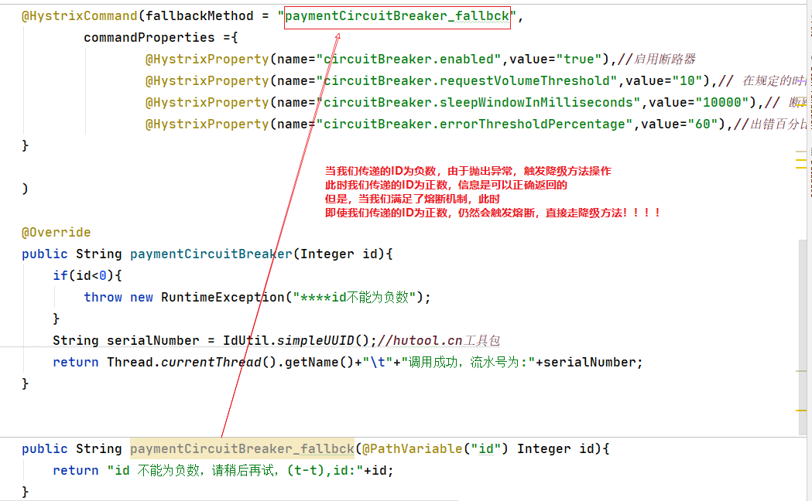

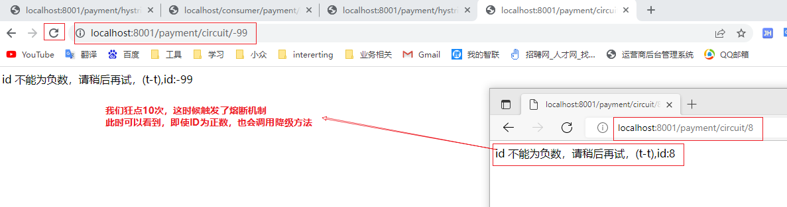

熔断机制出发以后，走的仍然是降级方法！！！！

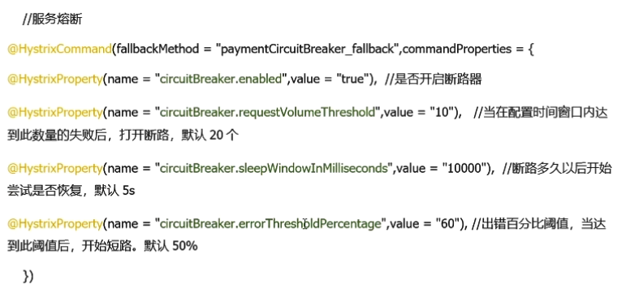

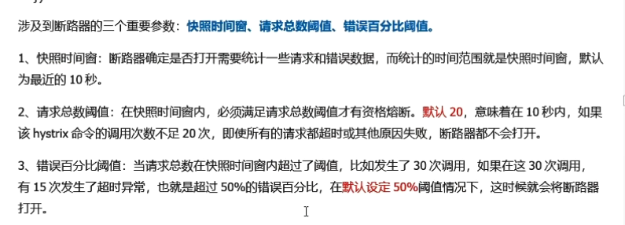

#### 7.3.3 服务监控-HystrixDashboard

除了隔离依赖服务的调用以外，Hystr还提供了==准实时的调用监控==，Hystrix会持续的记录所有通过发起的请求的执行情况，并且以**统计报表和图形**的形式展示给用户，包括每秒执行多少请求，多少执行成功，多少失败等。SpringCloud也提供了对Hystrix Dashboard的整合，对监控内容转化为可视化界面。

我们新建一个cloud-consumer-hystrix-dashboard9001子工程。

**pom.xml**

~~~xml
<?xml version="1.0" encoding="UTF-8"?>
<project xmlns="http://maven.apache.org/POM/4.0.0"
         xmlns:xsi="http://www.w3.org/2001/XMLSchema-instance"
         xsi:schemaLocation="http://maven.apache.org/POM/4.0.0 http://maven.apache.org/xsd/maven-4.0.0.xsd">
    <parent>
        <artifactId>cloud2022</artifactId>
        <groupId>com.atguigu.springcloud</groupId>
        <version>1.0-SNAPSHOT</version>
    </parent>
    <modelVersion>4.0.0</modelVersion>

    <artifactId>cloud-consumer-hystrix-dashboard9001</artifactId>
    <dependencies>
        <dependency>
            <groupId>org.springframework.cloud</groupId>
            <artifactId>spring-cloud-starter-netflix-hystrix-dashboard</artifactId>
        </dependency>
        <!--健康监控 -->
        <dependency>
            <groupId>org.springframework.boot</groupId>
            <artifactId>spring-boot-starter-actuator</artifactId>
        </dependency>
        <!--热部署 -->
        <dependency>
            <groupId>org.springframework.boot</groupId>
            <artifactId>spring-boot-devtools</artifactId>
            <scope>runtime</scope>
            <optional>true</optional>
        </dependency>
        <dependency>
            <groupId>org.projectlombok</groupId>
            <artifactId>lombok</artifactId>
            <optional>true</optional>
        </dependency>
        <dependency>
            <groupId>org.springframework.boot</groupId>
            <artifactId>spring-boot-starter-test</artifactId>
            <scope>test</scope>
        </dependency>
    </dependencies>

</project>
~~~

**核心配置文件**

~~~yaml
server:
  port: 9001
~~~

**主启动类**

~~~java
package com.atguigu.springcloud;

import org.springframework.boot.SpringApplication;
import org.springframework.boot.autoconfigure.SpringBootApplication;
import org.springframework.cloud.netflix.hystrix.dashboard.EnableHystrixDashboard;

@SpringBootApplication
@EnableHystrixDashboard // 启用Hystrix监控的模块
public class HystrixDashBoard {
    public static void main(String[] args) {
        SpringApplication.run(HystrixDashBoard.class,args);
    }
}
~~~

此时我们访问：http://localhost:9001/hystrix

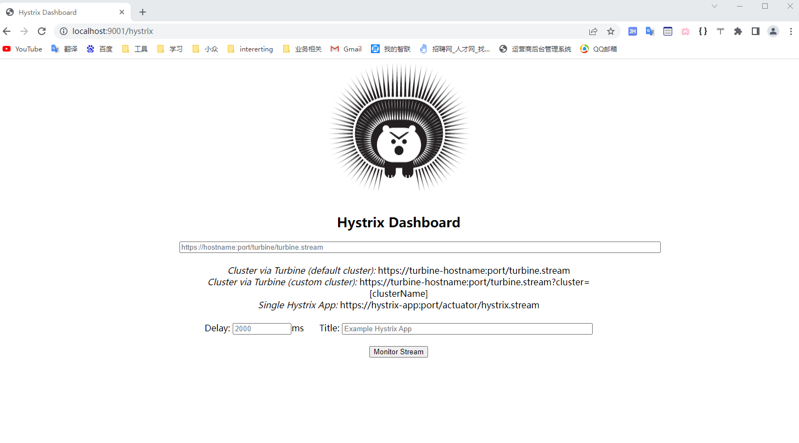

注意：**所有的服务端8001也都需要加上健康监控的依赖**

~~~xml
 <!--健康监控 -->
        <dependency>
            <groupId>org.springframework.boot</groupId>
            <artifactId>spring-boot-starter-actuator</artifactId>
        </dependency>
~~~

**同时在对应的8001主启动类上加如下代码**

~~~java
   /**
     * 此配置是为了服务监控而生，与服务容错本身无关，
     * ServletRegistrationBean因为SpringBoot的默认路径不是/hystrix.stream
     * 只要在自己的项目的配置上面加上下面的servlet就可以啦
     */
    @Bean
    public ServletRegistrationBean getServlet(){
        HystrixMetricsStreamServlet streamServlet = new HystrixMetricsStreamServlet();
        ServletRegistrationBean registrationBean = new ServletRegistrationBean(streamServlet);
        registrationBean.setLoadOnStartup(1);
        registrationBean.addUrlMappings("/hystrix.stream");
        registrationBean.setName("HystrixMetricsStreamServlet");
        return registrationBean;
    }
~~~

我们通过HystrixDashboard可以监控我们的8001，监控地址为http://localhost:8001/hystrix.stream

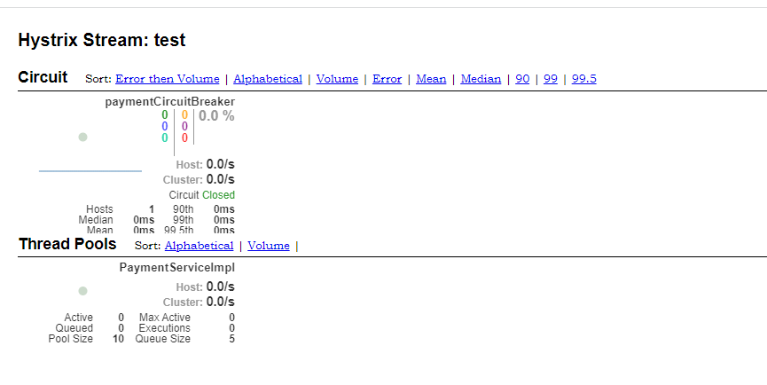

## 8.新一代网关Gateway⭐🐏

Cloud全家桶之中有一个很重要的组件就是网关。Gateway是新一代的微服务网关。网关相当于微服务的前门。

网址：https://spring.io/projects/spring-cloud-gateway

Gateway是在Spring生态上构建的API网关服务，基于==Spring5，SpringBoot2和Project Reactor==等技术。为了提升网关的性能，SpringCloudGateWay是基于WebFlux框架实现的，而WebFlux框架底层则使用了高性能的Reactor模式的通讯框架Netty。

Gateway旨在提供一种简单而又有效的方式来对API进行<font color="red">路由</font>，以及提供一些强大的<font color="red">过滤器</font>功能，例如：

熔断、限流、重试等。**Gatewayy也集成了Ribbon**。

网关可以实现：反向代理、鉴权、流量控制、熔断、日志监控等功能。

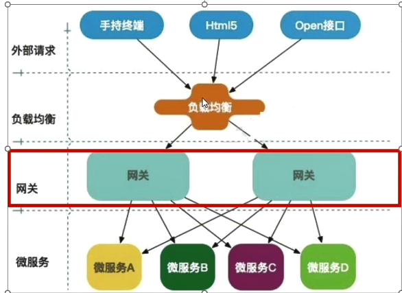


###  8.1 网关中的三大核心概念

**Route路由**

路由是构建网关的基本模块，**它是由ID，目标URI，一系列的断言和过滤器组成**，如果==断言为true则匹配该路由==

**Predicate断言**

开发人员可以匹配HTTP请求中的所有内容，如果请求与断言相匹配则进行路由。

**Filter过滤**

使用过滤器，可以在请求被路由前或者之后对请求进行修改。请求到来或者返回都执行过滤器

**路由内包含断言和过滤器，如果断言为true，则代表匹配上该路由，此时执行该路由内的过滤器方法。**

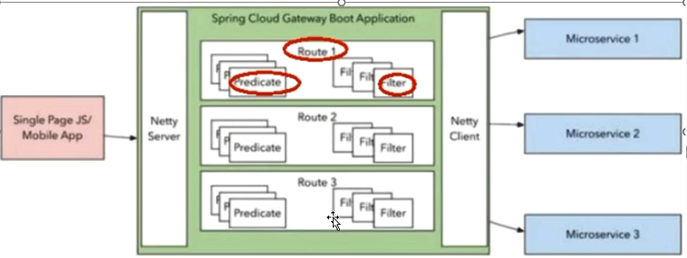

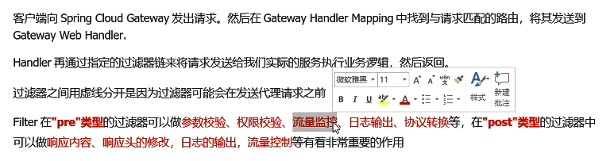

网关的核心逻辑就是：**路由转发+执行过滤器链**

### 8.2 创建9527⭐

我们新建一个演示网关的子工程：cloud-gateway-gateway9527

**pom.xml**

~~~xml
<?xml version="1.0" encoding="UTF-8"?>
<project xmlns="http://maven.apache.org/POM/4.0.0"
         xmlns:xsi="http://www.w3.org/2001/XMLSchema-instance"
         xsi:schemaLocation="http://maven.apache.org/POM/4.0.0 http://maven.apache.org/xsd/maven-4.0.0.xsd">
    <parent>
        <artifactId>cloud2022</artifactId>
        <groupId>com.atguigu.springcloud</groupId>
        <version>1.0-SNAPSHOT</version>
    </parent>
    <modelVersion>4.0.0</modelVersion>

    <artifactId>cloud-gateway-gateway9527</artifactId>
    <dependencies>
        <dependency>
            <groupId>org.springframework.cloud</groupId>
            <artifactId>spring-cloud-starter-gateway</artifactId>
        </dependency>
    <!--新增Hystrix熔断器 -->
    <dependency>
        <groupId>org.springframework.cloud</groupId>
        <artifactId>spring-cloud-starter-netflix-hystrix</artifactId>
    </dependency>
    <!--依赖Eureka客户端，即当前的微服务对于Eureka Server来讲，我们是客户端 -->
    <dependency>
        <groupId>org.springframework.cloud</groupId>
        <artifactId>spring-cloud-starter-netflix-eureka-client</artifactId>
    </dependency>
    <dependency>
        <groupId>org.springframework.boot</groupId>
        <artifactId>spring-boot-devtools</artifactId>
        <scope>runtime</scope>
        <optional>true</optional>
    </dependency>
    <dependency>
        <groupId>org.projectlombok</groupId>
        <artifactId>lombok</artifactId>
        <optional>true</optional>
    </dependency>
    <dependency>
        <groupId>org.springframework.boot</groupId>
        <artifactId>spring-boot-starter-test</artifactId>
        <scope>test</scope>
    </dependency>
    <dependency>
        <artifactId>cloud-api-commons</artifactId>
        <groupId>com.atguigu.springcloud</groupId>
        <version>1.0-SNAPSHOT</version>
    </dependency>
    </dependencies>
</project>
~~~

**配置文件**

网关中最重要的就是配置文件中的路由

~~~yaml
server:
  port: 9527

spring:
  application:
    name: cloud-gateway
  cloud:
    gateway:
      routes: # 网关可以有多个路由i，故这个是routes
        - id: payment_routh #路由ID，没有固定规则但要求唯一
          uri: http://localhost:8001 #匹配后提供服务的路由地址
          predicates:
            - Path=/payment/get/**   #断言。路径相匹配的进行路由

        - id: payment_routh2
          uri: http://localhost:8001
          predicates:
            - Path=/payment/lb/**   #断言。路径相匹配的进行路由,这里代表以路径进行断言，还可以以请求头，cookie等信息进行断言

eureka:
  instance:
    hostname: cloud-gateway-service
  client:
    register-with-eureka: true
    fetch-registry: true
    service-url:
      defaultZone: http://localhost:7001/eureka

~~~

**启动类**

~~~java
package com.atguigu.springcloud;

import org.springframework.boot.SpringApplication;
import org.springframework.boot.autoconfigure.SpringBootApplication;
import org.springframework.cloud.netflix.eureka.EnableEurekaClient;

@SpringBootApplication
@EnableEurekaClient
public class GatewayMain9527 {
    public static void main(String[] args) {
        SpringApplication.run(GatewayMain9527.class,args);
    }
}
~~~

由于我们在网关路由配置中配置了匹配8001，此时我们访问：http://localhost:9527/payment/lb，可以看到，依然是返回直接请求http://localhost:8001/payment/lb的结果。

### 8.3 网关中的负载均衡⭐

此时我们希望我们访问9527网关，可以帮我们动态的负载均衡到多个服务提供者，为此，我们需要修改配置文件：

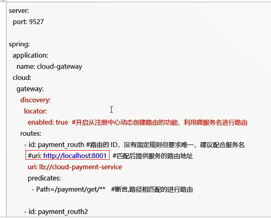

~~~yaml
server:
  port: 9527

spring:
  application:
    name: cloud-gateway
  cloud:
    gateway:
      discovery:
        locator:
          enabled: true  #开启从注册中心动态创建路由的功能，利用微服务的名进行路由
      routes: # 网关可以有多个路由i，故这个是routes
        - id: payment_routh #路由ID，没有固定规则但要求唯一
          # uri: http://localhost:8001 #匹配后提供服务的路由地址
          uri: lb://CLOUD-PAYMENT-SERVICE
          predicates:
            - Path=/payment/get/**   #断言。路径相匹配的进行路由

        - id: payment_routh2
          # uri: http://localhost:8001
          uri: lb://CLOUD-PAYMENT-SERVICE
          predicates:
            - Path=/payment/lb/**   #断言。路径相匹配的进行路由,这里代表以路径进行断言，还可以以请求头，cookie等信息进行断言


eureka:
  instance:
    hostname: cloud-gateway-service
  client:
    register-with-eureka: true
    fetch-registry: true
    service-url:
      defaultZone: http://localhost:7001/eureka

~~~

需要注意的是：URI的协议是lb,表示启用Cateway的负载均衡功能。

此时我们启动8002，8002，访问http://localhost:9527/payment/lb可以看到结果是交替进行的


### 8.4 常用predicate的使用

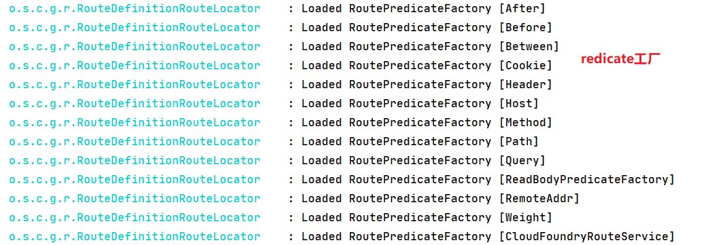**断言主要是用来匹配请求，并且实现请求和路由的绑定。用来判断我们的请求归不归这个路由管。**Gateway内置了很多的断言我们这里演示几个看一下。

比如：

第一个断言：**After:超过这个时间才会匹配，时间格式可以用如下代码获取：**

~~~java
package test;

import java.time.ZonedDateTime;

public class TestDemo {
    public static void main(String[] args) {
        ZonedDateTime zonedDateTime = ZonedDateTime.now();
        // 2022-05-03T15:36:54.285+08:00[GMT+08:00]
        System.out.println(zonedDateTime);
    }
}
~~~

~~~yaml
server:
  port: 9527

spring:
  application:
    name: cloud-gateway
  cloud:
    gateway:
      discovery:
        locator:
          enabled: true  #开启从注册中心动态创建路由的功能，利用微服务的名进行路由
      routes: # 网关可以有多个路由i，故这个是routes
        - id: payment_routh #路由ID，没有固定规则但要求唯一
          uri: http://localhost:8001 #匹配后提供服务的路由地址
          # uri: lb://CLOUD-PAYMENT-SERVICE
          predicates:
            - Path=/payment/get/**   #断言。路径相匹配的进行路由

        - id: payment_routh2
          # uri: http://localhost:8001
          uri: lb://CLOUD-PAYMENT-SERVICE
          predicates:
            - After=2022-05-03T15:36:54.285+08:00[GMT+08:00] # 只有在这个时间之后才会匹配

eureka:
  instance:
    hostname: cloud-gateway-service
  client:
    register-with-eureka: true
    fetch-registry: true
    service-url:
      defaultZone: http://localhost:7001/eureka
~~~

类似的，还有：

- **Before：代表必须在这个时间之前才会访问成功**
- **between：代表在某个时间之间才能访问**

- **Cookie**：如：Cookie=username，atguigu，表示必须有一个Cookie，Cookie键值对为username：atguigu

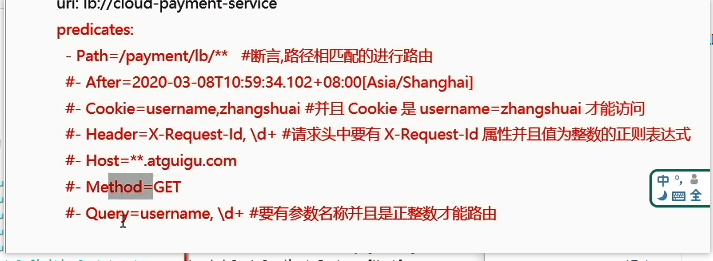

### 8.3 Gateway中过滤器的使用

路由过滤器可用于修改进入Http请求和返回的HTTP响应，路由过滤器只能指定路由进行使用。

SpringCloud Gateway内置了多种路由过滤器，他们都由<font color="red">**GatewayFilter**</font>的工厂类来产生。

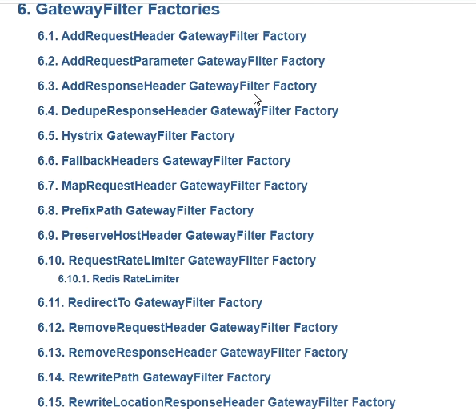

使用这些过滤器也很简单，只需要在配置文件中进行配置即可。

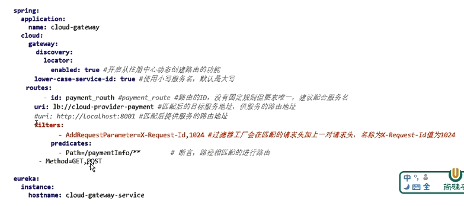

##### 8.3.1 自定义全局过滤器Global Filter⭐⭐🐏

自定义全局过滤器的操作也比较简单，只需要定义一个类，实现接口 ==**GlobalFilter, Ordered**== 即可

~~~java
package com.atguigu.springcloud.filter;

import lombok.extern.slf4j.Slf4j;
import org.apache.commons.lang.StringUtils;
import org.springframework.cloud.gateway.filter.GatewayFilterChain;
import org.springframework.cloud.gateway.filter.GlobalFilter;
import org.springframework.core.Ordered;
import org.springframework.http.HttpStatus;
import org.springframework.stereotype.Component;
import org.springframework.web.server.ServerWebExchange;
import reactor.core.publisher.Mono;

import java.util.Date;

/**
 * 自定义的全局过滤器：
 * 1.需要实现接口GlobalFilter、 Ordered
 * 2.这个过滤器需要纳入IOC容器中被Spring管理起来
 */
@Component
@Slf4j
public class MyLogGateWayFilter implements GlobalFilter, Ordered {
    @Override
    // exchange:里面封装了Request请求
    // chain：处理放行
    public Mono<Void> filter(ServerWebExchange exchange, GatewayFilterChain chain) {
        log.debug("MyLogGateWayFilter - filter datetime="+new Date());
        String username = exchange.getRequest().getQueryParams().getFirst("username");
        if(StringUtils.isEmpty(username)){
            log.debug("*****用户名为null,非法用户！");
            exchange.getResponse().setStatusCode(HttpStatus.NOT_ACCEPTABLE);
            return exchange.getResponse().setComplete();
        }
        return chain.filter(exchange);// 放行操作
    }

    @Override
    public int getOrder() {
        return 0;
    }
}
~~~

## 9.Sleuth_Zipkin链路跟踪

在微服务框架中，一个由客户端发起的请求在后端系统中会经过多个不同的服务节点调用来协同产生最后的请求结果，==每一个前端请求都会形成一个复杂的分布式服务调用链路==。链路的任何一环出现高延迟或者错误都会引起整个请求的失败。

SpringCLoudSleuth提供了一套完整的服务追踪的解决方案，在分布式系统中提供追踪解决方案并且兼容了Zipkin（负责展示）

### 9.1 链路监控步骤

#### 9.1.1 zipKin

1.下载： https://search.maven.org/remote_content?g=io.zipkin.java&a=zipkin-server&v=LATEST&c=exec ，此时得到zipkin-server-2.12.9.exce.jar

2.运行这个jar包：java  -jar  zipkin-server-2.12.9.exce.jar

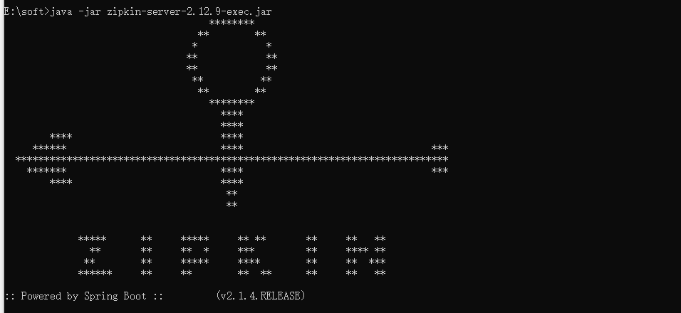

3.运行控制台： http://localhost:9411/zipkin/

追踪原理：

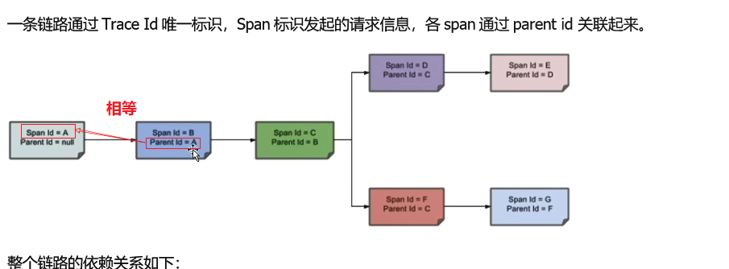

#### 9.1.2 修改服务提供者和服务消费者

服务提供者和服务消费者的集成zipkin的操作是一样的。

**1.修改pom.xml**

~~~xml
 <dependency>
            <groupId>org.springframework.cloud</groupId>
            <artifactId>spring-cloud-starter-zipkin</artifactId>
        </dependency>
~~~

**2.修改配置文件**

服务提供者

~~~yaml
server:
  port: 8001

spring:
  application:
    name: cloud-payment-service
  datasource:
    type: com.alibaba.druid.pool.DruidDataSource
    driver-class-name: com.mysql.jdbc.Driver
    url: jdbc:mysql://localhost:3306/test?useUnicode=true&characterEncoding=utf-8&useSSL=false&serverTimezone=Asia/Shanghai
    username: root
    password: 123456
  zipkin:
    base-url: http://localhost:9411
  sleuth:
    sampler:
      probability: 1 # 采样率值介于0-1之间，1表示全部采样

# mybatis相关整合配置
mybatis:
  mapper-locations: classpath:/mapper/*.xml   #接口映射文件路径
  type-aliases-package: com.atguigu.springcloud.entity  #设置别名包

# log
logging:
  level:
    com.atguigu.springcloud: debug
eureka:
  client:
    # 当前8001就是客户端，需要将自己注册到7001注册中心上去
    register-with-eureka: true
    # 80从7001上获取服务列表（会缓存到本地），用来调用其他的微服务
    fetch-registry: true
    # 当前微服务作为Eureka客户端，要注册到Eureka Server端
    service-url:
      defaulZone: http://localhost:7001/eureka
~~~

服务消费者

~~~yaml
server:
  port: 80

spring:
  application:
    name: cloud-consumer-order
  zipkin:
    base-url: http://localhost:9411
    sleuth:
      sampler:
        probability: 1 # 采样率值介于0-1之间，1表示全部采样

eureka:
  client:
    # 当前8001就是客户端，需要将自己注册到7001注册中心上去
    register-with-eureka: true
    # 80从7001上获取服务列表（会缓存到本地），用来调用其他的微服务
    fetch-registry: true
    # 当前微服务作为Eureka客户端，要注册到Eureka Server端
    service-url:
      defaultZone: http://localhost:7001/eureka
~~~

此时我们通过80去调用8001，可以看到，已经被监控到啦。

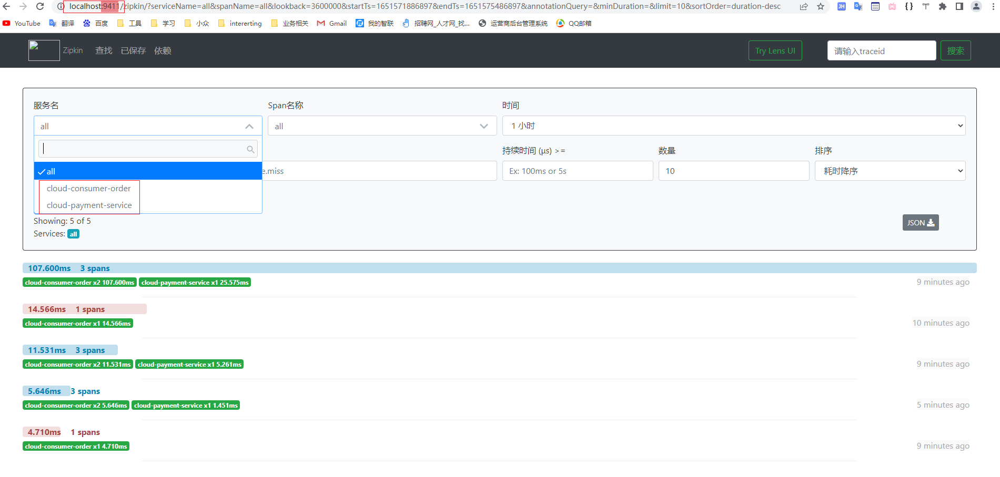


SpringCloud Netflix项目已经进入==维护期==。

# Spring Cloud Alibaba

Spring Cloud Alibaba 致力于提供微服务开发的一站式解决方案。此项目包含开发分布式应用微服务的必需组件，方便开发者通过 Spring Cloud 编程模型轻松使用这些组件来开发分布式应用服务。

依托 Spring Cloud Alibaba，您只需要添加一些注解和少量配置，就可以将 Spring Cloud 应用接入阿里微服务解决方案，通过阿里中间件来迅速搭建分布式应用系统。

此外，阿里云同时还提供了 Spring Cloud Alibaba 企业版 [微服务解决方案](https://www.aliyun.com/product/aliware/mse?spm=github.spring.com.topbar)，包括无侵入服务治理(全链路灰度，无损上下线，离群实例摘除等)，企业级 Nacos 注册配置中心和企业级云原生网关等众多产品。

## 主要功能

- **服务限流降级**：默认支持 WebServlet、WebFlux、OpenFeign、RestTemplate、Spring Cloud Gateway、Dubbo 和 RocketMQ 限流降级功能的接入，可以在运行时通过控制台实时修改限流降级规则，还支持查看限流降级 Metrics 监控。
- **服务注册与发现**：适配 Spring Cloud 服务注册与发现标准，默认集成了 Ribbon 的支持。
- **分布式配置管理**：支持分布式系统中的外部化配置，配置更改时自动刷新。
- **消息驱动能力**：基于 Spring Cloud Stream 为微服务应用构建消息驱动能力。
- **分布式事务**：使用 @GlobalTransactional 注解， 高效并且对业务零侵入地解决分布式事务问题。
- **阿里云对象存储**：阿里云提供的海量、安全、低成本、高可靠的云存储服务。支持在任何应用、任何时间、任何地点存储和访问任意类型的数据。
- **分布式任务调度**：提供秒级、精准、高可靠、高可用的定时（基于 Cron 表达式）任务调度服务。同时提供分布式的任务执行模型，如网格任务。网格任务支持海量子任务均匀分配到所有 Worker（schedulerx-client）上执行。
- **阿里云短信服务**：覆盖全球的短信服务，友好、高效、智能的互联化通讯能力，帮助企业迅速搭建客户触达通道。

更多功能请参考 [Roadmap](https://github.com/alibaba/spring-cloud-alibaba/blob/2021.x/Roadmap-zh.md)

除了上述所具有的功能外，针对企业级用户的场景，Spring Cloud Alibaba 配套的企业版微服务治理方案 [微服务引擎MSE](https://www.aliyun.com/product/aliware/mse?spm=github.spring.com.topbar) 还提供了企业级微服务治理中心，包括全链路灰度、服务预热、无损上下线和离群实例摘除等更多更强大的治理能力，同时还提供了企业级 Nacos 注册配置中心，企业级云原生网关等多种产品及解决方案。

## 组件

**[Sentinel](https://github.com/alibaba/Sentinel)**：把流量作为切入点，从流量控制、熔断降级、系统负载保护等多个维度保护服务的稳定性。

**[Nacos](https://github.com/alibaba/Nacos)**：一个更易于构建云原生应用的动态服务发现、配置管理和服务管理平台。

**[RocketMQ](https://rocketmq.apache.org/)**：一款开源的分布式消息系统，基于高可用分布式集群技术，提供低延时的、高可靠的消息发布与订阅服务。

**[Seata](https://github.com/seata/seata)**：阿里巴巴开源产品，一个易于使用的高性能微服务分布式事务解决方案。

**[Alibaba Cloud OSS](https://www.aliyun.com/product/oss)**: 阿里云对象存储服务（Object Storage Service，简称 OSS），是阿里云提供的海量、安全、低成本、高可靠的云存储服务。您可以在任何应用、任何时间、任何地点存储和访问任意类型的数据。

**[Alibaba Cloud SchedulerX](https://cn.aliyun.com/aliware/schedulerx)**: 阿里中间件团队开发的一款分布式任务调度产品，提供秒级、精准、高可靠、高可用的定时（基于 Cron 表达式）任务调度服务。

**[Alibaba Cloud SMS](https://www.aliyun.com/product/sms)**: 覆盖全球的短信服务，友好、高效、智能的互联化通讯能力，帮助企业迅速搭建客户触达通道。

## 10.Nacos⭐⭐🐏

Nacos: Dynamic Naming and Configuration Service，主要功能：==注册中心和配置中心==

nacos = Eureka+Config+Bus，

nacos下载地址：https://github.com/alibaba/nacos/releases/tag/1.1.4

我们直接运行bin/startup.cmd

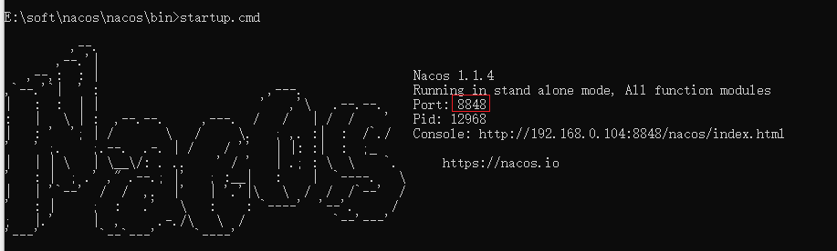

然后我们访问：http://localhost:8848/nacos，默认的账号密码都是nacos。

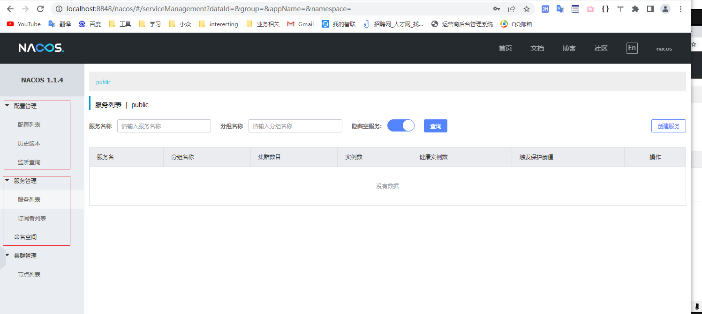

我们不用自己再创建注册中心服务端，这个软件就相当于注册中心服务端。

### 10.1 创建服务提供者9001，9002

创建子工程：cloudalibaba-provider-payment9001、cloudalibaba-provider-payment9002

**pom.xml**

~~~xml
<?xml version="1.0" encoding="UTF-8"?>
<project xmlns="http://maven.apache.org/POM/4.0.0"
         xmlns:xsi="http://www.w3.org/2001/XMLSchema-instance"
         xsi:schemaLocation="http://maven.apache.org/POM/4.0.0 http://maven.apache.org/xsd/maven-4.0.0.xsd">
    <parent>
        <artifactId>cloud2022</artifactId>
        <groupId>com.atguigu.springcloud</groupId>
        <version>1.0-SNAPSHOT</version>
    </parent>
    <modelVersion>4.0.0</modelVersion>

    <artifactId>cloudalibaba-provider-payment9001</artifactId>

    <dependencies>
        <dependency>
            <groupId>com.alibaba.cloud</groupId>
            <artifactId>spring-cloud-starter-alibaba-nacos-discovery</artifactId>
        </dependency>
        <dependency>
            <groupId>org.springframework.boot</groupId>
            <artifactId>spring-boot-starter-web</artifactId>
        </dependency>
        <!--健康监控 -->
        <dependency>
            <groupId>org.springframework.boot</groupId>
            <artifactId>spring-boot-starter-actuator</artifactId>
        </dependency>
        <!--热部署 -->
        <dependency>
            <groupId>org.springframework.boot</groupId>
            <artifactId>spring-boot-devtools</artifactId>
            <scope>runtime</scope>
            <optional>true</optional>
        </dependency>
        <dependency>
            <groupId>org.projectlombok</groupId>
            <artifactId>lombok</artifactId>
            <optional>true</optional>
        </dependency>
        <dependency>
            <groupId>org.springframework.boot</groupId>
            <artifactId>spring-boot-starter-test</artifactId>
            <scope>test</scope>
        </dependency>
    </dependencies>
</project>
~~~

**主要配置文件**

~~~yaml
server:
  port: 9002/9001
spring:
  application:
    name: nacos-payment-provider
  cloud:
    nacos:
      discovery:
        server-addr: localhost:8848   # 配置nacos的注册地址，代表将本服务要注册到的nacos的地址
management:
  endpoints:
    web:
      exposure:
        include: '*'  #默认是只公开了/health和/Info的端点，要想暴露所有的端点，比如有多少个Bean等只需要设置成*号

~~~

**主启动类**

~~~java
package com.atguigu.springcloud;

import org.springframework.boot.SpringApplication;
import org.springframework.boot.autoconfigure.SpringBootApplication;
import org.springframework.cloud.client.discovery.EnableDiscoveryClient;

@SpringBootApplication
// 通用服务发现客户端组件，可以用于多种注册中心：nacos,zookeeper,Consul,eureka
@EnableDiscoveryClient  // 类似于EnableEurekaclient（只作用于Eureka作为注册中心），但是不限定注册中心，任何注册中心都可以注册成功
public class PaymentMain9002 {
    public static void main(String[] args) {
        SpringApplication.run(PaymentMain9002.class,args);
    }
}

~~~

**controller**

~~~java
package com.atguigu.springcloud.controller;

import org.springframework.beans.factory.annotation.Value;
import org.springframework.web.bind.annotation.GetMapping;
import org.springframework.web.bind.annotation.PathVariable;
import org.springframework.web.bind.annotation.RestController;

@RestController
public class PaymentController {
    @Value("${server.port}")
    private String serverPort;

    @GetMapping(value="/payment/nacos/{id}")
    public String getPayment(@PathVariable("id") Long id){
        return "nacos registry,serverport:"+ serverPort+"\t id"+id;
    }


}

~~~

### 10.2 创建服务消费者83

我们再去创建子工程服务消费方，这个是用来调用我们的9001，9002工程的，主要区别在于配置文件的不同。

需要注意的是：Nacos也集成了Ribbon，故是可以做到负载均衡的！

**pom.xml**

~~~xml
<?xml version="1.0" encoding="UTF-8"?>
<project xmlns="http://maven.apache.org/POM/4.0.0"
         xmlns:xsi="http://www.w3.org/2001/XMLSchema-instance"
         xsi:schemaLocation="http://maven.apache.org/POM/4.0.0 http://maven.apache.org/xsd/maven-4.0.0.xsd">
    <parent>
        <artifactId>cloud2022</artifactId>
        <groupId>com.atguigu.springcloud</groupId>
        <version>1.0-SNAPSHOT</version>
    </parent>
    <modelVersion>4.0.0</modelVersion>

    <artifactId>cloudalibaba-consumer-nacos-order83</artifactId>
    <dependencies>
        <dependency>
            <groupId>com.alibaba.cloud</groupId>
            <artifactId>spring-cloud-starter-alibaba-nacos-discovery</artifactId>
        </dependency>
        <dependency>
            <groupId>org.springframework.boot</groupId>
            <artifactId>spring-boot-starter-web</artifactId>
        </dependency>
        <!--健康监控 -->
        <dependency>
            <groupId>org.springframework.boot</groupId>
            <artifactId>spring-boot-starter-actuator</artifactId>
        </dependency>
        <!--热部署 -->
        <dependency>
            <groupId>org.springframework.boot</groupId>
            <artifactId>spring-boot-devtools</artifactId>
            <scope>runtime</scope>
            <optional>true</optional>
        </dependency>
        <dependency>
            <groupId>org.projectlombok</groupId>
            <artifactId>lombok</artifactId>
            <optional>true</optional>
        </dependency>
        <dependency>
            <groupId>org.springframework.boot</groupId>
            <artifactId>spring-boot-starter-test</artifactId>
            <scope>test</scope>
        </dependency>
        <dependency>
            <artifactId>cloud-api-commons</artifactId>
            <groupId>com.atguigu.springcloud</groupId>
            <version>1.0-SNAPSHOT</version>
        </dependency>
    </dependencies>

</project>
~~~

**配置文件**

~~~yaml
server:
  port: 83
spring:
  application:
    name: nacos-order-consumer
  cloud:
    nacos:
      discovery:
        server-addr: localhost:8848   # 配置nacos的注册地址，代表将本服务要注册到的nacos的地址

# 消费者将要去访问的微服务名称（注册成功进nacos的微服务提供者），这个属性是可选的
service-url:
  nacos-user-service: http://nacos-payment-provider
~~~

**启动类**

~~~java
package com.atgui.springcloud;

import org.springframework.boot.SpringApplication;
import org.springframework.boot.autoconfigure.SpringBootApplication;
import org.springframework.cloud.client.discovery.EnableDiscoveryClient;

@SpringBootApplication
@EnableDiscoveryClient
public class OrderNacosMain83 {
    public static void main(String[] args) {
        SpringApplication.run(OrderNacosMain83.class,args);
    }
}

~~~

**controller**

~~~java
package com.atgui.springcloud.controller;

import lombok.extern.slf4j.Slf4j;
import org.springframework.beans.factory.annotation.Autowired;
import org.springframework.beans.factory.annotation.Value;
import org.springframework.stereotype.Controller;
import org.springframework.web.bind.annotation.GetMapping;
import org.springframework.web.bind.annotation.PathVariable;
import org.springframework.web.bind.annotation.RestController;
import org.springframework.web.client.RestTemplate;

@RestController
@Slf4j
public class OrderNacosController {
    @Autowired
    private RestTemplate restTemplate;

    @Value("${service-url.nacos-user-service}")
    private String serviceURL;

    @GetMapping("/consumer/payment/nacos/{id}")
    public String paymentInfo(@PathVariable("id") Long id){
         return restTemplate.getForObject(serviceURL+"/payment/nacos/"+id,String.class);
    }
}
~~~

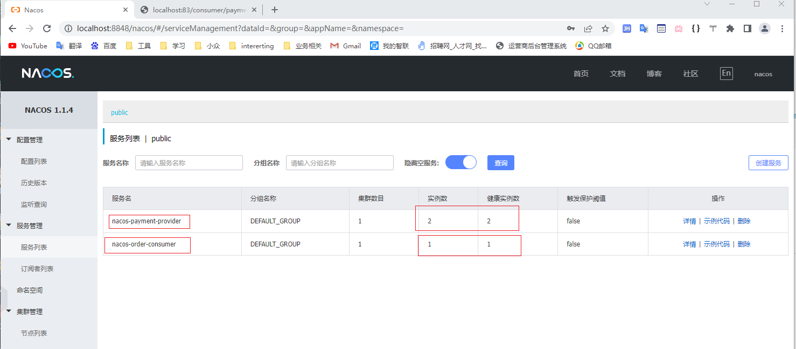

我们访问:http://localhost:83/consumer/payment/nacos/93，已经可以看到负载均衡的效果啦。

### 10.3 注册中心对比

#### 10.3.1 CAP定理

 CAP原则又称CAP定理，指的是在一个分布式系统中，一致性（Consistency）、可用性（Availability）、分区容错性（Partition tolerance）。CAP 原则指的是，这三个要素最多只能同时实现两点，不可能三者兼顾 。

Consistency (一致性)：

“all nodes see the same data at the same time”,即更新操作成功并返回客户端后，所有节点在同一时间的数据完全一致，这就是分布式的一致性。一致性的问题在并发系统中不可避免，对于客户端来说，一致性指的是并发访问时更新过的数据如何获取的问题。从服务端来看，则是更新如何复制分布到整个系统，以保证数据最终一致。

==在分布式系统中的所有数据备份，在同一时刻是否是同样的值==。

Availability (可用性):

可用性指“Reads and writes always succeed”，即服务一直可用，而且是正常响应时间。好的可用性主要是指系统能够很好的为用户服务，不出现用户操作失败或者访问超时等用户体验不好的情况。

==在集群中的一部分节点故障以后，集群整体是否还能响应客户端的读写请求可用性一般是通过集群保证的。==

Partition Tolerance (分区容错性):

即分布式系统在遇到某节点或网络分区故障的时候，仍然能够对外提供满足一致性和可用性的服务。

分区容错性要求能够使应用虽然是一个分布式系统，而看上去却好像是在一个可以运转正常的整体。比如现在的分布式系统中有某一个或者几个机器宕掉了，其他剩下的机器还能够正常运转满足系统需求，对于用户而言并没有什么体验上的影响。

**cap的精髓就是要么AP,要么CP，要么AC(这种情况下只能是单机部署)，但是不存在ACP。**==故我们只能是CP或者AP上选==。

我们一般会选择==AP，也就是保持可用性优先==，这种情况下，只能是**允许弱一致性，也就是在一定时间内数据同步就可以啦。**

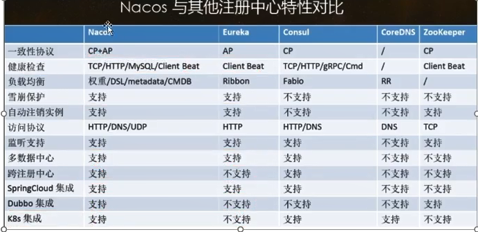

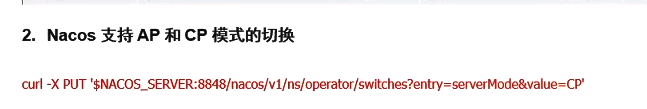

### 10.4 Nacos做服务配置中心⭐⭐🐏

#### 10.4.1 基本配置演示

配置中心实际上就是管理我们微服务当中的各种配置文件。naco配置中心也是一个图像化界面。方便我们修改配置文件。我们考虑现在有子工程：cloudalibaba-config-nacos-client3377。

**pom.xml**

~~~xml
<?xml version="1.0" encoding="UTF-8"?>
<project xmlns="http://maven.apache.org/POM/4.0.0"
         xmlns:xsi="http://www.w3.org/2001/XMLSchema-instance"
         xsi:schemaLocation="http://maven.apache.org/POM/4.0.0 http://maven.apache.org/xsd/maven-4.0.0.xsd">
    <parent>
        <artifactId>cloud2022</artifactId>
        <groupId>com.atguigu.springcloud</groupId>
        <version>1.0-SNAPSHOT</version>
    </parent>
    <modelVersion>4.0.0</modelVersion>

    <artifactId>cloudalibaba-config-nacos-client3377</artifactId>
    <dependencies>
        <!--nacos-config -->
        <dependency>
            <groupId>com.alibaba.cloud</groupId>
            <artifactId>spring-cloud-starter-alibaba-nacos-config</artifactId>
        </dependency>
        <!--nacos-discovery -->
        <dependency>
            <groupId>com.alibaba.cloud</groupId>
            <artifactId>spring-cloud-starter-alibaba-nacos-discovery</artifactId>
        </dependency>
        <dependency>
            <groupId>org.springframework.boot</groupId>
            <artifactId>spring-boot-starter-web</artifactId>
        </dependency>
        <!--健康监控 -->
        <dependency>
            <groupId>org.springframework.boot</groupId>
            <artifactId>spring-boot-starter-actuator</artifactId>
        </dependency>
        <!--热部署 -->
        <dependency>
            <groupId>org.springframework.boot</groupId>
            <artifactId>spring-boot-devtools</artifactId>
            <scope>runtime</scope>
            <optional>true</optional>
        </dependency>
        <dependency>
            <groupId>org.projectlombok</groupId>
            <artifactId>lombok</artifactId>
            <optional>true</optional>
        </dependency>
        <dependency>
            <groupId>org.springframework.boot</groupId>
            <artifactId>spring-boot-starter-test</artifactId>
            <scope>test</scope>
        </dependency>
    </dependencies>

</project>
~~~

**主配置文件**

**bootstrap.yml**

~~~yaml
server:
  port: 3377

spring:
  application:
    name: nacos-config-client
  cloud:
    nacos:
      discovery:
        server-addr: localhost:8848 #服务注册中心地址
      config:
        server-addr: localhost:8848 #配置中心地址
        file-extension: yaml #指定yaml格式的配置（yaml和yml都可以）.需要注意，这儿指定YAML，则NACO上配置文件也要是这个后缀！！！！
# ${spring.application.name}-${spring.profile.active}.${spring.cloud.nacos.config.file-extension}
~~~

**application.yml**

~~~yaml
spring:
  profiles:
    active: dev #表示开发环境配置
~~~

**主启动类**

~~~java
package com.atguigu.springcloud;

import org.springframework.boot.SpringApplication;
import org.springframework.boot.SpringBootConfiguration;
import org.springframework.cloud.client.discovery.EnableDiscoveryClient;

@SpringBootApplication
@EnableDiscoveryClient
public class NacosConfigClientMain3377 {
    public static void main(String[] args) {
        SpringApplication.run(NacosConfigClientMain3377.class,args);
    }
}

~~~

**controller**

~~~java
package com.atguigu.springcloud.controller;

import org.springframework.beans.factory.annotation.Value;
import org.springframework.web.bind.annotation.GetMapping;
import org.springframework.web.bind.annotation.RestController;

@RestController
public class ConfigClientController {

    @Value("${config.info}")  // 这个配置在本地yaml中没有配置，但是可以从配置中心下载
    private String info;


    @GetMapping("/config/info")
    public String getInfo(){
        return info;
    }
}

~~~

可以看到，我们没有配置config.info的信息，我们想定义一个远程配置文件，并且让3377可以获取到我们在远程定义到的配置文件的信息。为此，我们需要：做以下几步：

- 1.确定远程要定义的配置文件的**DataId**名字，

>远程要定义的配置文件的命名是有要求的，其格式如下：
>
>```
># ${spring.application.name}-${spring.profile.active}.${spring.cloud.nacos.config.file-extension}
>
>Nacos配置管理dataId的完整格式：
>${prefix}-${spring.profile.active}.${file-extension}
>prefix 默认为spring.application.name 的值，也可通过配置项 spring.cloud.nacos.config.prefix来配置。
>spring.profile.active 即为当前环境对应的profile
>file-extension 为配置内容的数据格式，目前支持 properties和yml类型。
>```

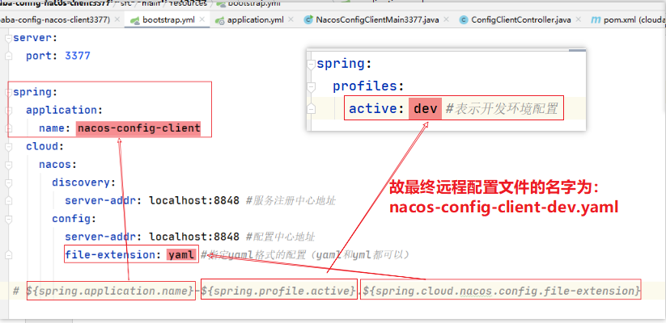

- 2.在nacos上编写配置文件,**DataId就是我们在1中确定的配置名称。**

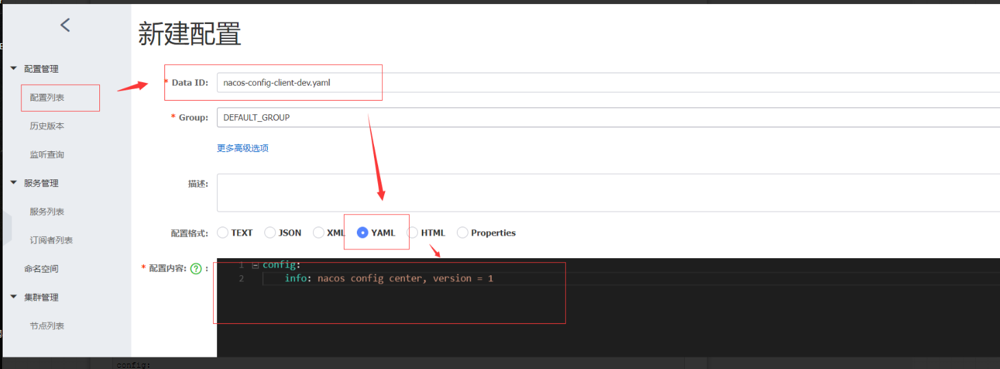

- 3.如果我们修改了远程配置文件，还想动态刷新获取，只需要在controller上加上注解<font color="red">**@RefreshScope**：</font>

~~~java
package com.atguigu.springcloud.controller;

import org.springframework.beans.factory.annotation.Value;
import org.springframework.cloud.context.config.annotation.RefreshScope;
import org.springframework.web.bind.annotation.GetMapping;
import org.springframework.web.bind.annotation.RestController;

@RestController
@RefreshScope   // 通过SpringCloud原生注解@RefreshScope实现配置自动更新
public class ConfigClientController {

    @Value("${config.info}")  // 这个配置在本地yaml中没有配置，但是可以从配置中心下载
    private String info;


    @GetMapping("/config/info")
    public String getInfo(){
        return info;
    }
}

~~~

此时我们访问：http://localhost:3377/config/info，可以看到获取到了远程配置文件的信息。

#### 10.4.2 分类配置

nacos上有命名空间，我们可以给每个环境定义一个命名空间，Nacos会给每个命名空间在生成一个单独的ID。

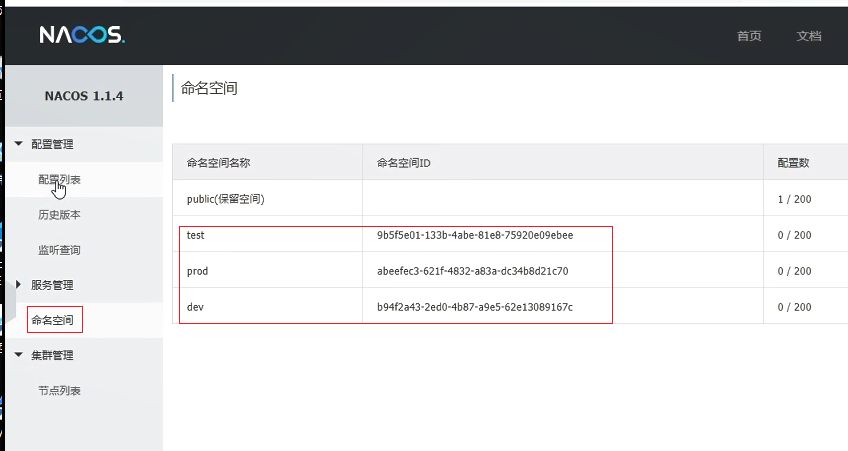

我们的配置文件实际上是分配在我们定义的各个命名空间下的。

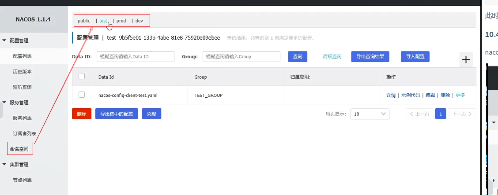

==我们可以在配置文件中确定自己要使用的哪个命名空间哪个组下的配置文件信息。==从而实现**配置文件的切换。**

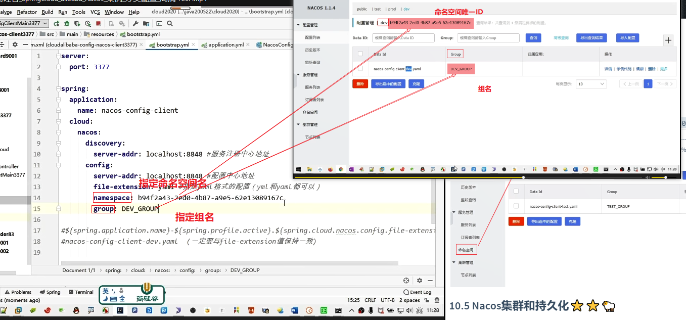

### 10.5 Nacos集群和持久化⭐⭐🐏

Nacos自身的持久化:持久化的主要是配置信息。

>我们在本地的nacos配置好后无论是重启nacos还是关机，再启动，都还会看到我们之前的配置。
>这是因为nacos自带一个小型数据库derby，所有配置文件都被Nacos保存在了内置的数据库中，如果我们在集群模式下仍然使用自带的derby数据库，那么就会出现数据一致性问题,同时如果使用内嵌数据库，注定会有存储上限

集群是为了解决单点故障而持久化是为了解决重启之后再手动输入配置的问题。
 默认Nacos使用嵌入式数据库实现数据的存储。所以，如果启动多个默认配置下的Nacos节点，数据存储是存在一致性问题的。
 为了解决这个问题，Nacos采用了**集中式存储的方式来支持集群化部署，目前只支持MySQL的存储**。

 #### 10.5.1单机模式支持mysql

在0.7版本之前，nacos单机模式使用嵌入式数据库做数据的存储，不方便观察数据存储的基本情况。0.7版本增加了mysql作为数据源能力。具体的操作步骤：

- 安装数据库。最低要求5.6.5+
- 初始化数据库，数据库初始化文件：nacos-mysql.sql，这个文件nacos自带的

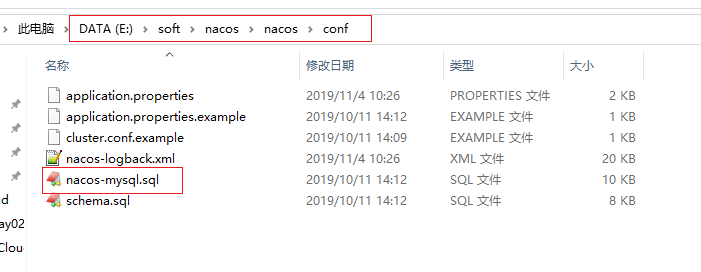

- nacos的配置文件同样在根目录下的/conf/application.properties, 修改conf/application.properties文件,增加对MySQL数据库的支持配置，目前也只支持mysql.添加mysql数据源的url，用户名，密码等。

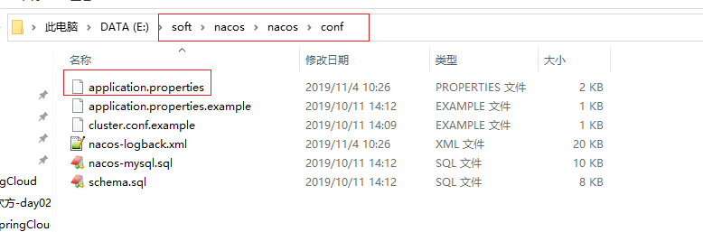

~~~properties
### If use MySQL as datasource:
spring.datasource.platform=mysql

### Count of DB:
db.num=1

### Connect URL of DB:
db.url.0=jdbc:mysql://127.0.0.1:3306/nacos-config?characterEncoding=utf8&connectTimeout=1000&socketTimeout=3000&autoReconnect=true&useUnicode=true&useSSL=false&serverTimezone=UTC
db.user=root
db.password=123456
~~~

- 修改完了以后重启nacos即可

#### 10.5.2 nacos集群

nacos集群是采用一个nacos重启三次，每次使用不同的端口来实现的。我们在linux环境去实现它，于此同时。我们也像单机模式一样，去修改存储的数据源为mysql.

为了让nacos重启三次，每次都可以使用不同的端口号，我们

- 1.复制cluster.conf文件


- 2.修改cluster.conf,增加三个集群的节点配置信息

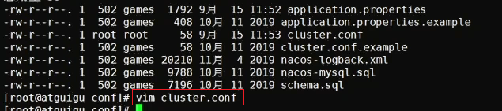

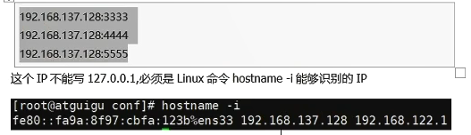

- 3.修改启动脚本：startup.sh


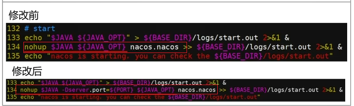

- 4.修改启动时的占用的内存大小

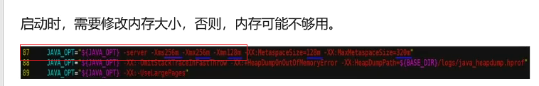

- 5.此时就可以启动多台服务器啦

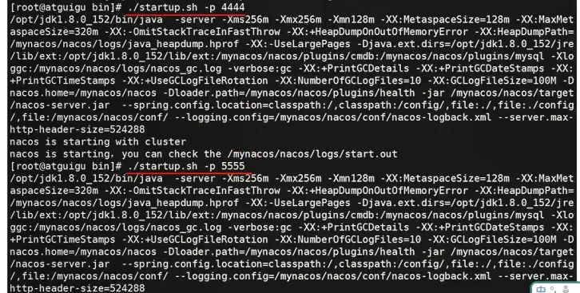

- 6.通过nginx负载均衡这三台nacos


此时，环境就搭建好啦！最终环境如下：

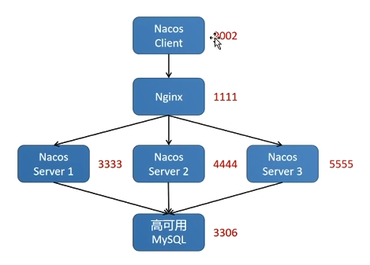

我们可以查看他的集群节点，最终在nacos控制台显示如下：

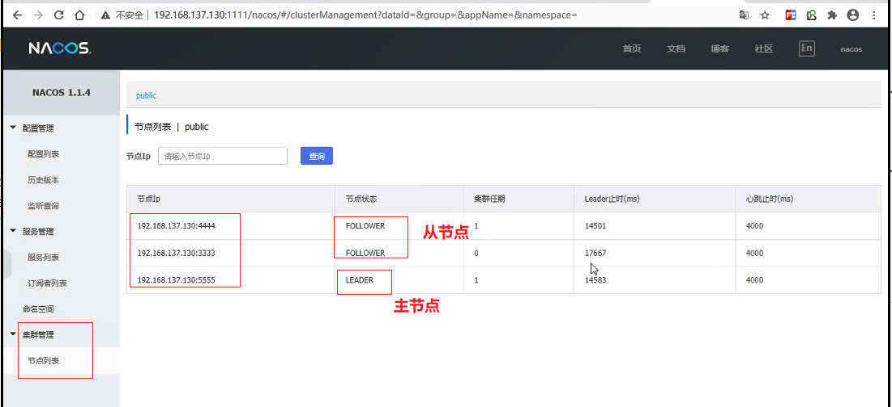

注意：

==在nacos集群搭建好了以后，我们此时访问的服务注册中心的地址就是nagix反向代理的地址，微服务在配置注册中西时的地址也是这个！==

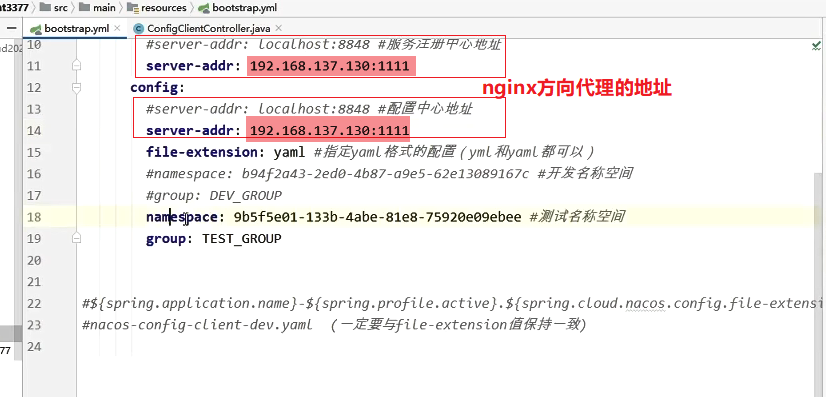

## 11 Sentinel⭐⭐🐏


