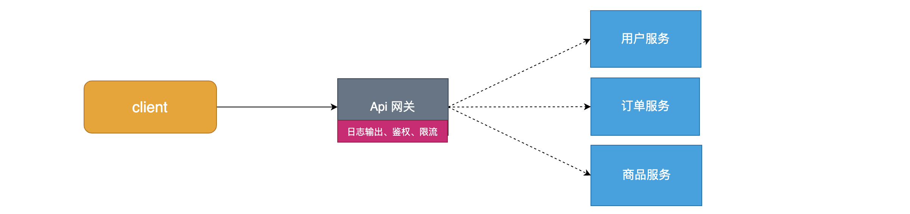

# SpringCloud

## 1.服务架构的演变

~~~
1、集中式架构
2、垂直拆分
3、分布式服务
4、服务治理SOA
5、微服务
~~~

### 1、集中式架构


缺点：

- 代码耦合，开发维护困难
- 无法针对不同模块进行针对性优化
- 无法水平扩展
- 单点容错率低，并发能力差

### 2、垂直拆分


优点：

- 系统拆分实现了流量分担，解决了并发问题
-  可以针对不同模块进行优化
- 方便水平扩展，负载均衡，容错率提高

缺点：

 - 系统间相互独立，但是不可避免会有一些系统间的调用带来的重复开发工作，影响开发效率

### 3、分布式服务


优点：

-  将基础服务进行了抽取，系统间相互调用，提高了代码复用和开发效率

缺点：

- 系统间耦合度变高，调用关系错综复杂，难以维护

~~~
出现了什么问题？
	- 服务越来越多，需要管理每个服务的地址
	- 调用关系错综复杂，难以理清依赖关系
	- 服务过多，服务状态难以管理，无法根据服务情况动态管理
~~~

### 4、服务治理SOA


~~~
服务治理要做什么？
	- 服务注册中心，实现服务自动注册和发现，无需人为记录服务地址
	- 服务自动订阅，服务列表自动推送，服务调用透明化，无需关心依赖关系
	- 动态监控服务状态监控报告，人为控制服务状态
缺点：
	- 服务间会有依赖关系，一旦某个环节出错会影响较大
	- 服务关系复杂，运维、测试部署困难，不符合DevOps思想
~~~

### 5、微服务


~~~
微服务的特点：
	- 单一职责：微服务中每一个服务都对应唯一的业务能力，做到单一职责
	- 微：微服务的服务拆分粒度很小，例如一个用户管理就可以作为一个服务。每个服务虽小，但“五脏俱全”。
	- 面向服务：面向服务是说每个服务都要对外暴露服务接口API。并不关心服务的技术实现，做到与平台和语言无关，也不限定用什么技术实现，只要提供Rest的接口即可。
	- 自治：自治是说服务间互相独立，互不干扰
  	- 团队独立：每个服务都是一个独立的开发团队，人数不能过多。
  	- 技术独立：因为是面向服务，提供Rest接口，使用什么技术没有别人干涉
  	- 前后端分离：采用前后端分离开发，提供统一Rest接口，后端不用再为PC、移动段开发不同接口
  	- 数据库分离：每个服务都使用自己的数据源
  	- 部署独立，服务间虽然有调用，但要做到服务重启不影响其它服务。有利于持续集成和持续交付。每个服务都是独立的组件，可复用，可替换，降低耦合，易维护
~~~

## 2.远程调用的方式⭐💡

==无论是微服务还是SOA，都面临着服务间的远程调用==。那么服务间的远程调用方式有哪些呢？

常见的远程调用方式有以下2种：

- RPC：Remote Produce Call远程过程调用，类似的还有RMI（remote method invoke）。自定义数据格式，基于原生TCP通信，==**速度快，效率高**==。早期的webservice，现在热门的dubbo，都是RPC的典型代表.

- Http：http其实是一种网络传输协议，基于TCP，规定了数据传输的格式。现在客户端浏览器与服务端通信基本都是采用Http协议，也可以用来进行远程服务调用。==缺点是消息封装臃肿，优势是对服务的提供和调用方没有任何技术限定，自由灵活，更符合微服务理念==。

  现在热门的Rest风格，就可以通过http协议来实现。

如果你们公司全部采用Java技术栈，那么使用Dubbo作为微服务架构是一个不错的选择。

相反，如果公司的技术栈多样化，而且你更青睐Spring家族，那么SpringCloud搭建微服务是不二之选。在我们的项目中，我们会==**选择SpringCloud套件，因此我们会使用Http方式来实现服务间调用**==。

### 2.1 RestTemplate远程调用

Spring提供了一个==RestTemplate模板工具类==，对**基于Http的客户端进行了封装**，RestTemplate封装了HttpClient、OkHttp、JDK原生的URLConnection，相当于他们的使用工具类，并且**实现了对象与json的序列化和反序列化**，非常方便。**我们会通过RestTemplate进行微服务的服务间的调用**。RestTemplate并没有限定Http的客户端类型，而是进行了抽象，目前常用的3种都有支持：

- HttpClient

- OkHttp

- JDK原生的URLConnection（默认的）

```java
package com.itheima.test;

import java.util.ArrayList;
import java.util.List;

import org.apache.http.NameValuePair;
import org.apache.http.client.entity.UrlEncodedFormEntity;
import org.apache.http.client.methods.HttpGet;
import org.apache.http.client.methods.HttpPost;
import org.apache.http.impl.client.BasicResponseHandler;
import org.apache.http.impl.client.CloseableHttpClient;
import org.apache.http.impl.client.HttpClients;
import org.apache.http.message.BasicNameValuePair;
import org.junit.Test;
import org.springframework.web.client.RestTemplate;

import com.fasterxml.jackson.databind.ObjectMapper;
import com.itheima.pojo.User;

public class Test01_http {
	
	private CloseableHttpClient httpClient = HttpClients.createDefault();
	
	/**
	 * httpClient完成get请求
	 * @throws Exception
	 */
	@Test
	public void test1() throws Exception {
		HttpGet request = new HttpGet("http://localhost:8080/user/3");
		String response = this.httpClient.execute(request, new BasicResponseHandler());
		System.out.println(response);
		
	}
	
	
	/**
	 * httpClient完成post请求
	 * @throws Exception
	 */
	@Test
	public void test2() throws Exception {
		HttpPost httpPost = new HttpPost("http://localhost:8080/user");
		//httpPost.setHeader("User-Agent","Mozilla/5.0 (Windows NT 10.0; WOW64) AppleWebKit/537.36 (KHTML, like Gecko) Chrome/56.0.2924.87 Safari/537.36");
		/*
		 * post带参数开始
		 */
		// 第一步：构造list集合，往里面丢数据
		List<NameValuePair> list = new ArrayList<NameValuePair>();
		BasicNameValuePair basicNameValuePair1 = new BasicNameValuePair("username", "xiaoyaya");
		BasicNameValuePair basicNameValuePair2 = new BasicNameValuePair("password", "666666");
		list.add(basicNameValuePair1);
		list.add(basicNameValuePair2);
		// 第二步：我们发现Entity是一个接口，所以只能找实现类，发现实现类又需要一个集合，集合的泛型是NameValuePair类型
		UrlEncodedFormEntity formEntity = new UrlEncodedFormEntity(list);
		// 第三步：通过setEntity 将我们的entity对象传递过去
		httpPost.setEntity(formEntity);
		
		
		//执行请求
		String response = this.httpClient.execute(httpPost, new BasicResponseHandler());
		System.out.println(response);
		
	}
	
	/**
	 * 返回字符串转成对象
	 * @throws Exception
	 */
	@Test
	public void test3() throws Exception {
		HttpGet request = new HttpGet("http://localhost:8080/user/3");
		String response = this.httpClient.execute(request, new BasicResponseHandler());
		System.out.println(response);
		
		System.out.println("字符串转成对象。。。。。");
		ObjectMapper om = new ObjectMapper();
		User user = om.readValue(response, User.class);
		System.out.println(user);
		System.out.println(user.getName());
		
	}	
	
	/**
	 * 2.Spring中的RestTemplate完成调用
	 * @throws Exception
	 */
	@Test
	public void test4() throws Exception {
		RestTemplate rt = new RestTemplate();
		User usr = rt.getForObject("http://localhost:8080/user/3", User.class);
		System.out.println(usr);		
	}
}
```

## 3.SpringCloud介绍⭐

SpringCloud是Spring旗下的项目之一，[官网地址：http://projects.spring.io/spring-cloud/](http://projects.spring.io/spring-cloud/)

Spring最擅长的就是集成，把世界上最好的框架拿过来，集成到自己的项目中。

SpringCloud也是一样，它将现在非常流行的一些技术整合到一起，实现了诸如：配置管理，服务发现，智能路由，负载均衡，熔断器，控制总线，集群状态等等功能。其主要涉及的组件包括：

Netflix公司旗下的一些开源组件：

- Eureka：注册中心 --> consul , zookeeper 
- Zuul：服务网关 
- Ribbon：负载均衡
- Feign：服务调用
- Hystix：熔断器

以上只是其中一部分，架构图：


**SpringCloud的版本**

SpringCloud的版本命名比较特殊，因为它不是一个组件，而是许多组件的集合，它的命名是以A到Z的为首字母的一些单词（其实是伦敦地铁站的名字）组成,不过从2020开始，SpringCloud重新以年份开始定义版本名：


我们在项目中，会是以Finchley的版本。

其中包含的组件，也都有各自的版本，如下表：

| Component                 | Edgware.SR4    | Finchley.SR1  | Finchley.BUILD-SNAPSHOT |
| ------------------------- | -------------- | ------------- | ----------------------- |
| spring-cloud-aws          | 1.2.3.RELEASE  | 2.0.0.RELEASE | 2.0.1.BUILD-SNAPSHOT    |
| spring-cloud-bus          | 1.3.3.RELEASE  | 2.0.0.RELEASE | 2.0.1.BUILD-SNAPSHOT    |
| spring-cloud-cli          | 1.4.1.RELEASE  | 2.0.0.RELEASE | 2.0.1.BUILD-SNAPSHOT    |
| spring-cloud-commons      | 1.3.4.RELEASE  | 2.0.1.RELEASE | 2.0.2.BUILD-SNAPSHOT    |
| spring-cloud-contract     | 1.2.5.RELEASE  | 2.0.1.RELEASE | 2.0.2.BUILD-SNAPSHOT    |
| spring-cloud-config       | 1.4.4.RELEASE  | 2.0.1.RELEASE | 2.0.2.BUILD-SNAPSHOT    |
| spring-cloud-netflix      | 1.4.5.RELEASE  | 2.0.1.RELEASE | 2.0.2.BUILD-SNAPSHOT    |
| spring-cloud-security     | 1.2.3.RELEASE  | 2.0.0.RELEASE | 2.0.1.BUILD-SNAPSHOT    |
| spring-cloud-cloudfoundry | 1.1.2.RELEASE  | 2.0.0.RELEASE | 2.0.1.BUILD-SNAPSHOT    |
| spring-cloud-consul       | 1.3.4.RELEASE  | 2.0.1.RELEASE | 2.0.2.BUILD-SNAPSHOT    |
| spring-cloud-sleuth       | 1.3.4.RELEASE  | 2.0.1.RELEASE | 2.0.2.BUILD-SNAPSHOT    |
| spring-cloud-stream       | Ditmars.SR4    | Elmhurst.SR1  | Elmhurst.BUILD-SNAPSHOT |
| spring-cloud-zookeeper    | 1.2.2.RELEASE  | 2.0.0.RELEASE | 2.0.1.BUILD-SNAPSHOT    |
| spring-boot               | 1.5.14.RELEASE | 2.0.4.RELEASE | 2.0.4.BUILD-SNAPSHOT    |
| spring-cloud-task         | 1.2.3.RELEASE  | 2.0.0.RELEASE | 2.0.1.BUILD-SNAPSHOT    |
| spring-cloud-vault        | 1.1.1.RELEASE  | 2.0.1.RELEASE | 2.0.2.BUILD-SNAPSHOT    |
| spring-cloud-gateway      | 1.0.2.RELEASE  | 2.0.1.RELEASE | 2.0.2.BUILD-SNAPSHOT    |
| spring-cloud-openfeign    |                | 2.0.1.RELEASE | 2.0.2.BUILD-SNAPSHOT    |
| spring-cloud-function     | 1.0.0.RELEASE  | 1.0.0.RELEASE | 1.0.1.BUILD-SNAPSHOT    |

接下来，我们就一一学习SpringCloud中的重要组件。

## 4.Eureka组件⭐💡

### 4.1 Eureka入门案例搭建

-==场景介绍：==

```
主要角色：
	- 服务提供者: 提供数据的一方，用户提供者查询数据库数据，在接口返回
	- 服务消费者: 获取数据的一方，调用提供者项目，获取用户数据
```

==思路图：==


#### 4.1.1搭建服务提供者

服务提供方默认8081端口。

服务提供者的搭建步骤如下：

- 1、创建工程导入起步依赖：web、SpringDataJpa、mysql驱动
- 2、准备好数据库表和用户实体类
- 3、编写SpringDataJpa规范的Dao接口
- 4、编写Service层业务类
- 5、编写Controller
- 6、编写application.yml配置文件
- 7、编写启动类【引导类】
- 8、启动并测试接口

~~~xml
<project xmlns="http://maven.apache.org/POM/4.0.0"
	xmlns:xsi="http://www.w3.org/2001/XMLSchema-instance"
	xsi:schemaLocation="http://maven.apache.org/POM/4.0.0 https://maven.apache.org/xsd/maven-4.0.0.xsd">
	<modelVersion>4.0.0</modelVersion>
	<groupId>com.atguigu</groupId>
	<artifactId>springcloud-provider</artifactId>
	<version>0.0.1-SNAPSHOT</version>
	<parent>
		<groupId>org.springframework.boot</groupId>
		<artifactId>spring-boot-starter-parent</artifactId>
		<version>2.0.1.RELEASE</version>
		<relativePath />
	</parent>

	<properties>
		<project.build.sourceEncoding>UTF-8</project.build.sourceEncoding>
		<project.reporting.outputEncoding>UTF-8</project.reporting.outputEncoding>
		<java.version>1.8</java.version>
	</properties>

	<dependencies>
		<dependency>
			<groupId>org.springframework.boot</groupId>
			<artifactId>spring-boot-starter-web</artifactId>
		</dependency>
		<dependency>
			<groupId>org.springframework.boot</groupId>
			<artifactId>spring-boot-starter-data-jpa</artifactId>
		</dependency>
		<dependency>
			<groupId>mysql</groupId>
			<artifactId>mysql-connector-java</artifactId>
			<scope>runtime</scope>
		</dependency>
		<dependency>
			<groupId>org.springframework.boot</groupId>
			<artifactId>spring-boot-starter-test</artifactId>
			<scope>test</scope>
		</dependency>
	</dependencies>

</project>
~~~

~~~mysql
CREATE TABLE user_info (
  `user_Id` int(11) NOT NULL DEFAULT '0',
  `name` varchar(255) DEFAULT NULL,
  `password` varchar(255) DEFAULT NULL,
  `user_Name` varchar(50) DEFAULT NULL,
  PRIMARY KEY (`user_Id`)
)

INSERT INTO user_info
(user_Id, name, password, user_Name)
VALUES(2, 'heheda', '123456', '部落里无敌公司');
~~~

**pojo**

~~~java
package com.atguigu.pojo;

import java.io.Serializable;

import javax.persistence.Column;
import javax.persistence.Entity;
import javax.persistence.GeneratedValue;
import javax.persistence.GenerationType;
import javax.persistence.Id;
import javax.persistence.Table;

/**
   * 用户实体类
 * @author Admin
 *
 */
@Entity
@Table(name="user_info")
public class User implements Serializable{
	@Id
	@GeneratedValue(strategy = GenerationType.IDENTITY)
	@Column(name ="user_Id")
	private Integer id;
	
	@Column(name="user_Name") 
	private String userName;
	
	@Column(name="password")
	private String password;
	
	@Column(name="name")
	private String name;

	public Integer getId() {
		return id;
	}

	public void setId(Integer id) {
		this.id = id;
	}

	

	public String getUserName() {
		return userName;
	}

	public void setUserName(String userName) {
		this.userName = userName;
	}

	public String getPassword() {
		return password;
	}

	public void setPassword(String password) {
		this.password = password;
	}

	public String getName() {
		return name;
	}

	public void setName(String name) {
		this.name = name;
	}

	@Override
	public String toString() {
		return "User [id=" + id + ", username=" + userName + ", password=" + password + ", name=" + name + "]";
	}
}
~~~

**dao**

~~~java
package com.atguigu.dao;

import org.springframework.data.jpa.repository.JpaRepository;

import com.atguigu.pojo.User;
/**
 * dao接口
 * @author Admin
 *
 */
public interface UserDao extends JpaRepository<User, Integer>{
}
~~~

**service**

~~~java
package com.atguigu.service;

import java.util.Optional;

import org.springframework.beans.factory.annotation.Autowired;
import org.springframework.stereotype.Component;

import com.atguigu.dao.UserDao;
import com.atguigu.pojo.User;

@Component
public class UserService {
	@Autowired
	private UserDao userDao;
	
    public User findById(Integer id) {
    	Optional<User> optional = userDao.findById(id);
    	return optional.get();
    }
}
~~~

**controller**

~~~java
package com.atguigu.controller;

import org.springframework.beans.factory.annotation.Autowired;
import org.springframework.web.bind.annotation.GetMapping;
import org.springframework.web.bind.annotation.PathVariable;
import org.springframework.web.bind.annotation.RestController;

import com.atguigu.pojo.User;
import com.atguigu.service.UserService;

/**
 *    控制器
 * @author Admin
 *
 */
@RestController
public class UserController {
	@Autowired
	private UserService userService;
	
	@GetMapping("/user/{id}")
    public User findById(@PathVariable Integer id) {
    	return userService.findById(id);
    }
}
~~~

**配置文件**

~~~yaml
# 端口
server:
  port: 8081

# 数据源
spring:
  datasource:
    driver-class-name: com.mysql.jdbc.Driver
    url: jdbc:mysql://localhost:3306/test
    username: root
    password: 123456
  jpa:
    show-sql: true
~~~

**启动类**

~~~java
package com.atguigu;

import org.springframework.boot.SpringApplication;
import org.springframework.boot.autoconfigure.SpringBootApplication;

@SpringBootApplication
public class ProviderApplication {
	public static void main(String[] args) {
		SpringApplication.run(ProviderApplication.class, args);
	}

}
~~~

#### 4.1.2 搭建服务消费者

服务消费方默认8080端口

==**搭建服务消费者步骤：**==

- 1、创建工程并导入依赖：web
- 2、编写启动类，并在启动类中配置RestTemplate
- 3、编写Controller： 调用服务提供者接口

- 4、启动并测试

~~~xml
<project xmlns="http://maven.apache.org/POM/4.0.0"
	xmlns:xsi="http://www.w3.org/2001/XMLSchema-instance"
	xsi:schemaLocation="http://maven.apache.org/POM/4.0.0 https://maven.apache.org/xsd/maven-4.0.0.xsd">
	<modelVersion>4.0.0</modelVersion>
	<groupId>com.atguigu</groupId>
	<artifactId>springcloud-consumer</artifactId>
	<version>0.0.1-SNAPSHOT</version>
	<parent>
		<groupId>org.springframework.boot</groupId>
		<artifactId>spring-boot-starter-parent</artifactId>
		<version>2.0.1.RELEASE</version>
		<relativePath />
	</parent>

	<properties>
		<project.build.sourceEncoding>UTF-8</project.build.sourceEncoding>
		<project.reporting.outputEncoding>UTF-8</project.reporting.outputEncoding>
		<java.version>1.8</java.version>
	</properties>

	<dependencies>
		<dependency>
			<groupId>org.springframework.boot</groupId>
			<artifactId>spring-boot-starter-web</artifactId>
		</dependency>
	</dependencies>
</project>
~~~

**controller**

~~~java
package com.atguigu.controller;

import org.springframework.beans.factory.annotation.Autowired;
import org.springframework.web.bind.annotation.GetMapping;
import org.springframework.web.bind.annotation.PathVariable;
import org.springframework.web.bind.annotation.RestController;
import org.springframework.web.client.RestTemplate;

@RestController
public class ConsumerController {
	@Autowired
	private RestTemplate restTemplate;
	
	@GetMapping("/consumer/{id}")
    public String consumer(@PathVariable Integer id) {
    	String urlString = "http://localhost:8081/user/"+id;
        
    	// 远程调用
    	String user = restTemplate.getForObject(urlString, String.class);
        return user;
	}
}

~~~

**启动类**

~~~java
package com.atguigu;

import org.springframework.boot.SpringApplication;
import org.springframework.boot.autoconfigure.SpringBootApplication;
import org.springframework.context.annotation.Bean;
import org.springframework.web.client.RestTemplate;

@SpringBootApplication
public class ConsumerApplication {
	public static void main(String[] args) {
		SpringApplication.run(ConsumerApplication.class, args);
	}
	
	// 创建一个Rest模板
	@Bean
	public RestTemplate restTemplate() {
		return  new RestTemplate();
	}

}
~~~


可以看到，我们已经可以进行基本的远程调用啦。

### 4.2注册中心Eureka的引入和搭建⭐💡

上一步搭建的微服务场景出现的问题：

```
- 在consumer中，我们把url地址硬编码到了代码中，不方便后期维护
- consumer需要记忆user-service的地址，如果出现变更，可能得不到通知，地址将失效
- consumer不清楚user-service的状态，服务宕机也不知道
- user-service只有1台服务，不具备高可用性
- 即便user-service形成集群，consumer还需自己实现负载均衡
```

 

renewal：续约

- ==Eureka-Server==：就是服务注册中心（可以是一个集群），对外暴露自己的地址。
- ==提供者==：启动后向Eureka注册自己信息（地址，服务名称等），并且定期进行服务续约
- ==消费者==：服务调用方，会定期去Eureka拉取服务列表，然后使用负载均衡算法选出一个服务进行调用。
- ==心跳(续约)==：提供者定期通过http方式向Eureka刷新自己的状态

我们下面来搭建==Eureke-server服务注册中心工程==。

####  4.2.1 Eureke-server工程搭建


**依赖**

在导入依赖坐标的时候1，由于可能阿里云没有这个jar,所以要先将阿里云远程仓库地址注释掉。

~~~xml
<project xmlns="http://maven.apache.org/POM/4.0.0"
	xmlns:xsi="http://www.w3.org/2001/XMLSchema-instance"
	xsi:schemaLocation="http://maven.apache.org/POM/4.0.0 https://maven.apache.org/xsd/maven-4.0.0.xsd">
	<modelVersion>4.0.0</modelVersion>
	<groupId>com.atguigu</groupId>
	<artifactId>eureka</artifactId>
	<version>0.0.1-SNAPSHOT</version>
	<parent>
		<groupId>org.springframework.boot</groupId>
		<artifactId>spring-boot-starter-parent</artifactId>
		<version>2.0.1.RELEASE</version>
		<relativePath />
	</parent>

	<properties>
		<project.build.sourceEncoding>UTF-8</project.build.sourceEncoding>
		<project.reporting.outputEncoding>UTF-8</project.reporting.outputEncoding>
		<java.version>1.8</java.version>
		<!-- SpringCloud版本，F系列 -->
		<spring-cloud.version>Finchley.RC1</spring-cloud.version>
	</properties>

	<dependencies>
		<!-- Eureka服务端 -->
		<dependency>
			<groupId>org.springframework.cloud</groupId>
			<artifactId>spring-cloud-starter-netflix-eureka-server</artifactId>
		</dependency>
	</dependencies>

	<dependencyManagement>
		<dependencies>
			<!-- SpringCloud依赖，一定要放到dependencyManagement中，起到管理版本的作用即可 -->
			<dependency>
				<groupId>org.springframework.cloud</groupId>
				<artifactId>spring-cloud-dependencies</artifactId>
				<version>${spring-cloud.version}</version>
				<type>pom</type>
				<scope>import</scope>
			</dependency>
		</dependencies>
	</dependencyManagement>

	<repositories>
		<repository>
			<id>spring-milestones</id>
			<name>Spring Milestones</name>
			<url>https://repo.spring.io/milestone</url>
			<snapshots>
				<enabled>false</enabled>
			</snapshots>
		</repository>
	</repositories>

</project>
~~~

编写引导类，==需要加上@EnableEurekaServer注解，==**这个注解用来标记当前工程是Eureka服务器的服务端**

~~~java
package com.atguigu;

import org.springframework.boot.SpringApplication;
import org.springframework.boot.autoconfigure.SpringBootApplication;
import org.springframework.cloud.netflix.eureka.server.EnableEurekaServer;

@SpringBootApplication
@EnableEurekaServer  // 开启注册中心服务
public class EurekaAppliation {
	public static void main(String[] args) {
		SpringApplication.run(EurekaAppliation.class, args);
	}

}
~~~

**配置文件**

~~~yaml
server:
  port: 10086
~~~

此时，我们访问http://localhost:10086/，可以看到，eureka服务端开启：


#### 4.2.2 解决EurekaServer工程报错问题

刚才我们访问http://localhost:10086/，可以看到Eureka服务端已经启动成功，但是我们查看后台日志，发现后台日志一直在重复报错！


查看我们导入的pom依赖，可以看到：


**原因如下**：

- 1.EurekaServer服务端里面内置了一个EurekaClient客户端，而客户端程序实际上需要注册到服务端，并且EurekaServer服务端有一个默认端口==8761==，由于我们修改了端口号，导致客户端找不到服务端而连接不上。
- 2.之所以会有客户端，是因为==注册中心需要考虑到集群高可用==，这就意味着**注册中心彼此之间需要相互注册**。

**解决方案**：

修改配置文件，告诉客户端服务端的地址，这样就可以注册成功！

~~~yaml
server:
  port: 10086
  
#配置服务ID
spring:
  application:
    name: eureka-server   # 不要大写和下划线
    
# 配置Eureka客户端：
eureka:
  client:
    service-url:
      defaultZone: http://localhost:10086/eureka/   #告诉现在Eureka客户端真正的注册中心的地址
      
~~~


虽然配置这样以后。可以注册成功，但是还是会出现一次这个错误，这是因为：

>当服务初始化的时候，server还没有准备，这时候client马上注册到server端，所以就报错
>后面当服务端启动完成之后，客户端就能正常和服务端通信

为了彻底解决这个错误，我们还可以继续修改配置，但是后面我们一般不会这样配，因为这样配置索然后台不报错，但是自己也不会注册自己。这里只是说明演示一下：

~~~yaml
server:
  port: 10086
#配置服务id
spring:
  application:
    name: eureka-server   # 不要大写和下划线
#配置eureka客户端配置
eureka:
  client:
    register-with-eureka: false  # 不让当前服务注册到注册中心
    fetch-registry: false #不拉取注册信息
    service-url:
      defaultZone: http://localhost:10086/eureka/  #告诉现在真正的注册中心的地址
~~~

### 4.3 服务注册⭐💡

有了注册中心以后，我们就可以往注册中心中注册服务啦。

==**服务注册的步骤如下**==：

- 导入EurekaClient起步依赖
- 在启动类中启用EurekaClient的使用
- 在配置文件中配置Eureka服务端的地址
- 查看服务列表

**导入EurekaClient起步依赖**

~~~xml
<project xmlns="http://maven.apache.org/POM/4.0.0"
	xmlns:xsi="http://www.w3.org/2001/XMLSchema-instance"
	xsi:schemaLocation="http://maven.apache.org/POM/4.0.0 https://maven.apache.org/xsd/maven-4.0.0.xsd">
	<modelVersion>4.0.0</modelVersion>
	<groupId>com.atguigu</groupId>
	<artifactId>springcloud-provider</artifactId>
	<version>0.0.1-SNAPSHOT</version>
	<parent>
		<groupId>org.springframework.boot</groupId>
		<artifactId>spring-boot-starter-parent</artifactId>
		<version>2.0.1.RELEASE</version>
		<relativePath />
	</parent>

	<properties>
		<project.build.sourceEncoding>UTF-8</project.build.sourceEncoding>
		<project.reporting.outputEncoding>UTF-8</project.reporting.outputEncoding>
		<java.version>1.8</java.version>
	</properties>


	<dependencies>
		<dependency>
			<groupId>org.springframework.boot</groupId>
			<artifactId>spring-boot-starter-web</artifactId>
		</dependency>
		<dependency>
			<groupId>org.springframework.boot</groupId>
			<artifactId>spring-boot-starter-data-jpa</artifactId>
		</dependency>
		<dependency>
			<groupId>mysql</groupId>
			<artifactId>mysql-connector-java</artifactId>
			<scope>runtime</scope>
		</dependency>
		<dependency>
			<groupId>org.springframework.boot</groupId>
			<artifactId>spring-boot-starter-test</artifactId>
			<scope>test</scope>
		</dependency>
		<!-- Eureka客户端 -->
		<dependency>
			<groupId>org.springframework.cloud</groupId>
			<artifactId>spring-cloud-starter-netflix-eureka-client</artifactId>
		</dependency>
	</dependencies>

	<!-- SpringCloud的依赖 -->
	<dependencyManagement>
		<dependencies>
			<dependency>
				<groupId>org.springframework.cloud</groupId>
				<artifactId>spring-cloud-dependencies</artifactId>
				<version>Finchley.RC1</version>
				<type>pom</type>
				<scope>import</scope>
			</dependency>
		</dependencies>
	</dependencyManagement>
	<!-- Spring的仓库地址 -->
	<repositories>
		<repository>
			<id>spring-milestones</id>
			<name>Spring Milestones</name>
			<url>https://repo.spring.io/milestone</url>
			<snapshots>
				<enabled>false</enabled>
			</snapshots>
		</repository>
	</repositories>
</project>
~~~

****

**在启动类中启用EurekaClient的使用**

~~~java
package com.atguigu;

import org.springframework.boot.SpringApplication;
import org.springframework.boot.autoconfigure.SpringBootApplication;
import org.springframework.cloud.client.discovery.EnableDiscoveryClient;
import org.springframework.cloud.netflix.eureka.EnableEurekaClient;

@SpringBootApplication
// @EnableEurekaClient   由于这个注解代表是只能注册到Eureka服务端，限定只能用eureka，但是注册中心可能不仅仅是EUREKA，所以我们用下面这个注解
@EnableDiscoveryClient // 一般用这个，服务发现
public class ProviderApplication {
	public static void main(String[] args) {
		SpringApplication.run(ProviderApplication.class, args);
	}

}
~~~

****

**在配置文件中配置Eureka服务端的地址**

~~~yaml
spring:
  datasource:
    driver-class-name: com.mysql.jdbc.Driver
    url: jdbc:mysql://localhost:3306/test
    username: root
    password: 123456
  jpa:
    show-sql: true
  application:
    name: user-service #定义服务ID
 
#eurek配置
eureka:
  client:
    service-url:
      defaultZone: http://localhost:10086/eureka/
~~~

可以看到，服务提供者已经被注册成功啦


### 4.4 服务拉取⭐💡

我们的服务提供方微服务注册以后，我们的服务消费方就可以去注册中心拉取已经注册的微服务。

==步骤如下：==

- 导入EurekaClient起步依赖
- 在启动类中启用EurekaClient的使用
- 在配置文件中配置Eureka服务端的地址
- 在Controller中注入**DiscoveryClient**拉取服务提供方的IP和端口。
- 重启测试

**导入EurekaClient起步依赖**

~~~xml
<project xmlns="http://maven.apache.org/POM/4.0.0"
	xmlns:xsi="http://www.w3.org/2001/XMLSchema-instance"
	xsi:schemaLocation="http://maven.apache.org/POM/4.0.0 https://maven.apache.org/xsd/maven-4.0.0.xsd">
	<modelVersion>4.0.0</modelVersion>
	<groupId>com.atguigu</groupId>
	<artifactId>springcloud-consumer</artifactId>
	<version>0.0.1-SNAPSHOT</version>
	<parent>
		<groupId>org.springframework.boot</groupId>
		<artifactId>spring-boot-starter-parent</artifactId>
		<version>2.0.1.RELEASE</version>
		<relativePath />
	</parent>

	<properties>
		<project.build.sourceEncoding>UTF-8</project.build.sourceEncoding>
		<project.reporting.outputEncoding>UTF-8</project.reporting.outputEncoding>
		<java.version>1.8</java.version>
	</properties>

	<dependencies>
		<dependency>
			<groupId>org.springframework.boot</groupId>
			<artifactId>spring-boot-starter-web</artifactId>
		</dependency>
		<!-- Eureka客户端 -->
		<dependency>
			<groupId>org.springframework.cloud</groupId>
			<artifactId>spring-cloud-starter-netflix-eureka-client</artifactId>
		</dependency>
	</dependencies>

	<!-- SpringCloud的依赖 -->
	<dependencyManagement>
		<dependencies>
			<dependency>
				<groupId>org.springframework.cloud</groupId>
				<artifactId>spring-cloud-dependencies</artifactId>
				<version>Finchley.RC1</version>
				<type>pom</type>
				<scope>import</scope>
			</dependency>
		</dependencies>
	</dependencyManagement>
	<!-- Spring的仓库地址 -->
	<repositories>
		<repository>
			<id>spring-milestones</id>
			<name>Spring Milestones</name>
			<url>https://repo.spring.io/milestone</url>
			<snapshots>
				<enabled>false</enabled>
			</snapshots>
		</repository>
	</repositories>
</project>
~~~

**在启动类中启用EurekaClient的使用**

~~~java
package com.atguigu;

import org.springframework.boot.SpringApplication;
import org.springframework.boot.autoconfigure.SpringBootApplication;
import org.springframework.cloud.client.discovery.EnableDiscoveryClient;
import org.springframework.context.annotation.Bean;
import org.springframework.web.client.RestTemplate;

@SpringBootApplication
@EnableDiscoveryClient
public class ConsumerApplication {
	public static void main(String[] args) {
		SpringApplication.run(ConsumerApplication.class, args);
	}
	
	// 创建一个Rest模板
	@Bean
	public RestTemplate restTemplate() {
		return  new RestTemplate();
	}

}
~~~

****

**在配置文件中配置Eureka服务端的地址**

~~~yaml
# 端口
server:
  port: 8080

# 数据源
spring:
  application:
    name: user-consumer #定义服务ID
 
#eurek配置
eureka:
  client:
    service-url:
      defaultZone: http://localhost:10086/eureka/
      
~~~

****

**在Controller中注入**DiscoveryClient**拉取服务提供方的IP和端口**

~~~java
package com.atguigu.controller;

import java.util.List;
import java.util.Random;

import org.springframework.beans.factory.annotation.Autowired;
import org.springframework.cloud.client.ServiceInstance;
import org.springframework.cloud.client.discovery.DiscoveryClient;
import org.springframework.web.bind.annotation.GetMapping;
import org.springframework.web.bind.annotation.PathVariable;
import org.springframework.web.bind.annotation.RestController;
import org.springframework.web.client.RestTemplate;

@RestController
public class ConsumerController {
	@Autowired
	private RestTemplate restTemplate;
	
	@Autowired
	private DiscoveryClient DiscoveryClient;
	
	@GetMapping("/consumer/{id}")
    public String consumer(@PathVariable Integer id) {
		// 1.通过接口获取IP和端口信息
		List<ServiceInstance> instances = DiscoveryClient.getInstances("USER-SERVICE");
		
		/*
		 * 返回的list集合可以方便我们使用负载均衡算法：随机、轮询、哈希、权重
		  instances.get(new Random().nextInt(instances.size()));
		*/
		
		// 2.我们现在只有一个服务提供方，所以我们直接获取第一个就可以啦
		ServiceInstance serviceInstance = instances.get(0);
		String host = serviceInstance.getHost();
		int port = serviceInstance.getPort();
		
		
    	String urlString = "http://"+host+":"+port+"/user/"+id;
    	// 远程调用
    	String user = restTemplate.getForObject(urlString, String.class);
        return user;
	}
	
	
	
	/*
	 * 这是我们的第一种操作方式
	* 
	* 
	@Autowired
	private RestTemplate restTemplate;
	
	@GetMapping("/consumer/{id}")
    public String consumer(@PathVariable Integer id) {
    	String urlString = "http://localhost:8081/user/"+id;
    	// 远程调用
    	String user = restTemplate.getForObject(urlString, String.class);
        return user;
	}
	
	*/
}
~~~

### 4.5 注册中心的高可用配置⭐🐂

Eureka Server即服务的注册中心，在刚才的案例中，我们只有一个EurekaServer，事实上EurekaServer也可以是一个集群，形成高可用的Eureka中心。

多个Eureka Server之间也会互相注册为服务，当服务提供者注册到Eureka Server集群中的某个节点时，该节点会把服务的信息同步给集群中的每个节点，从而实现高可用集群。因此，无论客户端访问到Eureka Server集群中的任意一个节点，都可以获取到完整的服务列表信息。而作为客户端，需要把信息注册到每个Eureka中。

我们现在想要让注册中心实现高可用配置，为此注册中心需要实现集群，我们让注册中心1的端口为10086，注册中心2的端口为10087。

实现注册中心的高可用需要分成两部分：

- **1.注册中心自己形成集群，每个注册中心成员需要相互注册**


此时可以看到注册中心已经有两台机啦。这个时候我们需要修改配置文件，由于两台机==共用一个配置文件，我们需要修改完启动一台，再修改再启动即可！==或者我们也可以按照如下的方式修改：


==也就是10086注册到10087上，而10087注册到10086上。这样就形成高可用配置啦！。==

**10086的注册中心1的配置文件**：10086注册到10087上

~~~yaml
server:
  port: 10086
  
#配置服务ID
spring:
  application:
    name: eureka-server   # 不要大写和下划线
    
#配置eureka客户端配置
eureka:
  client:
    # register-with-eureka: false  # 不让当前服务注册到注册中心
    # fetch-registry: false #不拉取注册信息
    service-url:
      defaultZone: http://localhost:10087/eureka/  #告诉现在真正的注册中心的地址
     
~~~

**10087注册中心2的配置文件**：10087注册到10086上

~~~yaml
server:
  port: 10087
  
#配置服务ID
spring:
  application:
    name: eureka-server   # 不要大写和下划线
    
#配置eureka客户端配置
eureka:
  client:
    # register-with-eureka: false  # 不让当前服务注册到注册中心
    # fetch-registry: false #不拉取注册信息
    service-url:
      defaultZone: http://localhost:10086/eureka/  #告诉现在真正的注册中心的地址
     
~~~

此时我们访问http://localhost:10087/,可以看到高可用的配置已经配置完毕！


- **2.服务提供方和服务消费方需要同时注册到多个注册中心上**

**服务消费方配置文件**

~~~yaml
# 端口
server:
  port: 8080

# 数据源
spring:
  application:
    name: user-consumer #定义服务ID
 
#eurek配置
eureka:
  client:
    service-url: #多个注册中心，用逗号分割
      defaultZone: http://localhost:10086/eureka/,http://localhost:10087/eureka/
~~~

**服务提供方配置文件**

~~~yaml
# 端口
server:
  port: 8081

# 数据源
spring:
  datasource:
    driver-class-name: com.mysql.jdbc.Driver
    url: jdbc:mysql://localhost:3306/test
    username: root
    password: 123456
  jpa:
    show-sql: true
  application:
    name: user-service #定义服务ID
 
#eurek配置
eureka:
  client:
    service-url:
      defaultZone: http://localhost:10086/eureka/,http://localhost:10087/eureka/
      
~~~

### 4.6 服务提供者的其他配置⭐🐂

服务提供者在启动时，会检测配置属性中的：eureka.client.register-with-erueka=true参数是否正确，事实上默认就是true。如果值确实为true，则会向EurekaServer发起一个Rest请求，并携带自己的元数据信息，Eureka Server会把这些信息保存到一个双层Map结构中。第一层Map的Key就是服务名称，第二层Map的key是服务的实例id。

我们还可以定义服务提供者的一些配置：

- 1、可以自定义上报ip地址
- 2、可以自定义本身的实例ID
- 3、配置续约时间

==1.可以自定义上报ip地址==


我们注册到注册中心的host主机名我们是可以修改成我们想要的配置的，为此我们修改服务提供方的配置文件：

~~~yaml
# 端口
server:
  port: 8081

# 数据源
spring:
  datasource:
    driver-class-name: com.mysql.jdbc.Driver
    url: jdbc:mysql://localhost:3306/test
    username: root
    password: 123456
  jpa:
    show-sql: true
  application:
    name: user-service #定义服务ID
 
#eurek配置
eureka:
  client:
    service-url:
      defaultZone: http://localhost:10086/eureka/,http://localhost:10087/eureka/
  instance:
    prefer-ip-address: true  #这个设置为true代表上报自己的ip，而不是用主机名  
    ip-address: 127.0.0.1    # 代表注册的ip地址为自己指定的IP，而不是默认获取的 host  "192.168.0.104" 
    
~~~


==2、可以自定义本身的实例ID==

我们默认注册到注册中心上展示到status栏的就是实例ID，我们还可以修改展示在Eureka上的ID名。

~~~yaml
# 端口
server:
  port: 8081

# 数据源
spring:
  datasource:
    driver-class-name: com.mysql.jdbc.Driver
    url: jdbc:mysql://localhost:3306/test
    username: root
    password: 123456
  jpa:
    show-sql: true
  application:
    name: user-service #定义服务ID
 
#eurek配置
eureka:
  client:
    service-url:
      defaultZone: http://localhost:10086/eureka/,http://localhost:10087/eureka/
  instance:
    prefer-ip-address: true  #这个设置为true代表上报自己的ip，而不是用主机名  
    ip-address: 127.0.0.1    # 代表注册的ip地址为自己指定的IP，而不是默认获取的 host  "192.168.0.104"
    instance-id:  ${eureka.instance.ip-address}:${server.port} #自定义实例ID
    
~~~


==3、配置续约时间==

eureka客户端默认续约时间是30秒每次，我们可以修改这个续约时间！

~~~yaml
# 端口
server:
  port: 8081

# 数据源
spring:
  datasource:
    driver-class-name: com.mysql.jdbc.Driver
    url: jdbc:mysql://localhost:3306/test
    username: root
    password: 123456
  jpa:
    show-sql: true
  application:
    name: user-service #定义服务ID
 
#eurek配置
eureka:
  client:
    service-url:
      defaultZone: http://localhost:10086/eureka/,http://localhost:10087/eureka/
  instance:
    lease-renewal-interval-in-seconds: 30 #默认值是30秒，生产环境一般不会改
    prefer-ip-address: true  #这个设置为true代表上报自己的ip，而不是用主机名  
    ip-address: 127.0.0.1    # 代表注册的ip地址为自己指定的IP，而不是默认获取的 host  "192.168.0.104"
    instance-id:  ${eureka.instance.ip-address}:${server.port} #自定义实例ID 
~~~

### 4.7 服务消费者的其他配置

当服务消费者启动时，会检测eureka.client.fetch-registry=true参数的值，如果为true，则会从Eureka Server服务的列表只读备份，然后缓存在本地。并且每隔30秒会重新获取并更新数据。我们也可以修改这个值。

~~~yaml
# 端口
server:
  port: 8080

# 数据源
spring:
  application:
    name: user-consumer #定义服务ID
 
#eurek配置
eureka:
  client:
    registry-fetch-interval-seconds: 30  #服务拉取时间，默认值也是30秒 生产环境一般不会改
    instance-info-replication-interval-seconds: 5 # 实例替换时间
    service-url: #多个注册中心，用逗号分割
      defaultZone: http://localhost:10086/eureka/,http://localhost:10087/eureka/
      
~~~

### 4.8 服务下线、失效剔除

当服务进行正常关闭操作时，它会触发一个服务下线的REST请求给Eureka Server，告诉服务注册中心：“我要下线了”。服务中心接受到请求之后，将该服务置为==下线状态==。

而有时我们的服务可能由于内存溢出或网络故障等原因使得服务不能正常的工作，而服务注册中心并未收到“服务下线”的请求。相对于服务提供者的“服务续约”操作，服务注册中心在启动时会创建一个定时任务，默认每隔一段时间（默认为60秒）将当前清单中超时（默认为90秒）没有续约的服务剔除，这个操作被称为==失效剔除==。

查看java的后台进程：jps
windows演示杀死进程： taskkill [/pid] [id值] [/F]   

可以通过eureka.server.eviction-interval-timer-in-ms参数对其进行修改，单位是毫秒。

我们异常暴力关停一个服务，就会在Eureka面板看到一条警告：


```
这是触发了Eureka的自我保护机制。当服务未按时进行心跳续约时，Eureka会统计服务实例最近15分钟心跳续约的比例是否低于了85%。在生产环境下，因为网络延迟等原因，心跳失败实例的比例很有可能超标，但是此时就把服务剔除列表并不妥当，因为服务可能没有宕机。Eureka在这段时间内不会剔除任何服务实例，直到网络恢复正常。生产环境下这很有效，保证了大多数服务依然可用，不过也有可能获取到失败的服务实例，因此服务调用者必须做好服务的失败容错。
```

我们可以通过下面的配置来关停自我保护：

```yaml
eureka:
  server:
    enable-self-preservation: false # 关闭自我保护模式（缺省为打开）
```

## 5.Ribbon组件⭐🐏

Ribbon是一个负载均衡组件，默认是集成在Eureka中，默认使用的策略是负载均衡，我们使用它需要

ureka中已经集成了Ribbon，所以我们无需引入新的依赖。直接修改代码：

在RestTemplate添加@LoadBalanced注解：

~~~java
package com.atguigu;

import org.springframework.boot.SpringApplication;
import org.springframework.boot.autoconfigure.SpringBootApplication;
import org.springframework.cloud.client.discovery.EnableDiscoveryClient;
import org.springframework.cloud.client.loadbalancer.LoadBalanced;
import org.springframework.context.annotation.Bean;
import org.springframework.web.client.RestTemplate;

@SpringBootApplication
@EnableDiscoveryClient
public class ConsumerApplication {
	public static void main(String[] args) {
		SpringApplication.run(ConsumerApplication.class, args);
	}
	
	// 创建一个Rest模板
	@Bean
	@LoadBalanced   // 开启负载均衡
	public RestTemplate restTemplate() {
		return  new RestTemplate();
	}
}
~~~

~~~java
package com.atguigu.controller;

import java.util.List;
import java.util.Random;

import org.springframework.beans.factory.annotation.Autowired;
import org.springframework.cloud.client.ServiceInstance;
import org.springframework.cloud.client.discovery.DiscoveryClient;
import org.springframework.web.bind.annotation.GetMapping;
import org.springframework.web.bind.annotation.PathVariable;
import org.springframework.web.bind.annotation.RestController;
import org.springframework.web.client.RestTemplate;

@RestController
public class ConsumerController {
	@Autowired
	private RestTemplate restTemplate;
		
	@GetMapping("/consumer/{id}")
    public String consumer(@PathVariable Integer id) {
		// 负载均衡：把ip替换成服务ID
    	String urlString = "http://USER-SERVICE/user/"+id;
    	// 远程调用
    	String user = restTemplate.getForObject(urlString, String.class);
        return user;
	}
	
}

~~~

我们也可以修改他的默认的负载均衡策略，默认策略是**轮询**。

### Ribbon负载均衡策略

```markdown
# 1.ribbon负载均衡算法
- RoundRobinRule         		轮训策略	按顺序循环选择 Server 
- RandomRule             		随机策略	随机选择 Server  
- AvailabilityFilteringRule 可用过滤策略
 	`会先过滤由于多次访问故障而处于断路器跳闸状态的服务，还有并发的连接数量超过阈值的服务，然后对剩余的服务列表按照轮询策略进行		访问

- WeightedResponseTimeRule  响应时间加权策略   
	`根据平均响应的时间计算所有服务的权重，响应时间越快服务权重越大被选中的概率越高，刚启动时如果统计信息不足，则使用		
		RoundRobinRule策略，等统计信息足够会切换到

- RetryRule                 重试策略          
	`先按照RoundRobinRule的策略获取服务，如果获取失败则在制定时间内进行重试，获取可用的服务。
	
- BestAviableRule           最低并发策略     
	`会先过滤掉由于多次访问故障而处于断路器跳闸状态的服务，然后选择一个并发量最小的服务
```


### 修改服务的默认负载均衡策略

SpringBoot也帮我们提供了修改负载均衡规则的配置入口：

~~~yaml
user-service:
  ribbon:
    NFLoadBalancerRuleClassName: com.netflix.loadbalancer.RandomRule
~~~

格式是：==**{服务名称}.ribbon.NFLoadBalancerRuleClassName，值就是IRule的实现类。**==

## 6.OpenFeign⭐🐏

在前面的学习中，我们使用了Ribbon的负载均衡功能，大大简化了远程调用时的代码：

```java
String baseUrl = "http://user-service/user/";
User user = this.restTemplate.getForObject(baseUrl + id, User.class)
```

如果就学到这里，你可能以后需要编写类似的大量重复代码，格式基本相同，无非参数不一样。有没有更优雅的方式，来对这些代码再次优化呢？这就是我们接下来要学的OpenFeign的功能了。

OpenFeign目前是SpringCloud的二级子项目。平时说的Feign是NetFlix下的Feign，而我们现在学习的OeenFeign是Spring提供的。

OpenFeign是一种声明式的，模板化的Http客户端（仅在Application Client中使用），其作用是：**声明式服务调用**。声明式调用指的是，就像调用本地方法一样调用远程方法，而无需感知操作远程Http请求。==它是一种替代RestTemplate的技术。==

简单来说：OpenFeign就是Spring提供的声明式远程服务调用技术。

### 6.1 入门使用⭐

我们使用尚硅谷的代码进行再次学习。OpenFeign的配置在服务消费方一端。使用OpenFeign的步骤如下：

- 1.导入起步依赖
- 2.编写配置文件
- 3.启动类添加OpenFeign注解
- **4.编写OpenFeign接口**
- 5.Controller注入OpenFeign接口，并且进行方法调用

==1.导入起步依赖==

~~~xml
<?xml version="1.0" encoding="UTF-8"?>
<project xmlns="http://maven.apache.org/POM/4.0.0"
         xmlns:xsi="http://www.w3.org/2001/XMLSchema-instance"
         xsi:schemaLocation="http://maven.apache.org/POM/4.0.0 http://maven.apache.org/xsd/maven-4.0.0.xsd">
    <parent>
        <artifactId>cloud2022</artifactId>
        <groupId>com.atguigu.springcloud</groupId>
        <version>1.0-SNAPSHOT</version>
    </parent>
    <modelVersion>4.0.0</modelVersion>

    <artifactId>cloud-consumer-feign-order80</artifactId>

    <dependencies>
        <!--OpenFeign:基于接口的编程方式，用于远程调用的！像调用本地代码一样调用远程接口 -->
        <dependency>
            <groupId>org.springframework.cloud</groupId>
            <artifactId>spring-cloud-starter-openfeign</artifactId>
        </dependency>
        <!--依赖Eureka客户端，即当前的微服务对于Eureka Server来讲，我们是客户端 -->
        <dependency>
            <groupId>org.springframework.cloud</groupId>
            <artifactId>spring-cloud-starter-netflix-eureka-client</artifactId>
        </dependency>
        <dependency>
            <groupId>org.springframework.boot</groupId>
            <artifactId>spring-boot-starter-web</artifactId>
        </dependency>
        <!--健康监控 -->
        <dependency>
            <groupId>org.springframework.boot</groupId>
            <artifactId>spring-boot-starter-actuator</artifactId>
        </dependency>
        <!--热部署 -->
        <dependency>
            <groupId>org.springframework.boot</groupId>
            <artifactId>spring-boot-devtools</artifactId>
            <scope>runtime</scope>
            <optional>true</optional>
        </dependency>
        <dependency>
            <groupId>org.projectlombok</groupId>
            <artifactId>lombok</artifactId>
            <optional>true</optional>
        </dependency>
        <dependency>
            <groupId>org.springframework.boot</groupId>
            <artifactId>spring-boot-starter-test</artifactId>
            <scope>test</scope>
        </dependency>
        <dependency>
            <artifactId>cloud-api-commons</artifactId>
            <groupId>com.atguigu.springcloud</groupId>
            <version>1.0-SNAPSHOT</version>
        </dependency>
    </dependencies>

</project>
~~~

==2.编写配置文件==

~~~yaml
server:
  port: 80
spring:
  application:
    name: cloud-consuner-feign-order80
eureka:
  client:
    fetch-registry: true
    service-url:
      defaultZone: http://localhost:7001/eureka
    register-with-eureka: true
~~~

==3.启动类添加OpenFeign注解==

我们需要在著启动类添加@EnableFeignClients 

这个注解代表：**启用OpenFeign远程调用功能,在启动Spring容器的时候，扫描当前类所在包及其子孙包中的关于OpenFeign的相关注解（FeignClient），并为注解扫描的接口创建动态代理**

~~~java
package com.atguigu.springcloud;

import org.springframework.boot.SpringApplication;
import org.springframework.boot.autoconfigure.SpringBootApplication;
import org.springframework.cloud.netflix.eureka.EnableEurekaClient;
import org.springframework.cloud.openfeign.EnableFeignClients;
import org.springframework.cloud.openfeign.FeignClient;

@SpringBootApplication
@EnableEurekaClient
@EnableFeignClients   // 启用OpenFeign远程调用功能,在启动Spring容器的时候，扫描当前类所在包及其子孙包中的关于OpenFeign的相关注解（FeignClient），并为注解扫描的接口创建动态代理
public class OrderFeignMain80 {
    public static void main(String[] args) {
        SpringApplication.run(OrderFeignMain80.class,args);
    }
}
~~~

==**4.编写OpenFeign接口**==

这一步是最重要的，我们只需要编写接口就可以啦，不需要写实现类,接口需要加上**@FeignClient注解****


~~~java
package com.atguigu.springcloud.service;
/**
 * @FeignClient注解：
 *      openFeign技术提供的注解，，功能是让Spring容器创建一个动态代理对象，
 *      动态代理的实现逻辑，由spring-cloud-starter-openfeign提供
 * 思考：访问远程服务需要什么?
 *      1.访问的服务的应用名：spring.application.name。远程调用的时候，使用Ribbon做负载均衡。
 *      ribbon是基于服务的应用名称，找服务注册信息的。
 *      2.访问远程服务的路径，就是远程服务控制器中的@RequestMapping注解中的value属性值。
 *      openfeign是通过SpringMvc的注解@RequestMapping等的value属性值来定义访问的远程服务的路径的。
 */

import org.springframework.cloud.openfeign.FeignClient;
import org.springframework.web.bind.annotation.GetMapping;

// 这个类上可以不加其他的注解，加了@Component注解也没关系。
@FeignClient("CLOUD-PAYMENT-SERVICE")
public interface TestFignClient {
    /**
     * 定义方法，方法就是要访问的远程服务的方法
     * 要求：
     *    1.方法名称任意
     *    2.参数表与被调用的远程服务的控制器方法的参数表一致或者匹配
     *    3.返回值 与被调用的远程服务的控制方法的返回值一致。
     */
    @GetMapping("/payment/lb")
    public String getPaymentLB();
}
~~~

==5.Controller注入OpenFeign接口，并且进行方法调用==

~~~java
package com.atguigu.springcloud.controller;


import com.atguigu.springcloud.service.TestFignClient;
import org.springframework.beans.factory.annotation.Autowired;
import org.springframework.web.bind.annotation.GetMapping;
import org.springframework.web.bind.annotation.RestController;

@RestController
public class TestFeignController {
    @Autowired
    private TestFignClient testFignClient;

    @GetMapping("/test")
    public String getProviderPort(){
        System.out.println(6666);
        return  testFignClient.getPaymentLB();
    }
}
~~~

### 6.2 OpenFeign请求参数⭐🐏

虽然微服务是需要基于RestFul风格来传递参数的，但是我们也可以就是按照SpringMVC本来的参数传递的方式去请求服务，也是允许的。这个时候，当OpenFeign接口远程调用服务的时候，对于远程服务控制器方法的形参不同，本地接口在写抽象方法的时候，对于形参和书写格式也是要求的。

访问远程服务的时候，请求参数是什么？

OpenFeign不能联想远程服务服务的请求参数名称，毕竟请求参数是需要和请求路径地址相关的，而不是和方法签名相关的，这个时候是无法将本地参数准确赋值给远程服务的控制器的。故有强制要求：

#### 6.2.1 请求参数是简单参数类型

>**如果请求参数是简单类型的请求参数，则必须使用@RequestParam注解来描述这个参数，且注解的Value属性值，就是请求参数的名称。**

**远程微服务**

~~~java
 @GetMapping("/payment")
    public String getParam(String name ,int age){
        return "请求参数为：name="+name+",age="+age;
    }
~~~

**OpenFeign服务调用方**

**service**

~~~java
/*OpenFeign不能联想远程服务服务的请求参数名称，毕竟请求参数是需要和请求路径地址相关的，而不是和方法签名相关的，这个时候是无法将本地参数准确赋值给远程服务的控制器的。故有强制要求：如果请求参数是简单类型的请求参数，则必须使用@RequestParam注解来描述这个参数，且注解的Value属性值，就是请求参数的名称。 
*/
@GetMapping("/payment")
public String getParam(@RequestParam("name") String name ,@RequestParam("age") int age);
~~~


controller**

~~~java
 @GetMapping("/testParam")
    public String getProviderParam(String name,int age){
        System.out.println(6666);
        return  testFignClient.getParam(name,age);
    }
~~~

我们访问路径，此时可以正确访问：http://localhost/testParam?name=admin&age=18

#### 6.2.2 RestFul风格请求参数

当参数传递是通过Restful风格进行参数传递的时候，此时

>**如果请求参数是一个Restful风格的参数，则需要给OpenFeign抽象方法方法参数提供注解@PathVariable,并且注解的属性value赋值，value的属性值，对应远程微服务控制器中的RequestMapping中的路径变量**

**服务提供方**

~~~java
 @GetMapping("/payment/{remark}")
    public String getParam(@PathVariable("remark") String remark){
        return "请求参数为：remark="+remark;
    }
~~~

**服务消费方**

**service**

~~~java
/*如果请求参数是一个Restful风格的参数，则需要给OpenFeign抽象方法方法参数提供注解@PathVariable,并且注解的属性value赋值，value的属性值，对应远程微服务控制器中的RequestMapping中的路径变量
*/
@GetMapping("/payment/{remark}")
public String getParam(@PathVariable("remark") String a);
~~~

**controller**

~~~java
  @GetMapping("/testParam")
    public String getProviderParam(){
        System.out.println(6666);
        return  testFignClient.getParam("hahahha");
    }

~~~

我们访问路径，此时可以正确访问：http://localhost/testParam

#### 6.2.3参数通过请求体传递

>**如果请求参数是通过请求体传递的，那么这个参数有特定的要求，首先一个方法中只能有唯一的一个请求体参数，且这个参数可以不做任何的注解描述，但是通常建议使用@RequestBody注解使用，因为OpenFeign强制定义一个方法的参数表中，如果有参数没有任何注解修饰，这个参数通过请求体传递，且请求体中只能有唯一的一个参数，方法参数表只有唯一的一个参数可以不做任何注解修饰**

**服务提供方**

注意：==此时注解不能写@RequestMapping==

~~~java
 @RequestMapping("/post")
    public String getParam(String name, int age, @RequestBody Map<String,Object> info){
        System.out.println("name="+name+";age ="+age+",info="+info);
        return  "Post方法执行";
    }
~~~

**OpenFeign服务消费方**

**service**

~~~java
    @RequestMapping("/post")
    public String getParam(@RequestParam("name") String name, @RequestParam("age")int age, @RequestBody Map<String,Object> info);

~~~

**controller**

~~~java
   @GetMapping("/testParam")
    public String getProviderParam(String name ,int age){
        System.out.println(6666);
        Map<String,Object> info  = new HashMap<>();
        info.put("test","测试请求体传递参数");
        return  testFignClient.getParam(name,age,info);
    }
~~~

我们访问路径，此时可以正确访问：http://localhost/testParam?name=admin&age=18

总结：==实际上OpenFeign底层是使用HttpClient来实现的，之所有没有使用RestTemplate，是因为HttpClinet支持连接池技术。==

### 6.3 OpenFeign数据压缩

用户在网络请求过程中，如果网络不佳、传输数据过大，会造成体验差的问题，我们需要将传输数据压缩提升体验。SpringCloud OpenFeign支持对请求和响应进行GZIP压缩，以减少通信过程中的性能损耗。

通过配置开启请求与响应的压缩功能：(是在消费方的配置文件中开启)

~~~yaml
feign:
	compression:
      request:
        enabled: true # 开启请求压缩，使用OpenFeign访问远程的时候，请求压缩
      response:
        enabled: true # 开启响应压缩
~~~

也可以对请求的数据类型，以及触发压缩的大小下限进行设置:

~~~yaml
feign:
	compression:
      request:
        enabled: true # 开启请求压缩
        mime-types:	text/html,application/xml,application/json # 设置压缩的数据类型，请求的context-type是什么，才压缩请求
        min-request-size: 2048 # 设置触发压缩的大小下限，请求达到多少个字节，才开启压缩，默认2048 2M
        #以上数据类型，压缩大小下限均为默认值
      response:
        enabled: true # 开启响应压缩
~~~

需要注意的是，我们刚才配置的是微服务和微服务之间的通信的时候进行的压缩优化，在服务器返回响应给到客户端浏览器的时候，还可以设置Tomcat优化。设置如下：

~~~yaml
server:
  port: 80
  compression:
    enabled: true  # 是否开启tomcat响应压缩，默认是false
    mime-types: text/html,application/xml,application/json # 响应头content-type是什么的时候，压缩
    min-response-size: 128 #响应容量多少字节才压缩，默认2048字节

spring:
  application:
    name: cloud-consuner-feign-order80

eureka:
  client:
    fetch-registry: true
    service-url:
      defaultZone: http://localhost:7001/eureka
    register-with-eureka: true

feign:
  compression:
    request:
      enabled: true # 开启请求压缩
      mime-types:	text/html,application/xml,application/json # 设置压缩的数据类型，请求的context-type是什么，才压缩请求
      min-request-size: 2048 # 设置触发压缩的大小下限，请求达到多少个字节，才开启压缩，默认2048 2M
      #以上数据类型，压缩大小下限均为默认值
    response:
      enabled: true # 开启响应压缩
~~~


### 6.4 配置对Ribbon的支持

需要说明的是，Feign已经内置了Ribbon，


因此我们不需要额外引入依赖，也不需要再注册`RestTemplate`对象。

另外，我们可以像上节课中讲的那样去配置Ribbon，可以通过ribbon.xx来进行全局配置。也可以通过服务名.ribbon.xx来对指定服务配置：

**对某个服务配置Ribbon**

~~~yaml
user-service:   
  ribbon:    
     NFLoadBalancerRuleClassName:  com.netflix.loadbalancer.RandomRule    # 负载均衡策略
     ConnectTimeout: 250 # Ribbon的连接超时时间    
     ReadTimeout: 1000 # Ribbon的数据读取超时时间    
     OkToRetryOnAllOperations: true # 是否对所有操作都进行重试    
     MaxAutoRetriesNextServer: 1 # 切换实例的重试次数  
~~~

**对所有请求配置Ribbon：**

Fegin内置的ribbon默认设置了请求超时时长，默认是1000ms，我们可以通过手动配置来修改这个超时时长：

```yaml
ribbon:
  ReadTimeout: 2000 # 读取超时时长
  ConnectTimeout: 1000 # 建立链接的超时时长
```

，因为ribbon内部有重试机制，一旦超时，会自动重新发起请求。如果不希望重试，可以添加配置：

```yaml
ribbon:
  ConnectTimeout: 500 # 连接超时时长
  ReadTimeout: 2000 # 数据通信超时时长
  MaxAutoRetries: 0 # 当前服务器的重试次数
  MaxAutoRetriesNextServer: 1 # 重试多少个服务节点
  OkToRetryOnAllOperations: false # 是否对所有的请求方式都重试，默认是true，对所有请求都重试，改为false,只对get请求进行重试。
```

==另外，Hystrix的超时时间，应该比重试的总时间要大，比如当前案例中，应该配 大于2500*2 = 5000==


### 6.5 配置对Hystrix的支持

Feign内置了对Hystrix支持，我们也可以i使用Hystrix熔断。


~~~java
package com.atguigu;

import org.springframework.boot.SpringApplication;
import org.springframework.boot.autoconfigure.SpringBootApplication;
import org.springframework.cloud.client.SpringCloudApplication;
import org.springframework.cloud.client.circuitbreaker.EnableCircuitBreaker;
import org.springframework.cloud.client.discovery.EnableDiscoveryClient;
import org.springframework.cloud.client.loadbalancer.LoadBalanced;
import org.springframework.cloud.netflix.hystrix.EnableHystrix;
import org.springframework.cloud.openfeign.EnableFeignClients;
import org.springframework.context.annotation.Bean;
import org.springframework.web.client.RestTemplate;

@SpringBootApplication
@EnableDiscoveryClient
@EnableCircuitBreaker  // 开启熔断器  实际上也有@EnableHystrix ，但是我们还是用@EnableCircuitBreaker，
@EnableFeignClients // 开启Feign的远程调用
public class ConsumerApplication {
	public static void main(String[] args) {
		SpringApplication.run(ConsumerApplication.class, args);
	}
	
}
~~~

**实体类**

~~~java
package com.atguigu.pojo;

import java.io.Serializable;


/**
   * 用户实体类
 * @author Admin
 *
 */
public class User implements Serializable{

	private Integer id;
	

	private String userName;
	

	private String password;
	

	private String name;

	public Integer getId() {
		return id;
	}

	public void setId(Integer id) {
		this.id = id;
	}

	

	public String getUserName() {
		return userName;
	}

	public void setUserName(String userName) {
		this.userName = userName;
	}

	public String getPassword() {
		return password;
	}

	public void setPassword(String password) {
		this.password = password;
	}

	public String getName() {
		return name;
	}

	public void setName(String name) {
		this.name = name;
	}

	@Override
	public String toString() {
		return "User [id=" + id + ", username=" + userName + ", password=" + password + ", name=" + name + "]";
	}
}
~~~

**service**

~~~java
package com.atguigu.clients;

import org.springframework.cloud.openfeign.FeignClient;
import org.springframework.web.bind.annotation.GetMapping;
import org.springframework.web.bind.annotation.PathVariable;

import com.atguigu.pojo.User;

@FeignClient(value="USER-SERVICE")
public interface UserClent {
	// 伪装成SpringMVC的controller
	@GetMapping("/user/{id}")
    public User findById(@PathVariable("id") Integer id) ;
}
~~~

第一种熔断方式：**直接在controller方法进行熔断配置**，此时可以不修改配置文件

**controller**。

~~~java
package com.atguigu.controller;

import java.util.List;
import java.util.Random;

import org.springframework.beans.factory.annotation.Autowired;
import org.springframework.cloud.client.ServiceInstance;
import org.springframework.cloud.client.discovery.DiscoveryClient;
import org.springframework.scheduling.support.SimpleTriggerContext;
import org.springframework.web.bind.annotation.GetMapping;
import org.springframework.web.bind.annotation.PathVariable;
import org.springframework.web.bind.annotation.RestController;
import org.springframework.web.client.RestTemplate;

import com.atguigu.clients.UserClent;
import com.atguigu.pojo.User;
import com.netflix.hystrix.contrib.javanica.annotation.HystrixCommand;
import com.netflix.hystrix.contrib.javanica.annotation.HystrixProperty;

@RestController
public class ConsumerController {
	@Autowired
	private UserClent userClent;
	
	@HystrixCommand(
			// 熔断降级的方法是哪个，当前Controller异常，超时才会调用熔断降级的方法
			fallbackMethod = "fallbackMethodConsumer",
			commandProperties = {
					@HystrixProperty(name="execution.isolation.thread.timeoutInMilliseconds",value="1000")// 配置属性，超时时间，实际生产会小于1000
			}		
			) // 标记这个方法需要降级
	@GetMapping("/consumer/{id}")
    public User consumer(@PathVariable Integer id) {
		User user = userClent.findById(id);
		return user;     
	}
	/**
	 * 这个是熔断的方法，它的要求如下：
	 * 1.熔断的方法需要和被调用的方法的参数类型一致！
	 * 2.熔断的方法需要和被调用的方法的返回值类型一致！
	 * 
	 */
	public User fallbackMethodConsumer(Integer id) {
		return new User();
	}	
}
~~~

第二种熔断方式：**解决代码耦合的问题：降级组件类**此时需要显示开启对Hystrix的支持。

==开发步骤：==

- 定义UserClient接口
- 复写UserClient接口的实现类
- 在UserClient中，指定刚才编写的实现类
- 在配置文件中开启Hystrix的支持

**组件类**

~~~java
package com.atguigu.clients;

import org.springframework.stereotype.Component;

import com.atguigu.pojo.User;


@Component // 降级组件类需要交给Spring管理
public class UserClientImpl implements UserClent {
 
	// 降级组件类需要实现Feign接口的方法
	@Override
	public User findById(Integer id) {
		User user = new User();
		user.setId(id);
		user.setName("OpenFeign熔断！");
		return user;
	}
}
~~~

**service接口**

~~~java
package com.atguigu.clients;

import org.springframework.cloud.openfeign.FeignClient;
import org.springframework.web.bind.annotation.GetMapping;
import org.springframework.web.bind.annotation.PathVariable;

import com.atguigu.pojo.User;

@FeignClient(value="USER-SERVICE",
   // fallbacks属性指定降级类
   fallback = UserClientImpl.class)
public interface UserClent {
	// 伪装成SpringMVC的controller
	@GetMapping("/user/{id}")
    public User findById(@PathVariable("id") Integer id) ;
}
~~~

**controller**

~~~java
package com.atguigu.controller;

import java.util.List;
import java.util.Random;

import org.springframework.beans.factory.annotation.Autowired;
import org.springframework.cloud.client.ServiceInstance;
import org.springframework.cloud.client.discovery.DiscoveryClient;
import org.springframework.scheduling.support.SimpleTriggerContext;
import org.springframework.web.bind.annotation.GetMapping;
import org.springframework.web.bind.annotation.PathVariable;
import org.springframework.web.bind.annotation.RestController;
import org.springframework.web.client.RestTemplate;

import com.atguigu.clients.UserClent;
import com.atguigu.pojo.User;
import com.netflix.hystrix.contrib.javanica.annotation.HystrixCommand;
import com.netflix.hystrix.contrib.javanica.annotation.HystrixProperty;

@RestController
public class ConsumerController {
	@Autowired
	private UserClent userClent;
	
	@GetMapping("/consumer/{id}")
    public User consumer(@PathVariable Integer id) {
		User user = userClent.findById(id);
		return user;
	}
	
}
~~~

**配置文件**

~~~yaml
# 端口
server:
  port: 8080

# 数据源
spring:
  application:
    name: user-consumer #定义服务ID
 
#eurek配置
eureka:
  client:
    registry-fetch-interval-seconds: 30  #服务拉取时间，默认值也是30秒 生产环境一般不会改
    instance-info-replication-interval-seconds: 5 # 实例替换时间
    service-url: #多个注册中心，用逗号分割
      defaultZone: http://localhost:10086/eureka/
      
# 全局熔断时间
hystrix:
  command:
    default:
      execution:
        isolation:
          thread:
            timeoutInMilliseconds: 2000  
            
#开启OpenFeign中熔断器的使用
feign:
  hystrix:
    enabled: true   #开启Feign的熔断功能
~~~

## 7.Hystrix熔断器⭐🐏

Hystrix,英文意思是豪猪，全身是刺，看起来就不好惹，==是一种保护机制。==

Hystrix也是Netflix公司的一款组件。

主页：https://github.com/Netflix/Hystrix/

 

那么Hystrix的作用是什么呢？具体要保护什么呢？

Hystrix是Netflix开源的一个延迟和容错库，用于隔离访问远程服务、第三方库，防止出现级联失败。

==**雪崩问题**==

微服务中，服务间调用关系错综复杂，一个请求，可能需要调用多个微服务接口才能实现，会形成非常复杂的调用链路：

 

如图，一次业务请求，需要调用A、P、H、I四个服务，这四个服务又可能调用其它服务。

如果此时，某个服务出现异常：


例如微服务I发生异常，请求阻塞，用户不会得到响应，则tomcat的这个线程不会释放，于是越来越多的用户请求到来，越来越多的线程会阻塞：

 

服务器支持的线程和并发数有限，请求一直阻塞，会导致服务器资源耗尽，从而导致所有其它服务都不可用，形成雪崩效应。

这就好比，一个汽车生产线，生产不同的汽车，需要使用不同的零件，如果某个零件因为种种原因无法使用，那么就会造成整台车无法装配，陷入等待零件的状态，直到零件到位，才能继续组装。  此时如果有很多个车型都需要这个零件，那么整个工厂都将陷入等待的状态，导致所有生产都陷入瘫痪。一个零件的波及范围不断扩大。 

Hystrix解决雪崩问题的手段主要是**服务降级**和**服务熔断**。

### 7.1 Hystrix的线程隔离原理

线程隔离示意图：

 

解读：

Hystrix为每个==依赖服务调用分配一个小的线程池==，**如果线程池已满调用将被立即拒绝，默认不采用排队.这样是为了加速失败判定时间**。此时用户的请求将不再直接访问服务，而是通过线程池中的空闲线程来访问服务，如果**线程池已满**，或者**请求超时**，则会进行降级处理，什么是服务降级？

>  服务降级：主要是针对非正常情况下的应急服务措施 ，目的为了优先保证核心服务，而非核心服务不可用或弱可用。

当用户的请求故障时，不会被阻塞，更不会无休止的等待或者看到系统崩溃，==至少可以看到一个执行结果（例如返回友好的提示信息）== 。这样就不会导致系统卡顿引起雪崩。

服务降级虽然会==导致请求失败，但是不会导致阻塞，而且最多会影响这个依赖服务对应的线程池中的资源，对其它服务没有响应。==

==哪些情况下会触发降级==：

- **<font color="red">程序运行异常</font>**
- **<font color="red">超时自动降级</font>**
- 服务熔断触发服务降级
- ==**线程池、信号量打满也会导致服务降级**==
- 人工降级

### 7.2 Hystrix熔断器的入门使用⭐🐏

这个熔断器可以配置中服务提供方（详见另一个笔记），也可以配置在服务消费方，这里我们配置在服务消费方。


使用步骤如下：

- 1.编写Hystrix起步依赖
- 2.在引导类加入Hystrix使用注解**@EnableCircuitBreaker**
- 3.在需要隔离的方法上配置**@@HystrixCommand**

**导入起步依赖**

~~~xml
<project xmlns="http://maven.apache.org/POM/4.0.0"
	xmlns:xsi="http://www.w3.org/2001/XMLSchema-instance"
	xsi:schemaLocation="http://maven.apache.org/POM/4.0.0 https://maven.apache.org/xsd/maven-4.0.0.xsd">
	<modelVersion>4.0.0</modelVersion>
	<groupId>com.atguigu</groupId>
	<artifactId>springcloud-consumer</artifactId>
	<version>0.0.1-SNAPSHOT</version>
	<parent>
		<groupId>org.springframework.boot</groupId>
		<artifactId>spring-boot-starter-parent</artifactId>
		<version>2.0.1.RELEASE</version>
		<relativePath />
	</parent>

	<properties>
		<project.build.sourceEncoding>UTF-8</project.build.sourceEncoding>
		<project.reporting.outputEncoding>UTF-8</project.reporting.outputEncoding>
		<java.version>1.8</java.version>
	</properties>

	<dependencies>
		<dependency>
			<groupId>org.springframework.boot</groupId>
			<artifactId>spring-boot-starter-web</artifactId>
		</dependency>
		<!-- Eureka客户端 -->
		<dependency>
			<groupId>org.springframework.cloud</groupId>
			<artifactId>spring-cloud-starter-netflix-eureka-client</artifactId>
		</dependency>
        
        
		<!--添加Hystrix起步依赖 -->
		<dependency>
			<groupId>org.springframework.cloud</groupId>
			<artifactId>spring-cloud-starter-netflix-hystrix</artifactId>
		</dependency>
        
        
	</dependencies>

	<!-- SpringCloud的依赖 -->
	<dependencyManagement>
		<dependencies>
			<dependency>
				<groupId>org.springframework.cloud</groupId>
				<artifactId>spring-cloud-dependencies</artifactId>
				<version>Finchley.RC1</version>
				<type>pom</type>
				<scope>import</scope>
			</dependency>
		</dependencies>
	</dependencyManagement>
	<!-- Spring的仓库地址 -->
	<repositories>
		<repository>
			<id>spring-milestones</id>
			<name>Spring Milestones</name>
			<url>https://repo.spring.io/milestone</url>
			<snapshots>
				<enabled>false</enabled>
			</snapshots>
		</repository>
	</repositories>
</project>
~~~

**在主启动类加入Hystrix使用注解**

~~~java
package com.atguigu;

import org.springframework.boot.SpringApplication;
import org.springframework.boot.autoconfigure.SpringBootApplication;
import org.springframework.cloud.client.circuitbreaker.EnableCircuitBreaker;
import org.springframework.cloud.client.discovery.EnableDiscoveryClient;
import org.springframework.cloud.client.loadbalancer.LoadBalanced;
import org.springframework.cloud.netflix.hystrix.EnableHystrix;
import org.springframework.context.annotation.Bean;
import org.springframework.web.client.RestTemplate;

@SpringBootApplication
@EnableDiscoveryClient
@EnableCircuitBreaker  // 开启熔断器  实际上也有@EnableHystrix ，但是我们还是用@EnableCircuitBreaker，
public class ConsumerApplication {
	public static void main(String[] args) {
		SpringApplication.run(ConsumerApplication.class, args);
	}
	
	// 创建一个Rest模板
	@Bean
	@LoadBalanced   // 开启负载均衡
	public RestTemplate restTemplate() {
		return  new RestTemplate();
	}

}
~~~

我们不使用@EnableHystrix，是因为使用@EnableCircuitBreaker ，这样的话，这三个注解@SpringBootApplication、
@EnableDiscoveryClient、@EnableCircuitBreaker就可以用一个注解**@SpringCloudApplication**代替。==启动类，服务发现，熔断器==

~~~java
package org.springframework.cloud.client;

import org.springframework.boot.autoconfigure.SpringBootApplication;
import org.springframework.cloud.client.circuitbreaker.EnableCircuitBreaker;
import org.springframework.cloud.client.discovery.EnableDiscoveryClient;

import java.lang.annotation.*;

/**
 * @author Spencer Gibb
 */
@Target(ElementType.TYPE)
@Retention(RetentionPolicy.RUNTIME)
@Documented
@Inherited
@SpringBootApplication
@EnableDiscoveryClient
@EnableCircuitBreaker
public @interface SpringCloudApplication {
}
~~~

**编写Hystrix配置代码**

~~~java
package com.atguigu.controller;

import java.util.List;
import java.util.Random;

import org.springframework.beans.factory.annotation.Autowired;
import org.springframework.cloud.client.ServiceInstance;
import org.springframework.cloud.client.discovery.DiscoveryClient;
import org.springframework.scheduling.support.SimpleTriggerContext;
import org.springframework.web.bind.annotation.GetMapping;
import org.springframework.web.bind.annotation.PathVariable;
import org.springframework.web.bind.annotation.RestController;
import org.springframework.web.client.RestTemplate;

import com.netflix.hystrix.contrib.javanica.annotation.HystrixCommand;

@RestController
public class ConsumerController {
	@Autowired
	private RestTemplate restTemplate;
	
	
	@HystrixCommand(
			// 熔断降级的方法是哪个，当前Controller异常，超时才会调用熔断降级的方法
			fallbackMethod = "fallbackMethodConsumer"
			
			) // 标记这个方法需要降级
	@GetMapping("/consumer/{id}")
    public String consumer(@PathVariable Integer id) {
		// 负载均衡：把ip替换成服务ID
    	String urlString = "http://USER-SERVICE/user/"+id;
    	// 远程调用
    	String user = restTemplate.getForObject(urlString, String.class);
        return user;
	}
	
	/**
	 * 这个是熔断的方法，它的要求如下：
	 * 1.熔断的方法需要和被调用的方法的参数类型一致！
	 * 2.熔断的方法需要和被调用的方法的返回值类型一致！
	 * 
	 */
	public String fallbackMethodConsumer(Integer id) {
		return "服务器被卡卡罗特干掉了，请稍后再试";
	}
	
}
~~~

**@HystrixCommand(fallbackMethod="fallbackMethodConsumer")：声明一个失败回滚处理函数fallbackMethodConsumer，当consumer执行超时（默认是1000毫秒），就会执行fallback函数，返回错误提示**

此时我们不启动服务提供方，我们访问http://localhost:8080/consumer/1。可以看到：


==需要注意的是，hystrix线程池中每个线程的占用时间为1秒，如果请求超过1秒没有返回，则直接降级==

### 7.3 Hystrix超时配置⭐🐏

线程隔离超时默认是1000毫秒，如果请求超过一秒，则会降级处理，但是我们可以修改超时时间。

~~~java
package com.atguigu.controller;

import java.util.List;
import java.util.Random;

import org.springframework.beans.factory.annotation.Autowired;
import org.springframework.cloud.client.ServiceInstance;
import org.springframework.cloud.client.discovery.DiscoveryClient;
import org.springframework.scheduling.support.SimpleTriggerContext;
import org.springframework.web.bind.annotation.GetMapping;
import org.springframework.web.bind.annotation.PathVariable;
import org.springframework.web.bind.annotation.RestController;
import org.springframework.web.client.RestTemplate;

import com.netflix.hystrix.contrib.javanica.annotation.HystrixCommand;
import com.netflix.hystrix.contrib.javanica.annotation.HystrixProperty;

@RestController
public class ConsumerController {
	@Autowired
	private RestTemplate restTemplate;
	
	
	@HystrixCommand(
			// 熔断降级的方法是哪个，当前Controller异常，超时才会调用熔断降级的方法
			fallbackMethod = "fallbackMethodConsumer",
			commandProperties = {
					@HystrixProperty(name="execution.isolation.thread.timeoutInMilliseconds",value="1000")// 配置属性，超时时间，实际生产会小于1000
			}		
			) // 标记这个方法需要降级
	@GetMapping("/consumer/{id}")
    public String consumer(@PathVariable Integer id) {
		// 负载均衡：把ip替换成服务ID
    	String urlString = "http://USER-SERVICE/user/"+id;
    	// 远程调用
    	String user = restTemplate.getForObject(urlString, String.class);
        return user;
	}
	
	/**
	 * 这个是熔断的方法，它的要求如下：
	 * 1.熔断的方法需要和被调用的方法的参数类型一致！
	 * 2.熔断的方法需要和被调用的方法的返回值类型一致！
	 * 
	 */
	public String fallbackMethodConsumer(Integer id) {
		return "服务器被卡卡罗特干掉了，请稍后再试";
	}
	
}
~~~

我们通过@HystrixProperty属性指定超时时间，但是我们只是配置了当前方法的超时时间，我们还可以配置1全局超时时间！这需要在配置文件中进行配置。当然，==优先执行局部降级时间==。

~~~yaml
# 端口
server:
  port: 8080

# 数据源
spring:
  application:
    name: user-consumer #定义服务ID
 
#eurek配置
eureka:
  client:
    registry-fetch-interval-seconds: 30  #服务拉取时间，默认值也是30秒 生产环境一般不会改
    instance-info-replication-interval-seconds: 5 # 实例替换时间
    service-url: #多个注册中心，用逗号分割
      defaultZone: http://localhost:10086/eureka/
      
# 全局熔断时间
hystrix:
  command:
    default:
      execution:
        isolation:
          thread:
            timeoutInMilliseconds: 2000  
~~~

更详细的Hystrix使用，可以查看另一个笔记。

## 8.Gateway网关组件⭐🐏

### 8.1 网关概述

~~~markdown
# 1.说明
- 网关统一服务入口，可方便实现对平台众多服务接口进行管控，对访问服务的身份认证、防报文重放与防数据篡改、功能调用的业务鉴权、响应数据的脱敏、流量与并发控制，甚至基于API调用的计量或者计费等等。

- 网关 =  路由转发 + 过滤器
	`路由转发：接收一切外界请求，转发到后端的微服务上去；
	`在服务网关中可以完成一系列的横切功能，例如权限校验、限流以及监控等，这些都可以通过过滤器完成
	
# 2.为什么需要网关
 - 1.网关可以实现服务的统一管理，同时解决前端系统在访问微服务是的路径可维护，保证一个负载均衡的转发。
 - 2.网关可以解决微服务中通用代码的冗余问题(如权限控制,流量监控,限流等)

# 3.网关组件在微服务中架构
~~~


网关的三个核心概念：

**Route路由**

路由是构建网关的基本模块，**它是由ID，目标URI，一系列的断言和过滤器组成**，如果==断言为true则匹配该路由==

**Predicate断言**

开发人员可以匹配HTTP请求中的所有内容，如果请求与断言相匹配则进行路由。

**Filter过滤**

使用过滤器，可以在请求被路由前或者之后对请求进行修改。请求到来或者返回都执行过滤器

**路由内包含断言和过滤器，如果断言为true，则代表匹配上该路由，此时执行该路由内的过滤器方法。**


网关的核心逻辑就是：**路由转发（在转发的过程中还可以实现负载均衡）+执行过滤器链**

**常用网关组件：**

#### 8.1.1 zuul

Zuul is the front door for all requests from devices and web sites to the backend of the Netflix streaming application. As an edge service application, Zuul is built to enable dynamic routing, monitoring, resiliency and security.

```markdown
# 0.原文翻译
- https://github.com/Netflix/zuul/wiki
- zul是从设备和网站到Netflix流媒体应用程序后端的所有请求的前门。作为一个边缘服务应用程序，zul被构建为支持动态路由、监视、弹性和安全性。

# 1.zuul版本说明
- 目前zuul组件已经从1.0更新到2.0，但是作为springcloud官方不再推荐使用zuul2.0，但是依然支持zuul2.

# 2.springcloud 官方集成zuul文档
- https://cloud.spring.io/spring-cloud-netflix/2.2.x/reference/html/#netflix-zuul-starter
```

#### 8.1.2 gateway

This project provides a library for building an API Gateway on top of Spring MVC. Spring Cloud Gateway aims to provide a simple, yet effective way to route to APIs and provide cross cutting concerns to them such as: security, monitoring/metrics, and resiliency.

```markdown
# 0.原文翻译
- https://spring.io/projects/spring-cloud-gateway
- 这个项目提供了一个在springmvc之上构建API网关的库。springcloudgateway旨在提供一种简单而有效的方法来路由到api，并为api提供横切关注点，比如：安全性、监控/度量和弹性。

# 1.特性
- 基于springboot2.x 和 spring webFlux 和 Reactor 构建 响应式异步非阻塞IO模型
- 动态路由
- 请求过滤
```

### 8.2 网关工程搭建

我们使用尚硅谷的工程中的父工程和eureka工程，同时新建两个子工程:spring-cloud-categories、spring-cloud-videos。这两个工程结构一致，代码相似。如下：

- spring-cloud-categories

~~~xml
<?xml version="1.0" encoding="UTF-8"?>
<project xmlns="http://maven.apache.org/POM/4.0.0"
         xmlns:xsi="http://www.w3.org/2001/XMLSchema-instance"
         xsi:schemaLocation="http://maven.apache.org/POM/4.0.0 http://maven.apache.org/xsd/maven-4.0.0.xsd">
    <parent>
        <artifactId>cloud2022</artifactId>
        <groupId>com.atguigu.springcloud</groupId>
        <version>1.0-SNAPSHOT</version>
    </parent>
    <modelVersion>4.0.0</modelVersion>

    <artifactId>spring-cloud-categories</artifactId>
    <!--web依赖 -->
    <dependencies>
        <dependency>
            <groupId>org.springframework.boot</groupId>
            <artifactId>spring-boot-starter-web</artifactId>
        </dependency>
        <dependency>
            <groupId>org.springframework.boot</groupId>
            <artifactId>spring-boot-starter-actuator</artifactId>
        </dependency>
        <!--依赖Eureka客户端，即当前的微服务对于Eureka Server来讲，我们是客户端 -->
        <dependency>
            <groupId>org.springframework.cloud</groupId>
            <artifactId>spring-cloud-starter-netflix-eureka-client</artifactId>
        </dependency>
    </dependencies>


</project>
~~~

**启动类**

~~~java
package com.baizhi;

import org.springframework.boot.SpringApplication;
import org.springframework.boot.autoconfigure.SpringBootApplication;
import org.springframework.cloud.client.discovery.EnableDiscoveryClient;
import org.springframework.cloud.netflix.eureka.EnableEurekaClient;

@SpringBootApplication
@EnableDiscoveryClient
public class CategoriesApplication {
    public static void main(String[] args) {
        SpringApplication.run(CategoriesApplication.class,args);
    }
}
~~~

**controller**

~~~java
package com.baizhi.controller;

import org.slf4j.Logger;
import org.slf4j.LoggerFactory;
import org.springframework.web.bind.annotation.GetMapping;
import org.springframework.web.bind.annotation.RestController;

@RestController
public class CategoriesController {
    private static final Logger log = LoggerFactory.getLogger(CategoriesController.class);

    @GetMapping("/categories")
    public String categories(){
        log.info("categories ok !!!");
        return "categories ok";
    }
}
~~~

**配置文件**

~~~yaml
server:
  port: 8989

spring:
  application:
    name: CATEGERIES

# 配置Eureka客户端：
eureka:
  client:
    # 当前8001就是客户端，需要将自己注册到7001注册中心上去
    register-with-eureka: true
    # 80从7001上获取服务列表（会缓存到本地），用来调用其他的微服务
    fetch-registry: true
    # 当前微服务作为Eureka客户端，要注册到Eureka Server端
    service-url:
      defaultZone: http://localhost:7001/eureka/   #告诉现在Eureka客户端真正的注册中心的地址
~~~

- spring-cloud-videos

~~~xml
<?xml version="1.0" encoding="UTF-8"?>
<project xmlns="http://maven.apache.org/POM/4.0.0"
         xmlns:xsi="http://www.w3.org/2001/XMLSchema-instance"
         xsi:schemaLocation="http://maven.apache.org/POM/4.0.0 http://maven.apache.org/xsd/maven-4.0.0.xsd">
    <parent>
        <artifactId>cloud2022</artifactId>
        <groupId>com.atguigu.springcloud</groupId>
        <version>1.0-SNAPSHOT</version>
    </parent>
    <modelVersion>4.0.0</modelVersion>

    <artifactId>spring-cloud-videos</artifactId>
    <!--web依赖 -->
    <dependencies>
        <dependency>
            <groupId>org.springframework.boot</groupId>
            <artifactId>spring-boot-starter-web</artifactId>
        </dependency>
        <dependency>
            <groupId>org.springframework.boot</groupId>
            <artifactId>spring-boot-starter-actuator</artifactId>
        </dependency>
        <!--依赖Eureka客户端，即当前的微服务对于Eureka Server来讲，我们是客户端 -->
        <dependency>
            <groupId>org.springframework.cloud</groupId>
            <artifactId>spring-cloud-starter-netflix-eureka-client</artifactId>
        </dependency>
    </dependencies>

</project>
~~~

**启动类**

~~~java
package com.baizhi;

import org.springframework.boot.SpringApplication;
import org.springframework.boot.autoconfigure.SpringBootApplication;
import org.springframework.cloud.client.discovery.EnableDiscoveryClient;

@SpringBootApplication
@EnableDiscoveryClient
public class VideosApplication {
    public static void main(String[] args) {
        SpringApplication.run(VideosApplication.class,args);
    }
}

~~~

**controller**

~~~java
package com.baizhi.controller;

import org.slf4j.Logger;
import org.slf4j.LoggerFactory;
import org.springframework.web.bind.annotation.GetMapping;
import org.springframework.web.bind.annotation.RestController;

@RestController
public class VideosController {
    private static final Logger log = LoggerFactory.getLogger(VideosController.class);

    @GetMapping("/videos")
    public String videos(){
        log.info("videos ok !!!");
        return "videos ok";
    }
}
~~~

**配置文件**

~~~yaml
server:
  port: 9090

spring:
  application:
    name: VIDEOS

# 配置Eureka客户端：
eureka:
  client:
    # 当前就是客户端，需要将自己注册到7001注册中心上去
    register-with-eureka: true
    # 从7001上获取服务列表（会缓存到本地），用来调用其他的微服务
    fetch-registry: true
    # 当前微服务作为Eureka客户端，要注册到Eureka Server端
    service-url:
      defaultZone: http://localhost:7001/eureka/   #告诉现在Eureka客户端真正的注册中心的地址
~~~

上述两个服务提供者搭建好了以后，我们继续来搭建网关。==我们建议是将网关单独作为一个和业务区分开的工程==。。需要注意的是**Gateway由于底层使用Spring WebFlux框架，这个框架和SpringMVC框架是冲突的，故有了gateway的依赖以后，不允许出现spring-boot-starter-web，否则项目启动会报错！**

**配置文件pom.xml**

~~~xml
<?xml version="1.0" encoding="UTF-8"?>
<project xmlns="http://maven.apache.org/POM/4.0.0"
         xmlns:xsi="http://www.w3.org/2001/XMLSchema-instance"
         xsi:schemaLocation="http://maven.apache.org/POM/4.0.0 http://maven.apache.org/xsd/maven-4.0.0.xsd">
    <parent>
        <artifactId>cloud2022</artifactId>
        <groupId>com.atguigu.springcloud</groupId>
        <version>1.0-SNAPSHOT</version>
    </parent>
    <modelVersion>4.0.0</modelVersion>

    <artifactId>spring-cloud-gateway</artifactId>
   <dependencies>
       <!--引入gateway网关依赖 使用Spring WebFlux模型，和传统的SpringMVCm模型冲突-->
       <dependency>
           <groupId>org.springframework.cloud</groupId>
           <artifactId>spring-cloud-starter-gateway</artifactId>
       </dependency>
       <dependency>
           <groupId>org.springframework.boot</groupId>
           <artifactId>spring-boot-starter-actuator</artifactId>
       </dependency>
       <!--依赖Eureka客户端，即当前的微服务对于Eureka Server来讲，我们是客户端 -->
       <dependency>
           <groupId>org.springframework.cloud</groupId>
           <artifactId>spring-cloud-starter-netflix-eureka-client</artifactId>
       </dependency>
   </dependencies>

</project>
~~~

**主启动类**

~~~java
package com.baizhi;

import org.springframework.boot.SpringApplication;
import org.springframework.boot.autoconfigure.SpringBootApplication;
import org.springframework.cloud.client.discovery.EnableDiscoveryClient;

@SpringBootApplication
@EnableDiscoveryClient
public class GatewayApplication {
    public static void main(String[] args) {
        SpringApplication.run(GatewayApplication.class,args);
    }
}
~~~

****

**配置文件**

~~~yaml
server:
  port: 8888

spring:
  application:
    name: GATEWAY

# 配置Eureka客户端：
eureka:
  client:
    # 当前就是客户端，需要将自己注册到7001注册中心上去
    register-with-eureka: true
    # 从7001上获取服务列表（会缓存到本地），用来调用其他的微服务
    fetch-registry: true
    # 当前微服务作为Eureka客户端，要注册到Eureka Server端
    service-url:
      defaultZone: http://localhost:7001/eureka/   #告诉现在Eureka客户端真正的注册中心的地址
~~~

这样一个基本的网关工程就搭建完毕啦。

### 8.3  网关实现路由转发⭐🐏

==1.完全展开方式：使用配置文件方式配置网关路由==

~~~yaml
server:
  port: 8888

spring:
  application:
    name: GATEWAY
  cloud:
    gateway:
      routes: # 用来配置多个路由规则，一个路由规则对象由三部分组成： 1：id：唯一名称   2.路由路径（转发的路径） 3.基于什么规则转发
        - id: categories_route
          uri: http://localhost:8989/
          predicates:      # 指定路由规则
            - Path=/categories/**  # 这里代表基于路径的规则，路径中含有categories，
        - id: vides_route
          uri: http://localhost:9090/
          predicates:      # 指定路由规则
            - Path=/videos/**    # 这里代表基于路径的规则，路径中含有vides


# 配置Eureka客户端：
eureka:
  client:
    # 当前就是客户端，需要将自己注册到7001注册中心上去
    register-with-eureka: true
    fetch-registry: true
    # 当前微服务作为Eureka客户端，要注册到Eureka Server端
    service-url:
      defaultZone: http://localhost:7001/eureka/   #告诉现在Eureka客户端真正的注册中心的地址将所有
~~~

网关将所有微服务统一管理，确实有好处，但是刚才我们这样配置也问题，**假如服务出现集群，我们在uri中直接将IP端口硬编码，显然不合适。**而网关底层集成了Ribbon，我们可以根据==网关名称配置配置URI==，解决这个问题！

~~~yaml
server:
  port: 8888

spring:
  application:
    name: GATEWAY
  cloud:
    gateway:
      routes: # 用来配置多个路由规则，一个路由规则对象由三部分组成： 1：id：唯一名称   2.路由路径（转发的路径） 3.基于什么规则转发
        - id: categories_route
          # uri: http://localhost:8989/ 这种方式缺点，没有负载均衡
          uri: lb://CATEGERIES       #lb:loadbalance 负载均衡
          predicates:      # 指定路由规则
            - Path=/categories/**  # 这里代表基于路径的规则，路径中含有categories，
        - id: vides_route
          # uri: http://localhost:9090/ 这种方式缺点，没有负载均衡
          uri: lb://VIDEOS       #lb:loadbalance 负载均衡
          predicates:      # 指定路由规则
            - Path=/videos/**    # 这里代表基于路径的规则，路径中含有vides

# 配置Eureka客户端：
eureka:
  client:
    # 当前就是客户端，需要将自己注册到7001注册中心上去
    register-with-eureka: true
    # 从7001上获取服务列表（会缓存到本地），用来调用其他的微服务
    fetch-registry: true
    # 当前微服务作为Eureka客户端，要注册到Eureka Server端
    service-url:
      defaultZone: http://localhost:7001/eureka/   #告诉现在Eureka客户端真正的注册中心的地址
~~~

==2.基于编程的方式：使用java代码方式配置网关路由==

这种方式配置路由规则就不需要在配置文件假如路由配置，==**直接将配置写在java类中**==，具体实现如下：

~~~java
package com.baizhi.config;

import org.springframework.cloud.gateway.route.RouteLocator;
import org.springframework.cloud.gateway.route.builder.RouteLocatorBuilder;
import org.springframework.context.annotation.Bean;
import org.springframework.context.annotation.Configuration;

@Configuration // 代表当前是一个配置类
public class GatewayConfig {

    /**
     * Spring工厂中已经默认有这个对象啦：RouteLocatorBuilder，可以直接违参数注入进来
     */
    @Bean
    public RouteLocator routeLocator(RouteLocatorBuilder builder){
       return builder.routes()
               .route("categories_route",r -> r.path("/categories/**").uri("http://localhost:8989/"))// 配置了一个路由对象
               .route("vides_route",r -> r.path("/videos/**").uri("http://localhost:9090/"))// 配置了一个路由对象
               .build();
    }
}
~~~

网关中除了有路由还有过滤，过滤又分为：**前置过滤还有后置过滤**,

- 前置过滤是通过==predicate==来操作的。满足这个predicate，请求就留下来，不满足这个predicate，请求就被阻拦。predicate是用来校验当前请求是否能够进入网关的标准。我们在前面的案例就是通过路径==predicate==实现路由转发。
- ==满足predicate，请求则经过网关，此时网关会对其进行转发==，此时我们还可以对请求进行过滤，做一些附加的操作，再让请求转发到对应的微服务。**过滤是进入网关之后，再转向微服务之前要经过的一些操作，可以放在过滤中。**

### 8.4 网关中的常用路由predicate(验证)⭐🐏

==**断言是确定请求能否进入网关中的某个路由对象。**==

```markdown
# 1.Gateway支持多种方式的predicate
```


```markdown
- After=2020-07-21T11:33:33.993+08:00[Asia/Shanghai]  		`指定日期之后的请求进行路由，如果再指定日期之前相当于该路由不存在
- Before=2020-07-21T11:33:33.993+08:00[Asia/Shanghai]       `指定日期之前的请求进行路由
- Between=2017-01-20T17:42:47.789-07:00[America/Denver], 2017-01-21T17:42:47.789-07:00[America/Denver]       `在指定时间内路由才生效
- Cookie=username,chenyn	`基于指定cookie的请求进行路由
- Cookie=username,[A-Za-z0-9]+	`基于指定cookie的请求进行路由	
	`curl http://localhost:8989/user/findAll --cookie "username=zhangsna"
- Header=X-Request-Id, \d+	    `基于请求头中的指定属性的正则匹配路由(这里全是整数)，必须携带指定的请求头才能访问 
      `curl http://localhost:8989/user/findAll -H "X-Request-Id:11"
- Method=GET,POST	 `基于指定的请求方式请求进行路由,

- 官方更多: https://cloud.spring.io/spring-cloud-static/spring-cloud-gateway/2.2.3.RELEASE/reference/html/#the-cookie-route-predicate-factory
```

断言中的时间格式可以i通过如下代码获取：

~~~java
package test;

import java.time.ZonedDateTime;

public class TestDemo {
    public static void main(String[] args) {
        ZonedDateTime zonedDateTime = ZonedDateTime.now();
        // 2022-05-03T15:36:54.285+08:00[GMT+08:00]
        System.out.println(zonedDateTime);
    }
}
~~~

### 8.5 常用的局部Filter以及自定义局部filter⭐🐏

过滤的价值：**减少每个微服务中的代码冗余。**

Route filters allow the modification of the incoming HTTP request or outgoing HTTP response in some manner. Route filters are scoped to a particular route. Spring Cloud Gateway includes many built-in GatewayFilter Factories.

```markdown
# 1.原文翻译
- 官网: 
	https://cloud.spring.io/spring-cloud-static/spring-cloud-gateway/2.2.3.RELEASE/reference/html/#gatewayfilter-factories
	
- 路由过滤器允许以某种方式修改传入的HTTP请求或传出的HTTP响应。路由筛选器的作用域是特定路由。springcloudgateway包括许多内置的GatewayFilter工厂。

# 2.作用
- 当我们有很多个服务时，比如下图中的user-service、order-service、product-service等服务，客户端请求各个服务的Api时，每个服务都需要做相同的事情，比如鉴权、限流、日志输出等。
```





Springcloud内置了很多Filter，如图所示：


#### 8.5.1 常见Filter的使用⭐🐏

配置文件中每个路由除了可以写id、uri、还有predicates，还可以写filters。

~~~markdown
# AddRequestHeader GatewayFilter:给请求增加请求头
~~~

**网关配置如下：**

~~~yaml
server:
  port: 8888

spring:
  application:
    name: GATEWAY
  cloud:
    gateway:
      routes: # 用来配置多个路由规则，一个路由规则对象由三部分组成： 1：id：唯一名称   2.路由路径（转发的路径） 3.基于什么规则转发
        - id: categories_route
          uri: http://localhost:8989/
          predicates:      # 指定路由规则
            - Path=/categories/**  # 这里代表基于路径的规则，路径中含有categories，
          filters:
            - AddRequestHeader=X-Request-red, blue  # 给当前的请求增加请求头
        - id: vides_route
          uri: http://localhost:9090/
          predicates:      # 指定路由规则
            - Path=/videos/**    # 这里代表基于路径的规则，路径中含有vid


# 配置Eureka客户端：
eureka:
  client:
    # 当前就是客户端，需要将自己注册到7001注册中心上去
    register-with-eureka: true
    # 从7001上获取服务列表（会缓存到本地），用来调用其他的微服务
    fetch-registry: true
    # 当前微服务作为Eureka客户端，要注册到Eureka Server端
    service-url:
      defaultZone: http://localhost:7001/eureka/   #告诉现在Eureka客户端真正的注册中心的地址

~~~

**对应controller代码可以进行如下修改**：

~~~java
package com.baizhi.controller;

import org.slf4j.Logger;
import org.slf4j.LoggerFactory;
import org.springframework.web.bind.annotation.GetMapping;
import org.springframework.web.bind.annotation.RestController;

import javax.servlet.http.HttpServletRequest;

@RestController
public class CategoriesController {
    private static final Logger log = LoggerFactory.getLogger(CategoriesController.class);

    @GetMapping("/categories")
    public String categories(HttpServletRequest request){
        log.info("categories ok !!!");
        String header = request.getHeader("X-Request-red");
        log.info("header:"+header);
        return "categories ok";
    }
}
~~~

此时我们访问：http://localhost:8888/categories

可以看到控制台打印：


~~~markdown
# AddRequestParameter GatewayFilter:给所有匹配的请求增加对应的请求参数
~~~

**网关中配置文件修改**：

~~~yaml
server:
  port: 8888

spring:
  application:
    name: GATEWAY
  cloud:
    gateway:
      routes: # 用来配置多个路由规则，一个路由规则对象由三部分组成： 1：id：唯一名称   2.路由路径（转发的路径） 3.基于什么规则转发
        - id: categories_route
          uri: http://localhost:8989/
          predicates:      # 指定路由规则
            - Path=/categories/**  # 这里代表基于路径的规则，路径中含有categories，
          filters:
            - AddRequestParameter=username, blue  # 给当前的请求增加请求参数
        - id: vides_route
          uri: http://localhost:9090/
          predicates:      # 指定路由规则
            - Path=/videos/**    # 这里代表基于路径的规则，路径中含有vid


# 配置Eureka客户端：
eureka:
  client:
    # 当前就是客户端，需要将自己注册到7001注册中心上去
    register-with-eureka: true
    # 从7001上获取服务列表（会缓存到本地），用来调用其他的微服务
    fetch-registry: true
    # 当前微服务作为Eureka客户端，要注册到Eureka Server端
    service-url:
      defaultZone: http://localhost:7001/eureka/   #告诉现在Eureka客户端真正的注册中心的地址

~~~

****

**对应controller代码可以进行如下修改**：

~~~java
package com.baizhi.controller;

import org.slf4j.Logger;
import org.slf4j.LoggerFactory;
import org.springframework.web.bind.annotation.GetMapping;
import org.springframework.web.bind.annotation.RestController;

import javax.servlet.http.HttpServletRequest;

@RestController
public class CategoriesController {
    private static final Logger log = LoggerFactory.getLogger(CategoriesController.class);

    @GetMapping("/categories")
    public String categories(String username){
        log.info("categories ok !!!");
        log.info("获取的请求参数username:"+username);
        return "categories ok";
    }
}
~~~

此时查看后台日志：

~~~text
2022-05-15 10:32:05.909  INFO 11848 --- [nio-8989-exec-1] c.b.controller.CategoriesController      : categories ok !!!
2022-05-15 10:32:05.909  INFO 11848 --- [nio-8989-exec-1] c.b.controller.CategoriesController      : 获取的请求参数username:blue
~~~

~~~markdown
# AddResponseHeader GatewayFilter:用来给请求增加相应的响应头信息
~~~

~~~markdown
# PrefixPath GatewayFilter：用来给请求增加对应的前置路径
~~~

~~~markdown
# StripPrefix GatewayFilter：用来给请求路径中去掉n级前缀，传1去掉1级前缀，传2去掉2级前缀
~~~

#### 8.5.2 自定义filter factory⭐🐏

官方给我们提供了很多的Filter，如上所讲解。但是我们还可以自定义一些Filter。

格式如下：

在包gateway.filter.factory中创建一个类，类名以GatewayFilterFactory结尾：

~~~java
package com.baizhi.gateway.filter.factory;

import org.springframework.cloud.gateway.filter.GatewayFilter;
import org.springframework.cloud.gateway.filter.GatewayFilterChain;
import org.springframework.cloud.gateway.filter.factory.AbstractGatewayFilterFactory;
import org.springframework.http.server.reactive.ServerHttpRequest;
import org.springframework.http.server.reactive.ServerHttpResponse;
import org.springframework.stereotype.Component;
import org.springframework.web.server.ServerWebExchange;
import reactor.core.publisher.Mono;

import java.util.List;

/**
 * 自定义认证的filter工厂
 * 要求：
 *     1.继承AbstractGatewayFilterFactory抽象类
 *     2.创建静态内部类作为泛型参数
 *     3.实现shortcutFieldOrder和apply方法
 *     4.新建一个构造器
 */
@Component   // 注意：这个地方要在工厂中创建Filter对象
public class TokenGatewayFilterFactory extends AbstractGatewayFilterFactory<TokenGatewayFilterFactory.Config> {
    // 构造方法
    public TokenGatewayFilterFactory(){
        super(Config.class);
    }

    @Override
    public List<String> shortcutFieldOrder() {
        return null;
    }

    @Override
    public GatewayFilter apply(Config config) {
       return new GatewayFilter() {
           /**
            * 参数1：springMVC：传统web模型，有HttpRequest和HttpResponse webFlux:新的web模型 将请求和响应合并成一个对象：ServerWebExchange
            * 参数2：GatewayFilterChain：用来放行请求的
            */
           @Override
           public Mono<Void> filter(ServerWebExchange exchange, GatewayFilterChain chain) {
               ServerHttpRequest request = exchange.getRequest();// 获取请求
               ServerHttpResponse response = exchange.getResponse();// 获取响应
               System.out.println("进入自定义的TokenFilter。。。。。。");
               Mono<Void> filter = chain.filter(exchange);
               System.out.println("进入自定义的TokenFilter。。。。。。");
               return filter;// 放行请求
           }
       };
    }

    public static class Config{

    }
}
~~~

此时在全局配置文件，我们只需要取我们创建的类的类名**TokenGatewayFilterFactory**的去掉==GatewayFilterFactory**==的部分。

~~~yaml
server:
  port: 8888

spring:
  application:
    name: GATEWAY
  cloud:
    gateway:
      routes: # 用来配置多个路由规则，一个路由规则对象由三部分组成： 1：id：唯一名称   2.路由路径（转发的路径） 3.基于什么规则转发
        - id: categories_route
          uri: http://localhost:8989/
          predicates:      # 指定路由规则
            - Path=/categories/**  # 这里代表基于路径的规则，路径中含有categories，
          filters:
            - AddRequestParameter=username, blue  # 给当前的请求增加请求参数
            - Token
        - id: vides_route
          uri: http://localhost:9090/
          predicates:      # 指定路由规则
            - Path=/videos/**    # 这里代表基于路径的规则，路径中含有vid


# 配置Eureka客户端：
eureka:
  client:
    # 当前就是客户端，需要将自己注册到7001注册中心上去
    register-with-eureka: true
    # 从7001上获取服务列表（会缓存到本地），用来调用其他的微服务
    fetch-registry: true
    # 当前微服务作为Eureka客户端，要注册到Eureka Server端
    service-url:
      defaultZone: http://localhost:7001/eureka/   #告诉现在Eureka客户端真正的注册中心的地址

~~~

此时我们可以看到我们自定义的过滤器生效，但是，我们发现在上述类中我们并没有对自定义内部类和shortcutFieldOrder方法做什么处理，实际上==这两个方法是用来获取配置文件中对应的参数的==。

~~~yaml
server:
  port: 8888

spring:
  application:
    name: GATEWAY
  cloud:
    gateway:
      routes: # 用来配置多个路由规则，一个路由规则对象由三部分组成： 1：id：唯一名称   2.路由路径（转发的路径） 3.基于什么规则转发
        - id: categories_route
          uri: http://localhost:8989/
          predicates:      # 指定路由规则
            - Path=/categories/**  # 这里代表基于路径的规则，路径中含有categories，
          filters:
            - AddRequestParameter=username, blue  # 给当前的请求增加请求参数
            - Token=true
        - id: vides_route
          uri: http://localhost:9090/
          predicates:      # 指定路由规则
            - Path=/videos/**    # 这里代表基于路径的规则，路径中含有vid


# 配置Eureka客户端：
eureka:
  client:
    # 当前就是客户端，需要将自己注册到7001注册中心上去
    register-with-eureka: true
    # 从7001上获取服务列表（会缓存到本地），用来调用其他的微服务
    fetch-registry: true
    # 当前微服务作为Eureka客户端，要注册到Eureka Server端
    service-url:
      defaultZone: http://localhost:7001/eureka/   #告诉现在Eureka客户端真正的注册中心的地址
~~~

如此时我们给上述自定义过滤器配置参数为true，那我们如何在自定过滤器中获取这个true呢，就需要用到Config类和shortcutFieldOrder方法：

~~~java
package com.baizhi.gateway.filter.factory;

import org.springframework.cloud.gateway.filter.GatewayFilter;
import org.springframework.cloud.gateway.filter.GatewayFilterChain;
import org.springframework.cloud.gateway.filter.factory.AbstractGatewayFilterFactory;
import org.springframework.http.server.reactive.ServerHttpRequest;
import org.springframework.http.server.reactive.ServerHttpResponse;
import org.springframework.stereotype.Component;
import org.springframework.web.server.ServerWebExchange;
import reactor.core.publisher.Mono;

import java.util.Collections;
import java.util.List;

/**
 * 自定义认证的filter工厂
 * 要求：
 *     1.继承AbstractGatewayFilterFactory抽象类
 *     2.创建静态内部类作为泛型参数
 *     3.实现shortcutFieldOrder和apply方法
 *     4.新建一个构造器
 */
@Component   // 注意：这个地方要在工厂中创建Filter对象
public class TokenGatewayFilterFactory extends AbstractGatewayFilterFactory<TokenGatewayFilterFactory.Config> {
    // 构造方法
    public TokenGatewayFilterFactory(){
        super(Config.class);
    }

    // 用来配置将传递的参数赋值给config中的那个变量
    @Override
    public List<String> shortcutFieldOrder() {
        return Collections.singletonList("requestToken");// 用来将config中定义的变量返回
    }

    @Override
    public GatewayFilter apply(Config config) {
       return new GatewayFilter() {
           /**
            * 参数1：springMVC：传统web模型，有HttpRequest和HttpResponse webFlux:新的web模型 将请求和响应合并成一个对象：ServerWebExchange
            * 参数2：GatewayFilterChain：用来放行请求的
            */
           @Override
           public Mono<Void> filter(ServerWebExchange exchange, GatewayFilterChain chain) {
               ServerHttpRequest request = exchange.getRequest();// 获取请求
               ServerHttpResponse response = exchange.getResponse();// 获取响应

               System.out.println(config.requestToken);
               
               System.out.println("进入自定义的TokenFilter。。。。。。");
               Mono<Void> filter = chain.filter(exchange);
               System.out.println("进入自定义的TokenFilter。。。。。。");
               return filter;// 放行请求
           }
       };
    }
   
    /*
    *这个里面的成员变量代表配置文件中参数个数，如果有多个参数，则需要定义多个
    *
    */
    public static class Config{
       private boolean requestToken; // 一定要有getter/setter

        public boolean isRequestToken() {
            return requestToken;
        }

        public void setRequestToken(boolean requestToken) {
            this.requestToken = requestToken;
        }
    }
}
~~~

嗯如果确定只需要传两个参数，且参数不为空。我们还可以用如下自定义filter


### 8.6 自定义全局filter

我蛮在前面介绍的Filter都是针对某个路由去设置使用的，假如路由多了，就需要每个路由进行配置，上述flter都是局部的过滤器。这样显然不合理，实际上gateway还有全局filter，也就是针对所有请求都有效。我们也可以自定义全局Filter。

~~~java
package com.baizhi.filters;

import org.springframework.cloud.gateway.filter.GatewayFilterChain;
import org.springframework.cloud.gateway.filter.GlobalFilter;
import org.springframework.core.Ordered;
import org.springframework.stereotype.Component;
import org.springframework.web.server.ServerWebExchange;
import reactor.core.publisher.Mono;

// 配置一个全局的Filter
@Component
public class CustomerGlobalFilter implements GlobalFilter, Ordered {
    @Override
    public Mono<Void> filter(ServerWebExchange exchange, GatewayFilterChain chain) {
        System.out.println("进入全局Filter。。。。");
        Mono<Void> filter = chain.filter(exchange);
        System.out.println("回到全局Filter。。。。");
        return filter;
    }

    /*
       order:排序
       1.这个方法返回一个int类型的数据。用来代表执行顺序
       2.默认按照自然排序 1 2 3 4 5
       3.-1：在所有的Filter之前执行
     */
    @Override
    public int getOrder() {
        return -1;
    }
}
~~~

注意：==**全局Filter不需要再配置文件中进行配置，直接让Spring管理即可**==